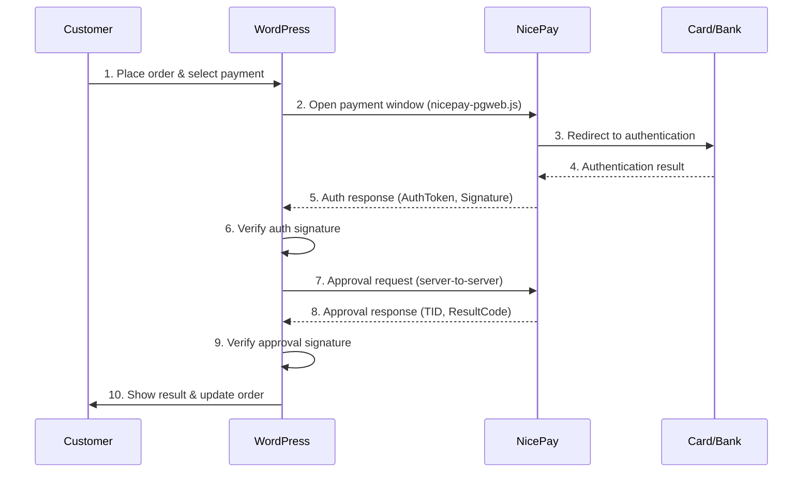

# NicePay Payment Gateway for WordPress

A WordPress plugin that integrates [NicePay](https://www.nicepay.co.kr/) with WooCommerce and fixed-price standalone payment forms. New payments currently pass the certification gate only for credit card (`CARD`), bank transfer (`BANK`), and mobile payment (`CELLPHONE`), in KRW and UTF-8.

> **Current support contract:** The WooCommerce gateway is disabled on a fresh install. Standalone forms have a separate disabled-by-default switch and require an explicitly saved payment configuration. `VBANK`, `SSG_BANK`, `GIFT_CULT`, recurring/subscription billing, escrow, and tax features are not supported. Do not enable or advertise them for new payments.

> **Protocol certification caveat:** This code targets the legacy NICEPAY PG-Web v3 flow and authenticated-payment manual v2.0.8. Before production certification or expanding the feature set, resolve **DG-01** (written confirmation that the merchant MID remains provisioned for this legacy flow) and **DG-02** (sanitized vendor/sandbox fixtures for success, decline, cancel, net-cancel, timeout, and replay behavior).

## Features

- **WooCommerce Integration** — Explicitly enabled checkout gateway with WooCommerce order management
- **Standalone Payments** — Explicitly enabled, saved fixed-price forms via shortcode ID
- **Shortcode Manager** — Visual admin UI to create, save, edit, and manage payment shortcodes
- **Display Modes** — Show payment form inline on the page or inside a popup modal
- **Certified Payment Methods** — Credit Card, Bank Transfer, and Mobile Payment
- **Payment Method Icons** — SVG icons for each payment method in the checkout form
- **Signature Verification** — SHA-256 based tamper-proof verification on every transaction
- **Audited Network Cancel** — Approval aborts attempt network cancel; ambiguous outcomes are marked `needs_reconciliation`
- **WooCommerce Refund Support** — Full and partial refunds use the WooCommerce refund flow
- **Admin Dashboard** — Transaction history, filtering, search, reconciliation states, and WooCommerce refund entry point
- **Shortcode Generator** — Interactive builder with live preview, color picker, and one-click copy
- **Localization catalogs** — Korean, English, Chinese, and Turkish catalogs are bundled; untranslated entries safely fall back to source English and still require native-speaker review
- **Merchant-controlled retention** — Financial ledger cleanup is disabled by default; a finite period requires an explicit warning acknowledgement and preserves unresolved money states
- **Test & Live Modes** — Separate credentials for development and production

## Requirements

| Requirement | Version |
|---|---|
| PHP | 7.4+ |
| WordPress | 5.8+ |
| WooCommerce | 5.0+ (optional, for checkout integration) |
| Transport | A valid public HTTPS page and outbound HTTPS access to the certified NicePay hosts |

## Installation

### Release ZIP

1. Download the latest `nicepay-payment-gateway-*.zip` file and its SHA-256 checksum from the GitHub Releases page. Do not clone the development repository into a production web root.
2. Go to **Plugins > Add New > Upload Plugin** in WordPress admin
3. Verify the checksum, then upload the ZIP and activate it
4. Navigate to **NicePay > Settings** to configure it

Repository clones contain tests and development tooling. Contributors should clone outside the production web root and follow [CONTRIBUTING.md](CONTRIBUTING.md).

## Quick Start

### 1. Configure Credentials

Go to **NicePay > Settings > API Credentials** and enter your MID and Merchant Key.

> **Test credentials are pre-filled:**
> - MID: `nicepay00m`
> - Key: `EYzu8jGGMfqaDEp76gSckuvnaHHu+bC4opsSN6lHv3b2lurNYkVXrZ7Z1AoqQnXI3eLuaUFyoRNC6FkrzVjceg==`

### 2. Enable Certified Payment Methods

Go to **NicePay > Settings > Payment Methods** and select from `CARD`, `BANK`, and `CELLPHONE`. Legacy method labels may remain visible in historical data, but unsupported methods cannot start a new payment.

### 3. WooCommerce Setup

Go to **WooCommerce > Settings > Payments**, find **NicePay**, and enable it. A fresh installation leaves this gateway disabled.

### 4. Standalone Payment (Optional)

First enable **Standalone payment forms** under **NicePay > Settings > Payment Methods**, then create and save a fixed-price configuration in **Shortcode Generator**. Embed it by ID:

```
[nicepay_payment id="quick-payment"]
```

## Payment Flow



## Shortcode Reference

### `[nicepay_payment]`

Renders a saved payment form on a page or post. Standalone forms must be explicitly enabled, and `id` is mandatory.

| Parameter | Required | Default | Description |
|---|---|---|---|
| `id` | **Yes** | — | Server-side saved configuration ID (for example `id="quick-payment"`) |
| `display_mode` | No | `inline` | `inline` (form on page) or `modal` (button opens popup overlay) |
| `amount` | No | Saved value | Ignored as a commercial override; the saved configuration is authoritative |
| `goods_name` | No | Saved value | Ignored as a commercial override; saved UTF-8 value, max 40 bytes on the wire |
| `pay_method` | No | Saved/selected certified method | Cannot override the saved policy; only `CARD`, `BANK`, `CELLPHONE` may be selected |
| `buyer_name` | No | — | Pre-fill buyer name (if empty, buyer fills in the form) |
| `buyer_email` | No | — | Pre-fill buyer email |
| `buyer_tel` | No | — | Pre-fill buyer phone |
| `button_text` | No | "Pay Now" | Button label |
| `button_class` | No | "nicepay-pay-button" | CSS class |
| `button_color` | No | `#2563eb` | Button background color (hex) |
| `currency` | No | Saved `KRW` | Ignored as a commercial override; new payments currently support KRW only |
| `language` | No | Settings value | `KO`, `EN`, or `CN` |

> When `buyer_name`, `buyer_email`, or `buyer_tel` are left empty, the payment form shows input fields for the buyer to fill in. When provided, those fields are pre-filled and hidden.

> `amount`, `goods_name`, `currency`, and payment-method policy always come from the saved server-side configuration. Shortcode attributes cannot override those fields. Only presentation fields such as display mode and button styling are customizable. Open/custom-amount payments are not implemented.

**Examples:**

```
// Using a saved shortcode
[nicepay_payment id="quick-payment"]

// Presentation-only customization; price and goods still come from the saved config
[nicepay_payment id="quick-payment" display_mode="modal" button_text="Pay Now" button_color="#111827"]
```

## Supported Payment Methods

| Code | Method | Success Code |
|---|---|---|
| `CARD` | Credit Card | `3001` |
| `BANK` | Bank Transfer | `4000` |
| `CELLPHONE` | Mobile Payment | `A000` |

`VBANK`, `SSG_BANK`, and `GIFT_CULT` are protocol-known legacy values but are blocked for new payments until DG-01/DG-02 certification and their complete lifecycles are implemented and tested.

## Known Limitations

- HPOS compatibility is declared after passing the WooCommerce 11.0.1 legacy/HPOS storage smoke matrix. Cart/Checkout Blocks compatibility remains undeclared, and multisite/network activation still requires topology-specific validation before enabling payments.
- The vendor lifecycle for this legacy PG-Web v3/manual v2.0.8 integration remains subject to DG-01/DG-02 confirmation.
- Standalone forms support saved fixed-price KRW offers only. They do not support standalone cancellation, open/custom amounts, subscriptions/recurring billing, escrow, or tax workflows.
- Financial rows are retained indefinitely by default. An administrator may opt into a 1–36,500 day policy under **NicePay > Settings > General**, but must obtain the applicable legal/accounting approval and acknowledge permanent deletion. The daily bounded cleanup affects only eligible rows in this plugin's transaction/refund-attempt tables; it preserves unresolved states and does not delete WooCommerce orders, backups, logs, or NICEPAY records. Deleting a settled ledger row prevents future refunds through this plugin.

## Admin Panel

### Settings (NicePay > Settings)

| Tab | Description |
|---|---|
| **General** | Mode, language, currency, and the opt-in financial-record retention policy; outbound protocol encoding is fixed to UTF-8 |
| **API Credentials** | Test and Live MID + Merchant Key |
| **Payment Methods** | Enable/disable the currently gated methods; legacy VBank settings do not enable VBank payments |
| **Shortcodes** | Card grid of saved shortcodes with copy/edit/delete actions |
| **Shortcode Generator** | Interactive builder with live preview, color picker, display mode, and save |

### Transactions (NicePay > Transactions)

- View all transaction history
- Filter by status, payment method, date range
- Search by TID, order ID, buyer name, or goods name
- Copy TID to clipboard with one click
- Refund WooCommerce-linked transactions through one WooCommerce refund flow; standalone cancellation is unavailable

## Firewall Configuration

If your server has a firewall, allow the following outbound connections:

| Purpose | Host | IP | Port | Protocol |
|---|---|---|---|---|
| API | `pg-api.nicepay.co.kr` | `121.133.126.56`, `211.44.32.56` | 443 | HTTPS |
| API (DC1) | `dc1-api.nicepay.co.kr` | `121.133.126.56` | 443 | HTTPS |
| API (DC2) | `dc2-api.nicepay.co.kr` | `211.44.32.56` | 443 | HTTPS |

Virtual-account deposit notifications are not implemented or supported. Do not open inbound firewall rules for this plugin based only on legacy documentation.

## Documentation

- [User & Implementation Guide](docs/USER-GUIDE.md) — Complete step-by-step guide for setup, usage, payment flows, and troubleshooting
- [Configuration Guide](docs/CONFIGURATION.md) — Detailed setup instructions for every environment
- [Architecture Overview](docs/ARCHITECTURE.md) — System design, class relationships, and data flow
- [Developer Guide](docs/DEVELOPER-GUIDE.md) — Hooks, filters, customization, and extending the plugin
- [API Reference](docs/API-REFERENCE.md) — NicePay API parameters, encryption rules, and partner codes

## Security

- All transactions use **SHA-256 signature verification** (request and response)
- Merchant keys are stored in WordPress options table (consider using `wp-config.php` constants for production)
- Operational admin actions require the configured WooCommerce-management capability and nonce verification
- All user inputs are sanitized with `sanitize_text_field()`, `esc_attr()`, `esc_url()`
- Approval requests are server-to-server (never exposed to the browser)

## Troubleshooting

| Issue | Solution |
|---|---|
| Payment window doesn't open | Check browser console for JS errors. Ensure `nicepay-pgweb.js` loads correctly. |
| "SIGNDATA verification failed" | Verify MID and Merchant Key match your NicePay account. Check EdiDate format. |
| Approval request timeout | Check firewall settings. Ensure outbound HTTPS to NicePay IPs is allowed. |
| Currency mismatch | Make sure WooCommerce store currency matches NicePay settings. |
| Payment completes but order stays pending | Check the return URL configuration and WooCommerce API endpoint. |
| Status is `needs_reconciliation` | Do not retry blindly. Compare the WooCommerce order and local transaction with the NICEPAY merchant record before taking another payment/refund action. |

## Technical Support

- NicePay Technical Support: `it@nicepay.co.kr`
- Plugin Issues: [GitHub Issues](https://github.com/cemililik/nicepay-paymentgateway-wordpress-plugin/issues)

## Contributing

Please read [CONTRIBUTING.md](CONTRIBUTING.md) for guidelines on how to contribute, and [CODE_OF_CONDUCT.md](CODE_OF_CONDUCT.md) for our community standards.

## License

This project is licensed under the [MIT License](LICENSE).
