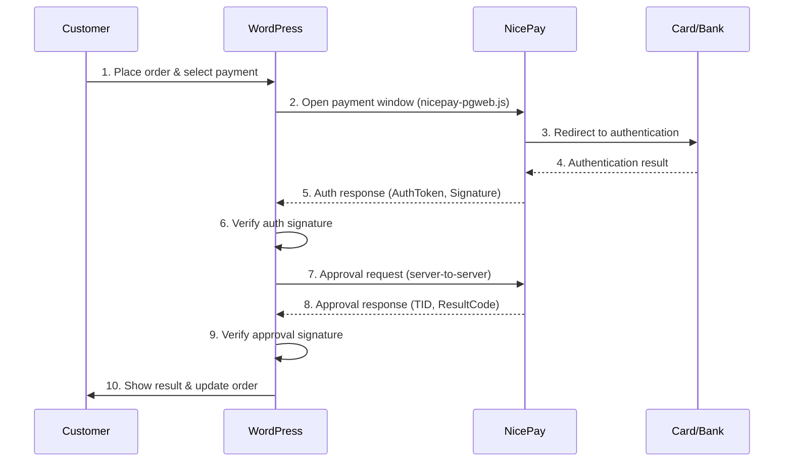

# NicePay Payment Gateway for WordPress

A WordPress plugin that integrates [NicePay](https://www.nicepay.co.kr/) payment gateway with WooCommerce. Supports credit card, bank transfer, virtual account, mobile payments, and more.

## Features

- **WooCommerce Integration** — Seamless checkout experience with automatic order management
- **Standalone Payments** — Embed payment buttons anywhere via shortcodes (inline or modal)
- **Shortcode Manager** — Visual admin UI to create, save, edit, and manage payment shortcodes
- **Display Modes** — Show payment form inline on the page or inside a popup modal
- **Multiple Payment Methods** — Credit Card, Bank Transfer, Virtual Account, Mobile Payment, SSG Bank, Culture Cash
- **Payment Method Icons** — SVG icons for each payment method in the checkout form
- **Signature Verification** — SHA-256 based tamper-proof verification on every transaction
- **Network Cancel** — Automatic rollback on approval failures
- **Refund Support** — Full and partial refunds from WooCommerce order screen
- **Admin Dashboard** — Transaction history with filtering, search, modal cancel dialog, toast notifications
- **Shortcode Generator** — Interactive builder with live preview, color picker, and one-click copy
- **Multi-language** — Korean, English, Chinese, Turkish translations included
- **Test & Live Modes** — Separate credentials for development and production

## Requirements

| Requirement | Version |
|---|---|
| PHP | 7.4+ |
| WordPress | 5.0+ |
| WooCommerce | 5.0+ (optional, for checkout integration) |

## Installation

### From GitHub

1. Download the latest release or clone the repository:
   ```bash
   git clone https://github.com/cemililik/nicepay-paymentgateway-wordpress-plugin.git nicepay-payment-gateway
   ```
2. Upload the `nicepay-payment-gateway` folder to `/wp-content/plugins/`
3. Activate the plugin via **Plugins** menu in WordPress admin
4. Navigate to **NicePay > Settings** to configure

### Manual Upload

1. Download the ZIP file
2. Go to **Plugins > Add New > Upload Plugin** in WordPress admin
3. Upload the ZIP and activate

## Quick Start

### 1. Configure Credentials

Go to **NicePay > Settings > API Credentials** and enter your MID and Merchant Key.

> **Test credentials are pre-filled:**
> - MID: `nicepay00m`
> - Key: `EYzu8jGGMfqaDEp76gSckuvnaHHu+bC4opsSN6lHv3b2lurNYkVXrZ7Z1AoqQnXI3eLuaUFyoRNC6FkrzVjceg==`

### 2. Enable Payment Methods

Go to **NicePay > Settings > Payment Methods** and check the methods you want to offer.

### 3. WooCommerce Setup

Go to **WooCommerce > Settings > Payments**, find **NicePay Payment**, and enable it.

### 4. Standalone Payment (Optional)

Add a payment button to any page using a shortcode. You can create shortcodes visually from **NicePay > Settings > Shortcode Generator**, or write them manually:

```
[nicepay_payment amount="10000" goods_name="Product Name" pay_method="CARD" button_text="Pay Now"]
```

Or use a saved shortcode by ID:

```
[nicepay_payment id="quick-payment"]
```

## Payment Flow



## Shortcode Reference

### `[nicepay_payment]`

Renders a payment form on any page or post. Can display inline or as a modal popup.

| Parameter | Required | Default | Description |
|---|---|---|---|
| `id` | No | — | Load a saved shortcode config by ID (e.g., `id="quick-payment"`) |
| `display_mode` | No | `inline` | `inline` (form on page) or `modal` (button opens popup overlay) |
| `amount` | Yes | — | Payment amount |
| `goods_name` | Yes | — | Product or service name (max 40 bytes) |
| `pay_method` | No | First enabled | `CARD`, `BANK`, `VBANK`, `CELLPHONE`, `SSG_BANK`, `GIFT_CULT` |
| `buyer_name` | No | — | Pre-fill buyer name (if empty, buyer fills in the form) |
| `buyer_email` | No | — | Pre-fill buyer email |
| `buyer_tel` | No | — | Pre-fill buyer phone |
| `button_text` | No | "Pay Now" | Button label |
| `button_class` | No | "nicepay-pay-button" | CSS class |
| `button_color` | No | `#2563eb` | Button background color (hex) |
| `currency` | No | `KRW` | `KRW` or `USD` |
| `language` | No | Settings value | `KO`, `EN`, or `CN` |

> When `buyer_name`, `buyer_email`, or `buyer_tel` are left empty, the payment form shows input fields for the buyer to fill in. When provided, those fields are pre-filled and hidden.

> When `id` is used, the saved config provides defaults. Any additional inline attributes override the saved values.

**Examples:**

```
// Inline form — buyer fills in their info
[nicepay_payment amount="50000" goods_name="Premium Plan" currency="KRW"]

// Modal popup — button opens payment overlay
[nicepay_payment amount="10000" goods_name="Product" display_mode="modal" button_text="Buy Now" button_color="#111827" currency="USD"]

// Using a saved shortcode
[nicepay_payment id="quick-payment"]

// Saved shortcode with overrides
[nicepay_payment id="donation" amount="25000" button_text="Donate 25,000 KRW"]

// Pre-filled buyer info (fields hidden from buyer)
[nicepay_payment amount="25000" goods_name="Consulting" buyer_name="John" buyer_email="john@example.com" buyer_tel="01012345678" currency="KRW" language="EN"]
```

## Supported Payment Methods

| Code | Method | Success Code |
|---|---|---|
| `CARD` | Credit Card (incl. SSG Pay) | `3001` |
| `BANK` | Bank Transfer | `4000` |
| `VBANK` | Virtual Account | `4100` |
| `CELLPHONE` | Mobile Payment | `A000` |
| `SSG_BANK` | SSG Bank Account | `0000` |
| `GIFT_CULT` | Culture Cash | `0000` |

## Admin Panel

### Settings (NicePay > Settings)

| Tab | Description |
|---|---|
| **General** | Mode (Test/Live), language, currency, charset |
| **API Credentials** | Test and Live MID + Merchant Key |
| **Payment Methods** | Enable/disable methods with icons, VBank expiry days |
| **Shortcodes** | Card grid of saved shortcodes with copy/edit/delete actions |
| **Shortcode Generator** | Interactive builder with live preview, color picker, display mode, and save |

### Transactions (NicePay > Transactions)

- View all transaction history
- Filter by status, payment method, date range
- Search by TID, order ID, buyer name, or goods name
- Copy TID to clipboard with one click
- Cancel transactions via modal confirmation dialog with toast notifications

## Firewall Configuration

If your server has a firewall, allow the following outbound connections:

| Purpose | Host | IP | Port | Protocol |
|---|---|---|---|---|
| API | `pg-api.nicepay.co.kr` | `121.133.126.56`, `211.44.32.56` | 443 | HTTPS |
| API (DC1) | `dc1-api.nicepay.co.kr` | `121.133.126.56` | 443 | HTTPS |
| API (DC2) | `dc2-api.nicepay.co.kr` | `211.44.32.56` | 443 | HTTPS |

For virtual account deposit notifications (inbound):

| Source IP | Port | Protocol |
|---|---|---|
| `121.133.126.10` | 443 | TCP/HTTPS |
| `121.133.126.11` | 443 | TCP/HTTPS |
| `211.33.136.39` | 443 | TCP/HTTPS |

## Documentation

- [User & Implementation Guide](docs/USER-GUIDE.md) — Complete step-by-step guide for setup, usage, payment flows, and troubleshooting
- [Configuration Guide](docs/CONFIGURATION.md) — Detailed setup instructions for every environment
- [Architecture Overview](docs/ARCHITECTURE.md) — System design, class relationships, and data flow
- [Developer Guide](docs/DEVELOPER-GUIDE.md) — Hooks, filters, customization, and extending the plugin
- [API Reference](docs/API-REFERENCE.md) — NicePay API parameters, encryption rules, and partner codes

## Security

- All transactions use **SHA-256 signature verification** (request and response)
- Merchant keys are stored in WordPress options table (consider using `wp-config.php` constants for production)
- Admin actions require `manage_options` capability and nonce verification
- All user inputs are sanitized with `sanitize_text_field()`, `esc_attr()`, `esc_url()`
- Approval requests are server-to-server (never exposed to the browser)

## Troubleshooting

| Issue | Solution |
|---|---|
| Payment window doesn't open | Check browser console for JS errors. Ensure `nicepay-pgweb.js` loads correctly. |
| "SIGNDATA verification failed" | Verify MID and Merchant Key match your NicePay account. Check EdiDate format. |
| Approval request timeout | Check firewall settings. Ensure outbound HTTPS to NicePay IPs is allowed. |
| Currency mismatch | Make sure WooCommerce store currency matches NicePay settings. |
| Payment completes but order stays pending | Check the return URL configuration and WooCommerce API endpoint. |

## Technical Support

- NicePay Technical Support: `it@nicepay.co.kr`
- Plugin Issues: [GitHub Issues](https://github.com/cemililik/nicepay-paymentgateway-wordpress-plugin/issues)

## Contributing

Please read [CONTRIBUTING.md](CONTRIBUTING.md) for guidelines on how to contribute, and [CODE_OF_CONDUCT.md](CODE_OF_CONDUCT.md) for our community standards.

## License

This project is licensed under the [MIT License](LICENSE).
