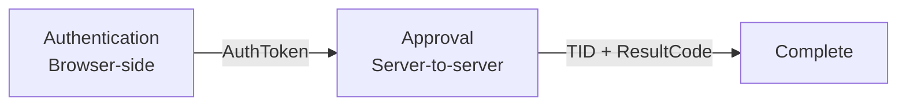
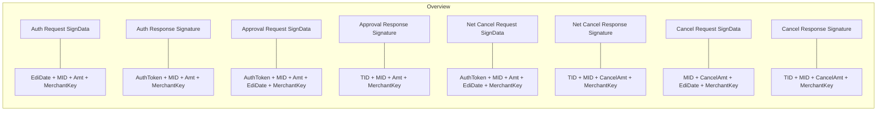

# NicePay API Reference

Reference for the legacy NICEPAY PG-Web v3 / authenticated-payment manual v2.0.8 contract targeted by this plugin.

> **Protocol capability is not plugin support.** Tables below retain fields and result codes from the legacy manual for interoperability and historical-record interpretation. New plugin payments are currently certified only for `CARD`, `BANK`, and `CELLPHONE`, with KRW and UTF-8. `VBANK`, `SSG_BANK`, and `GIFT_CULT` are rejected by the new-payment gate. Recurring/subscription billing, escrow, and tax features are not implemented.

> **DG-01 / DG-02:** The current public NICEPAY API/SDK may differ from this legacy target. Production certification requires written confirmation that the merchant MID is provisioned for PG-Web v3/manual v2.0.8 (DG-01) and sanitized vendor/sandbox fixtures for all enabled lifecycles, cancel/net-cancel, timeouts, and replay behavior (DG-02). Until then, this reference must not be read as a vendor support guarantee.

## Table of Contents

- [Overview](#overview)
- [Authentication Request Parameters](#authentication-request-parameters)
- [Authentication Response Parameters](#authentication-response-parameters)
- [Approval Request Parameters](#approval-request-parameters)
- [Approval Response Parameters](#approval-response-parameters)
- [Network Cancel Parameters](#network-cancel-parameters)
- [Payment Cancel Parameters](#payment-cancel-parameters)
- [Signature (Encryption) Rules](#signature-encryption-rules)
- [Result Codes](#result-codes)
- [Card Company Codes](#card-company-codes)
- [Bank Codes](#bank-codes)
- [Timeout Configuration](#timeout-configuration)

---

## Overview

NicePay uses a **two-phase authenticated payment** model:



| Phase | Direction | Encoding | Content-Type |
|---|---|---|---|
| Authentication | Browser → NicePay | UTF-8 | via legacy `nicepay-pgweb.js` |
| Approval | Server → NicePay | UTF-8 | `application/x-www-form-urlencoded; charset=utf-8` |
| Cancel | Server → NicePay | UTF-8 | `application/x-www-form-urlencoded; charset=utf-8` |

The plugin always sends UTF-8. There is no EUC-KR setting or conversion path.

### Base URLs

| Purpose | URL |
|---|---|
| Payment JS | `https://pg-web.nicepay.co.kr/v3/common/js/nicepay-pgweb.js` |
| Approval (DC1) | `https://dc1-api.nicepay.co.kr/webapi/pay_process.jsp` |
| Approval (DC2) | `https://dc2-api.nicepay.co.kr/webapi/pay_process.jsp` |
| Cancel | `https://pg-api.nicepay.co.kr/webapi/cancel_process.jsp` |
| Net Cancel (DC1) | `https://dc1-api.nicepay.co.kr/webapi/cancel_process.jsp` |
| Net Cancel (DC2) | `https://dc2-api.nicepay.co.kr/webapi/cancel_process.jsp` |

> **Important:** The approval URL (`NextAppURL`) is returned dynamically in the auth response. Do NOT hardcode it — each transaction may receive a different URL.

---

## Authentication Request Parameters

Sent to NicePay via `nicepay-pgweb.js` form submission.

### Required Parameters

| Parameter | Size | Description |
|---|---|---|
| `GoodsName` | 40 | Product name |
| `Amt` | 12 | Payment amount (no special characters) |
| `MID` | 10 | Merchant ID |
| `EdiDate` | 30 | Timestamp (`YYYYMMDDHHMISS`) |
| `Moid` | 64 | Merchant order ID (unique per transaction) |
| `SignData` | 500 | `hex(sha256(EdiDate + MID + Amt + MerchantKey))` |
| `PayMethod` | 10 | Legacy protocol values include `CARD` / `BANK` / `VBANK` / `CELLPHONE` / `SSG_BANK` / `GIFT_CULT`; this plugin sends only certified `CARD` / `BANK` / `CELLPHONE` for new payments |

### Optional Parameters

| Parameter | Size | Description |
|---|---|---|
| `ReturnURL` | 500 | Redirect URL after auth (**required for Mobile**) |
| `BuyerName` | 30 bytes | Buyer name; server and browser enforce the UTF-8 byte limit |
| `BuyerTel` | 20 bytes | Buyer phone |
| `BuyerEmail` | 60 bytes | Buyer email |
| `ReqReserved` | 500 | Custom data, returned as-is (no double quotes `"`) |
| `CurrencyCode` | 3 | Legacy protocol documents `KRW` / `USD`; this plugin currently sends `KRW` only |
| `NpLang` | 2 | `KO` (default) / `EN` / `CN` |
| `CharSet` | 10 | This plugin sends `utf-8` only |
| `LogoImage` | 100 | Logo image full URL (60x60 px) |
| `SkinType` | — | `default` / `black` |
| `ConnWithIframe` | 1 | `Y` for iframe mode (PC only) |

### Credit Card Extra Parameters

| Parameter | Size | Description |
|---|---|---|
| `SelectQuota` | 2 | Installment months (`00`=lump sum, `02`, `03`...). Comma-separated for multiple. Min 50,000 KRW. |
| `SelectCardCode` | 2 | Restrict to specific card companies. Comma-separated codes. |
| `ShopInterest` | 1 | Merchant interest-free (`0`=no, `1`=yes, empty=use MID setting) |
| `QuotaInterest` | — | Interest-free card info. Format: `CardCode:months|CardCode:months` |

### Virtual Account Extra Parameters

Protocol reference only: the plugin does not initiate new `VBANK` payments and has no certified deposit-notification lifecycle.

| Parameter | Size | Required | Description |
|---|---|---|---|
| `VbankExpDate` | 12 | Yes | Expiry date `YYYYMMDD` or `YYYYMMDDHHMI` |

### Mobile Payment Extra Parameters

| Parameter | Size | Required | Description |
|---|---|---|---|
| `GoodsCl` | 1 | Yes | `0`=content, `1`=physical goods |

---

## Authentication Response Parameters

Returned via `nicepaySubmit()` callback (PC) or `ReturnURL` redirect (Mobile).

| Parameter | Size | Description |
|---|---|---|
| `AuthResultCode` | 4 | Auth result (`0000`=success, others=failure) |
| `AuthResultMsg` | 2000 | Auth result message |
| `AuthToken` | 40 | Authentication token (unique key) |
| `PayMethod` | 10 | Authenticated payment method |
| `MID` | 10 | Merchant ID |
| `Moid` | 64 | Merchant order ID |
| `Amt` | 12 | Payment amount |
| `Signature` | 500 | `hex(sha256(AuthToken + MID + Amt + MerchantKey))` |
| `ReqReserved` | 500 | Custom data (passed through) |
| `TxTid` | 30 | Transaction ID (use this as `TID` in approval request) |
| `NextAppURL` | 255 | Approval request URL |
| `NetCancelURL` | 255 | Network cancel URL |

---

## Approval Request Parameters

Sent server-to-server to `NextAppURL`.

| Parameter | Size | Required | Description |
|---|---|---|---|
| `TID` | 30 | Yes | Transaction ID (from `TxTid` in auth response) |
| `AuthToken` | 40 | Yes | Auth token from auth response |
| `MID` | 10 | Yes | Merchant ID |
| `Amt` | 12 | Yes | Payment amount |
| `EdiDate` | 14 | Yes | Timestamp (`YYYYMMDDHHMISS`) |
| `SignData` | 256 | Yes | `hex(sha256(AuthToken + MID + Amt + EdiDate + MerchantKey))` |
| `CharSet` | 10 | No | Response encoding; this plugin requests UTF-8 |
| `EdiType` | 10 | No | Response format (`JSON` default, `KV` for key=value) |

---

## Approval Response Parameters

### Common Response

| Parameter | Size | Description |
|---|---|---|
| `ResultCode` | 4 | Result code (see [Result Codes](#result-codes)) |
| `ResultMsg` | 100 | Result message |
| `Amt` | 12 | Transaction amount; the response may use fixed-width leading-zero padding |
| `MID` | 10 | Merchant ID |
| `Moid` | 64 | Merchant order ID |
| `Signature` | 500 | `hex(sha256(TID + MID + Amt + MerchantKey))` |

For approval-response signature verification, `Amt` is used byte-for-byte as
returned by NicePay. Numeric transaction binding separately canonicalizes a
strict 1–12 digit response (for example, `000000001004` equals `1004`). The
plugin does not try alternative signature preimages; confirm the merchant
account's exact sandbox response convention before production certification.
| `TID` | 30 | Transaction ID |
| `AuthCode` | 30 | Authorization code |
| `AuthDate` | 12 | Authorization date (`YYMMDDHHMMSS`) |
| `PayMethod` | 10 | Payment method code |

### Credit Card Extra Response

| Parameter | Size | Description |
|---|---|---|
| `CardCode` | 3 | Card company code |
| `CardName` | 20 | Card company name |
| `CardNo` | 20 | Masked card number |
| `CardQuota` | 2 | Installment months (`00`=lump sum) |
| `CardInterest` | 1 | Merchant interest-free (`0`=normal, `1`=interest-free) |
| `AcquCardCode` | 3 | Acquirer card code |
| `AcquCardName` | 100 | Acquirer card name |
| `CardCl` | 1 | Card type (`0`=credit, `1`=debit) |
| `CcPartCl` | 1 | Partial cancel available (`0`=no, `1`=yes) |
| `ClickpayCl` | 2 | Simple pay service (see table below) |
| `CardType` | 2 | `01`=personal, `02`=corporate, `03`=overseas |

#### Simple Pay Service Codes (ClickpayCl)

| Code | Service |
|---|---|
| 6 | SK PAY |
| 7 | SSG PAY |
| 15 | PAYCO |
| 16 | KAKAO PAY |
| 18 | L.PAY |
| 20 | NAVER PAY |
| 21 | SAMSUNG PAY |
| 22 | APPLE PAY |
| 25 | TOSS PAY |

### Bank Transfer Extra Response

| Parameter | Size | Description |
|---|---|---|
| `BankCode` | 3 | Bank code |
| `BankName` | 20 | Bank name |
| `RcptType` | 1 | Cash receipt type (`0`=none, `1`=income, `2`=expense) |
| `RcptTID` | 30 | Cash receipt TID |
| `RcptAuthCode` | 30 | Cash receipt auth code |

### Virtual Account Extra Response

| Parameter | Size | Description |
|---|---|---|
| `VbankBankCode` | 3 | Bank code |
| `VbankBankName` | 20 | Bank name |
| `VbankNum` | 20 | Virtual account number |
| `VbankExpDate` | 8 | Expiry date (`yyyyMMdd`) |
| `VbankExpTime` | 6 | Expiry time (`HHmmss`) |

---

## Network Cancel Parameters

Used when approval fails. Sent to `NetCancelURL`.

### Request

Same as approval request, plus:

| Parameter | Size | Required | Description |
|---|---|---|---|
| `NetCancel` | 1 | Yes | Set to `1` |

### Response

Same as [Payment Cancel Response](#cancel-response).

---

## Payment Cancel Parameters

### Cancel Request

POST to `https://pg-api.nicepay.co.kr/webapi/cancel_process.jsp`

| Parameter | Size | Required | Description |
|---|---|---|---|
| `TID` | 30 | Yes | Transaction ID |
| `MID` | 10 | Yes | Merchant ID |
| `Moid` | 64 | Yes | Cancel order ID (should be unique) |
| `CancelAmt` | 12 | Yes | Cancel amount |
| `CancelMsg` | 100 | Yes | Cancel reason |
| `PartialCancelCode` | 1 | Yes | `0`=full cancel, `1`=partial cancel |
| `EdiDate` | 14 | Yes | Timestamp |
| `SignData` | 256 | Yes | `hex(sha256(MID + CancelAmt + EdiDate + MerchantKey))` |
| `SupplyAmt` | 12 | No | Supply amount (sum must equal CancelAmt) |
| `GoodsVat` | 12 | No | VAT amount |
| `ServiceAmt` | 12 | No | Service charge |
| `TaxFreeAmt` | 12 | No | Tax-free amount |
| `RefundAcctNo` | 16 | Cond. | Refund account number (for VBank after deposit) |
| `RefundBankCd` | 3 | Cond. | Refund bank code |
| `RefundAcctNm` | 10 | Cond. | Refund account holder name |

### Cancel Response

| Parameter | Size | Description |
|---|---|---|
| `ResultCode` | 4 | `2001` or `2211` = success |
| `ResultMsg` | 100 | Result message |
| `ErrorCD` | 5 | Error code |
| `ErrorMsg` | 97 | Error message |
| `CancelAmt` | 12 | Cancelled amount |
| `MID` | 10 | Merchant ID |
| `Moid` | 64 | Cancel order ID |
| `Signature` | 500 | `hex(sha256(TID + MID + CancelAmt + MerchantKey))` |
| `TID` | 30 | Transaction ID |
| `CancelDate` | 8 | Cancel date (`YYYYMMDD`) |
| `CancelTime` | 6 | Cancel time (`HHmmss`) |
| `CancelNum` | 8 | Cancel number |
| `RemainAmt` | 12 | Remaining amount after cancel |

---

## Signature (Encryption) Rules

All signatures use `hex(sha256(plaintext))` format.



### Verification Example

```text
MID          = "nicepay00m"
MerchantKey  = "EYzu8jGGMfqaDEp76gSckuvnaHHu+bC4opsSN6lHv3b2lurNYkVXrZ7Z1AoqQnXI3eLuaUFyoRNC6FkrzVjceg=="
EdiDate      = "20200622131021"
Amt          = "1004"

PlainText    = "20200622131021nicepay00m1004EYzu8jGGMfqaDEp76gSckuvnaHHu+bC4opsSN6lHv3b2lurNYkVXrZ7Z1AoqQnXI3eLuaUFyoRNC6FkrzVjceg=="

SignData     = hex(sha256(PlainText))
             = "475979a5628498711052598c6d4a73a17f0e3f0ef45960eed2e1b1776e3146bd"
```

---

## Result Codes

### Approval Success Codes

| Payment Method | Legacy Success Code | New-payment support |
|---|---|---|
| Credit Card (`CARD`) | `3001` | Certified gate enabled |
| Bank Transfer (`BANK`) | `4000` | Certified gate enabled |
| Mobile Payment (`CELLPHONE`) | `A000` | Certified gate enabled |
| Virtual Account (`VBANK`) | `4100` | Disabled/unsupported |
| SSG Bank Account (`SSG_BANK`) | `0000` | Disabled/unsupported |
| Culture Cash (`GIFT_CULT`) | `0000` | Disabled/unsupported |

### Cancel Success Codes

| Code | Meaning |
|---|---|
| `2001` | Cancel successful |
| `2211` | Cancel successful (alternative) |

### Authentication Success Code

| Code | Meaning |
|---|---|
| `0000` | Authentication successful |

> For the full list of error codes, refer to the separate "Result Code" document provided by NicePay.

---

## Card Company Codes

| Code | Card Company | Code | Card Company |
|---|---|---|---|
| 01 | BC | 25 | Overseas VISA |
| 02 | KB Kookmin | 26 | Overseas Master |
| 03 | Hana (KEB) | 27 | Overseas Diners |
| 04 | Samsung | 28 | Overseas AMEX |
| 06 | Shinhan | 29 | Overseas JCB |
| 07 | Hyundai | 31 | SK-OK Cashbag |
| 08 | Lotte | 32 | Post Office |
| 09 | Hanmi | 33 | Savings Bank |
| 10 | Shinsegae Hanmi | 34 | UnionPay |
| 11 | Citi | 35 | Saemaeul Geumgo |
| 12 | NH Chaeum | 36 | KDB Industrial |
| 13 | Suhyup | 37 | Kakao Bank |
| 14 | Shinheup | 38 | K Bank |
| 15 | Woori BC | 39 | PAYCO Points |
| 16 | Hana | 40 | Kakao Money |
| 17 | Woori | 41 | SSG Money |
| 21 | Gwangju | 42 | Naver Points |
| 22 | Jeonbuk | 44 | Toss Bank |
| 23 | Jeju | 46 | Toss Money |
| 24 | Saneun Capital | | |

---

## Bank Codes

| Code | Bank | Code | Bank | Code | Bank |
|---|---|---|---|---|---|
| 002 | KDB Industrial | 039 | Gyeongnam | 081 | Hana |
| 003 | IBK | 045 | Saemaeul | 088 | Shinhan |
| 004 | KB Kookmin | 048 | Shinheup | 089 | K Bank |
| 007 | Suhyup | 050 | Savings | 090 | Kakao Bank |
| 011 | NH | 071 | Post Office | 092 | Toss Bank |
| 020 | Woori | 076 | Credit Guarantee | | |
| 023 | SC | 077 | Tech Credit | | |
| 027 | Citibank Korea | | | | |
| 031 | iM Bank (Daegu) | | | | |
| 032 | Busan | | | | |
| 034 | Gwangju | | | | |
| 035 | Jeju | | | | |
| 037 | Jeonbuk | | | | |

---

## Timeout Configuration

| Connection Timeout | Read Timeout |
|---|---|
| 5 seconds | 30 seconds |

The plugin uses WordPress `wp_remote_post()` with a 30-second overall timeout. A request-scoped `http_api_curl` callback sets `CURLOPT_CONNECTTIMEOUT` to 5 seconds for the exact NicePay URL and is removed in a `finally` block. `nicepay_http_timeout` and `nicepay_http_connect_timeout` may adjust these bounded values per operation (`approval`, `net_cancel`, or `cancel`). Exact vendor retry semantics remain part of DG-01/DG-02 certification; ambiguous results are recorded as `needs_reconciliation`, not treated as success or blindly retried.

```php
wp_remote_post( $url, array(
    'timeout'   => 30,
    'redirection' => 0,
    'sslverify' => true,
    'body'      => $params,
) );
```

The approval response's `CcPartCl`, `ClickpayCl`, and `CardType` flags are stored as validated first-class fields. Card partial refunds require `CcPartCl=1`; simple-pay codes whose remaining balance may become irreversible are blocked from partial refund.
