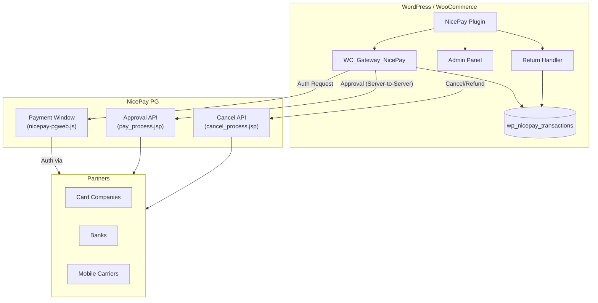
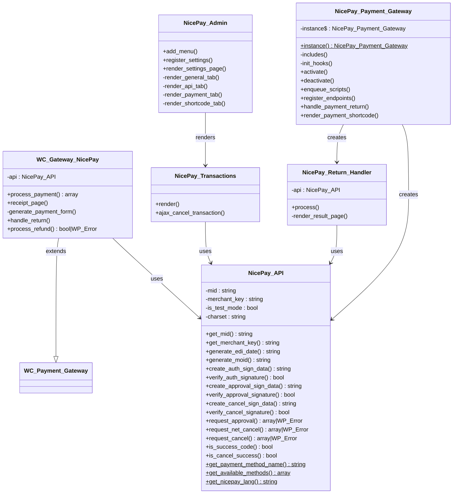
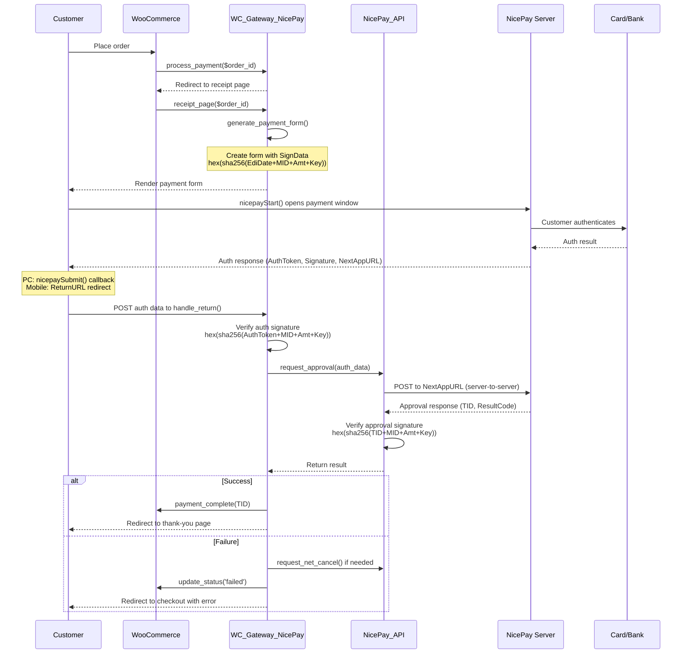
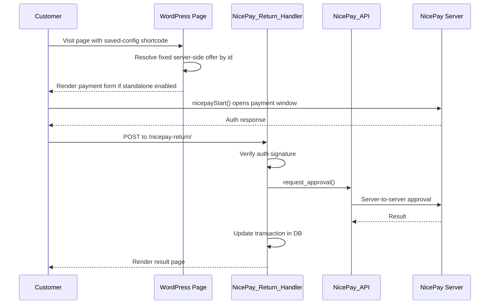
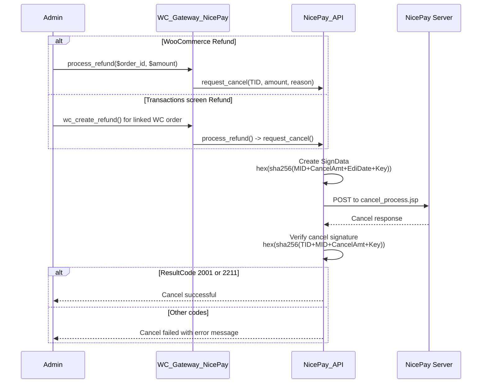
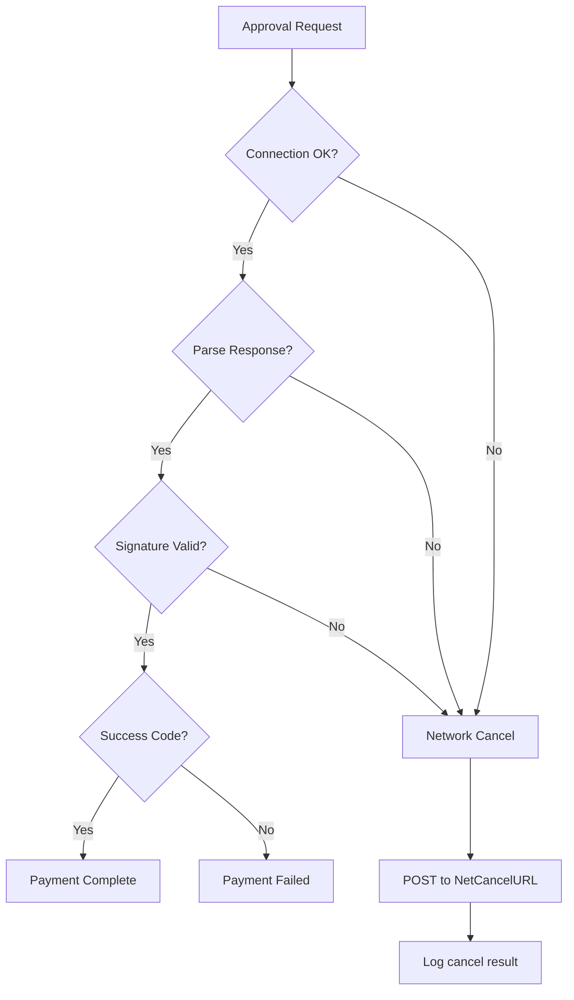
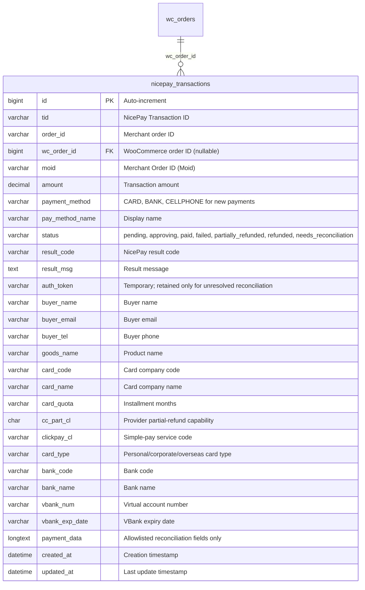
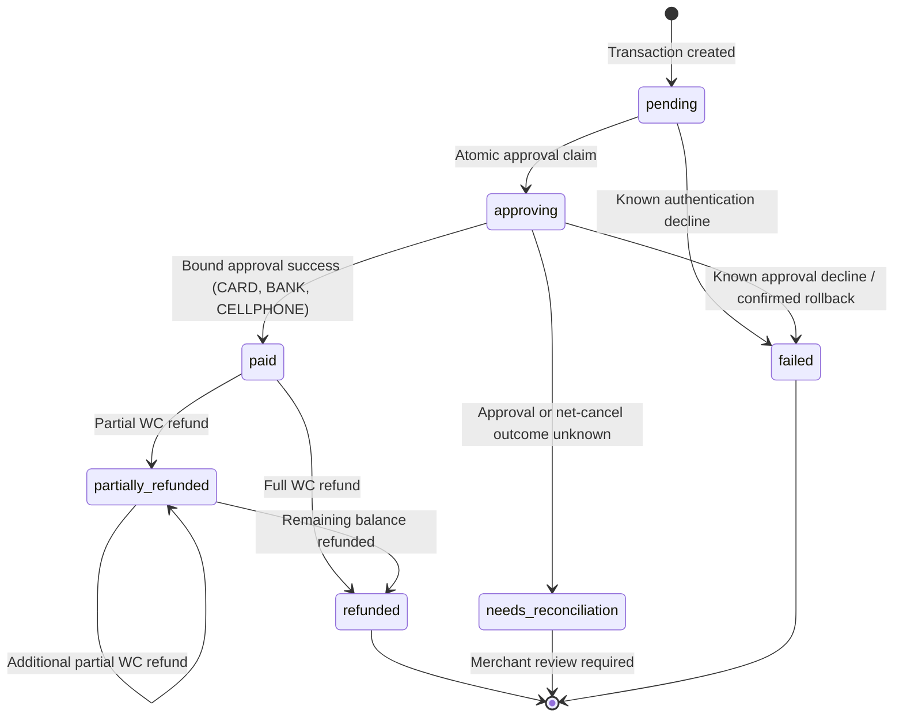
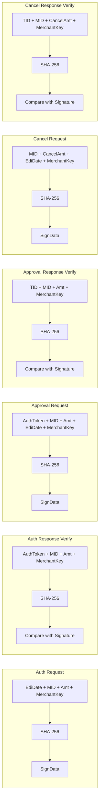

# Architecture Overview

This document describes the system architecture, class relationships, data flow, and design decisions of the NicePay Payment Gateway WordPress plugin.

> **Supported execution envelope:** New payments are restricted to certified `CARD`, `BANK`, and `CELLPHONE` flows, KRW, and UTF-8. The WooCommerce gateway and the separate standalone surface both default disabled. Standalone payment commercial data resolves from a required saved configuration ID; shortcode attributes cannot override amount, goods, currency, or method policy.

> The protocol adapter targets legacy PG-Web v3/manual v2.0.8. DG-01 vendor confirmation and DG-02 sanitized fixtures remain prerequisites for broader certification. `VBANK`, `SSG_BANK`, `GIFT_CULT`, recurring/subscription, escrow, and tax features are outside the supported architecture.

## Table of Contents

- [High-Level Architecture](#high-level-architecture)
- [Directory Structure](#directory-structure)
- [Class Diagram](#class-diagram)
- [Payment Flows](#payment-flows)
- [Database Schema](#database-schema)
- [Security Architecture](#security-architecture)
- [WordPress Integration Points](#wordpress-integration-points)

---

## High-Level Architecture

The plugin operates as a bridge between WordPress/WooCommerce and the NicePay payment gateway. It follows NicePay's **authenticated payment** model: a two-phase flow where the customer authenticates on NicePay's hosted page, then the merchant's server sends a server-to-server approval request.



## Directory Structure

```
nicepay-payment-gateway/
├── nicepay-payment-gateway.php      # Plugin entry point, bootstrap, AJAX handlers
├── includes/
│   ├── class-nicepay-api.php        # NicePay API communication layer
│   ├── class-nicepay-gateway.php    # WooCommerce payment gateway
│   ├── class-nicepay-return-handler.php  # Standalone payment return handler
│   ├── class-nicepay-offer-resolver.php  # Server-authoritative saved standalone offers
│   ├── class-nicepay-inbound-validator.php # Return/approval binding policy
│   ├── class-nicepay-installer.php        # Versioned dbDelta schema installer
│   ├── class-nicepay-transaction-schema.php # Pure schema/write map
│   ├── nicepay-functions.php        # Helper functions, DB operations, shortcode helpers
│   └── nicepay-icons.php            # SVG icons for payment methods
├── admin/
│   ├── class-nicepay-admin.php      # Admin settings, shortcode manager, generator
│   └── class-nicepay-transactions.php  # Transaction management UI
├── templates/
│   ├── payment-form.php             # WooCommerce receipt page form
│   └── standalone-payment-form.php  # Shortcode payment form (inline + modal)
├── assets/
│   ├── js/nicepay.js                # Frontend JavaScript (payment, loading)
│   ├── js/nicepay-admin.js          # Admin JavaScript (modal, toast, card actions)
│   ├── css/nicepay.css              # Frontend styles
│   └── css/nicepay-admin.css        # Admin styles (cards, builder, modal)
├── languages/                       # Translation files
└── docs/                            # Documentation
```

## Class Diagram



## Payment Flows

### WooCommerce Checkout Flow

This is the primary flow when a customer pays through the WooCommerce checkout page.



### Standalone Payment Flow

Used only when standalone forms are explicitly enabled and `[nicepay_payment id="saved-config"]` is embedded on a page. Rendering or initialization fails closed without the saved ID. Amount, goods, KRW currency, and method policy come from that saved record; custom/open amount is unavailable.



### Refund / Cancel Flow



### Network Cancel Flow

After authorization, applicable approval failures attempt network cancel and verify its outcome. A failed, missing, or ambiguous network-cancel result does not prove rollback: the transaction becomes `needs_reconciliation` and requires comparison with the NICEPAY merchant record. Blind retry is intentionally avoided.



## Database Schema

### `wp_nicepay_transactions`

Stores all transaction records regardless of source (WooCommerce or standalone).



### Transaction Status Lifecycle



## Security Architecture

### Signature Verification

Every request and response is verified using SHA-256 hashing. The merchant key is never sent over the network — it's only used to compute signatures locally.



### Security Layers

| Layer | Implementation |
|---|---|
| **Transport** | All API calls use HTTPS (port 443) |
| **Data Integrity** | SHA-256 signature on every request/response |
| **Authentication** | MID + MerchantKey pair identifies the merchant |
| **Authorization** | WordPress `manage_options` capability for admin actions |
| **CSRF Protection** | WordPress nonce verification on admin AJAX actions |
| **Input Validation** | `sanitize_text_field()`, `esc_attr()`, `absint()` on all inputs |
| **Timing-safe Compare** | `hash_equals()` for signature comparison (prevents timing attacks) |

## WordPress Integration Points

### Hooks Used

| Hook | Type | Purpose |
|---|---|---|
| `plugins_loaded` | Action | Initialize plugin, load text domain, register gateway |
| `init` | Action | Register rewrite rules for return endpoint |
| `template_redirect` | Action | Handle payment return requests |
| `wp_enqueue_scripts` | Action | Load NicePay JS and CSS |
| `admin_menu` | Action | Add NicePay admin menu |
| `admin_init` | Action | Register settings |
| `admin_enqueue_scripts` | Action | Load admin CSS/JS on NicePay pages |
| `woocommerce_payment_gateways` | Filter | Register NicePay gateway |
| `woocommerce_receipt_nicepay` | Action | Display payment form on receipt page |
| `woocommerce_api_nicepay_return` | Action | Handle WC payment return |
| `plugin_action_links_*` | Filter | Add settings link to plugins page |
| `wp_ajax_nicepay_init_payment` | Action | AJAX: Initialize standalone payment |
| `wp_ajax_nopriv_nicepay_init_payment` | Action | AJAX: Same (public) |
| `wp_ajax_nicepay_save_shortcode` | Action | AJAX: Save/update shortcode config |
| `wp_ajax_nicepay_delete_shortcode` | Action | AJAX: Delete shortcode config |
| `wp_ajax_nicepay_cancel_transaction` | Action | Legacy action name; initiates one WooCommerce refund flow for an eligible linked order |

### WooCommerce API Endpoints

| Endpoint | Handler | Purpose |
|---|---|---|
| `/?wc-api=nicepay_return` | `WC_Gateway_NicePay::handle_return()` | Receives auth response from NicePay |

### Custom Rewrite Endpoints

| URL | Handler | Purpose |
|---|---|---|
| `/nicepay-return/` | `NicePay_Return_Handler::process()` | Standalone payment return |

### WordPress Options

| Option Key | Type | Description |
|---|---|---|
| `nicepay_mode` | string | `test` or `live` |
| `nicepay_test_mid` | string | Test merchant ID |
| `nicepay_test_merchant_key` | string | Test merchant key |
| `nicepay_live_mid` | string | Live merchant ID |
| `nicepay_live_merchant_key` | string | Live merchant key |
| `nicepay_enabled_methods` | array | List of enabled payment method codes |
| `nicepay_language` | string | Payment window language (`KO`, `EN`, `CN`) |
| `nicepay_currency` | string | Default currency code |
| `nicepay_vbank_expiry_days` | int | Virtual account expiry in days |
| `nicepay_retention_settings` | array | Fail-closed `indefinite` policy or acknowledged custom `days` value |
| `nicepay_retention_last_run` | array | Non-sensitive UTC completion time, deleted count, and error code |
| Protocol charset | fixed | UTF-8 only; no persisted EUC-KR setting |
| `nicepay_db_version` | string | Database schema version |
| `nicepay_saved_shortcodes` | array | Saved shortcode configurations (includes presets) |
| `nicepay_transactions_schema_version` | string | Independent migrator version; current target `2026.08.24.7` |

WordPress privacy exporter/eraser callbacks are implemented by `NicePay_Privacy`. The eraser anonymizes buyer contact and receipt/payload fields but deliberately retains the financial identity and amount ledger.

`NicePay_Retention` implements the separate merchant-selected lifecycle. Its default is indefinite. When a custom period is explicitly acknowledged, a daily bounded job selects old eligible rows with `FOR UPDATE`, deletes child refund-attempt history and parent rows in one database transaction, and rolls back if the locked parent set changes. Active/ambiguous/reconciliation states are excluded. WooCommerce orders and external/provider storage are outside this cleanup boundary.
