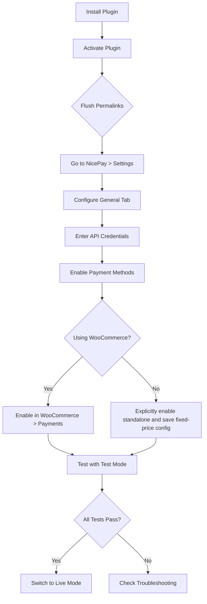
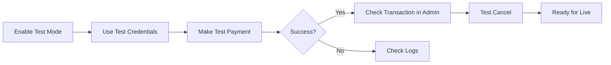
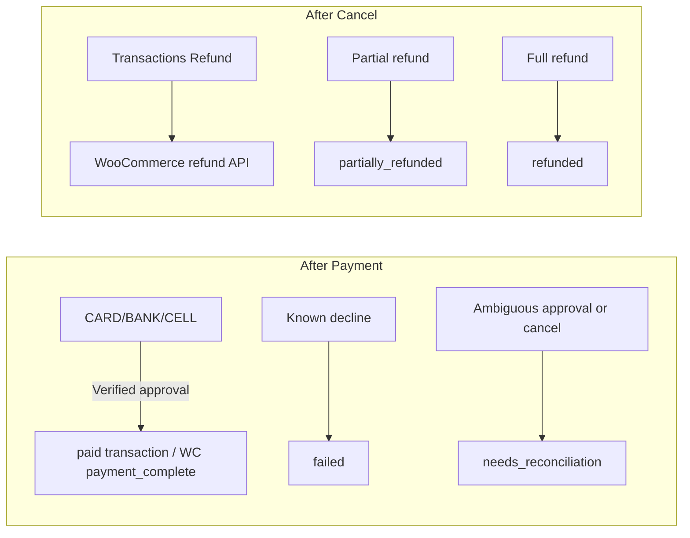
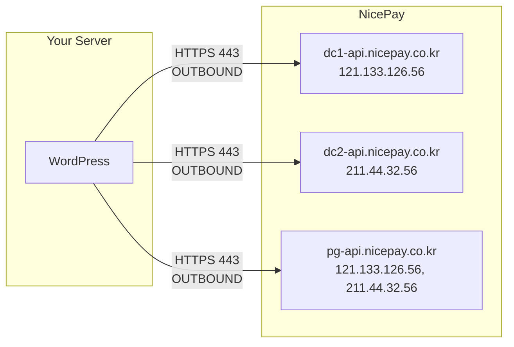

# Configuration Guide

Step-by-step setup instructions for every environment and use case.

> **Safe current defaults:** Fresh WooCommerce gateways are disabled. Standalone forms are disabled separately and require explicit enablement plus a saved fixed-price configuration. New payments are restricted to `CARD`, `BANK`, or `CELLPHONE`, KRW, and UTF-8. `VBANK`, `SSG_BANK`, `GIFT_CULT`, recurring/subscription billing, escrow, and tax features are unsupported.

> The integration target is legacy PG-Web v3 / authenticated-payment manual v2.0.8. Resolve DG-01 (vendor confirmation that the MID remains provisioned for this flow) and DG-02 (sanitized sandbox/vendor lifecycle fixtures) before production certification or expanding methods.

## Table of Contents

- [Initial Setup](#initial-setup)
- [Test Environment](#test-environment)
- [Production Environment](#production-environment)
- [WooCommerce Setup](#woocommerce-setup)
- [Standalone Payment Setup](#standalone-payment-setup)
- [Firewall Configuration](#firewall-configuration)
- [Multi-language Setup](#multi-language-setup)
- [SSL/HTTPS Requirements](#sslhttps-requirements)
- [Server Requirements](#server-requirements)
- [Troubleshooting Configuration](#troubleshooting-configuration)

---

## Initial Setup

### Installation Checklist



### Step 1: Verify Return Routing

Activation registers the standalone return endpoint and flushes rules. Before enabling standalone payments, verify the configured return route works in the actual permalink/proxy/cache environment. Do not infer compatibility for an untested hosting topology.

### Step 2: General Settings

Navigate to **NicePay > Settings > General**.

| Setting | Recommended Value | Notes |
|---|---|---|
| Mode | `Test` | Start with test mode |
| Language | `KO` | Payment window language |
| Currency | `KRW` | Must match your WooCommerce store currency |
| Protocol encoding | `UTF-8` | Fixed; EUC-KR is not selectable or transcoded |
| Financial record retention | Retain indefinitely | Use a finite period only after legal and accounting approval |

#### Financial record retention

The default policy is **Retain indefinitely**. The plugin cannot determine the tax, accounting, payment, privacy, limitation-period, or contractual rules that apply to a merchant. Selecting a finite period is therefore an administrator decision, not legal advice supplied by the plugin.

To enable automatic cleanup:

1. Choose **Permanently delete eligible NicePay financial records after**.
2. Enter a whole number from 1 to 36,500 days.
3. Read and select the permanent-deletion acknowledgement.
4. Export the relevant transaction CSV, verify a recoverable backup, and save. Each CSV is limited to 10,000 rows; use non-overlapping date ranges and verify every part when a larger ledger must be backed up.

The setting is fail-closed: an invalid period or missing acknowledgement keeps the last valid policy. Cleanup begins through WP-Cron, processes at most 500 records in a daily run, and uses each ledger row's last-updated time. Saving the setting does not restore records already deleted.

Automatic cleanup deletes only eligible rows from this plugin's `nicepay_transactions` and related `nicepay_refund_attempts` tables. It does not delete WooCommerce orders, backups, server/application logs, exported files, or records retained by NICEPAY. Pending approvals, active payment attempts, reconciliation-required states, unknown cancel/net-cancel outcomes, retained authorization tokens, and requested/unknown refunds are protected.

Paid and partially refunded rows can become eligible after the selected period. Once such a local ledger row is deleted, a later refund cannot be initiated through this plugin. Monitor the eligible count, next run, and last-run result shown beside the setting, and ensure WP-Cron operates reliably on low-traffic sites.

### Step 3: API Credentials

Navigate to **NicePay > Settings > API Credentials**.

For test mode, the default credentials are pre-filled:
- **Test MID:** `nicepay00m`
- **Test Merchant Key:** `EYzu8jGGMfqaDEp76gSckuvnaHHu+bC4opsSN6lHv3b2lurNYkVXrZ7Z1AoqQnXI3eLuaUFyoRNC6FkrzVjceg==`

### Step 4: Payment Methods

Navigate to **NicePay > Settings > Payment Methods**.

Enable only methods exposed by the certification gate:

| Method | Description | Notes |
|---|---|---|
| Credit Card | Visa, MasterCard, Korean cards | Most common |
| Bank Transfer | Direct bank transfer | Cash-receipt workflows are not supported |
| Mobile Payment | Charge to mobile bill | Set `GoodsCl` (content/physical) |

`VBANK`, `SSG_BANK`, and `GIFT_CULT` may appear in legacy protocol documentation or historical records, but they are unavailable for new payments. Virtual-account expiry configuration is not an enablement mechanism.

---

## Test Environment

### Test Workflow



### Test Mode Configuration

```text
Mode:         Test
MID:          nicepay00m
Merchant Key: EYzu8jGGMfqaDEp76gSckuvnaHHu+bC4opsSN6lHv3b2lurNYkVXrZ7Z1AoqQnXI3eLuaUFyoRNC6FkrzVjceg==
```

### Test Limitations

| Feature | Limitation |
|---|---|
| Credit Card | Use real card numbers; test MID won't charge |
| Virtual Account | Disabled; issuance alone is not a supported deposit lifecycle |
| Partial Cancel | Do NOT test with simple pay services (Kakao, Naver, etc.) |
| Simple Pay | Partial cancel rollback not possible with test MID |

### Accessing NicePay Merchant Admin

To verify transactions in NicePay's admin panel:

1. Go to `npg.nicepay.co.kr`
2. Login with:
   - Username: MID without trailing `m` (e.g., `nicepay00`)
   - Password: Same as username (e.g., `nicepay00`)

---

## Production Environment

### Go-Live Checklist

- [ ] Obtain Live MID and Merchant Key from NicePay sales team
- [ ] Enter Live credentials in **NicePay > Settings > API Credentials**
- [ ] Switch Mode to **Live** in **NicePay > Settings > General**
- [ ] Verify firewall rules allow outbound HTTPS to NicePay
- [ ] Verify SSL certificate is valid on your domain
- [ ] Test one live transaction with a small amount
- [ ] Verify the transaction appears in NicePay merchant admin
- [ ] Cancel the test transaction to verify refund flow
- [ ] Monitor logs for the first few days

### Securing Live Credentials

For production, store credentials in `wp-config.php` instead of the database:

```php
// wp-config.php (above "That's all, stop editing!")
define( 'NICEPAY_LIVE_MID', 'your_live_mid_here' );
define( 'NICEPAY_LIVE_MERCHANT_KEY', 'your_live_merchant_key_here' );
```

No option filters are needed. When these constants are defined, NicePay reads
them directly, renders the corresponding settings as read-only, and never
copies the live merchant key into the WordPress options table.

---

## Shortcode Manager

### Managing Saved Shortcodes

Go to **NicePay > Settings > Shortcodes** to view all saved payment shortcodes in a card grid.

Each card shows:
- Shortcode name and display mode badge (inline/modal)
- Button preview with the configured color
- Amount, product name, and payment method
- Full shortcode code (copyable)
- Edit, Copy, and Delete actions

### Creating a New Shortcode

1. Go to **NicePay > Settings > Shortcode Generator**
2. Enter a **Name** (required for saving)
3. Choose **Display Mode**:
   - **Inline**: Full form shown directly on the page
   - **Modal**: Only the button is visible; clicking opens a popup with the payment form
4. Fill in the **Amount** and **Product Name** (required)
5. Optionally select a specific **Payment Method** or leave as "All Enabled"
6. Customize the **Button Text** and **Color**. Buyer name, email, and phone are collected from the customer at payment time and cannot be stored in a reusable configuration.
7. Click **Save Shortcode**
8. Copy the generated shortcode from the **Shortcodes** tab and paste into any page

### Editing a Shortcode

Click **Edit** on any card in the Shortcodes tab. The Shortcode Generator opens with all fields pre-populated. Make changes and click **Update Shortcode**.

### Default Presets

Current defaults are fixed one-time-payment examples:

| Name | Amount | Mode | Button Color | Method |
|---|---|---|---|---|
| Quick Payment | 10,000 KRW | Inline | Blue | All |
| Donation | 5,000 KRW | Inline | Green | All |
| Product Purchase | 50,000 KRW | Modal | Black | All |

Presets can be edited or deleted. They are not automatically re-created after deletion.

---

## WooCommerce Setup

### Enable the Gateway

1. Go to **WooCommerce > Settings > Payments**
2. Find **NicePay** in the list
3. Click the toggle to enable it
4. Click **Set up** to configure title and description

### Gateway Settings

| Setting | Default | Description |
|---|---|---|
| Enable/Disable | Disabled | Toggle the payment method only after readiness and sandbox checks pass |
| Title | "NicePay Payment" | Shown to customer at checkout |
| Description | "Pay securely via NicePay..." | Shown below the title |

> API credentials are managed in the centralized **NicePay > Settings** page, not in the WooCommerce gateway settings.

### Currency Configuration

The plugin uses the WooCommerce order currency automatically. Ensure your WooCommerce store currency matches what your NicePay MID supports.

Typical configurations:

| Store Currency | NicePay Currency | Notes |
|---|---|---|
| KRW | KRW | Most common setup |
| USD | — | Unsupported for new payments; the request fails closed |

### Order Status Mapping



| NicePay Result | WooCommerce Status | Description |
|---|---|---|
| CARD/BANK/CELLPHONE verified success | `processing` or `completed`, chosen by WooCommerce | Transaction `paid` |
| Known auth/approval decline | Order remains payable | Transaction `failed` |
| Unknown approval/cancel outcome | Manual hold/review | Transaction `needs_reconciliation` |
| Partial WooCommerce refund | Existing WC status rules | Transaction `partially_refunded` |
| Full WooCommerce refund | Existing WC status rules | Transaction `refunded` |

---

## Standalone Payment Setup

### Using Saved Shortcodes (Recommended)

First explicitly enable **Standalone payment forms**, then create a fixed-price saved configuration in **NicePay > Settings > Shortcode Generator** and paste its ID:

```
[nicepay_payment id="quick-payment"]
```

### Inline Mode

Set inline mode in the saved configuration, then embed `[nicepay_payment id="quick-payment"]`. Buyer contact fields may still be collected at payment time, but commercial fields are server-side.

### Manual Shortcode — Modal Mode

Shows only a button. Clicking opens a popup overlay with the full payment form:

```
[nicepay_payment id="quick-payment" display_mode="modal" button_text="Buy Now" button_color="#111827"]
```

### Fixed Payment Method and Amount Authority

Configure amount, goods, KRW currency, and any fixed method in the saved configuration. Inline `amount`, `goods_name`, `currency`, and `pay_method` attributes are not commercial overrides. There is no custom/open-amount mode.

### Button Color Customization

Use `button_color` with a hex value:

```
[nicepay_payment id="quick-payment" button_text="Pay" button_color="#16a34a"]
```

### Custom CSS Class

```
[nicepay_payment id="quick-payment" button_text="Buy Now" button_class="my-custom-button"]
```

Then in your CSS:

```css
.my-custom-button {
    background: linear-gradient(135deg, #667eea 0%, #764ba2 100%);
    color: white;
    padding: 16px 40px;
    border: none;
    border-radius: 25px;
    font-size: 18px;
    cursor: pointer;
}
```

---

## Firewall Configuration

### Outbound Rules (Your Server → NicePay)

Your server must be able to reach NicePay's API servers:



| Direction | IP Addresses | Port | Protocol |
|---|---|---|---|
| OUTBOUND | `121.133.126.56` | 443 | HTTPS |
| OUTBOUND | `211.44.32.56` | 443 | HTTPS |

### Inbound Rules (NicePay → Your Server)

No inbound vendor-notification lifecycle is supported. In particular, do not open historical VBANK source-IP rules for this plugin unless a future certified notification endpoint explicitly requires them.

---

## Multi-language Setup

### Payment Window Language

Set in **NicePay > Settings > General > Language**:

| Value | Language |
|---|---|
| `KO` | Korean (default) |
| `EN` | English |
| `CN` | Chinese |

### Plugin Text Translation

The plugin supports WordPress i18n. Translation files go in the `languages/` directory:

- `nicepay-payment-gateway-ko_KR.po` — Korean
- `nicepay-payment-gateway-en_US.po` — English
- `nicepay-payment-gateway-zh_CN.po` — Chinese

Use a tool like [Poedit](https://poedit.net/) or [Loco Translate](https://wordpress.org/plugins/loco-translate/) to create translations.

### Per-shortcode Language Override

```
[nicepay_payment id="quick-payment" language="EN"]
```

---

## SSL/HTTPS Requirements

NicePay requires HTTPS for all communication:

- Your site **must** have a valid SSL certificate
- The `ReturnURL` must use `https://`
- All API calls use HTTPS (enforced by the plugin)

If your site is not on HTTPS, the payment window may not load or may show security warnings.

---

## Server Requirements

| Requirement | Minimum | Recommended |
|---|---|---|
| PHP | 7.4 | 8.0+ |
| WordPress | 5.8 | 6.0+ |
| WooCommerce | 5.0 | 8.0+ |
| PHP Extensions | `hash`, `json`, `curl` | — |
| OpenSSL | 1.0.2+ | 1.1.1+ |
| `allow_url_fopen` | Not required | — |

### PHP Extension Check

```php
// Verify SHA-256 is available
var_dump( in_array( 'sha256', hash_algos() ) ); // must be true

// Verify cURL is available (used by wp_remote_post)
var_dump( function_exists( 'curl_init' ) ); // should be true
```

---

## Troubleshooting Configuration

### "SIGNDATA verification failed"

**Cause:** The SignData sent doesn't match what NicePay computed.

**Fix:**
1. Check that MID and Merchant Key are correct (no extra spaces)
2. Verify EdiDate format is exactly `YYYYMMDDHHMISS` (14 digits)
3. Ensure amount has no commas, decimal points, or special characters
4. For KRW, amount must be an integer string (e.g., `"10000"` not `"10000.00"`)

### Payment window doesn't open

**Cause:** NicePay JavaScript failed to load.

**Fix:**
1. Check browser console for errors
2. Verify `https://pg-web.nicepay.co.kr/v3/common/js/nicepay-pgweb.js` is accessible from your server
3. Check for Content Security Policy (CSP) headers blocking external scripts
4. Ensure the form name is exactly `payForm`

### Approval request fails (timeout)

**Cause:** Your server cannot reach NicePay's API.

**Fix:**
1. Check firewall outbound rules (see [Firewall Configuration](#firewall-configuration))
2. Test connectivity: `curl -I https://pg-api.nicepay.co.kr`
3. Check if your hosting provider blocks outbound HTTPS connections
4. Verify SSL certificates are up to date on your server

### Order stuck in "Pending" after payment

**Cause:** The return handler didn't execute.

**Fix:**
1. Verify the WooCommerce return endpoint and standalone route, if enabled, in the current permalink/proxy environment
2. Confirm the endpoint is not cached or blocked
3. Check that `wp-cron.php` or page caching isn't interfering
4. Look at WooCommerce logs for error details

### Virtual account not receiving deposits

**Cause:** VBANK is disabled and no certified deposit-notification lifecycle exists.

**Fix:**
1. Do not bypass the method gate.
2. Use a currently certified method.
3. Treat VBANK as future work requiring DG-01/DG-02 plus a complete implementation.

### Partial cancel not working

**Cause:** The original approval did not certify partial cancellation, the payment used an irreversible simple-pay wallet, or the mobile OTID lifecycle is not certified.

**Fix:**
1. Check the transaction detail and original provider response in the NICEPAY console.
2. Card partial refunds proceed only when the persisted approval flag is `CcPartCl=1`.
3. The plugin blocks partial refunds for irreversible simple-pay codes and mobile payments; use a full refund or obtain vendor certification before changing those gates.
4. Never retry a refund marked `needs_reconciliation` or `cancel_status=unknown` until the merchant console confirms the money state.
