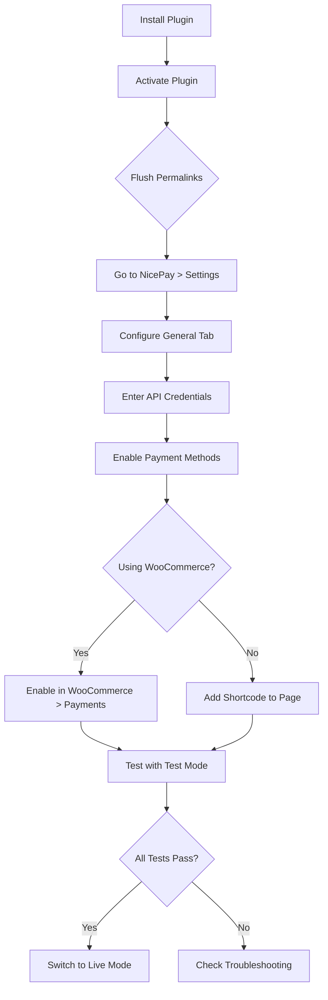
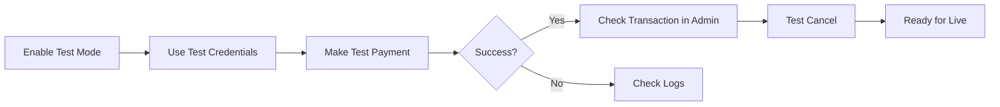
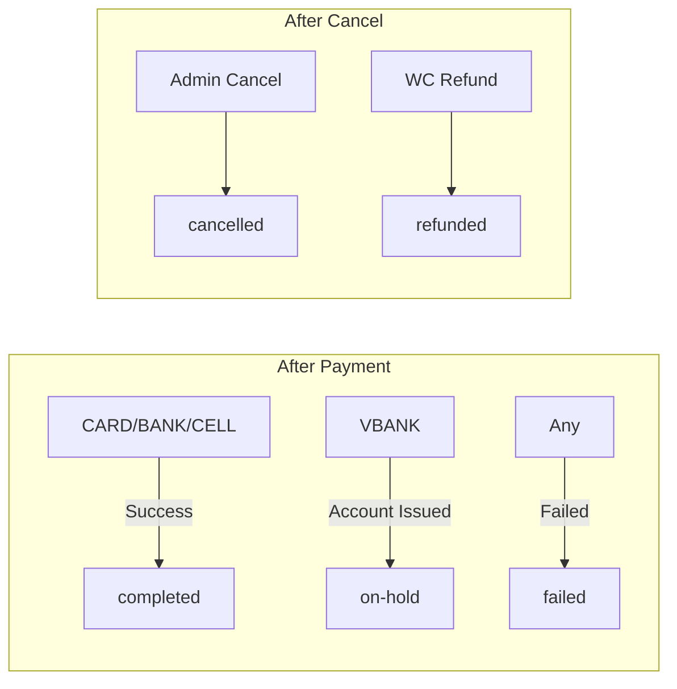
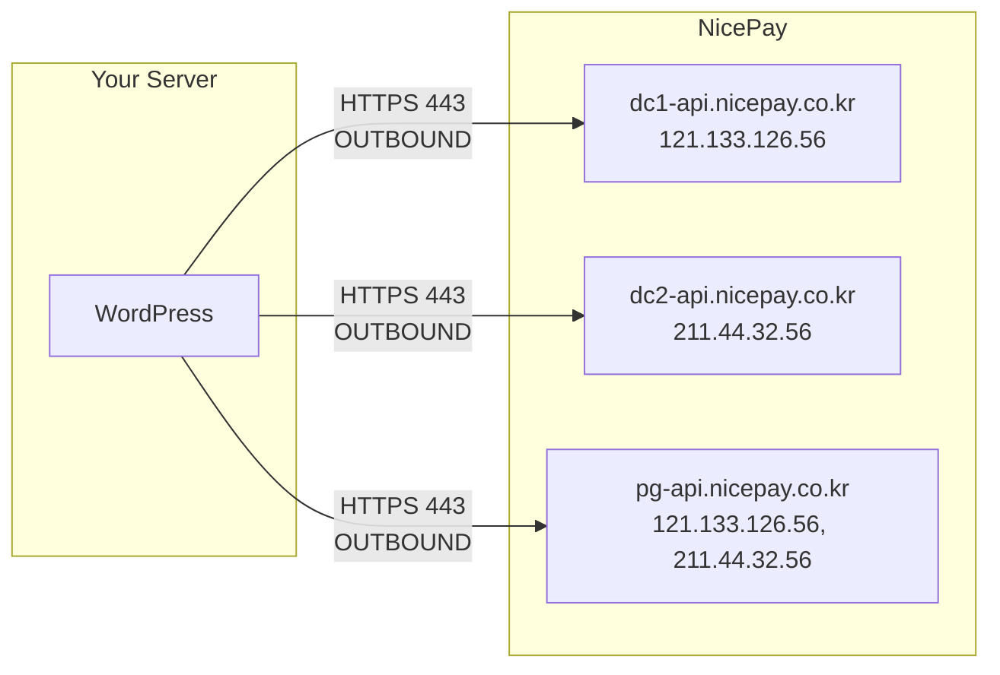

# Configuration Guide

Step-by-step setup instructions for every environment and use case.

## Table of Contents

- [Initial Setup](#initial-setup)
- [Test Environment](#test-environment)
- [Production Environment](#production-environment)
- [WooCommerce Setup](#woocommerce-setup)
- [Standalone Payment Setup](#standalone-payment-setup)
- [Firewall Configuration](#firewall-configuration)
- [Multi-language Setup](#multi-language-setup)
- [SSL/HTTPS Requirements](#sslhttps-requirements)
- [Server Requirements](#server-requirements)
- [Troubleshooting Configuration](#troubleshooting-configuration)

---

## Initial Setup

### Installation Checklist



### Step 1: Flush Permalinks

After activating the plugin, go to **Settings > Permalinks** and click **Save Changes** (no changes needed). This registers the `/nicepay-return/` endpoint.

### Step 2: General Settings

Navigate to **NicePay > Settings > General**.

| Setting | Recommended Value | Notes |
|---|---|---|
| Mode | `Test` | Start with test mode |
| Language | `KO` | Payment window language |
| Currency | `KRW` | Must match your WooCommerce store currency |
| Charset | `utf-8` | Use `euc-kr` only if your site uses EUC-KR encoding |

### Step 3: API Credentials

Navigate to **NicePay > Settings > API Credentials**.

For test mode, the default credentials are pre-filled:
- **Test MID:** `nicepay00m`
- **Test Merchant Key:** `EYzu8jGGMfqaDEp76gSckuvnaHHu+bC4opsSN6lHv3b2lurNYkVXrZ7Z1AoqQnXI3eLuaUFyoRNC6FkrzVjceg==`

### Step 4: Payment Methods

Navigate to **NicePay > Settings > Payment Methods**.

Enable the payment methods you want to offer:

| Method | Description | Notes |
|---|---|---|
| Credit Card | Visa, MasterCard, Korean cards | Most common |
| Bank Transfer | Direct bank transfer | Cash receipt supported |
| Virtual Account | Issue a temp account number | Customer deposits later |
| Mobile Payment | Charge to mobile bill | Set `GoodsCl` (content/physical) |
| SSG Bank Account | SSG Pay bank integration | Requires SSG Pay MID setup |
| Culture Cash | Cultureland gift cards | Requires `MallUserID` |

Set **Virtual Account Expiry Days** (default: 3 days).

---

## Test Environment

### Test Workflow



### Test Mode Configuration

```
Mode:         Test
MID:          nicepay00m
Merchant Key: EYzu8jGGMfqaDEp76gSckuvnaHHu+bC4opsSN6lHv3b2lurNYkVXrZ7Z1AoqQnXI3eLuaUFyoRNC6FkrzVjceg==
```

### Test Limitations

| Feature | Limitation |
|---|---|
| Credit Card | Use real card numbers; test MID won't charge |
| Virtual Account | Test issuance only; deposit/refund needs separate MID |
| Partial Cancel | Do NOT test with simple pay services (Kakao, Naver, etc.) |
| Simple Pay | Partial cancel rollback not possible with test MID |

### Accessing NicePay Merchant Admin

To verify transactions in NicePay's admin panel:

1. Go to `npg.nicepay.co.kr`
2. Login with:
   - Username: MID without trailing `m` (e.g., `nicepay00`)
   - Password: Same as username (e.g., `nicepay00`)

---

## Production Environment

### Go-Live Checklist

- [ ] Obtain Live MID and Merchant Key from NicePay sales team
- [ ] Enter Live credentials in **NicePay > Settings > API Credentials**
- [ ] Switch Mode to **Live** in **NicePay > Settings > General**
- [ ] Verify firewall rules allow outbound HTTPS to NicePay
- [ ] Verify SSL certificate is valid on your domain
- [ ] Test one live transaction with a small amount
- [ ] Verify the transaction appears in NicePay merchant admin
- [ ] Cancel the test transaction to verify refund flow
- [ ] Monitor logs for the first few days

### Securing Live Credentials

For production, store credentials in `wp-config.php` instead of the database:

```php
// wp-config.php (above "That's all, stop editing!")
define( 'NICEPAY_LIVE_MID', 'your_live_mid_here' );
define( 'NICEPAY_LIVE_MERCHANT_KEY', 'your_live_merchant_key_here' );
```

Then add to your theme's `functions.php` or a custom plugin:

```php
add_filter( 'option_nicepay_live_mid', function() {
    return defined( 'NICEPAY_LIVE_MID' ) ? NICEPAY_LIVE_MID : '';
} );

add_filter( 'option_nicepay_live_merchant_key', function() {
    return defined( 'NICEPAY_LIVE_MERCHANT_KEY' ) ? NICEPAY_LIVE_MERCHANT_KEY : '';
} );
```

---

## WooCommerce Setup

### Enable the Gateway

1. Go to **WooCommerce > Settings > Payments**
2. Find **NicePay Payment** in the list
3. Click the toggle to enable it
4. Click **Set up** to configure title and description

### Gateway Settings

| Setting | Default | Description |
|---|---|---|
| Enable/Disable | Enabled | Toggle the payment method |
| Title | "NicePay Payment" | Shown to customer at checkout |
| Description | "Pay securely via NicePay..." | Shown below the title |

> API credentials are managed in the centralized **NicePay > Settings** page, not in the WooCommerce gateway settings.

### Currency Configuration

The plugin uses the WooCommerce order currency automatically. Ensure your WooCommerce store currency matches what your NicePay MID supports.

Typical configurations:

| Store Currency | NicePay Currency | Notes |
|---|---|---|
| KRW | KRW | Most common setup |
| USD | USD | Requires USD-enabled MID |

### Order Status Mapping



| NicePay Result | WooCommerce Status | Description |
|---|---|---|
| CARD/BANK/CELL success | `completed` | Payment received |
| VBANK success | `on-hold` | Waiting for bank deposit |
| Auth/Approval failure | `failed` | Payment not processed |
| Cancel success | `cancelled` | Transaction reversed |

---

## Standalone Payment Setup

### Basic Shortcode

Add to any page or post:

```
[nicepay_payment amount="10000" goods_name="Product Name"]
```

This creates a payment button with the default enabled methods.

### Fixed Payment Method

```
[nicepay_payment amount="50000" goods_name="Premium Plan" pay_method="CARD" button_text="Pay with Card"]
```

### With Buyer Information

```
[nicepay_payment 
    amount="25000" 
    goods_name="Consultation" 
    buyer_name="Kim" 
    buyer_email="kim@example.com" 
    buyer_tel="01012345678"
    currency="KRW"
    language="KO"
]
```

### Custom Styled Button

```
[nicepay_payment amount="10000" goods_name="Item" button_text="Buy Now" button_class="my-custom-button"]
```

Then in your CSS:

```css
.my-custom-button {
    background: linear-gradient(135deg, #667eea 0%, #764ba2 100%);
    color: white;
    padding: 16px 40px;
    border: none;
    border-radius: 25px;
    font-size: 18px;
    cursor: pointer;
}
```

---

## Firewall Configuration

### Outbound Rules (Your Server → NicePay)

Your server must be able to reach NicePay's API servers:



| Direction | IP Addresses | Port | Protocol |
|---|---|---|---|
| OUTBOUND | `121.133.126.56` | 443 | HTTPS |
| OUTBOUND | `211.44.32.56` | 443 | HTTPS |

### Inbound Rules (NicePay → Your Server)

Required only for virtual account deposit notifications:

| Direction | Source IP | Port | Protocol |
|---|---|---|---|
| INBOUND | `121.133.126.10` | 443 | TCP/HTTPS |
| INBOUND | `121.133.126.11` | 443 | TCP/HTTPS |
| INBOUND | `211.33.136.39` | 443 | TCP/HTTPS |

---

## Multi-language Setup

### Payment Window Language

Set in **NicePay > Settings > General > Language**:

| Value | Language |
|---|---|
| `KO` | Korean (default) |
| `EN` | English |
| `CN` | Chinese |

### Plugin Text Translation

The plugin supports WordPress i18n. Translation files go in the `languages/` directory:

- `nicepay-payment-gateway-ko_KR.po` — Korean
- `nicepay-payment-gateway-en_US.po` — English
- `nicepay-payment-gateway-zh_CN.po` — Chinese

Use a tool like [Poedit](https://poedit.net/) or [Loco Translate](https://wordpress.org/plugins/loco-translate/) to create translations.

### Per-shortcode Language Override

```
[nicepay_payment amount="10000" goods_name="Product" language="EN"]
```

---

## SSL/HTTPS Requirements

NicePay requires HTTPS for all communication:

- Your site **must** have a valid SSL certificate
- The `ReturnURL` must use `https://`
- All API calls use HTTPS (enforced by the plugin)

If your site is not on HTTPS, the payment window may not load or may show security warnings.

---

## Server Requirements

| Requirement | Minimum | Recommended |
|---|---|---|
| PHP | 7.4 | 8.0+ |
| WordPress | 5.0 | 6.0+ |
| WooCommerce | 5.0 | 8.0+ |
| PHP Extensions | `hash`, `json`, `curl` | — |
| OpenSSL | 1.0.2+ | 1.1.1+ |
| `allow_url_fopen` | Not required | — |

### PHP Extension Check

```php
// Verify SHA-256 is available
var_dump( in_array( 'sha256', hash_algos() ) ); // must be true

// Verify cURL is available (used by wp_remote_post)
var_dump( function_exists( 'curl_init' ) ); // should be true
```

---

## Troubleshooting Configuration

### "SIGNDATA verification failed"

**Cause:** The SignData sent doesn't match what NicePay computed.

**Fix:**
1. Check that MID and Merchant Key are correct (no extra spaces)
2. Verify EdiDate format is exactly `YYYYMMDDHHMISS` (14 digits)
3. Ensure amount has no commas, decimal points, or special characters
4. For KRW, amount must be an integer string (e.g., `"10000"` not `"10000.00"`)

### Payment window doesn't open

**Cause:** NicePay JavaScript failed to load.

**Fix:**
1. Check browser console for errors
2. Verify `https://pg-web.nicepay.co.kr/v3/common/js/nicepay-pgweb.js` is accessible from your server
3. Check for Content Security Policy (CSP) headers blocking external scripts
4. Ensure the form name is exactly `payForm`

### Approval request fails (timeout)

**Cause:** Your server cannot reach NicePay's API.

**Fix:**
1. Check firewall outbound rules (see [Firewall Configuration](#firewall-configuration))
2. Test connectivity: `curl -I https://pg-api.nicepay.co.kr`
3. Check if your hosting provider blocks outbound HTTPS connections
4. Verify SSL certificates are up to date on your server

### Order stuck in "Pending" after payment

**Cause:** The return handler didn't execute.

**Fix:**
1. Go to **Settings > Permalinks** and click Save (flush rewrite rules)
2. Verify `/?wc-api=nicepay_return` URL is accessible
3. Check that `wp-cron.php` or page caching isn't interfering
4. Look at WooCommerce logs for error details

### Virtual account not receiving deposits

**Cause:** Deposit notification endpoint not configured.

**Fix:**
1. Contact NicePay (`it@nicepay.co.kr`) to set up your deposit notification URL
2. Ensure inbound firewall rules are configured
3. This requires separate setup outside of this plugin

### Partial cancel not working

**Cause:** Some payment methods don't support partial cancel with test credentials.

**Fix:**
1. For simple pay services (Kakao, Naver, etc.), use a dedicated MID for partial cancel testing
2. Contact NicePay sales team for a separate test MID
3. Check `CcPartCl` response field to verify if partial cancel is supported for the transaction
