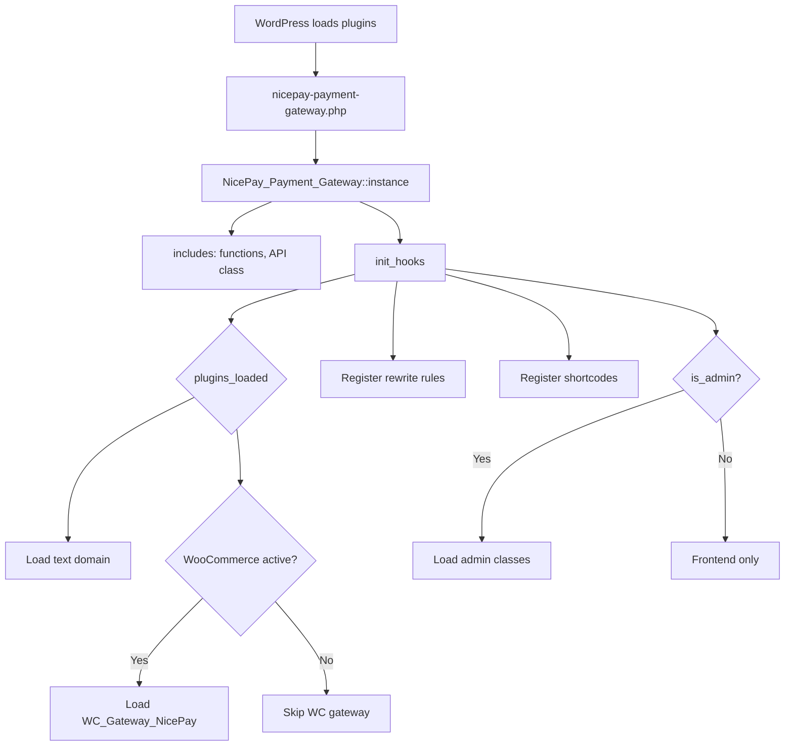
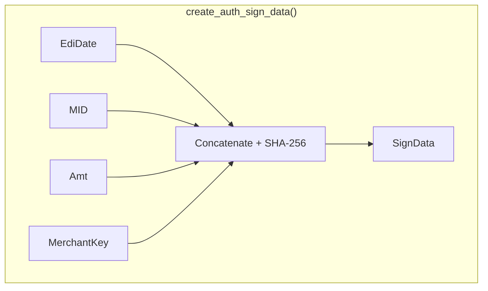
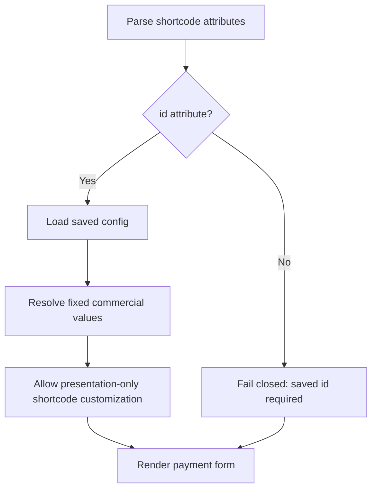
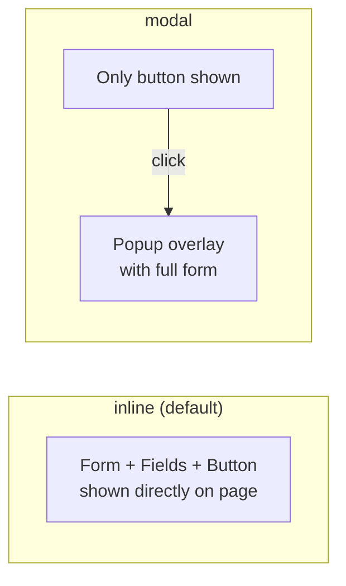
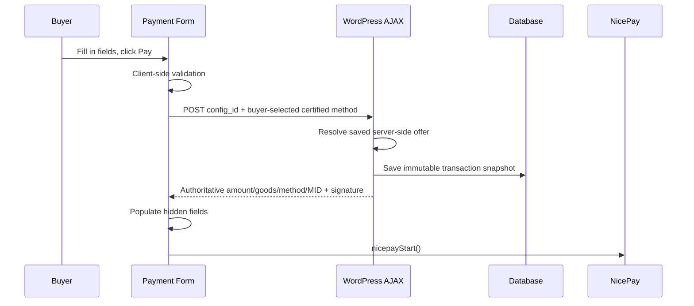

# Developer Guide

This guide covers how to extend, customize, and integrate with the NicePay Payment Gateway plugin.

> **Supported boundary:** New requests are certified only for `CARD`, `BANK`, and `CELLPHONE`, KRW, and UTF-8. WooCommerce and standalone surfaces default disabled independently. Standalone initialization requires a saved fixed-price configuration ID and resolves amount, goods, currency, and method policy server-side. `VBANK`, `SSG_BANK`, `GIFT_CULT`, recurring/subscription, escrow, tax, and open/custom-amount features are unsupported.

> **DG-01 / DG-02:** The adapter targets legacy PG-Web v3/manual v2.0.8. Obtain vendor confirmation that the MID remains provisioned for this flow and sanitized vendor/sandbox fixtures before production certification or expanding protocol features.

## Table of Contents

- [Plugin Lifecycle](#plugin-lifecycle)
- [Adding Custom Logic with Hooks](#adding-custom-logic-with-hooks)
- [Working with the NicePay API Class](#working-with-the-nicepay-api-class)
- [Transaction Management](#transaction-management)
- [Customizing Templates](#customizing-templates)
- [Handling Virtual Account Deposits](#handling-virtual-account-deposits)
- [Storing Credentials Securely](#storing-credentials-securely)
- [Debugging & Logging](#debugging--logging)
- [Testing](#testing)
- [Common Patterns](#common-patterns)

---

## Plugin Lifecycle



### Activation

On activation, the plugin:
1. Creates or upgrades the transaction and refund-attempt tables
2. Sets fail-closed default option values, including indefinite financial retention
3. Registers the recovery cron and, only for an acknowledged custom policy, the daily retention cron
4. Flushes rewrite rules (for `/nicepay-return/` endpoint)

### Deactivation

On deactivation, the plugin:
1. Clears the recovery and financial-retention cron hooks
2. Flushes rewrite rules

> **Note:** Deactivation and uninstall retain the financial ledger. The default retention policy is also indefinite. A custom 1–36,500 day policy requires explicit administrator acknowledgement and deletes only settled/failed local ledger rows that have no active, unknown, refund-pending, or reconciliation-required state. The cleanup is transactional and bounded to 100 rows per batch and five batches per daily run. WordPress's personal-data exporter can return a buyer's NicePay records; its eraser removes buyer contact data, receipt access, and raw allowlisted payloads while retaining transaction references, amounts, and states.

---

## Adding Custom Logic with Hooks

### After Successful Payment (WooCommerce)

Use the `woocommerce_payment_complete` action to run code after a NicePay payment completes:

```php
add_action( 'woocommerce_payment_complete', function( $order_id ) {
    $order = wc_get_order( $order_id );
    
    // Check if this was a NicePay payment
    if ( $order->get_payment_method() !== 'nicepay' ) {
        return;
    }

    $tid = $order->get_meta( '_nicepay_tid' );
    $pay_method = $order->get_meta( '_nicepay_pay_method' );
    
    // Your custom logic here
    // e.g., send a notification, update external system, etc.
});
```

### Payment Form Data

Do not alter commercial fields at render time. WooCommerce amount/goods/currency come from the order; standalone amount/goods/KRW/method policy come from the saved configuration. There is no supported filter for overriding these values.

### After Transaction Saved

The plugin does not currently publish a transaction-saved action. Do not document or depend on an assumed hook; integrate only through a separately reviewed extension point.

### Custom Order Status Mapping

```php
add_filter( 'woocommerce_payment_complete_order_status', function( $status, $order_id ) {
    $order = wc_get_order( $order_id );
    if ( $order->get_payment_method() === 'nicepay' ) {
        return 'processing'; // Instead of 'completed'
    }
    return $status;
}, 10, 2 );
```

---

## Working with the NicePay API Class

The `NicePay_API` class handles legacy protocol communication. Application code should prefer the WooCommerce refund/payment flows and the standalone offer resolver rather than calling money-moving API methods directly; direct examples do not supply the transaction state, audit, or reconciliation invariants.

```php
$api = new NicePay_API();

// Check current mode
if ( $api->is_test_mode() ) {
    // Running in test mode
}

// Get current MID
$mid = $api->get_mid();

// Generate identifiers
$edi_date = $api->generate_edi_date(); // YmdHis format
$moid = $api->generate_moid( 'CUSTOM' ); // CUSTOM_20260403120000_1234

// Create signatures
$sign_data = $api->create_auth_sign_data( $edi_date, '10000' );

// Use WC_Gateway_NicePay::process_refund() through WooCommerce so the local
// refund record and the gateway cancellation remain one audited flow.
```

### Signature Computation Reference



| Method | Plain Text Components | Used For |
|---|---|---|
| `create_auth_sign_data()` | EdiDate + MID + Amt + Key | Authentication request |
| `verify_auth_signature()` | AuthToken + MID + Amt + Key | Authentication response |
| `create_approval_sign_data()` | AuthToken + MID + Amt + EdiDate + Key | Approval request |
| `verify_approval_signature()` | TID + MID + Amt + Key | Approval response |
| `create_cancel_sign_data()` | MID + CancelAmt + EdiDate + Key | Cancel request |
| `verify_cancel_signature()` | TID + MID + CancelAmt + Key | Cancel response |

Signed response amounts are verified with their exact returned bytes. A
fixed-width response such as `000000001004` is canonicalized to `1004` only for
the separate amount-binding comparison. Do not trim the value before signature
verification or add fallback signature representations without a sanitized
vendor fixture.

---

## Transaction Management

### Database Functions

```php
// Save a new transaction
$id = nicepay_save_transaction( array(
    'tid'            => 'nicepay00m03012603031200001234',
    'moid'           => 'WC42_20260403_5678',
    'wc_order_id'    => 42,
    'amount'         => 50000,
    'payment_method' => 'CARD',
    'status'         => 'paid',
    'result_code'    => '3001',
    'result_msg'     => 'Card payment success',
    'buyer_name'     => 'John Doe',
    'payment_data'   => $full_response_array, // auto-serialized to JSON
) );

// Update a transaction
nicepay_update_transaction( $id, array(
    'status'      => 'partially_refunded',
    'result_code' => '2001',
) );

// Look up transactions
$tx = nicepay_get_transaction_by_tid( 'nicepay00m03012603031200001234' );
$tx = nicepay_get_transaction_by_moid( 'WC42_20260403_5678' );

// List with filters
$result = nicepay_get_transactions( array(
    'status'         => 'paid',
    'payment_method' => 'CARD',
    'date_from'      => '2026-04-01',
    'date_to'        => '2026-04-30',
    'search'         => 'John',
    'per_page'       => 50,
    'page'           => 1,
) );

foreach ( $result['items'] as $transaction ) {
    echo $transaction->tid . ' - ' . $transaction->amount;
}
echo 'Total: ' . $result['total'];
```

### Transaction Status Values

| Status | Meaning | Triggered When |
|---|---|---|
| `pending` | Transaction initiated, waiting for payment | Form created, before auth |
| `paid` | Payment approved successfully | CARD/BANK/CELLPHONE approval |
| `failed` | Payment failed (auth or approval) | Error in any step |
| `approving` | One request owns the approval attempt | Atomic claim before server approval |
| `partially_refunded` | Some captured balance was refunded | Partial WooCommerce refund |
| `refunded` | Captured balance was fully refunded | Full WooCommerce refund |
| `needs_reconciliation` | Approval/cancel outcome cannot be proven | Manual merchant review required |

---

## Shortcode Management

### Saved Shortcodes

Shortcode configs are stored in the `nicepay_saved_shortcodes` WordPress option as a PHP array. Each entry:

```php
array(
    'id'           => 'quick-payment',    // unique slug
    'name'         => 'Quick Payment',
    'display_mode' => 'inline',           // 'inline' or 'modal'
    'amount'       => '10000',
    'goods_name'   => 'Quick Payment',
    'pay_method'   => '',                 // empty = all enabled
    'buyer_name'   => '',
    'buyer_email'  => '',
    'buyer_tel'    => '',
    'button_text'  => 'Pay Now',
    'button_class' => 'nicepay-pay-button',
    'button_color' => '#2563eb',
    'currency'     => 'KRW',
    'language'     => '',
    'is_preset'    => true,               // true for built-in presets
    'created_at'   => 1712000000,
    'updated_at'   => 1712000000,
)
```

### Helper Functions

```php
// Get all saved shortcodes (seeds defaults if empty)
$shortcodes = nicepay_get_all_shortcodes();

// Get a specific shortcode by ID
$config = nicepay_get_saved_shortcode( 'quick-payment' );
if ( $config ) {
    echo $config['amount'];    // '10000'
    echo $config['button_color']; // '#2563eb'
}

// Get current built-in one-time-payment presets
$presets = nicepay_get_default_presets();

// Get SVG icon for a payment method
echo nicepay_get_method_icon( 'CARD' );  // Returns <span class="nicepay-method-icon">...</span>
echo nicepay_get_method_icon( 'BANK' );
echo nicepay_get_method_icon( 'CELLPHONE' );
```

### Shortcode ID Resolution

When `[nicepay_payment id="donation"]` is used:



Example: `[nicepay_payment id="quick-payment" display_mode="modal"]` changes presentation only. Inline `amount`, `goods_name`, `currency`, or `pay_method` values do not override the saved commercial policy.

### Display Modes

The `display_mode` parameter controls how the payment form appears:



- **Inline**: Payment method selector, buyer fields, and pay button rendered directly in the page content
- **Modal**: Only the pay button is shown. Clicking opens a centered modal overlay with the full form. Closes on backdrop click, close button, or Escape key.

### AJAX Payment Initialization

Standalone payments use AJAX to create the transaction record when the buyer clicks pay (not on page load):



---

## Customizing Templates

### Override WooCommerce Payment Form

The plugin currently includes `templates/payment-form.php` directly and does not expose a supported template-path filter. Editing or unhooking payment rendering without preserving order authority, signatures, return binding, and reconciliation is unsupported.

### Customize Button Styling

The payment button uses the class `nicepay-pay-button`. Override in your theme CSS:

```css
.nicepay-pay-button {
    background: #ff6b35;
    border-radius: 4px;
    font-size: 18px;
    padding: 16px 48px;
}

.nicepay-pay-button:hover {
    background: #e55a2b;
}
```

### Customize Payment Method Labels

```php
add_filter( 'gettext', function( $translated, $text, $domain ) {
    if ( $domain !== 'nicepay-payment-gateway' ) {
        return $translated;
    }
    
    $custom = array(
        'Credit Card' => 'Credit / Debit Card',
        'Bank Transfer' => 'Direct Bank Payment',
    );
    
    return isset( $custom[ $text ] ) ? $custom[ $text ] : $translated;
}, 10, 3 );
```

---

## Handling Virtual Account Deposits

Virtual accounts are disabled and unsupported. The plugin does not expose a certified issuance/deposit-notification/refund lifecycle. Do not add an inbound route or enable the legacy method until DG-01/DG-02 evidence exists and the complete state machine, authentication, acknowledgment, retry, expiry, and refund behavior are implemented and reviewed.

---

## Storing Credentials Securely

By default, credentials are stored in the WordPress options table. For production environments, consider defining them as constants in `wp-config.php`:

```php
// wp-config.php
define( 'NICEPAY_LIVE_MID', 'your_live_mid' );
define( 'NICEPAY_LIVE_MERCHANT_KEY', 'your_live_merchant_key' );
```

Then modify the API class initialization to check for constants first:

```php
// In a custom plugin or theme functions.php
add_filter( 'option_nicepay_live_mid', function( $value ) {
    return defined( 'NICEPAY_LIVE_MID' ) ? NICEPAY_LIVE_MID : $value;
} );

add_filter( 'option_nicepay_live_merchant_key', function( $value ) {
    return defined( 'NICEPAY_LIVE_MERCHANT_KEY' ) ? NICEPAY_LIVE_MERCHANT_KEY : $value;
} );
```

---

## Debugging & Logging

### Enable Logging

Add to `wp-config.php`:

```php
define( 'WP_DEBUG', true );
define( 'WP_DEBUG_LOG', true );
```

All NicePay operations log with the `[NicePay]` prefix. If WooCommerce is active, logs go to `wp-content/uploads/wc-logs/nicepay-*.log`. Otherwise, they go to `wp-content/debug.log`.

### Log Entries

The plugin logs:
- Authentication request parameters (excluding sensitive data)
- Approval request URL and parameters
- Approval response data
- Signature verification results
- Network cancel attempts
- Cancel requests and responses
- Database errors

### Viewing WooCommerce Logs

Go to **WooCommerce > Status > Logs** and select the `nicepay-*` log file from the dropdown.

---

## Testing

### Test Credentials

| Field | Value |
|---|---|
| MID | `nicepay00m` |
| Merchant Key | `EYzu8jGGMfqaDEp76gSckuvnaHHu+bC4opsSN6lHv3b2lurNYkVXrZ7Z1AoqQnXI3eLuaUFyoRNC6FkrzVjceg==` |

### Test Cards

Use real card numbers in the NicePay test environment. The test MID is configured to process test transactions without actual charges.

### Important Test Mode Notes

1. **DG-01:** Confirm with NICEPAY that the test/live MID is provisioned for legacy PG-Web v3/manual v2.0.8.
2. **DG-02:** Capture sanitized fixtures for each certified method, decline, full/partial refund, net-cancel, timeout, and replay case. Keep any unverified lifecycle disabled.
3. **Partial refunds:** Verify vendor behavior for the actual MID before production use; ambiguous responses require reconciliation.

---

## Common Patterns

### Check if NicePay Paid an Order

```php
function is_nicepay_order( $order_id ) {
    $order = wc_get_order( $order_id );
    return $order && $order->get_payment_method() === 'nicepay';
}

function get_nicepay_tid( $order_id ) {
    $order = wc_get_order( $order_id );
    return $order ? $order->get_meta( '_nicepay_tid' ) : '';
}
```

### Get Payment Details for Display

```php
$order = wc_get_order( $order_id );
$tid = $order->get_meta( '_nicepay_tid' );
$tx = nicepay_get_transaction_by_tid( $tid );

if ( $tx ) {
    $data = json_decode( $tx->payment_data, true );
    
    echo 'Card issuer: ' . $tx->card_name;
    echo 'Installment: ' . ( $data['CardQuota'] === '00' ? 'Lump sum' : $data['CardQuota'] . ' months' );
}
```

### Programmatic Refund

```php
$gateway = new WC_Gateway_NicePay();
$result = $gateway->process_refund( $order_id, 5000, 'Defective product' );

if ( is_wp_error( $result ) ) {
    echo 'Refund failed: ' . $result->get_error_message();
} elseif ( $result === true ) {
    echo 'Refund processed successfully';
}
```

### WooCommerce Order Meta Fields

| Meta Key | Description |
|---|---|
| `_nicepay_moid` | Merchant Order ID sent to NicePay |
| `_nicepay_edi_date` | EdiDate used in auth request |
| `_nicepay_tid` | NicePay Transaction ID |
| `_nicepay_pay_method` | Payment method code (CARD, BANK, etc.) |
| `_nicepay_auth_code` | Authorization code from NicePay |
