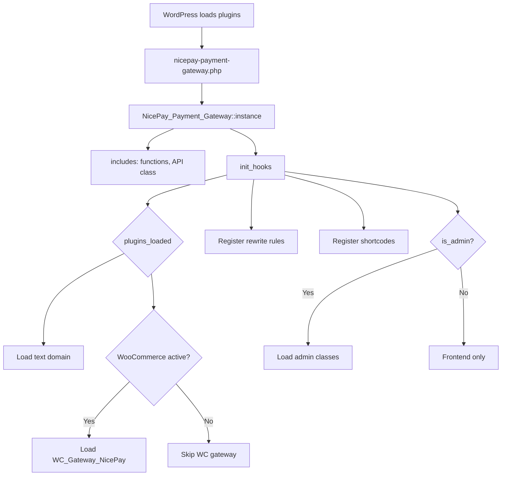
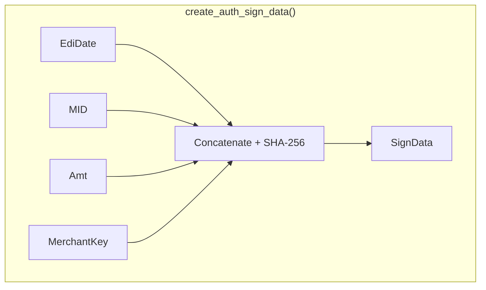
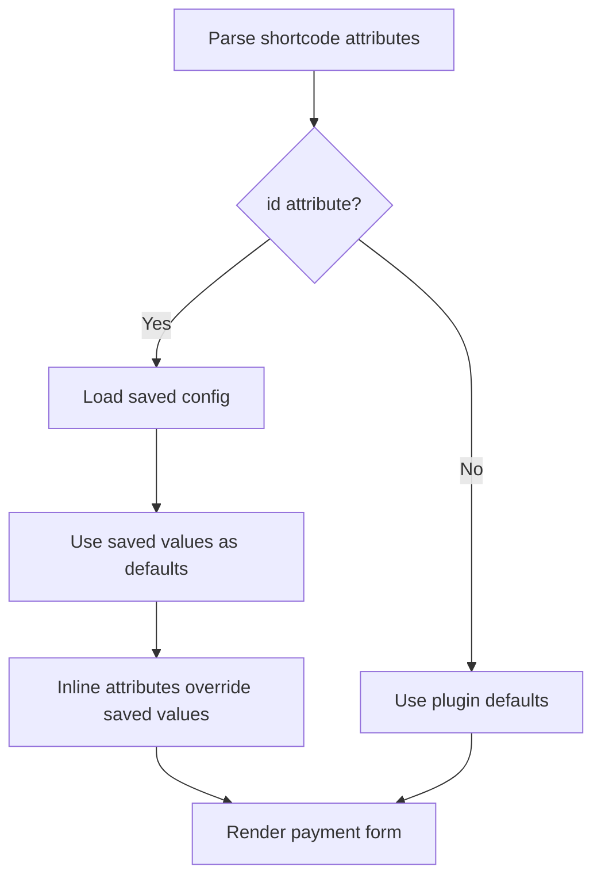
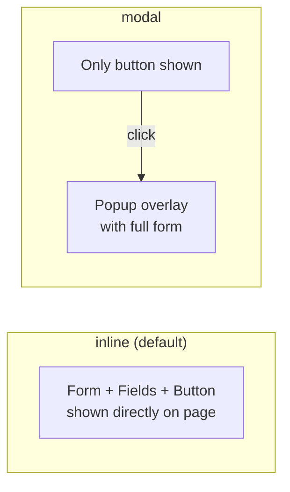
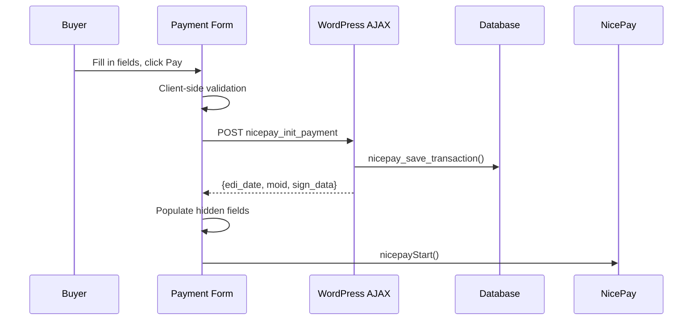
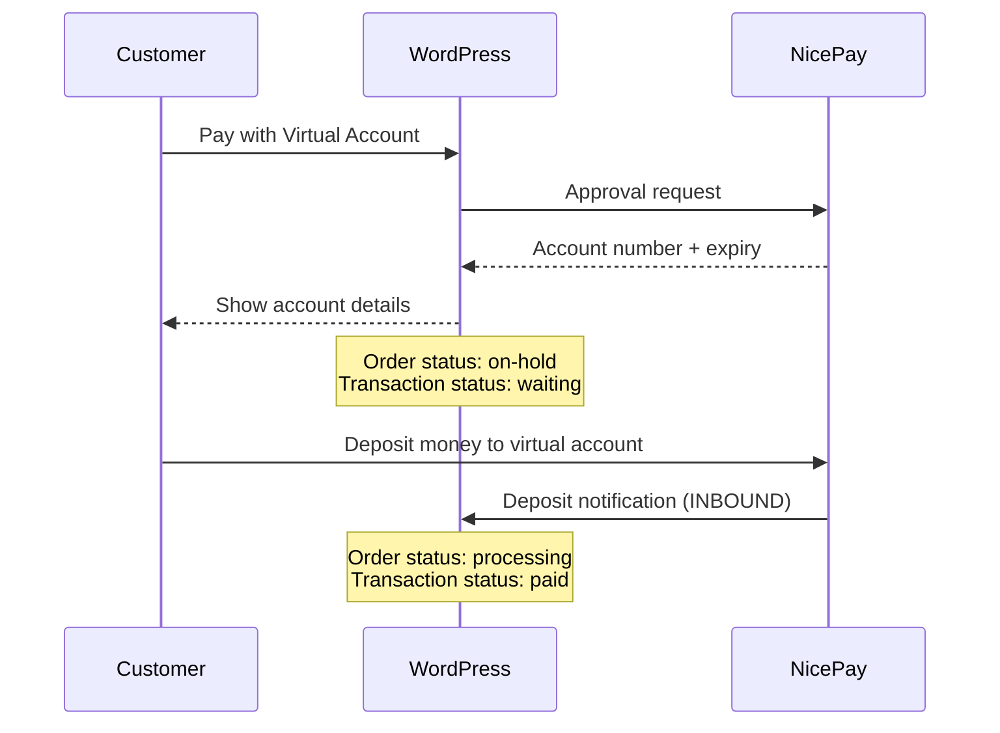

# Developer Guide

This guide covers how to extend, customize, and integrate with the NicePay Payment Gateway plugin.

## Table of Contents

- [Plugin Lifecycle](#plugin-lifecycle)
- [Adding Custom Logic with Hooks](#adding-custom-logic-with-hooks)
- [Working with the NicePay API Class](#working-with-the-nicepay-api-class)
- [Transaction Management](#transaction-management)
- [Customizing Templates](#customizing-templates)
- [Handling Virtual Account Deposits](#handling-virtual-account-deposits)
- [Storing Credentials Securely](#storing-credentials-securely)
- [Debugging & Logging](#debugging--logging)
- [Testing](#testing)
- [Common Patterns](#common-patterns)

---

## Plugin Lifecycle



### Activation

On activation, the plugin:
1. Creates the `wp_nicepay_transactions` database table
2. Sets default option values
3. Flushes rewrite rules (for `/nicepay-return/` endpoint)

### Deactivation

On deactivation, the plugin:
1. Flushes rewrite rules

> **Note:** The database table and options are NOT removed on deactivation. This is intentional to preserve transaction history. To fully clean up, use an uninstall hook or manual deletion.

---

## Adding Custom Logic with Hooks

### After Successful Payment (WooCommerce)

Use the `woocommerce_payment_complete` action to run code after a NicePay payment completes:

```php
add_action( 'woocommerce_payment_complete', function( $order_id ) {
    $order = wc_get_order( $order_id );
    
    // Check if this was a NicePay payment
    if ( $order->get_payment_method() !== 'nicepay' ) {
        return;
    }

    $tid = $order->get_meta( '_nicepay_tid' );
    $pay_method = $order->get_meta( '_nicepay_pay_method' );
    
    // Your custom logic here
    // e.g., send a notification, update external system, etc.
});
```

### Modify Payment Form Data

To add or modify form fields before the NicePay payment window opens, use the `woocommerce_receipt_nicepay` action timing. Since the form is generated in a template, you can override the template (see [Customizing Templates](#customizing-templates)).

### After Transaction Saved

To hook into transaction saves, use WordPress database hooks or wrap the `nicepay_save_transaction` function:

```php
// Example: Log every new transaction to an external service
add_action( 'init', function() {
    // Check periodically for new transactions
    // Or use a custom action fired after nicepay_save_transaction
});
```

### Custom Order Status Mapping

```php
add_filter( 'woocommerce_payment_complete_order_status', function( $status, $order_id ) {
    $order = wc_get_order( $order_id );
    if ( $order->get_payment_method() === 'nicepay' ) {
        return 'processing'; // Instead of 'completed'
    }
    return $status;
}, 10, 2 );
```

---

## Working with the NicePay API Class

The `NicePay_API` class handles all NicePay server communication. You can instantiate it anywhere:

```php
$api = new NicePay_API();

// Check current mode
if ( $api->is_test_mode() ) {
    // Running in test mode
}

// Get current MID
$mid = $api->get_mid();

// Generate identifiers
$edi_date = $api->generate_edi_date(); // YmdHis format
$moid = $api->generate_moid( 'CUSTOM' ); // CUSTOM_20260403120000_1234

// Create signatures
$sign_data = $api->create_auth_sign_data( $edi_date, '10000' );

// Request a cancellation
$result = $api->request_cancel(
    'nicepay00m03012603031200001234', // TID
    '10000',                          // Cancel amount
    'Customer requested refund',      // Reason
    'WC123_20260403_5678',           // Moid
    false                            // false = full cancel
);

if ( is_wp_error( $result ) ) {
    echo $result->get_error_message();
} elseif ( $api->is_cancel_success( $result['ResultCode'] ) ) {
    echo 'Cancel successful';
}
```

### Signature Computation Reference



| Method | Plain Text Components | Used For |
|---|---|---|
| `create_auth_sign_data()` | EdiDate + MID + Amt + Key | Authentication request |
| `verify_auth_signature()` | AuthToken + MID + Amt + Key | Authentication response |
| `create_approval_sign_data()` | AuthToken + MID + Amt + EdiDate + Key | Approval request |
| `verify_approval_signature()` | TID + MID + Amt + Key | Approval response |
| `create_cancel_sign_data()` | MID + CancelAmt + EdiDate + Key | Cancel request |
| `verify_cancel_signature()` | TID + MID + CancelAmt + Key | Cancel response |

---

## Transaction Management

### Database Functions

```php
// Save a new transaction
$id = nicepay_save_transaction( array(
    'tid'            => 'nicepay00m03012603031200001234',
    'moid'           => 'WC42_20260403_5678',
    'wc_order_id'    => 42,
    'amount'         => 50000,
    'payment_method' => 'CARD',
    'status'         => 'paid',
    'result_code'    => '3001',
    'result_msg'     => 'Card payment success',
    'buyer_name'     => 'John Doe',
    'payment_data'   => $full_response_array, // auto-serialized to JSON
) );

// Update a transaction
nicepay_update_transaction( $id, array(
    'status'      => 'cancelled',
    'result_code' => '2001',
) );

// Look up transactions
$tx = nicepay_get_transaction_by_tid( 'nicepay00m03012603031200001234' );
$tx = nicepay_get_transaction_by_moid( 'WC42_20260403_5678' );

// List with filters
$result = nicepay_get_transactions( array(
    'status'         => 'paid',
    'payment_method' => 'CARD',
    'date_from'      => '2026-04-01',
    'date_to'        => '2026-04-30',
    'search'         => 'John',
    'per_page'       => 50,
    'page'           => 1,
) );

foreach ( $result['items'] as $transaction ) {
    echo $transaction->tid . ' - ' . $transaction->amount;
}
echo 'Total: ' . $result['total'];
```

### Transaction Status Values

| Status | Meaning | Triggered When |
|---|---|---|
| `pending` | Transaction initiated, waiting for payment | Form created, before auth |
| `paid` | Payment approved successfully | CARD/BANK/CELLPHONE approval |
| `waiting` | Virtual account issued, awaiting deposit | VBANK approval |
| `failed` | Payment failed (auth or approval) | Error in any step |
| `cancelled` | Full cancel processed | Admin cancel or refund |
| `refunded` | Partial refund processed | Partial refund from WooCommerce |

---

## Shortcode Management

### Saved Shortcodes

Shortcode configs are stored in the `nicepay_saved_shortcodes` WordPress option as a PHP array. Each entry:

```php
array(
    'id'           => 'quick-payment',    // unique slug
    'name'         => 'Quick Payment',
    'display_mode' => 'inline',           // 'inline' or 'modal'
    'amount'       => '10000',
    'goods_name'   => 'Quick Payment',
    'pay_method'   => '',                 // empty = all enabled
    'buyer_name'   => '',
    'buyer_email'  => '',
    'buyer_tel'    => '',
    'button_text'  => 'Pay Now',
    'button_class' => 'nicepay-pay-button',
    'button_color' => '#2563eb',
    'currency'     => 'KRW',
    'language'     => '',
    'is_preset'    => true,               // true for built-in presets
    'created_at'   => 1712000000,
    'updated_at'   => 1712000000,
)
```

### Helper Functions

```php
// Get all saved shortcodes (seeds defaults if empty)
$shortcodes = nicepay_get_all_shortcodes();

// Get a specific shortcode by ID
$config = nicepay_get_saved_shortcode( 'quick-payment' );
if ( $config ) {
    echo $config['amount'];    // '10000'
    echo $config['button_color']; // '#2563eb'
}

// Get default presets (4 built-in templates)
$presets = nicepay_get_default_presets();

// Get SVG icon for a payment method
echo nicepay_get_method_icon( 'CARD' );  // Returns <span class="nicepay-method-icon">...</span>
echo nicepay_get_method_icon( 'BANK' );
echo nicepay_get_method_icon( 'VBANK' );
echo nicepay_get_method_icon( 'CELLPHONE' );
```

### Shortcode ID Resolution

When `[nicepay_payment id="donation"]` is used:



Example: `[nicepay_payment id="donation" amount="7500"]` loads the donation config but uses 7500 as the amount.

### Display Modes

The `display_mode` parameter controls how the payment form appears:



- **Inline**: Payment method selector, buyer fields, and pay button rendered directly in the page content
- **Modal**: Only the pay button is shown. Clicking opens a centered modal overlay with the full form. Closes on backdrop click, close button, or Escape key.

### AJAX Payment Initialization

Standalone payments use AJAX to create the transaction record when the buyer clicks pay (not on page load):



---

## Customizing Templates

### Override WooCommerce Payment Form

The plugin uses a direct `include` to load `templates/payment-form.php`. To override it, use the `nicepay_payment_form_template` filter (or hook into `woocommerce_receipt_nicepay` with a higher priority to replace the output):

```php
// Option 1: Replace the template path via filter
add_filter( 'nicepay_payment_form_template', function( $template_path ) {
    $theme_template = get_stylesheet_directory() . '/nicepay/payment-form.php';
    if ( file_exists( $theme_template ) ) {
        return $theme_template;
    }
    return $template_path;
} );
```

> **Note:** This filter needs the gateway to apply it. If you need a quick override, you can unhook the default `receipt_page` and add your own:

```php
// Option 2: Replace the receipt page handler entirely
add_action( 'init', function() {
    // Remove the default handler and add your own
    remove_action( 'woocommerce_receipt_nicepay', array( WC()->payment_gateways()->get_available_payment_gateways()['nicepay'], 'receipt_page' ) );
    add_action( 'woocommerce_receipt_nicepay', 'my_custom_nicepay_receipt' );
} );
```

### Customize Button Styling

The payment button uses the class `nicepay-pay-button`. Override in your theme CSS:

```css
.nicepay-pay-button {
    background: #ff6b35;
    border-radius: 4px;
    font-size: 18px;
    padding: 16px 48px;
}

.nicepay-pay-button:hover {
    background: #e55a2b;
}
```

### Customize Payment Method Labels

```php
add_filter( 'gettext', function( $translated, $text, $domain ) {
    if ( $domain !== 'nicepay-payment-gateway' ) {
        return $translated;
    }
    
    $custom = array(
        'Credit Card' => 'Credit / Debit Card',
        'Bank Transfer' => 'Direct Bank Payment',
    );
    
    return isset( $custom[ $text ] ) ? $custom[ $text ] : $translated;
}, 10, 3 );
```

---

## Handling Virtual Account Deposits

Virtual account payments follow a two-step process:



### Deposit Notification Setup

NicePay sends deposit notifications to your server. You need to:

1. **Open inbound firewall** for NicePay notification IPs (see README)
2. **Implement a notification endpoint** — this requires coordination with NicePay to configure the callback URL
3. **Contact NicePay** (`it@nicepay.co.kr`) to set up your deposit notification URL

> **Note:** The current plugin version handles virtual account issuance but the deposit notification handler needs to be configured with NicePay separately. This is typically set up during merchant onboarding.

---

## Storing Credentials Securely

By default, credentials are stored in the WordPress options table. For production environments, consider defining them as constants in `wp-config.php`:

```php
// wp-config.php
define( 'NICEPAY_LIVE_MID', 'your_live_mid' );
define( 'NICEPAY_LIVE_MERCHANT_KEY', 'your_live_merchant_key' );
```

Then modify the API class initialization to check for constants first:

```php
// In a custom plugin or theme functions.php
add_filter( 'option_nicepay_live_mid', function( $value ) {
    return defined( 'NICEPAY_LIVE_MID' ) ? NICEPAY_LIVE_MID : $value;
} );

add_filter( 'option_nicepay_live_merchant_key', function( $value ) {
    return defined( 'NICEPAY_LIVE_MERCHANT_KEY' ) ? NICEPAY_LIVE_MERCHANT_KEY : $value;
} );
```

---

## Debugging & Logging

### Enable Logging

Add to `wp-config.php`:

```php
define( 'WP_DEBUG', true );
define( 'WP_DEBUG_LOG', true );
```

All NicePay operations log with the `[NicePay]` prefix. If WooCommerce is active, logs go to `wp-content/uploads/wc-logs/nicepay-*.log`. Otherwise, they go to `wp-content/debug.log`.

### Log Entries

The plugin logs:
- Authentication request parameters (excluding sensitive data)
- Approval request URL and parameters
- Approval response data
- Signature verification results
- Network cancel attempts
- Cancel requests and responses
- Database errors

### Viewing WooCommerce Logs

Go to **WooCommerce > Status > Logs** and select the `nicepay-*` log file from the dropdown.

---

## Testing

### Test Credentials

| Field | Value |
|---|---|
| MID | `nicepay00m` |
| Merchant Key | `EYzu8jGGMfqaDEp76gSckuvnaHHu+bC4opsSN6lHv3b2lurNYkVXrZ7Z1AoqQnXI3eLuaUFyoRNC6FkrzVjceg==` |

### Test Cards

Use real card numbers in the NicePay test environment. The test MID is configured to process test transactions without actual charges.

### Important Test Mode Notes

1. **Virtual Account**: Only test up to account issuance. Do NOT test deposits with test credentials — request a separate MID from NicePay sales team for deposit/refund testing.
2. **Partial Cancel**: Avoid partial cancellation with test credentials on simple pay services (Naver Pay, Kakao Pay, etc.) as rollback is not possible. Use a dedicated MID.
3. **Admin Login**: To access the NicePay merchant admin (`npg.nicepay.co.kr`), use the MID without the trailing `m` for both username and password (e.g., `nicepay00` / `nicepay00`).

---

## Common Patterns

### Check if NicePay Paid an Order

```php
function is_nicepay_order( $order_id ) {
    $order = wc_get_order( $order_id );
    return $order && $order->get_payment_method() === 'nicepay';
}

function get_nicepay_tid( $order_id ) {
    $order = wc_get_order( $order_id );
    return $order ? $order->get_meta( '_nicepay_tid' ) : '';
}
```

### Get Payment Details for Display

```php
$order = wc_get_order( $order_id );
$tid = $order->get_meta( '_nicepay_tid' );
$tx = nicepay_get_transaction_by_tid( $tid );

if ( $tx ) {
    $data = json_decode( $tx->payment_data, true );
    
    echo 'Card: ' . $tx->card_name . ' ' . $tx->card_no;
    echo 'Installment: ' . ( $data['CardQuota'] === '00' ? 'Lump sum' : $data['CardQuota'] . ' months' );
}
```

### Programmatic Refund

```php
$gateway = new WC_Gateway_NicePay();
$result = $gateway->process_refund( $order_id, 5000, 'Defective product' );

if ( is_wp_error( $result ) ) {
    echo 'Refund failed: ' . $result->get_error_message();
} elseif ( $result === true ) {
    echo 'Refund processed successfully';
}
```

### WooCommerce Order Meta Fields

| Meta Key | Description |
|---|---|
| `_nicepay_moid` | Merchant Order ID sent to NicePay |
| `_nicepay_edi_date` | EdiDate used in auth request |
| `_nicepay_tid` | NicePay Transaction ID |
| `_nicepay_pay_method` | Payment method code (CARD, BANK, etc.) |
| `_nicepay_auth_code` | Authorization code from NicePay |
