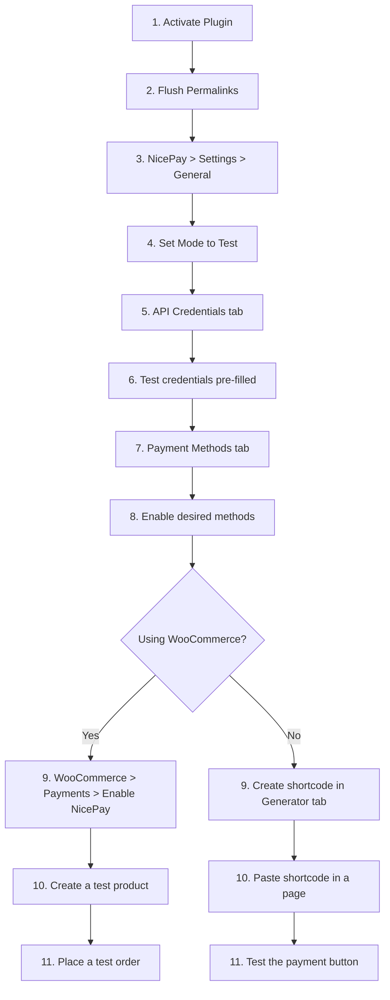
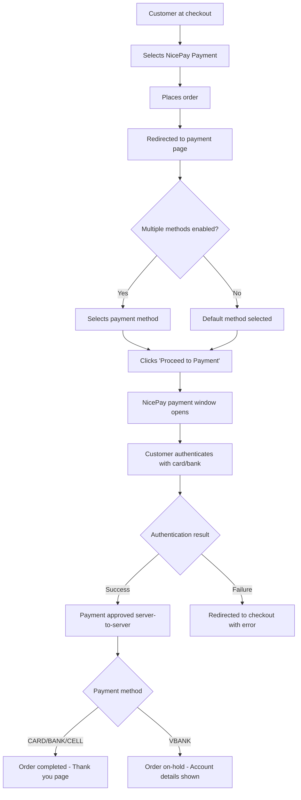
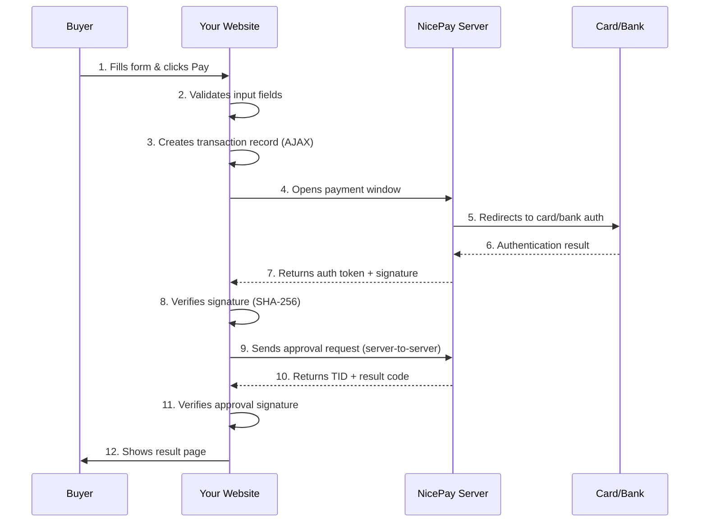
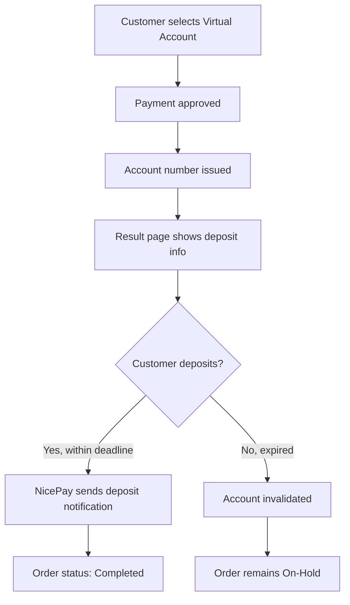

# User & Implementation Guide

A complete step-by-step guide for installing, configuring, and using the NicePay Payment Gateway WordPress plugin. Covers both WooCommerce checkout integration and standalone payment forms.

## Table of Contents

- [Getting Started](#getting-started)
  - [Requirements](#requirements)
  - [Installation](#installation)
  - [First-Time Setup Walkthrough](#first-time-setup-walkthrough)
- [Admin Panel](#admin-panel)
  - [General Settings](#general-settings)
  - [API Credentials](#api-credentials)
  - [Payment Methods](#payment-methods)
  - [Shortcodes Tab](#shortcodes-tab)
  - [Shortcode Generator](#shortcode-generator)
  - [Transactions](#transactions)
- [Using with WooCommerce](#using-with-woocommerce)
  - [Enabling at Checkout](#enabling-at-checkout)
  - [Customer Payment Experience](#customer-payment-experience)
  - [Order Management](#order-management)
  - [Processing Refunds](#processing-refunds)
- [Standalone Payments (Without WooCommerce)](#standalone-payments-without-woocommerce)
  - [Using Saved Shortcodes](#using-saved-shortcodes)
  - [Display Modes: Inline vs Modal](#display-modes-inline-vs-modal)
  - [Shortcode Parameters Reference](#shortcode-parameters-reference)
  - [Buyer Information Behavior](#buyer-information-behavior)
  - [Button Customization](#button-customization)
- [Payment Methods in Detail](#payment-methods-in-detail)
  - [Credit Card (CARD)](#credit-card-card)
  - [Bank Transfer (BANK)](#bank-transfer-bank)
  - [Virtual Account (VBANK)](#virtual-account-vbank)
  - [Mobile Payment (CELLPHONE)](#mobile-payment-cellphone)
  - [SSG Bank Account (SSG_BANK)](#ssg-bank-account-ssg_bank)
  - [Culture Cash (GIFT_CULT)](#culture-cash-gift_cult)
- [Payment Flow](#payment-flow)
  - [How a Payment Works (Step by Step)](#how-a-payment-works-step-by-step)
  - [What Happens on Success](#what-happens-on-success)
  - [What Happens on Failure](#what-happens-on-failure)
  - [Virtual Account Special Flow](#virtual-account-special-flow)
- [Multi-Language Support](#multi-language-support)
- [Going Live (Production)](#going-live-production)
- [Troubleshooting](#troubleshooting)

---

## Getting Started

### Requirements

| Component | Minimum Version | Notes |
|---|---|---|
| WordPress | 5.0+ | Required |
| PHP | 7.4+ | Extensions: `hash`, `json`, `curl`, `mbstring` |
| WooCommerce | 5.0+ | Optional (for checkout integration) |
| SSL Certificate | Required | NicePay requires HTTPS |

### Installation

1. Download the plugin ZIP file
2. In WordPress admin, go to **Plugins > Add New > Upload Plugin**
3. Select the ZIP file and click **Install Now**
4. Click **Activate**
5. Go to **Settings > Permalinks** and click **Save Changes** (this registers the payment return URL)

### First-Time Setup Walkthrough

After activation, follow these steps:



**Step 1-2:** Activate the plugin. Go to **Settings > Permalinks** and click Save Changes.

**Step 3-4:** Navigate to **NicePay > Settings**. The General tab is shown by default. Keep **Mode** set to **Test**.

**Step 5-6:** Click the **API Credentials** tab. Test credentials are already pre-filled:
- Test MID: `nicepay00m`
- Test Merchant Key: `EYzu8jGGMfqaDEp76gSckuvnaHHu+bC4opsSN6lHv3b2lurNYkVXrZ7Z1AoqQnXI3eLuaUFyoRNC6FkrzVjceg==`

**Step 7-8:** Click the **Payment Methods** tab. Check the boxes for the payment methods you want to offer (Credit Card is recommended for initial testing).

**Step 9-11:** Either enable in WooCommerce or create a shortcode to test.

---

## Admin Panel

The plugin adds a **NicePay** menu in the WordPress admin sidebar with two pages:
- **Settings** — 5 configuration tabs
- **Transactions** — Payment history and management

### General Settings

**NicePay > Settings > General**

| Setting | Options | Description |
|---|---|---|
| **Mode** | Test / Live | Test mode uses test credentials (no real charges). Live mode processes real payments. |
| **Language** | Korean / English / Chinese | Language of the NicePay payment window shown to customers. |
| **Currency** | KRW / USD | Default currency for payments. Must match your NicePay MID configuration. |
| **Charset** | UTF-8 / EUC-KR | Character encoding. Use UTF-8 unless your site specifically requires EUC-KR. |

A mode badge (TEST or LIVE) is shown in the page header so you always know which mode is active.

### API Credentials

**NicePay > Settings > API Credentials**

Enter your NicePay merchant credentials here. You need separate credentials for test and live environments.

| Field | Description |
|---|---|
| **Test MID** | Merchant ID for test environment (pre-filled: `nicepay00m`) |
| **Test Merchant Key** | Secret key for test environment (pre-filled) |
| **Live MID** | Merchant ID for production (obtain from NicePay sales team) |
| **Live Merchant Key** | Secret key for production (obtain from NicePay sales team) |

> **Security Tip:** For production, consider storing credentials in `wp-config.php` instead of the database. See the [Developer Guide](DEVELOPER-GUIDE.md#storing-credentials-securely) for instructions.

### Payment Methods

**NicePay > Settings > Payment Methods**

Enable or disable payment methods with visual icons. Only enabled methods appear in payment forms.

| Method | Icon | Description | Notes |
|---|---|---|---|
| **Credit Card** | Card icon | Visa, MasterCard, Korean domestic cards | Most commonly used |
| **Bank Transfer** | Bank icon | Direct bank account transfer | Cash receipt supported |
| **Virtual Account** | Bank+clock icon | Temporary account number for deposit | Buyer deposits later |
| **Mobile Payment** | Phone icon | Charge to mobile phone bill | Physical goods default |
| **SSG Bank Account** | Wallet icon | SSG Pay bank integration | Requires SSG Pay MID setup |
| **Culture Cash** | Gift icon | Cultureland gift vouchers | Requires buyer email as MallUserID |

**Virtual Account Expiry Days:** Set how many days the virtual account number remains valid (1-30 days, default: 3).

### Shortcodes Tab

**NicePay > Settings > Shortcodes**

A card grid showing all your saved payment shortcodes. On first use, 4 default presets are created:

| Preset | Amount | Mode | Button | Use Case |
|---|---|---|---|---|
| **Quick Payment** | 10,000 KRW | Inline | Blue "Pay Now" | General purpose payment |
| **Donation** | 5,000 KRW | Inline | Green "Donate" | Accepting donations |
| **Product Purchase** | 50,000 KRW | Modal | Black "Buy Now" | Product sales |
| **Subscription** | 29,900 KRW | Modal | Purple "Subscribe" | Recurring services |

Each card shows:
- **Name** and **display mode** badge (inline or modal)
- **Button preview** with the configured color
- **Meta info** — amount, product name, payment method
- **Full shortcode** — ready to copy and paste

**Actions on each card:**
- **Edit** — Opens the Shortcode Generator with all fields pre-filled
- **Copy** — Copies the full shortcode to clipboard (with toast notification)
- **Delete** — Removes the shortcode after confirmation dialog

### Shortcode Generator

**NicePay > Settings > Shortcode Generator**

An interactive builder with a live preview panel. Build your payment shortcode visually without writing any code.

#### Builder Fields

**1. Shortcode Name** (required for saving)
- Give your shortcode a descriptive name (e.g., "Premium Plan Payment")
- Used to identify it in the Shortcodes tab

**2. Display Mode**
- **Inline** — The full payment form (method selector, buyer fields, pay button) appears directly on the page
- **Modal** — Only the pay button is visible. Clicking it opens a popup overlay with the full form

**3. Required Fields**
- **Payment Amount** — The price. Select currency (KRW or USD) from the dropdown next to it.
- **Product/Service Name** — What the customer is paying for (max 40 bytes, shown in NicePay window)

**4. Payment Method**
- **All Enabled** — Customer can choose from any enabled method
- **Specific method** — Lock to one method (e.g., Credit Card only)

**5. Buyer Information**
- **If left empty:** The payment form shows Name, Email, and Phone input fields for the buyer to fill in
- **If filled:** Those values are pre-set and the fields are hidden from the buyer

**6. Appearance**
- **Button Text** — The label on the pay button (default: "Pay Now")
- **Button Color** — Pick from preset swatches (Blue, Black, Green, Red, Purple, Orange) or use the color picker for any hex color
- **Language** — Override the payment window language for this specific shortcode
- **CSS Class** — Add custom CSS class for advanced styling

#### Live Preview

The right panel updates in real-time as you fill in the fields:
- Shows product name and formatted amount
- Shows payment method options (if "All Enabled")
- Shows buyer input field placeholders (if buyer info not pre-filled)
- Shows the button with your chosen text and color

#### Generated Shortcode

Below the preview, the generated shortcode is displayed. It includes all non-default parameters.

#### Saving

Click **Save Shortcode** to save your configuration. You'll be redirected to the Shortcodes tab where your new shortcode appears as a card.

To edit an existing shortcode, click **Edit** on its card. The generator opens with all fields pre-filled, and the button changes to **Update Shortcode**.

### Transactions

**NicePay > Transactions**

View and manage all payment transactions.

#### Filtering

| Filter | Options |
|---|---|
| **Status** | All, Pending, Paid, Failed, Cancelled, Refunded, Waiting for Deposit |
| **Payment Method** | All, Credit Card, Bank Transfer, Virtual Account, Mobile Payment, etc. |
| **Date Range** | From / To date pickers |
| **Search** | Search by TID, order ID, buyer name, or product name |

#### Transaction Table

| Column | Description |
|---|---|
| **ID** | Internal transaction ID |
| **TID** | NicePay Transaction ID (click copy icon to copy) |
| **Order** | WooCommerce order link (if applicable) or standalone Moid |
| **Amount** | Formatted payment amount |
| **Method** | Payment method used |
| **Status** | Color-coded badge with dot indicator |
| **Buyer** | Buyer name |
| **Date** | Transaction timestamp |
| **Actions** | Cancel button (for paid/waiting transactions) |

#### Status Badges

| Badge | Color | Meaning |
|---|---|---|
| **PENDING** | Yellow | Payment initiated, not yet completed |
| **PAID** | Green | Payment successfully completed |
| **FAILED** | Red | Payment failed at authentication or approval |
| **CANCELLED** | Gray | Payment reversed/cancelled |
| **REFUNDED** | Purple | Partial refund processed |
| **WAITING** | Blue (pulsing) | Virtual account issued, waiting for deposit |

#### Cancelling a Transaction

1. Click the **Cancel** button on a paid or waiting transaction
2. A modal dialog appears asking for the cancellation reason
3. Enter the reason and click **Cancel Transaction**
4. The cancellation is processed via NicePay API
5. A toast notification confirms success or shows an error
6. The status badge updates immediately (no page reload needed)

---

## Using with WooCommerce

### Enabling at Checkout

1. Go to **WooCommerce > Settings > Payments**
2. Find **NicePay Payment** in the list
3. Toggle it **On**
4. Click **Set up** to customize the title and description shown to customers

| Setting | Default | Description |
|---|---|---|
| **Title** | "NicePay Payment" | What customers see at checkout |
| **Description** | "Pay securely via NicePay..." | Additional text below the title |

> API credentials are configured in the centralized **NicePay > Settings** page, not here.

### Customer Payment Experience



### Order Management

After a successful payment, the WooCommerce order contains:

| Order Meta | Description |
|---|---|
| `_nicepay_tid` | NicePay Transaction ID |
| `_nicepay_moid` | Merchant Order ID |
| `_nicepay_pay_method` | Payment method code (CARD, BANK, etc.) |
| `_nicepay_auth_code` | Authorization code |

Order notes automatically record:
- Payment completion with method and TID
- Virtual account details (bank, account number, expiry)
- Refund processing details

### Processing Refunds

#### Full Refund

1. Open the WooCommerce order
2. Click **Refund**
3. Enter the full order amount
4. Click **Refund via NicePay**
5. The refund is processed through the NicePay API
6. Order status changes to **Refunded**
7. Amount is credited back to the customer's original payment method

#### Partial Refund

1. Open the WooCommerce order
2. Click **Refund**
3. Enter a partial amount
4. Enter a reason
5. Click **Refund via NicePay**
6. The partial amount is refunded
7. Order note records the refund details

> **Important:** Some payment methods may not support partial refunds with test credentials. Contact NicePay for a dedicated test MID if needed.

---

## Standalone Payments (Without WooCommerce)

Use shortcodes to embed payment buttons on any page or post — no WooCommerce required.

### Using Saved Shortcodes

The easiest approach:

1. Go to **NicePay > Settings > Shortcode Generator**
2. Build your payment configuration visually
3. Click **Save Shortcode**
4. Go to the **Shortcodes** tab
5. Click **Copy** on your shortcode card
6. Paste into any page or post

Example:
```text
[nicepay_payment id="quick-payment"]
```

### Display Modes: Inline vs Modal

#### Inline Mode (Default)

The complete payment form is shown directly on the page:

```text
[nicepay_payment id="donation"]
```

What the customer sees:
1. Product name and amount
2. Payment method selector (if multiple methods enabled)
3. Buyer information fields (Name, Email, Phone)
4. Pay button

#### Modal Mode

Only a button is visible. Clicking it opens a popup overlay:

```text
[nicepay_payment id="product-purchase"]
```

What the customer sees:
1. A styled button on the page
2. When clicked: A centered popup overlay appears with the full payment form
3. The popup can be closed by:
   - Clicking the X button
   - Clicking outside the popup
   - Pressing the Escape key

### Shortcode Parameters Reference

| Parameter | Required | Default | Description |
|---|---|---|---|
| `id` | No | — | Load config from a saved shortcode |
| `display_mode` | No | `inline` | `inline` or `modal` |
| `amount` | Yes* | — | Payment amount |
| `goods_name` | Yes* | — | Product/service name (max 40 bytes) |
| `pay_method` | No | All enabled | Specific method: `CARD`, `BANK`, `VBANK`, `CELLPHONE`, `SSG_BANK`, `GIFT_CULT` |
| `buyer_name` | No | — | Pre-fill buyer name |
| `buyer_email` | No | — | Pre-fill buyer email |
| `buyer_tel` | No | — | Pre-fill buyer phone |
| `button_text` | No | "Pay Now" | Button label |
| `button_color` | No | `#2563eb` | Hex color for button background |
| `button_class` | No | `nicepay-pay-button` | CSS class for custom styling |
| `currency` | No | `KRW` | `KRW` or `USD` |
| `language` | No | Settings default | `KO`, `EN`, or `CN` |

*Required unless using a saved shortcode via `id` that already has these values.

**Priority:** When using `id`, inline attributes override saved values. For example:
```text
[nicepay_payment id="donation" amount="25000"]
```
This loads the "Donation" config but changes the amount to 25,000.

### Buyer Information Behavior

| Scenario | What Happens |
|---|---|
| All buyer fields empty in shortcode | Form shows Name, Email, Phone inputs for the buyer to fill in |
| Some fields provided | Only missing fields are shown as inputs |
| All fields provided | No input fields shown — buyer info is hidden and pre-set |

**With validation:** When the buyer clicks Pay, the form validates:
- Name: must not be empty
- Email: must be a valid email format
- Phone: must be 7-20 digits (allows dashes, spaces, parentheses)

Error messages appear inline below each invalid field, and the first invalid field receives focus.

### Button Customization

**Color presets available in the generator:**

| Color | Hex | Suggested Use |
|---|---|---|
| Blue | `#2563eb` | Default, general purpose |
| Black | `#111827` | Premium, professional |
| Green | `#16a34a` | Donations, eco-friendly |
| Red | `#dc2626` | Urgent, limited offers |
| Purple | `#9333ea` | Premium, subscriptions |
| Orange | `#ea580c` | Promotions, calls to action |

Or use any custom hex color via the color picker.

---

## Payment Methods in Detail

### Credit Card (CARD)

- **Success code:** `3001`
- **Supports:** Visa, MasterCard, all Korean domestic cards (BC, KB, Samsung, Shinhan, etc.)
- **Features:** Installment payments, interest-free options
- **Refund:** Full and partial refunds supported

### Bank Transfer (BANK)

- **Success code:** `4000`
- **Supports:** All major Korean banks
- **Features:** Cash receipt issuance (income deduction or expense proof)
- **Refund:** Full and partial refunds supported

### Virtual Account (VBANK)

- **Success code:** `4100`
- **Supports:** All major Korean banks
- **How it works:**
  1. A temporary bank account number is issued to the customer
  2. The customer deposits the exact amount to this account
  3. NicePay confirms the deposit and notifies your server
- **Expiry:** Configurable (1-30 days, default 3)
- **Result page:** Shows bank name, account number, amount, and deadline
- **Order status:** Set to "on-hold" until deposit is received
- **Refund:** Requires bank account details (account number, bank code, account holder name)

### Mobile Payment (CELLPHONE)

- **Success code:** `A000`
- **Supports:** All major Korean mobile carriers
- **How it works:** Charges the amount to the customer's mobile phone bill
- **Product type:** Automatically set to "physical goods" (GoodsCl=1)
- **Refund:** Full and partial refunds supported

### SSG Bank Account (SSG_BANK)

- **Success code:** `0000`
- **Supports:** SSG Pay bank account integration
- **Note:** Requires SSG Pay MID setup with NicePay

### Culture Cash (GIFT_CULT)

- **Success code:** `0000`
- **Supports:** Cultureland gift vouchers
- **Special requirement:** `MallUserID` parameter is required (automatically set to buyer's email)
- **Note:** Requires buyer email to be provided

---

## Payment Flow

### How a Payment Works (Step by Step)



### What Happens on Success

**WooCommerce:**
- Order status set to **Completed** (or **On-Hold** for virtual accounts)
- Transaction ID stored in order meta
- Order note added with payment details
- Customer redirected to the Thank You page

**Standalone:**
- Transaction record updated with TID and payment details
- Animated success page shown with:
  - Green checkmark icon
  - "Payment Successful" title
  - Transaction ID, amount, and payment method
  - "Return to Home" button

### What Happens on Failure

**Automatic recovery:** If the approval request fails (timeout, network error), the plugin automatically sends a **network cancel** request to prevent the customer from being charged without your knowledge.

**WooCommerce:**
- Order status set to **Failed**
- Error message shown at checkout
- Customer can retry the payment

**Standalone:**
- Red X icon with "Payment Failed" message
- Error description from NicePay
- "Return to Home" button

### Virtual Account Special Flow



The result page for virtual accounts shows a highlighted deposit information card:
- **Bank:** The bank name
- **Account:** The virtual account number
- **Amount:** The exact amount to deposit
- **Deadline:** The expiry date and time

---

## Multi-Language Support

### Payment Window Language

The NicePay payment window (where customers enter card details) supports:
- **KO** — Korean (default)
- **EN** — English
- **CN** — Chinese

Set globally in **NicePay > Settings > General > Language**, or per-shortcode:
```text
[nicepay_payment id="my-payment" language="EN"]
```

### Plugin Interface Language

The plugin's admin and frontend text is translated into:
- **English** (en_US) — Source language
- **Korean** (ko_KR)
- **Chinese Simplified** (zh_CN)
- **Turkish** (tr_TR)

The plugin follows your WordPress site language setting (**Settings > General > Site Language**).

### Adding More Languages

To add a new translation:
1. Copy `languages/nicepay-payment-gateway.pot` as your base
2. Use [Poedit](https://poedit.net/) or the [Loco Translate](https://wordpress.org/plugins/loco-translate/) plugin
3. Save the `.po` file as `nicepay-payment-gateway-{locale}.po` (e.g., `nicepay-payment-gateway-ja.po` for Japanese)
4. Compile the `.mo` file
5. Place both files in the `languages/` directory

---

## Going Live (Production)

### Pre-Launch Checklist

- [ ] Obtain Live MID and Merchant Key from NicePay sales team
- [ ] Enter Live credentials in **NicePay > Settings > API Credentials**
- [ ] Switch Mode to **Live** in **NicePay > Settings > General**
- [ ] Verify your site has a valid SSL certificate (HTTPS)
- [ ] Verify firewall allows outbound HTTPS to NicePay IPs:
  - `121.133.126.56:443`
  - `211.44.32.56:443`
- [ ] If using virtual accounts, set up inbound firewall for deposit notifications:
  - `121.133.126.10`, `121.133.126.11`, `211.33.136.39`
- [ ] Process one small live transaction to verify everything works
- [ ] Verify the transaction appears in both your admin panel and NicePay merchant admin
- [ ] Cancel the test transaction to verify refund flow
- [ ] Monitor WooCommerce logs (**WooCommerce > Status > Logs > nicepay**) for the first few days

### NicePay Merchant Admin

Access your NicePay merchant dashboard at `npg.nicepay.co.kr`:
- **Test login:** MID without trailing `m` for both username and password (e.g., `nicepay00` / `nicepay00`)
- **Live login:** Credentials provided by NicePay sales team

---

## Troubleshooting

### Common Issues

| Problem | Cause | Solution |
|---|---|---|
| **Payment window doesn't open** | NicePay JavaScript not loaded | Check browser console for errors. Verify `https://pg-web.nicepay.co.kr` is accessible from your site. |
| **"SIGNDATA verification failed"** | Incorrect MID or Merchant Key | Double-check credentials in API Credentials tab. Ensure no extra spaces. |
| **Payment approved but order stays Pending** | Return URL not working | Go to **Settings > Permalinks** and click Save Changes to flush rewrite rules. |
| **Approval request timeout** | Firewall blocking outbound HTTPS | Ensure outbound access to `121.133.126.56:443` and `211.44.32.56:443`. |
| **Multiple methods appear selected** | Browser CSS `:has()` not supported | Clear browser cache. The plugin includes a JavaScript fallback for older browsers. |
| **Virtual account not confirming deposit** | Deposit notification not configured | Contact NicePay (`it@nicepay.co.kr`) to set up your deposit notification URL. |
| **Culture Cash payment fails** | MallUserID missing | Ensure buyer email is provided (it's used as MallUserID automatically). |
| **Partial cancel fails on test** | Simple Pay + test MID limitation | Use a dedicated test MID from NicePay for partial cancel testing. |
| **Currency mismatch error** | Site currency differs from NicePay MID | Ensure your currency setting matches what your NicePay MID supports. |

### Viewing Logs

Enable debug logging in `wp-config.php`:

```php
define( 'WP_DEBUG', true );
define( 'WP_DEBUG_LOG', true );
define( 'WP_DEBUG_DISPLAY', false );
```

**With WooCommerce:** Go to **WooCommerce > Status > Logs** and select the `nicepay-*` file.

**Without WooCommerce:** Check `wp-content/debug.log`.

All NicePay log entries are prefixed with `[NicePay]` for easy filtering. Sensitive data (card numbers, tokens) is automatically redacted in logs.

### Getting Help

- **NicePay Technical Support:** `it@nicepay.co.kr`
- **Plugin Issues:** [GitHub Issues](https://github.com/cemililik/nicepay-paymentgateway-wordpress-plugin/issues)
