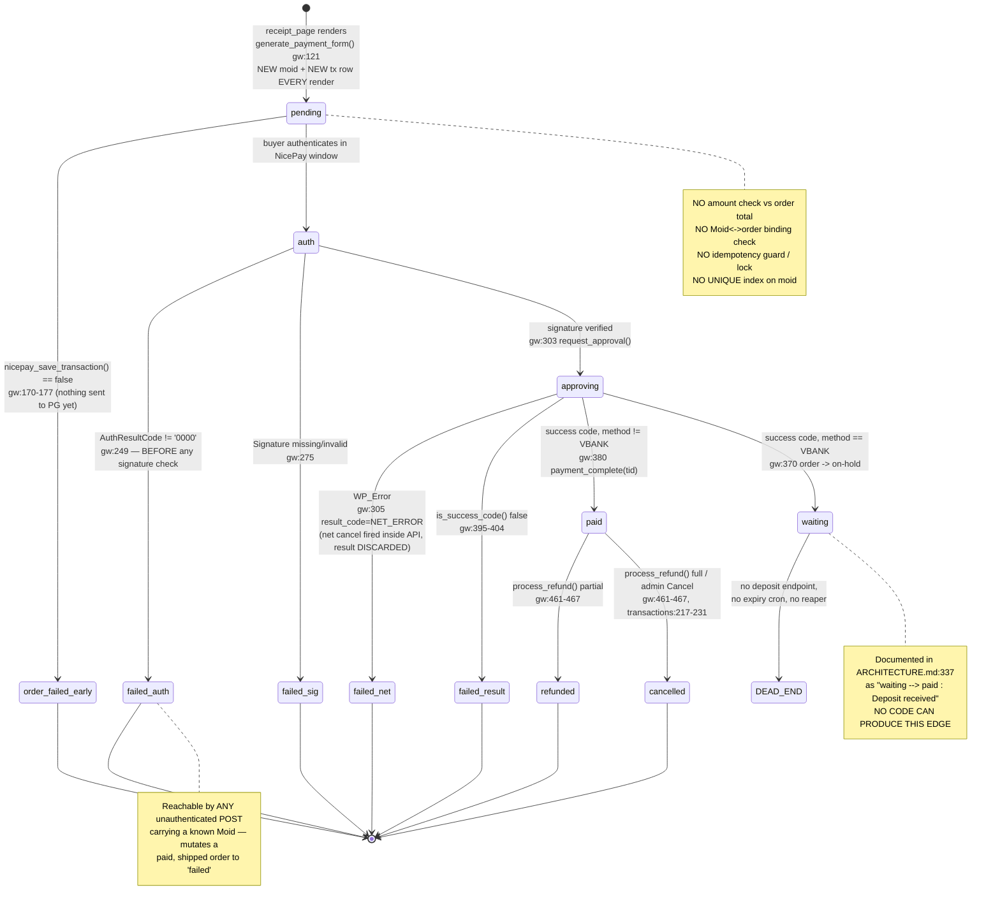

# Payment Lifecycle & Money Correctness

This document covers the *payflow* dimension of the NicePay Payment Gateway review: the reconstructed state machine of an authenticated payment, what happens to real money at each edge, and the 42 findings (3 critical, 5 high, 22 medium, 11 low, 1 enhancement) that concern approval, net cancel, virtual accounts, refunds and reconciliation. The cryptographic core of this plugin is genuinely strong — signature construction is contract-tested against the vendor's own worked digests — but the layer above it is missing almost every *binding* and *idempotency* invariant that turns a correct signature into a correct payment: the approved amount is never compared to the order total, the response is bound to an order only by a client-supplied `Moid` that no signature covers, the standalone AJAX endpoint will sign any amount a visitor asks for, and there is no guard at all against a replayed return POST. Virtual account is enabled by default and cannot complete, because no deposit-notification endpoint exists and the account number never reaches the buyer.

---

## What this codebase does well

Before the findings, the parts that are right — and that a rewrite must not regress:

- **Signature construction is exactly right, and contract-tested against the vendor's worked examples.** [includes/class-nicepay-api.php:74](../../includes/class-nicepay-api.php#L74)–[125](../../includes/class-nicepay-api.php#L125) implements all six SignData/Signature rules with the correct plaintext concatenations, uses `hash_equals()` for every comparison (no timing leak, no `==` type juggling), and [tests/unit/NicePaySignatureIntegrationTest.php](../../tests/unit/NicePaySignatureIntegrationTest.php) pins each one to the literal hex digest from the v2.0.8 manual (e.g. `475979a5…46bd` for the auth request). Most PG integrations get this wrong; this one does not.
- **`NextAppURL` and `NetCancelURL` are treated as untrusted input.** `validate_nicepay_url()` ([api.php:140-152](../../includes/class-nicepay-api.php#L140)) requires an `https` scheme and an exact host match against `dc1`/`dc2`/`pg-api`/`pg-web` — honouring the spec's warning that `NextAppURL` must not be hardcoded, while still closing the SSRF hole naive implementations open. `sslverify => true` is set explicitly on all three outbound calls.
- **Net cancel (망취소) is implemented at all, with the right parameters.** It fires on the three transport-level conditions that matter most — connection failure, unparseable body, approval-signature mismatch ([api.php:222-267](../../includes/class-nicepay-api.php#L222)) — and the request itself is spec-correct: TID, AuthToken, MID, Amt, EdiDate, `NetCancel=1` and the approval-rule SignData ([api.php:288-301](../../includes/class-nicepay-api.php#L288)). Many integrations skip 망취소 entirely; the gaps here are in what happens to the *result*, not in the mechanism.
- **Success codes are modelled per-method, not as one global value.** [api.php:399-414](../../includes/class-nicepay-api.php#L399): CARD `3001`, BANK `4000`, VBANK `4100`, CELLPHONE `A000`, SSG_BANK `0000` — matching spec §7, and a detail very commonly collapsed into a wrong `'0000'` check.
- **VBANK correctly lands on `on-hold`, not `processing`/`completed`,** with bank, account number and expiry captured into an order note ([gateway.php:370-378](../../includes/class-nicepay-gateway.php#L370)). The initial transition is right — only the forward path out of it is missing.
- **Log redaction is thoughtful.** `redact_for_log()` ([api.php:157-174](../../includes/class-nicepay-api.php#L157)) masks AuthToken, SignData, Signature, MerchantKey, CardNo and VbankNum to first-4/last-4 before anything reaches the log, and is applied to approval, net-cancel and cancel responses alike.
- **Every DB read is parameterised** through `$wpdb->prepare()` with `esc_like()` on the search term, and the `ORDER BY` column is whitelisted against a fixed array before interpolation ([nicepay-functions.php:118-214](../../includes/nicepay-functions.php#L118)). The transactions query is free of injection.
- **The standalone result page is well-built for what it covers:** distinct success/failure treatments, a dedicated highlighted panel for virtual-account details, `role="alert"` on notices, responsive breakpoints, and no dependency on the theme rendering correctly.

---

## 1. The actual state machine

Reconstructed by reading [includes/class-nicepay-gateway.php](../../includes/class-nicepay-gateway.php) and [includes/class-nicepay-return-handler.php](../../includes/class-nicepay-return-handler.php) — this is what the code does, not what the docs claim.



### WooCommerce order status, in parallel

| Transaction status | WooCommerce order status | Set at |
|---|---|---|
| `pending` | `pending` | order creation; row inserted at [gateway.php:158](../../includes/class-nicepay-gateway.php#L158) |
| `failed` (auth / sig / net / result) | `failed` | [gateway.php:258](../../includes/class-nicepay-gateway.php#L258), [283](../../includes/class-nicepay-gateway.php#L283), [312](../../includes/class-nicepay-gateway.php#L312), [399](../../includes/class-nicepay-gateway.php#L399) |
| `paid` | `payment_complete()` → `processing` (or `completed`) | [gateway.php:380](../../includes/class-nicepay-gateway.php#L380) |
| `waiting` (VBANK) | `on-hold` | [gateway.php:370](../../includes/class-nicepay-gateway.php#L370) |
| `refunded` (partial) | unchanged by the plugin | [gateway.php:461-467](../../includes/class-nicepay-gateway.php#L461) |
| `cancelled` (full) | `cancelled` when cancelled from the admin screen only | [transactions.php:217-231](../../admin/class-nicepay-transactions.php#L217) |

### The standalone (shortcode) path

`NicePay_Return_Handler::process()` ([return-handler.php:25](../../includes/class-nicepay-return-handler.php#L25)) is structurally the same machine with two differences: it enforces `REQUEST_METHOD === 'POST'` (which the WooCommerce handler does not), and **every DB write is wrapped in `if ( $transaction )` while `request_approval()` at [line 97](../../includes/class-nicepay-return-handler.php#L97) runs unconditionally** — so it can capture money it has nowhere to record. It never inspects `wc_order_id`, so a WooCommerce auth response delivered here is approved and the order is left untouched.

---

## 2. Risk table — failure mode × money × order

| Failure mode | What happens to the money | What happens to the order | Finding |
|---|---|---|---|
| Attacker swaps `Moid` in the return POST | Cheap amount captured | Expensive order marked paid & fulfilled | FLOW-01, FLOW-02 |
| Attacker POSTs arbitrary `amount` to `ajax_init_payment` | Arbitrary amount captured, signed by the merchant | Standalone "Payment Successful" page shown | FLOW-03 |
| Return POST delivered twice | Approval replayed; **net cancel fired against the live TID** | Paid order downgraded to `failed`, failure email sent | FLOW-04 |
| Crafted POST with `AuthResultCode=9999` | None (no PG contact) | Any order, incl. shipped, flipped to `failed` | FLOW-05 |
| Approval times out, net cancel also fails | **Money stays captured** | Order `failed`, customer pays again | FLOW-06 |
| Merchant DB/PHP fails after approval | Money captured | Order stays unpaid, tx stays `pending` | FLOW-09 |
| Buyer deposits into a virtual account | Money captured at PG | Order `on-hold` forever, stock reserved forever | FLOW-07, FLOW-08, FLOW-28 |
| Two tabs both complete | **Charged twice** | One TID stored, second capture orphaned | FLOW-17 |
| Moid collision (1/9000 same second) | Correct amount captured | Bound to the *wrong buyer's* row | FLOW-18 |
| Store currency is not KRW/USD | Nothing captured (PG rejects) | Dead end at the pay page, no diagnostic | FLOW-10 |
| Partial refund on a `CcPartCl=0` card / simple-pay | Refund rejected, or irreversibly forecloses further cancels | Raw Korean PG error on the order screen | FLOW-25 |
| Refund of 3,333.33 KRW | PG reverses 3,333 | WooCommerce records 3,333.33 — permanent divergence | FLOW-24 |
| Admin "Cancel" button used | Money reversed at PG | No `wc_create_refund` object, no customer email | FLOW-15 |
| Partial refund recorded | Money reversed | Row status overwritten to `refunded`; remaining balance no longer actionable | FLOW-38 |
| VBANK refund after deposit | Impossible via the plugin | Manual bank transfer + manual ledger fix | FLOW-26 |
| Mobile payment fails | Nothing captured | Silent bounce to checkout, **no message at all** | FLOW-21 |
| All payment methods unchecked | Nothing captured | Gateway still offered; pay button does nothing | FLOW-22 |

---

## 3. Findings

Severity order: `CRITICAL` → `HIGH` → `MEDIUM` → `LOW` → `ENHANCEMENT`. Findings marked **needs confirmation** were rated PLAUSIBLE during verification — the code fact holds, but the consequence depends on live PG behaviour that cannot be established from this repository.

### Index

| ID | Severity | Title |
|---|---|---|
| FLOW-01 | CRITICAL | Approved `Amt` never reconciled against the order total |
| FLOW-02 | CRITICAL | Auth response bound to an order only by client-supplied `Moid` |
| FLOW-03 | CRITICAL | Standalone AJAX endpoint signs any amount the client asks for |
| FLOW-04 | HIGH | No idempotency guard on the return endpoint |
| FLOW-05 | HIGH | Unauthenticated POST can force an order to `failed` |
| FLOW-06 | HIGH | Net-cancel results discarded and never validated |
| FLOW-07 | HIGH | VBANK orders can never complete — no deposit endpoint |
| FLOW-08 | HIGH | Virtual account number never reaches the customer |
| FLOW-09 | MEDIUM | No net cancel on merchant-internal failure after approval |
| FLOW-10 | MEDIUM | Gateway offered in any store currency |
| FLOW-11 | MEDIUM | Standalone endpoint captures with no transaction row |
| FLOW-12 | MEDIUM | Real decline codes discarded as a generic network error *(needs confirmation)* |
| FLOW-13 | MEDIUM | Approval-signature `Amt` has no padding tolerance *(needs confirmation)* |
| FLOW-14 | MEDIUM | Refunds reuse the payment `Moid`; `OTID` never captured |
| FLOW-15 | MEDIUM | Admin Cancel creates no WooCommerce refund record |
| FLOW-16 | MEDIUM | Every pay-page render mints a new moid and a new row |
| FLOW-17 | MEDIUM | Concurrent attempts double-charge and overwrite the TID |
| FLOW-18 | MEDIUM | Moid is timestamp + 4 digits with no unique index |
| FLOW-19 | MEDIUM | VBANK routing trusts client `PayMethod`; loose success check |
| FLOW-20 | MEDIUM | Customer cancellation marked as order `failed` |
| FLOW-21 | MEDIUM | Failure notices lost on the mobile return POST *(needs confirmation)* |
| FLOW-22 | MEDIUM | Unchecking every method silently breaks both forms |
| FLOW-23 | MEDIUM | Amounts formatted — and cancelled — with a global currency |
| FLOW-24 | MEDIUM | Refund truncation; PG `CancelAmt` never compared |
| FLOW-25 | MEDIUM | `CcPartCl` / `ClickpayCl` stored but never read |
| FLOW-26 | MEDIUM | VBANK refunds cannot work — refund account never sent |
| FLOW-27 | MEDIUM | HPOS not declared; order links go through `post.php` |
| FLOW-28 | MEDIUM | Expired virtual accounts never reaped |
| FLOW-29 | MEDIUM | Byte-length limits enforced only on `GoodsName` |
| FLOW-30 | MEDIUM | Partial refund overwrites the row status |
| FLOW-31 | LOW | `GIFT_CULT` success code is an unverified assumption *(needs confirmation)* |
| FLOW-32 | LOW | Cancelling in WooCommerce leaves the payment captured |
| FLOW-33 | LOW | Cancel-response signature check skipped when fields absent |
| FLOW-34 | LOW | `order_id` duplicates `moid` |
| FLOW-35 | LOW | `nicepayParams.nonce` is generated for an action nothing verifies |
| FLOW-36 | LOW | Single 30s timeout instead of 5s connect / 30s read |
| FLOW-37 | LOW | Docs promise transitions the code cannot perform |
| FLOW-38 | LOW | Standalone payments produce no receipt and no email |
| FLOW-39 | LOW | A failed row INSERT permanently fails a brand-new order |
| FLOW-40 | LOW | `VbankExpDate` computed in UTC, nine hours short of KST |
| FLOW-41 | LOW | `ajax_init_payment` allows unbounded attacker-controlled rows |
| FLOW-42 | ENHANCEMENT | No reconciliation surface at all |

---

### FLOW-01 · `CRITICAL` · Approved `Amt` is never reconciled against the order total or the stored transaction amount

**Where:** [includes/class-nicepay-gateway.php:227](../../includes/class-nicepay-gateway.php#L227), [292-333](../../includes/class-nicepay-gateway.php#L292), [358-392](../../includes/class-nicepay-gateway.php#L358); [includes/class-nicepay-return-handler.php:112-149](../../includes/class-nicepay-return-handler.php#L112)

**Problem.** `handle_return()` takes `Amt` from `$_POST`, forwards it verbatim into `request_approval()`, and on a success `ResultCode` calls `$order->payment_complete( $tid )` without ever comparing the approved amount to `$order->get_total()` or to `$transaction->amount` (which is in scope). The `$update_data` array has no `amount` key, so the DB row keeps the amount recorded at initialisation regardless of what was captured. `NicePay_Return_Handler::process()` has the identical gap for standalone payments.

```php
// gateway.php:227
$amt = isset( $_POST['Amt'] ) ? sanitize_text_field( wp_unslash( $_POST['Amt'] ) ) : '';
// gateway.php:297
'Amt'          => $amt,
// gateway.php:325-333 — note the absence of an 'amount' key
$update_data = array(
    'tid' => $tid, 'payment_method' => $result_method, 'pay_method_name' => ...,
    'result_code' => $result_code, 'result_msg' => $result_msg,
    'auth_token' => $auth_token, 'payment_data' => $result,
);
// gateway.php:380
$order->payment_complete( $tid );
```

`grep -n 'get_total()' includes/class-nicepay-gateway.php` returns only lines 124, 434 and 438 (form render and refund) — nothing between 216 and 413. `grep -rn -- '->amount'` across `includes/`, `admin/`, `templates/` returns only `admin/class-nicepay-transactions.php:133` and `:205`: `$transaction->amount` is never used for verification anywhere.

**Impact.** `Amt` tampering *in isolation* is blocked (the auth Signature covers `Amt`), but the amount check is the second half of the Moid-binding defect (FLOW-02): a validly-signed auth response obtained for a cheap transaction can be re-pointed at an expensive order by swapping `Moid`, and nothing notices that 1,000 KRW was approved against a 1,000,000 KRW order. Because `$update_data` carries no amount, the admin transactions row still displays the original figure — the discrepancy is invisible after the fact. There is also no invariant protecting the KRW truncation path (`nicepay_get_amount()` casts with `(int)`, so a 1000.50 total is signed and charged as 1000 while WooCommerce records the order paid in full).

> **Scenario.** An attacker places order A (1,000 KRW) and order B (1,000,000 KRW). They pay order A; the auth response POST is an ordinary browser form submission, so they intercept it and change only `Moid` to order B's moid. The Signature still verifies (it covers AuthToken+MID+Amt+MerchantKey, not Moid). The plugin approves 1,000 KRW, sees `3001`, and calls `payment_complete()` on order B. Order B ships as paid in full and its transaction row still reads 1,000,000.

**Recommendation.** Immediately after `request_approval()` returns and before *any* order mutation, refuse to complete on mismatch. Note the empty-string guard — `ltrim()` on an all-zero `Amt` yields `''`.

```php
$expected = nicepay_get_amount( $order->get_total(), $order->get_currency() );
$approved = isset( $result['Amt'] ) ? ltrim( (string) $result['Amt'], '0' ) : '';
if ( '' === $approved ) { $approved = '0'; }
if ( (float) $approved !== (float) $expected ) {
    $this->api->request_net_cancel( $auth_data );
    nicepay_update_transaction( $transaction->id, array(
        'status' => 'failed', 'result_code' => 'AMT_MISMATCH',
        'result_msg' => "expected {$expected}, approved {$approved}",
        'amount' => $approved,
    ) );
    $order->update_status( 'failed', sprintf( __( 'NicePay amount mismatch: expected %1$s, approved %2$s. Net cancel attempted.', 'nicepay-payment-gateway' ), $expected, $approved ) );
    wc_add_notice( __( 'Payment amount did not match your order.', 'nicepay-payment-gateway' ), 'error' );
    wp_safe_redirect( wc_get_checkout_url() );
    exit;
}
```

Also add `'amount' => $approved` to `$update_data` on the success path so the row always records what was really captured, and apply the same check in `NicePay_Return_Handler::process()` against `$transaction->amount`.

**Spec:** NICEPAY-SPEC-REF §3 (auth Signature = AuthToken+MID+Amt+MerchantKey — Moid absent), §7 (approval response `Amt(12)`, e.g. `000000001004`). **Effort:** small.

---

### FLOW-02 · `CRITICAL` · Auth response is bound to an order solely by client-supplied `Moid`

**Where:** [includes/class-nicepay-gateway.php:226](../../includes/class-nicepay-gateway.php#L226), [234-246](../../includes/class-nicepay-gateway.php#L234), [274-289](../../includes/class-nicepay-gateway.php#L274); [includes/class-nicepay-api.php:83-87](../../includes/class-nicepay-api.php#L83)

**Problem.** The only link between an incoming auth response and a WooCommerce order is `$_POST['Moid']` resolved via `nicepay_get_transaction_by_moid()`. `verify_auth_signature()` hashes AuthToken + MID + Amt + MerchantKey — **`Moid` is not covered** — so the signature check proves only that NicePay issued *some* auth for this AuthToken/Amt, not which order it belongs to.

```php
// gateway.php:226
$moid = isset( $_POST['Moid'] ) ? sanitize_text_field( wp_unslash( $_POST['Moid'] ) ) : '';
// gateway.php:234
$transaction = nicepay_get_transaction_by_moid( $moid );
// api.php:83-87
public function verify_auth_signature( $auth_token, $amt, $received_signature ) {
    $plain = $auth_token . $this->mid . $amt . $this->merchant_key;
    ...
}
```

`grep -rn "\['Moid'\]"` over `includes/` + `admin/` returns only the two `$_POST` reads (gateway 226, return-handler 38) — **the approval response's `Moid` is never inspected**. The plugin also never asserts that the moid's `WC<order-id>_` prefix matches `$transaction->wc_order_id`, and never binds AuthToken or TxTid to anything stored.

**Impact.** An auth response legitimately obtained for one cheap transaction can be replayed against any other order by swapping `Moid`, which — combined with FLOW-01 — completes an expensive order for the price of a cheap one. It also means an accidental moid collision (FLOW-18) binds a payment to the wrong buyer's order with no detection.

**Recommendation.** Bind on three independent axes:

1. **Structural** — the WooCommerce moid embeds the order id ([gateway.php:123](../../includes/class-nicepay-gateway.php#L123) `generate_moid( 'WC' . $order->get_id() )`), so the cheap assertion is available today.
2. **Amount** — FLOW-01.
3. **Authoritative** — the approval request sends only TID/AuthToken/MID/Amt/EdiDate/SignData ([api.php:193-205](../../includes/class-nicepay-api.php#L193)), no `Moid`, so NicePay's response echoes the Moid *it* recorded at auth time; a swapped Moid is caught there even though the signature does not cover it.

```php
if ( strpos( $moid, 'WC' . (int) $transaction->wc_order_id . '_' ) !== 0 ) { /* refuse, 400, no state change */ }
// after approval succeeds, before touching the order:
if ( ! empty( $result['Moid'] ) && ! hash_equals( (string) $transaction->moid, (string) $result['Moid'] ) ) {
    $this->api->request_net_cancel( $auth_data );
    $order->add_order_note( sprintf( 'NicePay Moid mismatch: expected %s, got %s. Net cancel attempted.', $transaction->moid, $result['Moid'] ) );
    /* fail + redirect */
}
```

**Spec:** NICEPAY-SPEC-REF §3, §5 (Moid echoed in auth response), §7 (Moid echoed in approval response). **Effort:** small.

---

### FLOW-03 · `CRITICAL` · Standalone AJAX endpoint mints a valid `SignData` for any amount the client asks for

**Where:** [nicepay-payment-gateway.php:81-82](../../nicepay-payment-gateway.php#L81), [313-359](../../nicepay-payment-gateway.php#L313); [templates/standalone-payment-form.php:305](../../templates/standalone-payment-form.php#L305)

**Problem.** `ajax_init_payment()` is registered for both `wp_ajax_` and `wp_ajax_nopriv_`, takes `amount` straight from `$_POST`, validates only that it is non-empty and `> 0`, then signs it. The nonce it checks is printed into the public page source, so it is not a secret — and for logged-out visitors WordPress nonces are not user-bound at all. Nothing server-side ties the amount, goods name or buyer fields to the shortcode they came from; the shortcode id is not even sent.

```php
// nicepay-payment-gateway.php:82
add_action( 'wp_ajax_nopriv_nicepay_init_payment', array( $this, 'ajax_init_payment' ) );
// :322
$amount = isset( $_POST['amount'] ) ? sanitize_text_field( wp_unslash( $_POST['amount'] ) ) : '';
// :328 — the only validation
if ( empty( $amount ) || (float) $amount <= 0 ) {
// :336
$sign_data = $api->create_auth_sign_data( $edi_date, $amount );
// standalone-payment-form.php:305
xhr.send('action=nicepay_init_payment&nonce=<?php echo esc_js( wp_create_nonce( 'nicepay_init_payment' ) ); ?>&amount=<?php echo esc_js( $amount ); ?>&goods_name=' + ...
```

**Impact.** Any visitor can obtain a server-signed `(EdiDate, Amt, SignData)` triple for an arbitrary amount and complete a real NicePay payment for, say, 100 KRW against a 50,000 KRW product, then land on the plugin's green "Payment Successful" page. NicePay validates `SignData = SHA256(EdiDate+MID+Amt+MerchantKey)`, so the tampered `Amt` paired with the matching server-signed `SignData` is accepted. It also lets anyone write arbitrary `goods_name`/`buyer_*` rows into the merchant's transactions table (FLOW-41).

*One honest mitigation:* unlike the WooCommerce path, the transaction row here **does** record the tampered amount, because `ajax_init_payment` stores whatever it signed. An attentive merchant can therefore see `100 KRW` in NicePay → Transactions. Detection depends entirely on manual vigilance.

> **Scenario.** A shop publishes `[nicepay_payment id="product-purchase" amount="50000"]`. A visitor copies the nonce from the page source, POSTs `action=nicepay_init_payment&nonce=<copied>&amount=100` to `admin-ajax.php`, pastes the returned moid/edi_date/sign_data into the form's hidden fields, sets `Amt` to 100, and pays. NicePay approves 100 KRW; `/nicepay-return/` marks it paid and renders "Payment Successful".

**Recommendation.** Never accept the amount from the client. Send only the shortcode id; derive everything server-side.

```php
$sc_id  = isset( $_POST['sc_id'] ) ? sanitize_text_field( wp_unslash( $_POST['sc_id'] ) ) : '';
$config = nicepay_get_saved_shortcode( $sc_id );
if ( ! $config ) { wp_send_json_error( array( 'message' => __( 'Unknown payment configuration.', 'nicepay-payment-gateway' ) ) ); return; }
$amount     = nicepay_get_amount( $config['amount'], $config['currency'] );
$goods_name = mb_strcut( $config['goods_name'], 0, 40, 'UTF-8' );
```

Render the form's `Amt` hidden field from the same server-side config after the AJAX round-trip. For genuinely variable amounts (donations), add explicit `min_amount`/`max_amount`/`allow_custom_amount` to the saved shortcode config and clamp server-side. Then re-check the approved `Amt` against `$transaction->amount` in `NicePay_Return_Handler::process()`.

**Spec:** NICEPAY-SPEC-REF §3 (auth SignData = EdiDate+MID+Amt+MerchantKey — the merchant's assertion of the price). **Effort:** medium.

---

### FLOW-04 · `HIGH` · No idempotency guard or lock on the return endpoint

**Where:** [includes/class-nicepay-gateway.php:216-413](../../includes/class-nicepay-gateway.php#L216); [nicepay-payment-gateway.php:110-144](../../nicepay-payment-gateway.php#L110)

**Problem.** `handle_return()` never checks `$order->needs_payment()`, never checks `$transaction->status`, takes no lock or transient, and runs in no DB transaction. The schema has **no UNIQUE constraint at all** — only non-unique keys:

```php
// nicepay-payment-gateway.php:138-143
PRIMARY KEY (id),
KEY idx_tid (tid),
KEY idx_order_id (order_id),
KEY idx_wc_order_id (wc_order_id),
KEY idx_moid (moid),
KEY idx_status (status)
```

`grep -rn 'set_transient|get_transient|GET_LOCK|wp_schedule'` over the repo: **zero matches**. On a second delivery of the same POST the handler re-sends the approval with an already-consumed AuthToken; NicePay's rejection either lacks Signature/TID — which hits [api.php:251-253](../../includes/class-nicepay-api.php#L251), returning `WP_Error` **plus a net cancel against the original TID** — or carries a non-success ResultCode and falls through to [gateway.php:399](../../includes/class-nicepay-gateway.php#L399). Both paths end in `$order->update_status( 'failed', ... )` on an order that is already paid.

**Impact.** A duplicate return delivery flips a successfully-paid order to `failed`, fires WooCommerce's "Failed order" admin email, and bounces the customer to checkout where they may pay a second time. Worse, the [api.php:251-253](../../includes/class-nicepay-api.php#L251) branch sends `NetCancel=1` for the original TxTid/AuthToken — the mechanism whose whole purpose is reversing an approval — so a replay can plausibly reverse a real capture on an order the merchant has already shipped. The buyer holds their own auth-response POST body and can resubmit it at will.

*Verification note:* browsers normally replace the POST history entry after a 302, so the everyday accidental "Back → Reload" replay is less likely than it first appears; the realistic triggers are a deliberate resubmission by the buyer, a PG retry, or two concurrent tabs. Whether a net cancel actually reverses an already-settled approval depends on NicePay's net-cancel window, which cannot be established from this repository — the order-flipped-to-`failed` consequence alone is fully confirmed by the code.

**Recommendation.** Four layers:

```php
$lock = 'nicepay_ret_' . md5( $moid );
if ( false === set_transient( $lock, 1, 60 ) ) { wp_safe_redirect( $this->get_return_url( $order ) ); exit; }
if ( in_array( $transaction->status, array( 'paid', 'waiting', 'cancelled', 'refunded' ), true ) || ! $order->needs_payment() ) {
    nicepay_log( 'Duplicate return ignored', $moid );
    delete_transient( $lock );
    wp_safe_redirect( $this->get_return_url( $order ) );
    exit;
}
```

Plus: add `UNIQUE KEY uniq_moid (moid)` to the schema, bump `nicepay_db_version` and run `dbDelta` on upgrade; and guard every failure branch with `if ( $order->needs_payment() )` so a paid order can never be set to `failed`.

**Spec:** NICEPAY-SPEC-REF §12 (mobile POSTs form data to the ReturnURL — a browser-owned request that can be replayed). **Effort:** medium.

---

### FLOW-05 · `HIGH` · Any unauthenticated POST can force a WooCommerce order to `failed`

**Where:** [includes/class-nicepay-gateway.php:248-272](../../includes/class-nicepay-gateway.php#L248), [274-289](../../includes/class-nicepay-gateway.php#L274); [templates/payment-form.php:52-54](../../templates/payment-form.php#L52)

**Problem.** The `AuthResultCode !== '0000'` branch executes **before** the signature check, and performs two persistent mutations on the strength of two unauthenticated POST fields (`Moid`, `AuthResultCode`):

```php
// gateway.php:249
if ( $auth_result_code !== '0000' ) {
// gateway.php:252-256
nicepay_update_transaction( $transaction->id, array(
    'status' => 'failed', 'result_code' => $auth_result_code, 'result_msg' => $auth_result_msg,
) );
// gateway.php:258-263
$order->update_status( 'failed', sprintf(
    __( 'NicePay authentication failed. Code: %1$s, Message: %2$s', 'nicepay-payment-gateway' ),
    $auth_result_code, $auth_result_msg
) );
// gateway.php:275 — verification happens only AFTER the failure branch already fired
if ( empty( $signature ) || ! $this->api->verify_auth_signature( $auth_token, $amt, $signature ) ) {
```

The signature-failure branch at 275-289 does exactly the same two mutations, so simply moving the check up is **not enough** — an unverified request must cause no state change at all. There is no `REQUEST_METHOD` check (the standalone handler has one at [return-handler.php:26](../../includes/class-nicepay-return-handler.php#L26)), no order-key check, and no status precondition. The attacker-supplied `$auth_result_msg` is interpolated into the order note.

**Impact.** Anyone who knows a `Moid` can flip that order — including an already-paid, already-shipped order — to `failed`, triggering the "Failed order" admin email and any merchant automation keyed on that status. **And Moids do not need to be guessed in the common case:** `templates/payment-form.php:52-54` renders every `$form_data` key, including `Moid`, as a visible hidden input on the pay page, so every customer trivially knows their own order's moid — a ready-made "my payment failed, please refund" fraud lever. For third-party orders the moid is guessable (`WC<orderid>_YYYYMMDDHHMISS_<4 digits>`) but requires guessing the render second too.

**Recommendation.** Make signature verification the first gate for every response, success or failure — NicePay signs the auth response regardless of `AuthResultCode` — and on failure return HTTP 400 with no DB write and no order mutation.

```php
// immediately after the $order lookup, before any branching:
if ( 'POST' !== $_SERVER['REQUEST_METHOD'] || empty( $signature ) || ! $this->api->verify_auth_signature( $auth_token, $amt, $signature ) ) {
    nicepay_log( 'Unverified NicePay return — refusing to mutate order', $moid );
    status_header( 400 );
    wp_die( esc_html__( 'Invalid payment response.', 'nicepay-payment-gateway' ), 'NicePay Error', array( 'response' => 400 ) );
}
if ( ! $order->needs_payment() ) { wp_safe_redirect( $this->get_return_url( $order ) ); exit; }
if ( '0000' !== $auth_result_code ) { /* now safe to record the failure */ }
```

Additionally, refuse to mutate an order not in `pending`/`failed`, and make the moid unguessable by replacing `wp_rand( 1000, 9999 )` with `wp_generate_password( 12, false, false )` (FLOW-18).

**Spec:** NICEPAY-SPEC-REF §1 step 4 ("Merchant MUST verify Signature"), §5. **Effort:** trivial.

---

### FLOW-06 · `HIGH` · Net-cancel results are discarded and never validated

**Where:** [includes/class-nicepay-api.php:225-227](../../includes/class-nicepay-api.php#L225), [238-240](../../includes/class-nicepay-api.php#L238), [251-253](../../includes/class-nicepay-api.php#L251), [262-264](../../includes/class-nicepay-api.php#L262), [278-324](../../includes/class-nicepay-api.php#L278); [includes/nicepay-functions.php:16-35](../../includes/nicepay-functions.php#L16)

**Problem.** `request_net_cancel()` is called from four places inside `request_approval()` and in every one the return value is thrown away:

```php
// api.php:225-227 — identical at 238-240, 251-253, 262-264
if ( ! empty( $auth_data['NetCancelURL'] ) ) {
    $this->request_net_cancel( $auth_data );
}
```

Inside `request_net_cancel()` the response is never validated — no `ResultCode === '2001'` check, no Signature verification (even though `verify_cancel_signature()` exists in the same class), no persistence, no order note:

```php
// api.php:319-323
$body   = wp_remote_retrieve_body( $response );
$result = json_decode( $body, true );
nicepay_log( 'Network cancel response', $result ? $this->redact_for_log( $result ) : 'parse_error' );
return $result ? $result : new WP_Error( 'nicepay_parse_error', ... );
```

The only trace is `nicepay_log()`, which returns immediately unless `WP_DEBUG` is true — and even then logs at the level most likely to be filtered:

```php
// nicepay-functions.php:17-19
if ( ! defined( 'WP_DEBUG' ) || ! WP_DEBUG ) { return; }
// nicepay-functions.php:31
wc_get_logger()->debug( $log_entry, array( 'source' => 'nicepay' ) );
```

**Impact.** Net cancel is the one mechanism protecting the customer when the merchant loses the approval response. When it fails — PG down, second call also times out, TID already settled — the money stays captured, the order is marked failed, the customer is told to try again and often pays twice, and **there is no record anywhere that a reversal was attempted, let alone that it failed.** On a production site with `WP_DEBUG` off (the norm) this is completely invisible.

> **Scenario.** A shopper's card is approved at NicePay but the merchant's worker times out reading the response. `request_approval()` returns `WP_Error` and fires a net cancel that also times out. The `WP_Error` is discarded, the order is marked failed, the shopper pays again successfully. Her statement shows two charges; NicePay's console shows two approvals; WooCommerce shows one order with one TID.

**Recommendation.**

```php
// in request_net_cancel(), after decoding:
if ( ! is_array( $result ) || ! isset( $result['ResultCode'] ) || '2001' !== (string) $result['ResultCode'] ) {
    wc_get_logger()->error( 'NicePay NET CANCEL FAILED tid=' . $auth_data['TxTid'] . ' resp=' . wp_json_encode( $result ), array( 'source' => 'nicepay' ) );
    return new WP_Error( 'nicepay_netcancel_failed', __( 'Net cancel failed — the payment may still be captured.', 'nicepay-payment-gateway' ) );
}
if ( ! empty( $result['TID'] ) && ! empty( $result['Signature'] )
     && ! $this->verify_cancel_signature( $result['TID'], isset( $result['CancelAmt'] ) ? $result['CancelAmt'] : $auth_data['Amt'], $result['Signature'] ) ) {
    return new WP_Error( 'nicepay_netcancel_sig', __( 'Net cancel response signature invalid.', 'nicepay-payment-gateway' ) );
}
```

At each of the four call sites, capture the result and thread it back so the gateway can set `result_code = 'NETCANCEL_FAILED'`, add a loud order note ("Net cancel FAILED for TID x — money may still be captured, reconcile manually"), and schedule a retry with `wp_schedule_single_event`. Log money-critical outcomes unconditionally through `wc_get_logger()->error()`.

**Spec:** NICEPAY-SPEC-REF §8 (net-cancel response `ResultCode 2001` = success; Signature = TID+MID+CancelAmt+MerchantKey). **Effort:** small.

---

### FLOW-07 · `HIGH` · VBANK orders can never be completed — no deposit-notification (입금통보) endpoint exists

**Where:** [includes/class-nicepay-gateway.php:370-378](../../includes/class-nicepay-gateway.php#L370); [nicepay-payment-gateway.php:156](../../nicepay-payment-gateway.php#L156), [202-223](../../nicepay-payment-gateway.php#L202); [docs/ARCHITECTURE.md:337](../ARCHITECTURE.md)

**Problem.** Virtual-account issuance correctly sets the transaction to `waiting` and the order to `on-hold`, but nothing can move it forward.

```php
// gateway.php:370-378 — the last automated write for a VBANK order
if ( $result_method === 'VBANK' ) {
    $order->update_status( 'on-hold', sprintf(
        __( 'Awaiting virtual account deposit. Bank: %1$s, Account: %2$s, Expires: %3$s', ... ) ) );
}
```

`register_endpoints()` ([nicepay-payment-gateway.php:202-212](../../nicepay-payment-gateway.php#L202)) adds only `'^nicepay-return/?$'`. A grep for `deposit|입금|webhook|notification|121\.133\.126` across `includes/`, `admin/`, `templates/` and the bootstrap returns only four UI/label strings. There is no cron to poll and no handling of virtual-account expiry.

**Impact.** Every VBANK order is a dead end. The customer deposits real money, NicePay POSTs a deposit notification to a URL that does not exist, and the order sits `on-hold` forever with stock reduced (WooCommerce reduces stock on the `on-hold` transition — core behaviour, not this repo). The merchant must reconcile every virtual-account payment by hand against the NicePay console. **VBANK is seeded on by default** ([nicepay-payment-gateway.php:156](../../nicepay-payment-gateway.php#L156) `add_option( 'nicepay_enabled_methods', array( 'CARD', 'BANK', 'VBANK', 'CELLPHONE' ) )`), so this hits shops out of the box, and `docs/ARCHITECTURE.md:337` documents a `waiting --> paid` transition no code can produce.

**Recommendation.** Ship the handler: register a second endpoint (e.g. `^nicepay-vbank-deposit/?$`) that (1) optionally restricts by `REMOTE_ADDR` against the spec's three inbound hosts behind a filter, (2) looks the transaction up by TID **and** Moid together, (3) verifies the notification Signature, (4) requires the notified amount to equal `$transaction->amount`, (5) idempotently transitions `waiting → paid` and `on-hold → payment_complete( $tid )`, and (6) returns the acknowledgement body NicePay expects. Add a daily cron that cancels `waiting` transactions past `vbank_exp_date` (releasing stock). Until it ships, say so prominently in the docs and in the settings UI next to the Virtual Account checkbox.

**Spec:** NICEPAY-SPEC-REF §2 (inbound deposit-notification hosts), §7 VBANK extras. **Effort:** large.

---

### FLOW-08 · `HIGH` · The virtual-account number never reaches the customer

**Where:** [includes/class-nicepay-gateway.php:370-378](../../includes/class-nicepay-gateway.php#L370)

**Problem.** On a successful VBANK issuance the only place the bank name, account number and deadline are written is the `update_status()` note — which WooCommerce turns into a **private** order note (`add_order_note` with `$is_customer_note = 0`), visible only in wp-admin.

```php
// gateway.php:370-378
$order->update_status( 'on-hold', sprintf(
    __( 'Awaiting virtual account deposit. Bank: %1$s, Account: %2$s, Expires: %3$s', 'nicepay-payment-gateway' ),
    isset( $result['VbankBankName'] ) ? $result['VbankBankName'] : '',
    isset( $result['VbankNum'] ) ? $result['VbankNum'] : '',
    isset( $result['VbankExpDate'] ) ? $result['VbankExpDate'] : ''
) );
```

A grep for `woocommerce_thankyou|order_details|customer_note|add_order_note|email_` across `includes/`, `admin/`, `templates/` and the bootstrap returns only `gateway.php:381` and `gateway.php:454` — both plain `add_order_note()` calls with the default private flag. No thank-you hook, no order-details hook, no email hook.

**Impact.** The buyer's only sight of their virtual account number is the NicePay payment window, which closes immediately. Once it closes there is no way to recover the account number, amount or deadline from the merchant's site or from any email — they must contact support, who must look it up in NicePay → Transactions. Combined with FLOW-07 this makes VBANK unusable end to end even though it is enabled by default.

> **Scenario.** A buyer selects 가상계좌 at checkout. The NicePay window shows an account number and closes. The thank-you page says only that the order is on hold; the on-hold email lists items and total but no account number. She has no way to pay.

**Recommendation.** Persist the details to order meta (`_nicepay_vbank_bank` / `_nicepay_vbank_num` / `_nicepay_vbank_exp`) and render them in three places: (1) hook `woocommerce_thankyou` and `woocommerce_order_details_after_order_table` for a formatted deposit panel with copy-to-clipboard; (2) hook `woocommerce_email_before_order_table` (or add a dedicated email) so the on-hold email carries the account number, exact amount and a `wp_date()`-formatted deadline; (3) add the same text as a **customer** note — `$order->add_order_note( $text, 1 )`. Keep the private note for the merchant.

**Effort:** small.

---

### FLOW-09 · `MEDIUM` · No net cancel when the merchant fails internally after a successful approval

**Where:** [includes/class-nicepay-gateway.php:303-317](../../includes/class-nicepay-gateway.php#L303), [358-392](../../includes/class-nicepay-gateway.php#L358); [includes/class-nicepay-api.php:222-270](../../includes/class-nicepay-api.php#L222)

**Problem.** Net cancel lives entirely inside `NicePay_API::request_approval()` and fires only for transport-level problems. Once it returns an array, `$auth_data` — including `NetCancelURL` — is never used again: there is no `try/catch` around the order-mutation block, and `nicepay_update_transaction()`'s boolean return at [gateway.php:360](../../includes/class-nicepay-gateway.php#L360) is discarded. The spec's trigger condition is explicitly *"approval call failed (connection timeout / **merchant internal error**)"*; the merchant-internal half is unimplemented.

**Impact.** When the merchant fails between capture and bookkeeping — DB unavailable, a third-party plugin on `woocommerce_payment_complete` throwing, PHP hitting `max_execution_time` mid-save — NicePay has the money, WooCommerce has an unpaid order, the transaction row may still read `pending`, and nothing retries or reverses. The customer sees a blank page and typically pays again. *(The failure requires an infrastructure fault inside a sub-second window; the two realistic variants are already covered by FLOW-36 and FLOW-04. The spec-conformance gap is real and the fix is cheap.)*

**Recommendation.**

```php
try {
    if ( ! nicepay_update_transaction( $transaction->id, $update_data ) ) { throw new Exception( 'transaction row update failed' ); }
    /* ...order mutation... */
    $order->save();
} catch ( Throwable $e ) {
    $nc = $this->api->request_net_cancel( $auth_data );
    $order->add_order_note( sprintf( 'NicePay: internal error after approval (%s). Net cancel: %s', $e->getMessage(), is_wp_error( $nc ) ? 'FAILED — reconcile manually' : 'ok' ) );
    /* fail + redirect */
}
```

For the fatal-error case, stash `$auth_data` in a transient keyed by moid before the approval call and register a shutdown handler that fires the net cancel if the request died mid-flight.

**Spec:** NICEPAY-SPEC-REF §8. **Effort:** medium.

---

### FLOW-10 · `MEDIUM` · Gateway is offered in any store currency; non-KRW/USD carts are sent to NicePay verbatim

**Where:** [includes/class-nicepay-gateway.php:76-86](../../includes/class-nicepay-gateway.php#L76), [149](../../includes/class-nicepay-gateway.php#L149), [191](../../includes/class-nicepay-gateway.php#L191); [admin/class-nicepay-admin.php:226-233](../../admin/class-nicepay-admin.php#L226)

**Problem.**

```php
// gateway.php:76-86
public function is_available() {
    if ( $this->enabled !== 'yes' ) { return false; }
    if ( ! $this->api->get_mid() || ! $this->api->get_merchant_key() ) { return false; }
    return true;
}
```

No currency check. `generate_payment_form()` then sends `'CurrencyCode' => $order->get_currency()` — TRY, EUR, JPY, whatever WooCommerce is configured for — while NicePay accepts only KRW and USD (spec §4, and the plugin's own settings dropdown offers exactly those two).

**Impact.** A shop on an unsupported currency (the plugin ships a `tr_TR` translation, so TRY stores are an intended audience) shows "NicePay Payment" at checkout for every order. The customer selects it, reaches the pay page, and the auth request is rejected with an opaque error — a dead end with no diagnostic for either party.

*Refuted sub-claims from the initial review, recorded for accuracy:* "19.99 EUR becomes 19 KRW" is **wrong** — `nicepay_get_amount()` only truncates when `$currency === 'KRW'`; for EUR it returns `number_format(19.99, 2, '.', '')`. And the amount/CurrencyCode cannot disagree on the checkout path, because the currency is passed explicitly ([gateway.php:124](../../includes/class-nicepay-gateway.php#L124), [:149](../../includes/class-nicepay-gateway.php#L149)); the global-option fallback applies only in the admin list/cancel paths (FLOW-23). Whether NicePay could silently treat an unknown `CurrencyCode` as KRW is undetermined — that residual risk is the reason to hard-gate rather than warn.

**Recommendation.**

```php
public function is_available() {
    if ( 'yes' !== $this->enabled ) { return false; }
    if ( ! $this->api->get_mid() || ! $this->api->get_merchant_key() ) { return false; }
    $supported = apply_filters( 'nicepay_supported_currencies', array( 'KRW', 'USD' ) );
    if ( ! in_array( get_woocommerce_currency(), $supported, true ) ) { return false; }
    if ( ! get_option( 'nicepay_enabled_methods', array() ) ) { return false; }
    return true;
}
```

Render an explicit notice on the NicePay settings screen and the WooCommerce gateway settings explaining why the gateway is hidden — silent unavailability is worse than an error. For KRW use `round()` rather than `(int)` in `nicepay_get_amount()` and add an order note when the rounded value differs from the order total.

**Spec:** NICEPAY-SPEC-REF §4. **Effort:** small.

---

### FLOW-11 · `MEDIUM` · The standalone `/nicepay-return/` endpoint captures money with no transaction row

**Where:** [includes/class-nicepay-return-handler.php:51](../../includes/class-nicepay-return-handler.php#L51), [97](../../includes/class-nicepay-return-handler.php#L97), [145-149](../../includes/class-nicepay-return-handler.php#L145)

**Problem.** `process()` resolves the transaction and then treats it as entirely optional — every DB write is wrapped in `if ( $transaction )` — while the approval call runs unconditionally:

```php
// return-handler.php:51
$transaction = nicepay_get_transaction_by_moid( $moid );
// return-handler.php:97 — outside any if ( $transaction ) guard
$result = $this->api->request_approval( $auth_data );
// return-handler.php:145-149
if ( $transaction ) { nicepay_update_transaction( $transaction->id, $update_data ); }
$this->render_result_page( true, $result_msg, $result );
```

Contrast the WooCommerce handler, which hard-fails: [gateway.php:235](../../includes/class-nicepay-gateway.php#L235) `if ( ! $transaction || ! $transaction->wc_order_id ) { ... wp_die( 404 ); }`. It also never checks whether the row carries a `wc_order_id`, and never touches the WooCommerce order if it does.

**Impact.** Two silent money-loss modes. **(a)** A WooCommerce auth response delivered here is approved: money captured, row flipped to `paid`, WooCommerce order left `pending` with no note, no email and no stock reduction. **(b)** If no row matches the Moid at all, the approval still goes through and a green "Payment Successful" page is rendered having persisted nothing — a capture with zero merchant-side record. *(Mode (a) is weak in practice: the ReturnURL is written by the plugin itself, so it needs a rewriting proxy or a self-harming attacker. Mode (b) is the valuable half.)*

**Recommendation.**

```php
$transaction = nicepay_get_transaction_by_moid( $moid );
if ( ! $transaction ) {
    nicepay_log( 'Standalone return: unknown moid, refusing to approve', $moid );
    wp_die( esc_html__( 'Unknown payment reference.', 'nicepay-payment-gateway' ), 'NicePay Error', array( 'response' => 404 ) );
}
if ( ! empty( $transaction->wc_order_id ) ) {
    wp_die( esc_html__( 'Invalid payment endpoint for this transaction.', 'nicepay-payment-gateway' ), 'NicePay Error', array( 'response' => 400 ) );
}
```

Also assert the moid's `SP_` prefix so a `WC…` moid is rejected structurally, and require `$transaction->status === 'pending'` for idempotency, as in the WooCommerce handler.

**Effort:** trivial.

---

### FLOW-12 · `MEDIUM` · An approval response without TID/Signature discards the real ResultCode — *needs confirmation*

**Where:** [includes/class-nicepay-api.php:248-256](../../includes/class-nicepay-api.php#L248); [includes/class-nicepay-gateway.php:305-317](../../includes/class-nicepay-gateway.php#L305)

**Problem.**

```php
// api.php:248-256
if ( empty( $result['Signature'] ) || empty( $result['TID'] ) ) {
    nicepay_log( 'Approval response missing Signature or TID' );
    if ( ! empty( $auth_data['NetCancelURL'] ) ) { $this->request_net_cancel( $auth_data ); }
    return new WP_Error( 'nicepay_signature_error', __( 'Missing signature in approval response.', 'nicepay-payment-gateway' ) );
}
```

`$result['ResultCode']` and `$result['ResultMsg']` are in scope and discarded. The gateway's `WP_Error` branch then writes `result_code = 'NET_ERROR'` and shows "Payment processing failed. Please try again."

**Impact.** For any decline that comes back without a TID, the customer is told to retry when the real reason might be an over-limit card, the merchant's row records `NET_ERROR` instead of the PG's real code, and a pointless net cancel fires against a TID that does not exist.

**Needs confirmation.** The code fact — ResultCode/ResultMsg are discarded in that branch — is confirmed. The *premise* that real declines land there is not verifiable from this repo: NicePay may well return TID and Signature on declines, in which case the response flows to [gateway.php:395-409](../../includes/class-nicepay-gateway.php#L395), which *does* surface the PG's ResultMsg. Confirm the live decline payload with NICE before rewriting the branch.

**Recommendation.**

```php
$code = isset( $result['ResultCode'] ) ? (string) $result['ResultCode'] : '';
if ( '' !== $code && ! $this->is_success_code( $code, isset( $result['PayMethod'] ) ? $result['PayMethod'] : '' ) ) {
    return $result; // genuine decline — no money moved, no net cancel
}
if ( empty( $result['Signature'] ) || empty( $result['TID'] ) ) { /* success code but unverifiable -> net cancel */ }
```

Add a result-code-to-friendly-message map (the concept already exists in `tests/unit/NicePayResultCodeTest.php`) and use it for `wc_add_notice()`.

**Spec:** NICEPAY-SPEC-REF §7. **Effort:** small.

---

### FLOW-13 · `MEDIUM` · Approval-signature verification uses the response `Amt` verbatim with no padding tolerance — *needs confirmation*

**Where:** [includes/class-nicepay-api.php:258-267](../../includes/class-nicepay-api.php#L258), [102-106](../../includes/class-nicepay-api.php#L102); [tests/unit/NicePaySignatureIntegrationTest.php:23](../../tests/unit/NicePaySignatureIntegrationTest.php#L23)

**Problem.**

```php
// api.php:258-259
$amt = isset( $result['Amt'] ) ? $result['Amt'] : $auth_data['Amt'];
if ( ! $this->verify_approval_signature( $result['TID'], $amt, $result['Signature'] ) ) {
// api.php:102-106
$plain = $tid . $this->mid . $amt . $this->merchant_key;
```

The spec documents the approval response `Amt` as a 12-byte field with the worked example `000000001004`, while every signature worked example uses the unpadded `1004`. The plugin normalises nothing and tries exactly one representation. The unit tests only exercise the unpadded form (`private string $amt = '1004';`); `grep -rn "00000000" tests/` returns nothing.

**Impact.** If NicePay returns a zero-padded `Amt` but signs the unpadded value, every payment fails signature verification, every payment triggers a net cancel, and no order can complete — a total outage presenting as "Signature verification failed" with no production log (`nicepay_log` is `WP_DEBUG`-gated). If the representations already agree, the code is correct today but has zero tolerance for change.

**Needs confirmation.** Because the code verifies against the value *as returned*, a padded-and-consistently-signed response verifies fine. The outage occurs only in the specific case where NicePay returns padded `Amt` but signs unpadded. Unverifiable from this repo — the fix is trivial and eliminates the uncertainty either way.

**Recommendation.**

```php
private function verify_approval_signature_flexible( $tid, $amt, $sig ) {
    $bare = ltrim( (string) $amt, '0' );
    if ( '' === $bare ) { $bare = '0'; }
    foreach ( array_unique( array( (string) $amt, $bare, str_pad( $bare, 12, '0', STR_PAD_LEFT ) ) ) as $candidate ) {
        if ( $this->verify_approval_signature( $tid, $candidate, $sig ) ) {
            nicepay_log( 'Approval signature matched Amt form', $candidate );
            return true;
        }
    }
    return false;
}
```

Add padded cases to `tests/unit/NicePaySignatureIntegrationTest.php`, and use the normalised unpadded integer for the FLOW-01 amount comparison.

**Spec:** NICEPAY-SPEC-REF §3 note + §7. **Effort:** trivial.

---

### FLOW-14 · `MEDIUM` · Refunds reuse the original payment `Moid` as the cancel order number, and `OTID` is never captured

**Where:** [includes/class-nicepay-gateway.php:430](../../includes/class-nicepay-gateway.php#L430), [445](../../includes/class-nicepay-gateway.php#L445); [includes/class-nicepay-api.php:337-352](../../includes/class-nicepay-api.php#L337), [384-393](../../includes/class-nicepay-api.php#L384); [admin/class-nicepay-transactions.php:208](../../admin/class-nicepay-transactions.php#L208)

**Problem.** The spec requires the cancel request's `Moid` to be a merchant-issued **unique CANCEL order number**, freshly minted per cancellation. All call sites pass the original payment Moid instead:

```php
// gateway.php:430
$moid = $order->get_meta( '_nicepay_moid' );
// gateway.php:445
$result = $this->api->request_cancel( $tid, $cancel_amt, $reason, $moid, $is_partial );
// api.php:343
'Moid' => $moid,
// transactions.php:208
$result = $api->request_cancel( $tid, $cancel_amount, $reason, $transaction->moid );
```

Separately, `OTID` — which the spec says 2nd and subsequent partial cancels **MUST** use for mobile transactions — is never read from the cancel response and never stored; nor are `RemainAmt`, `CancelNum` or `CancelDate` (`grep -rn 'OTID|RemainAmt'`: zero matches).

**Impact.** A second partial refund sends an identical `(TID, Moid)` pair, which NicePay may reject as a duplicate cancel order number, and for mobile-originated transactions the missing `OTID` makes 2nd+ partial cancels structurally impossible. The merchant hits an opaque PG error, refunds out-of-band, and WooCommerce refund totals and NicePay settlement permanently disagree. *(The deviation from the documented contract is confirmed; whether NicePay actually rejects a duplicate cancel Moid is not verifiable here. The `OTID` omission is a flat spec violation regardless.)*

**Recommendation.**

```php
$cancel_moid = $this->api->generate_moid( 'CX' . $order->get_id() );
$extra = array();
$prev_otid = $order->get_meta( '_nicepay_otid' );
if ( $prev_otid ) { $extra['OTID'] = $prev_otid; }
$result = $this->api->request_cancel( $tid, $cancel_amt, $reason, $cancel_moid, $is_partial, $extra );
if ( ! is_wp_error( $result ) && ! empty( $result['OTID'] ) ) { $order->update_meta_data( '_nicepay_otid', $result['OTID'] ); }
if ( ! is_wp_error( $result ) && isset( $result['RemainAmt'] ) ) { $order->update_meta_data( '_nicepay_remain_amt', ltrim( $result['RemainAmt'], '0' ) ); }
$order->save();
```

Add a `RemainAmt` sanity check and write a warning order note when it does not equal previous-remaining minus `CancelAmt`.

**Spec:** NICEPAY-SPEC-REF §9. **Effort:** medium.

---

### FLOW-15 · `MEDIUM` · Admin "Cancel" reverses money at the PG but creates no WooCommerce refund record

**Where:** [admin/class-nicepay-transactions.php:180-237](../../admin/class-nicepay-transactions.php#L180), esp. [186-191](../../admin/class-nicepay-transactions.php#L186), [205-231](../../admin/class-nicepay-transactions.php#L205)

**Problem.** `ajax_cancel_transaction()` calls `request_cancel()` — always full-cancel, since the 5th `$partial` argument is omitted and defaults to `false`, yielding `'PartialCancelCode' => '0'` ([api.php:346](../../includes/class-nicepay-api.php#L346)) — and on success does `$order->update_status( 'cancelled', ... )`. `grep -rn 'wc_create_refund'` across the repo: **zero matches**. It also never re-checks `$transaction->status` before firing (the button is rendered only for `paid`/`waiting`, but the AJAX handler is directly callable), and the nonce is bound to the POSTed `$id` while the record acted on is fetched by `$tid`:

```php
// transactions.php:186
wp_verify_nonce( $nonce, 'nicepay_cancel_' . $id )
// transactions.php:191
$transaction = nicepay_get_transaction_by_tid( $tid );
```

**Impact.** Money leaves the merchant's NicePay balance while WooCommerce holds no refund object: `$order->get_total_refunded()` stays 0, no refund line appears on the order screen, and the customer receives no refund notification. The order reads `cancelled` rather than `refunded`, which misrepresents what happened. Because `$partial` is hardcoded `false`, partial cancels are impossible from the screen that is their natural home.

*Refuted sub-claim:* "the order still reports its full total as revenue in Analytics" is **wrong** — WooCommerce Analytics excludes `cancelled` from gross revenue by default. The nonce/lookup mismatch is scoping sloppiness rather than a vulnerability, since the handler also requires `current_user_can('manage_options')`.

**Recommendation.**

```php
if ( $transaction->wc_order_id && function_exists( 'wc_create_refund' ) ) {
    $refund = wc_create_refund( array(
        'amount'         => $transaction->amount,
        'reason'         => $reason,
        'order_id'       => $transaction->wc_order_id,
        'refund_payment' => true, // routes through WC_Gateway_NicePay::process_refund()
    ) );
    if ( is_wp_error( $refund ) ) { wp_send_json_error( array( 'message' => $refund->get_error_message() ) ); return; }
    wp_send_json_success( array( 'message' => __( 'Refund processed.', 'nicepay-payment-gateway' ) ) );
}
```

Keep the direct `request_cancel()` path only for standalone transactions. Re-verify `$transaction->status` inside the handler, and bind the nonce to the same key the record is fetched by.

**Effort:** medium.

---

### FLOW-16 · `MEDIUM` · Every pay-page render mints a new moid and inserts another pending row that nothing reaps

**Where:** [includes/class-nicepay-gateway.php:121-177](../../includes/class-nicepay-gateway.php#L121), esp. [122-123](../../includes/class-nicepay-gateway.php#L122), [152-168](../../includes/class-nicepay-gateway.php#L152)

**Problem.**

```php
// gateway.php:122-123
$edi_date = $this->api->generate_edi_date();
$moid     = $this->api->generate_moid( 'WC' . $order->get_id() );
// gateway.php:153-155
$order->update_meta_data( '_nicepay_moid', $moid );
$order->update_meta_data( '_nicepay_edi_date', $edi_date );
$order->save();
// gateway.php:158-168
$tx_id = nicepay_save_transaction( array(
    'order_id' => $moid, 'wc_order_id' => $order->get_id(), 'moid' => $moid,
    'amount' => $amount, 'status' => 'pending', ...
) );
```

There is no reuse of an in-flight attempt, no marking of the superseded one, and no cron that expires stale pending rows.

**Impact.** (a) The transactions table fills with permanently-pending rows that no UI distinguishes from genuinely in-flight payments, degrading the reconciliation surface with every page reload. (b) It creates the multi-tab double-payment surface of FLOW-17, because an order can hold several simultaneously-valid auth sessions. (c) `_nicepay_moid` ends up pointing at the last attempt *rendered*, not the attempt that was *paid*.

*Refuted sub-claim:* "refunds can target the wrong reference" is **wrong** — `process_refund()` identifies the payment by `_nicepay_tid` (written from the attempt that actually succeeded), and the `Moid` it passes is only the cancel order number, which per spec §9 should be a fresh value anyway (FLOW-14).

**Recommendation.** Look for an existing `pending` row for this `wc_order_id` created within the last N minutes whose amount still matches the order total and reuse its moid. When a payment succeeds, mark the order's sibling pending rows `abandoned` and write the winning moid to `_nicepay_moid` from `handle_return()` (using `$transaction->moid`) rather than from the form renderer. Add a daily cron ageing pending rows older than 24h to `abandoned`, with a filter entry and badge for that status.

**Effort:** medium.

---

### FLOW-17 · `MEDIUM` · Two concurrent payment attempts on one order double-charge the customer and overwrite the first TID

**Where:** [includes/class-nicepay-gateway.php:363](../../includes/class-nicepay-gateway.php#L363), [380](../../includes/class-nicepay-gateway.php#L380)

**Problem.** Because each pay-page render mints an independent moid/transaction (FLOW-16) and there is no lock, an order can carry two simultaneously-valid auth sessions, and both can be approved.

```php
// gateway.php:363 — no check for an existing value
$order->update_meta_data( '_nicepay_tid', $tid );
// gateway.php:380 — no is_paid()/needs_payment() precondition
$order->payment_complete( $tid );
```

**Impact.** The customer is charged twice. `_nicepay_tid` retains only the second capture, so a later refund reverses one charge and leaves the other stranded with no order reference; the only surviving trace of the first capture is a `paid` row in the plugin's table that nothing links from the order screen. WooCommerce's `payment_complete()` only applies the status change from on-hold/pending/failed/cancelled, so the second call is a status no-op — but **the meta overwrite at line 363 happens before that guard and is unconditional.** The only visible symptom is a second "NicePay payment completed" order note ([gateway.php:381-386](../../includes/class-nicepay-gateway.php#L381)).

**Recommendation.** Once FLOW-04's idempotency guard is in place this collapses into it: refuse to process a return for an order that no longer needs payment, immediately net-cancel the incoming second approval, add an order note naming both TIDs, and tell the customer "This order has already been paid — the second charge was reversed." Also append rather than overwrite: keep a `_nicepay_tids` array alongside the primary `_nicepay_tid`.

**Effort:** small.

---

### FLOW-18 · `MEDIUM` · Moid is a timestamp plus a 4-digit random with no unique index behind it

**Where:** [includes/class-nicepay-api.php:59-68](../../includes/class-nicepay-api.php#L59); [nicepay-payment-gateway.php:138-143](../../nicepay-payment-gateway.php#L138), [335](../../nicepay-payment-gateway.php#L335); [includes/nicepay-functions.php:130-134](../../includes/nicepay-functions.php#L130)

**Problem.**

```php
// api.php:66-68
public function generate_moid( $prefix = 'WC' ) {
    return $prefix . '_' . date( 'YmdHis' ) . '_' . wp_rand( 1000, 9999 );
}
// nicepay-payment-gateway.php:335 — constant prefix site-wide for the standalone path
$moid = $api->generate_moid( 'SP' );
// nicepay-functions.php:133 — silently returns whichever duplicate MySQL hands back first
return $wpdb->get_row( $wpdb->prepare( "SELECT * FROM {$table} WHERE moid = %s", $moid ) );
// nicepay-payment-gateway.php:142 — not UNIQUE
KEY idx_moid (moid),
```

For the standalone path two initialisations in the same second collide with probability 1/9000.

**Impact.** On a collision the auth response binds to the *wrong transaction row*: the wrong buyer's record is marked paid, with the wrong amount and TID, and `get_row()` never signals the ambiguity, so it is undetectable afterwards. The missing UNIQUE constraint also removes the last storage-layer defence against duplicate processing (FLOW-04).

*Correction to a related claim:* `date()` here is **not** server-timezone-dependent — WordPress core calls `date_default_timezone_set('UTC')` during bootstrap, so it is deterministically UTC on every install. That makes moids stable but shifts them 9 hours from Korean local time (FLOW-40).

**Recommendation.**

```php
public function generate_moid( $prefix = 'WC' ) {
    return $prefix . '_' . gmdate( 'YmdHis' ) . '_' . wp_generate_password( 10, false, false );
}
```

(Well within the 64-byte `Moid` limit.) Add `UNIQUE KEY uniq_moid (moid)` with a `nicepay_db_version` upgrade routine, and have `nicepay_save_transaction()` detect a duplicate-key failure and regenerate. Give the standalone prefix more entropy than the constant `SP`.

**Spec:** NICEPAY-SPEC-REF §4 (Moid 64 bytes). **Effort:** small.

---

### FLOW-19 · `MEDIUM` · VBANK routing depends on a client-supplied `PayMethod`, and `is_success_code()` matches any method's code when the method is unknown

**Where:** [includes/class-nicepay-gateway.php:322](../../includes/class-nicepay-gateway.php#L322), [350-355](../../includes/class-nicepay-gateway.php#L350), [370](../../includes/class-nicepay-gateway.php#L370); [includes/class-nicepay-api.php:399-414](../../includes/class-nicepay-api.php#L399); [includes/class-nicepay-return-handler.php:115](../../includes/class-nicepay-return-handler.php#L115), [142-143](../../includes/class-nicepay-return-handler.php#L142)

**Problem.**

```php
// gateway.php:322 — falls back to $_POST['PayMethod']
$result_method = isset( $result['PayMethod'] ) ? $result['PayMethod'] : $pay_method;
// api.php:409-413 — with an empty method, ANY method's success code matches
if ( $payment_method && isset( $success_codes[ $payment_method ] ) ) {
    return $code === $success_codes[ $payment_method ];
}
return in_array( $code, array_values( $success_codes ), true );
// gateway.php:370
if ( $result_method === 'VBANK' ) {
// gateway.php:350 — the reliable signal, used only to fill DB columns
if ( ! empty( $result['VbankBankCode'] ) ) {
```

**Impact.** If an approval response ever omits `PayMethod` and the POSTed method is also empty, a VBANK issuance (`4100`) passes the loose success check and then fails the `=== 'VBANK'` test, so `payment_complete()` runs and **the order ships before any deposit has been made.** The same loose check would accept any method's success code for any method. There is also no validation that the returned method is one the merchant actually enabled. *(The trigger is hypothetical — the spec lists `PayMethod` as a documented response field — so treat this as a robustness gap; both fixes are cheap and the failure mode is shipping goods for an unpaid virtual account.)*

**Recommendation.**

```php
$is_vbank = ( 'VBANK' === $result_method ) || ! empty( $result['VbankNum'] ) || ! empty( $result['VbankBankCode'] );
if ( $is_vbank ) { $result_method = 'VBANK'; }
// and in is_success_code():
if ( ! $payment_method || ! isset( $success_codes[ $payment_method ] ) ) { return false; }
return hash_equals( $success_codes[ $payment_method ], (string) $code );
```

Validate the returned method against `get_option('nicepay_enabled_methods')`, and apply the same change in the standalone handler.

**Spec:** NICEPAY-SPEC-REF §7, §12. **Effort:** small.

---

### FLOW-20 · `MEDIUM` · Customer-cancelled authentication marks the order `failed`

**Where:** [includes/class-nicepay-gateway.php:249-272](../../includes/class-nicepay-gateway.php#L249)

**Problem.** Any `AuthResultCode !== '0000'` — including the routine case where the shopper closes the card-issuer window or presses Cancel in the ISP/ARS step — results in:

```php
// gateway.php:258-263
$order->update_status( 'failed', sprintf(
    __( 'NicePay authentication failed. Code: %1$s, Message: %2$s', 'nicepay-payment-gateway' ),
    $auth_result_code, $auth_result_msg ) );
// gateway.php:265-268
wc_add_notice( __( 'Payment authentication failed. Please try again.', 'nicepay-payment-gateway' ) . ' (' . $auth_result_msg . ')', 'error' );
```

No distinction between "the customer changed their mind", "the card was declined" and "something is broken".

**Impact.** WooCommerce sends the merchant a "Failed order" email on every `pending → failed` transition (core `WC_Email_Failed_Order`), so a shop with normal cart abandonment receives a stream of alarming emails for non-events and real failures get lost in the noise. Order-status reporting is skewed, and the shopper who deliberately cancelled is told their payment "failed", which reads as their mistake.

> **Scenario.** A shopper reaches the NicePay window, decides to use a different card, and closes it. Her order flips to `failed`, the owner's phone buzzes with "Failed order #4712", and she lands on checkout reading "Payment authentication failed. Please try again. (사용자 취소)".

**Recommendation.** Classify the outcome. For user-cancellation codes leave the order `pending` (so the customer can retry into the same order), add a neutral order note ("Customer cancelled NicePay authentication"), and show a neutral notice ("Payment was cancelled. Your cart is saved — you can try again or choose another method."). Reserve `failed` for genuine declines and errors, and map the common `AuthResultCode`s to localised, actionable messages instead of passing the raw PG string through.

**Effort:** small.

---

### FLOW-21 · `MEDIUM` · Error notices set during the mobile return POST are likely lost — *needs confirmation*

**Where:** [includes/class-nicepay-gateway.php:265-271](../../includes/class-nicepay-gateway.php#L265), [314-316](../../includes/class-nicepay-gateway.php#L314), [406-412](../../includes/class-nicepay-gateway.php#L406), [186](../../includes/class-nicepay-gateway.php#L186); [templates/payment-form.php:50](../../templates/payment-form.php#L50)

**Problem.** All three customer-facing failure branches do `wc_add_notice( ... ); wp_safe_redirect( wc_get_checkout_url() ); exit;`. On the mobile flow the return is a **cross-site form POST** from NicePay's domain to the merchant's ReturnURL ([gateway.php:186](../../includes/class-nicepay-gateway.php#L186) `WC()->api_request_url( 'nicepay_return' )`). Cookies without an explicit `SameSite` attribute are treated as `SameSite=Lax`, and Lax cookies are not sent on cross-site POSTs — and WooCommerce's `wc_setcookie` does not set `SameSite`. The session cookie is therefore likely absent on exactly the request that writes the notice, which lands in a fresh throwaway session; the subsequent top-level GET carries the real session and shows nothing.

**Impact.** On mobile — the dominant channel for Korean PG flows — a failed payment produces a **silent bounce** back to checkout. The customer cannot tell whether they were charged, whether the card was declined, or whether to retry. This is the worst possible moment in the funnel to say nothing. *(The success path is unaffected: `get_return_url()` carries order id and key, so the thank-you page renders without a session. Not verified at runtime, and browser lax-POST grace behaviour varies.)*

**Recommendation.** Do not rely on the session. Redirect to a URL that carries the outcome explicitly — `add_query_arg( array( 'nicepay_error' => $code, 'nicepay_order' => $order->get_id(), 'nicepay_key' => wp_hash( $order->get_order_key() ) ), wc_get_checkout_url() )` — and render the message from validated query args. Better still, render a self-contained interstitial for failures (the standalone handler already has `render_result_page()`) showing the order reference, whether a charge was made, and both Retry and Choose-another-method actions. Keep `wc_add_notice` as belt-and-braces.

**Spec:** NICEPAY-SPEC-REF §12 ("Mobile: data is POSTed as form (name=value) to the ReturnURL endpoint"). **Effort:** medium.

---

### FLOW-22 · `MEDIUM` · Unchecking every payment method silently breaks both payment forms

**Where:** [admin/class-nicepay-admin.php:111-117](../../admin/class-nicepay-admin.php#L111); [templates/standalone-payment-form.php:32-39](../../templates/standalone-payment-form.php#L32); [templates/payment-form.php:56-59](../../templates/payment-form.php#L56); [includes/class-nicepay-gateway.php:76-86](../../includes/class-nicepay-gateway.php#L76)

**Problem.**

```php
// admin/class-nicepay-admin.php:112-117
register_setting( 'nicepay_payment', 'nicepay_enabled_methods', array(
    'type' => 'array',
    'sanitize_callback' => function ( $value ) { return is_array( $value ) ? array_map( 'sanitize_text_field', $value ) : array(); },
) );
// standalone-payment-form.php:32 then :39 — unguarded index on an empty array
$enabled_methods = get_option( 'nicepay_enabled_methods', array( 'CARD' ) );
$default_method  = $pay_method ? $pay_method : $enabled_methods[0];
// payment-form.php:56-59 — the WC form silently omits PayMethod instead of erroring
<?php if ( ! empty( $enabled_methods ) ) : ?><input type="hidden" name="PayMethod" ... >
```

`wp-admin/options.php` sets `$value = null` when a checkbox group is absent from `$_POST` and calls `update_option()`, so the sanitize callback stores `array()`. `get_option( ..., array( 'CARD' ) )` then returns that empty array — the default applies only when the option is *absent*. `is_available()` does not check the method list either.

**Impact.** A single mis-click takes payments offline with no warning anywhere: the gateway still appears at checkout, the pay page renders a form with no (or an empty) `PayMethod`, NicePay's JS fails on a missing required parameter, and PHP 8 emits an undefined-index warning in the standalone template. The merchant sees a payment button that does nothing.

**Recommendation.** In the sanitize callback, fall back to the previous value (or `array('CARD')`) when the submitted array is empty and register a `settings_error` explaining that at least one method is required. Add `if ( ! get_option( 'nicepay_enabled_methods', array() ) ) { return false; }` to `is_available()`. Guard `$enabled_methods[0]` in the standalone template and render an explicit "no payment methods are enabled" message. Show a persistent admin notice whenever the list is empty.

**Effort:** trivial.

---

### FLOW-23 · `MEDIUM` · Transaction amounts are formatted — and cancelled — using a global currency option the row does not record

**Where:** [admin/class-nicepay-transactions.php:133](../../admin/class-nicepay-transactions.php#L133), [197-205](../../admin/class-nicepay-transactions.php#L197); [includes/nicepay-functions.php:229-258](../../includes/nicepay-functions.php#L229); [nicepay-payment-gateway.php:110-137](../../nicepay-payment-gateway.php#L110)

**Problem.** The transactions table has **no currency column**, so neither the list nor the cancel path knows what currency a row is in.

```php
// transactions.php:133 — no currency argument
<td class="nicepay-amount"><?php echo esc_html( nicepay_format_amount( $item->amount ) ); ?></td>
// transactions.php:197-205 — $currency is '' for EVERY standalone transaction
$currency = '';
if ( $transaction->wc_order_id && function_exists( 'wc_get_order' ) ) { ... $currency = $wc_order->get_currency(); ... }
$cancel_amount = nicepay_get_amount( $transaction->amount, $currency );
```

Both `nicepay_format_amount()` and `nicepay_get_amount()` fall back to `get_option( 'nicepay_currency', 'KRW' )` and cast with `(int)` for KRW.

**Impact.** Display-side, historical rows are re-labelled whenever the global currency option changes — a 89,000 KRW payment can render as "89,000 USD" — and decimal amounts display truncated. **Money-side is worse:** for a standalone payment taken in USD while the global option says KRW, the admin Cancel button sends `CancelAmt` as a KRW-style truncated integer (19.99 → `19`), so the cancel either fails at the PG or reverses the wrong amount **while the row is still marked `cancelled`.**

**Recommendation.** Add a `currency char(3) NOT NULL DEFAULT 'KRW'` column, populate it from `$order->get_currency()` (WooCommerce path) or the shortcode config (standalone path) at insert time, backfill during the db-version upgrade, and pass `$item->currency` into both helpers. While there, add the columns reconciliation actually needs: `approved_amount`, `refunded_amount`, `cancel_tid`.

**Effort:** small.

---

### FLOW-24 · `MEDIUM` · Refund amounts are truncated to whole units and the PG's returned `CancelAmt` is never compared

**Where:** [includes/class-nicepay-gateway.php:437-439](../../includes/class-nicepay-gateway.php#L437), [447-473](../../includes/class-nicepay-gateway.php#L447); [includes/class-nicepay-api.php:384-393](../../includes/class-nicepay-api.php#L384); [includes/nicepay-functions.php:248-258](../../includes/nicepay-functions.php#L248)

**Problem.**

```php
// gateway.php:437-439
$cancel_amt = nicepay_get_amount( $amount, $order->get_currency() );
$total_amt  = nicepay_get_amount( $order->get_total(), $order->get_currency() );
$is_partial = ( (float) $cancel_amt < (float) $total_amt );
// nicepay-functions.php:253-254 — truncation, not rounding, with no floor check
if ( $currency === 'KRW' ) { return (string) (int) $amount; }
// api.php:386-390 — the response CancelAmt is used ONLY as signature input
$resp_cancel_amt = isset( $result['CancelAmt'] ) ? $result['CancelAmt'] : $cancel_amt;
if ( ! $this->verify_cancel_signature( $result['TID'], $resp_cancel_amt, $result['Signature'] ) ) {
```

On a success code `process_refund()` returns `true` unconditionally ([gateway.php:453-469](../../includes/class-nicepay-gateway.php#L453)), which tells WooCommerce to record the merchant's *requested* figure.

**Impact.** WooCommerce records a refund of 3,333.33 while NicePay reverses 3,333 — a permanent, silent divergence that compounds across partial refunds. A sub-unit refund produces `CancelAmt=0` and an opaque PG error. And because the response amount is never checked, WooCommerce's refund ledger can diverge from the PG's by an arbitrary amount with nobody told. *(KRW stores usually run with zero decimals, so the divergence surfaces mainly when WooCommerce splits tax or line discounts. The unchecked response `CancelAmt` is the more valuable half and is confirmed outright.)*

**Recommendation.**

```php
if ( 'KRW' === $currency ) { return (string) (int) round( (float) $amount ); }
// in process_refund(), after a successful cancel:
$resp_amt = isset( $result['CancelAmt'] ) ? ltrim( (string) $result['CancelAmt'], '0' ) : '';
if ( '' !== $resp_amt && (float) $resp_amt !== (float) $cancel_amt ) {
    $order->add_order_note( sprintf( 'NicePay cancel amount mismatch: requested %s, PG cancelled %s.', $cancel_amt, $resp_amt ) );
    return new WP_Error( 'nicepay_refund_amount_mismatch', __( 'The gateway cancelled a different amount than requested. Refund not recorded — reconcile manually.', 'nicepay-payment-gateway' ) );
}
```

Reject an amount that rounds to 0 with a clear `WP_Error`, and record `RemainAmt` on the order so the next partial refund can be validated.

**Effort:** small.

---

### FLOW-25 · `MEDIUM` · `CcPartCl` and the simple-pay partial-cancel restriction are stored but never read

**Where:** [includes/class-nicepay-gateway.php:332](../../includes/class-nicepay-gateway.php#L332), [336-341](../../includes/class-nicepay-gateway.php#L336), [418-474](../../includes/class-nicepay-gateway.php#L418)

**Problem.** The approval response's `CcPartCl` (partial cancel allowed 0/1) and `ClickpayCl` (simple-pay provider code) are persisted only inside the `payment_data` JSON blob:

```php
// gateway.php:332
'payment_data'    => $result,
// gateway.php:336-341 — dedicated columns capture only these four
if ( ! empty( $result['CardCode'] ) ) {
    $update_data['card_code']  = $result['CardCode'];
    $update_data['card_name']  = ...; $update_data['card_no'] = ...; $update_data['card_quota'] = ...;
}
```

`grep -rn 'CcPartCl|ClickpayCl' --include="*.php" .`: **zero matches**. `process_refund()` therefore offers partial refunds unconditionally, with no pre-flight capability check.

**Impact.** (a) On a card whose `CcPartCl` is `0`, the partial refund is rejected by the PG with a raw Korean error and no guidance. (b) On a KakaoPay/NaverPay/PAYCO/TossPay/ApplePay transaction, a partial cancel is **irreversible** per spec §12.2, and the merchant gets no warning at the moment of the click — one mis-keyed partial refund permanently forecloses any further cancellation. `docs/CONFIGURATION.md:494` advises the reader to "Check `CcPartCl` response field" — advice the code does not follow.

*Note:* the data is already there — the whole response is stored as JSON — so the fix is a **read**, not a schema change.

**Recommendation.** Read `CcPartCl`, `ClickpayCl`, `CardCl` and `CardType` back out of the stored `payment_data` (or promote them to columns) in `process_refund()`. When `$is_partial && CcPartCl !== '1'`, return a `WP_Error` before contacting the PG: *"This card does not support partial cancellation — refund the full amount instead."* When `ClickpayCl` is one of `6/7/15/16/18/20/21/22/25`, require an explicit confirmation and add an order note stating the irreversibility.

**Spec:** NICEPAY-SPEC-REF §7 CARD extras, §12.2. **Effort:** medium.

---

### FLOW-26 · `MEDIUM` · VBANK refunds cannot work: `RefundAcctNo`/`RefundBankCd`/`RefundAcctNm` are never collected or sent

**Where:** [includes/class-nicepay-gateway.php:418-474](../../includes/class-nicepay-gateway.php#L418); [includes/class-nicepay-api.php:337-352](../../includes/class-nicepay-api.php#L337)

**Problem.** The spec requires `RefundAcctNo`, `RefundBankCd` and `RefundAcctNm` on a cancel request for a VBANK transaction that has already been deposited — money must be wired back to a real account. `request_cancel()` supports arbitrary `$extra_params`, but `process_refund()` never populates them and never branches on payment method at all:

```php
// api.php:337 — the 6th argument exists…
public function request_cancel( $tid, $cancel_amt, $cancel_msg, $moid, $partial = false, $extra_params = array() ) {
// gateway.php:445 — …and is never used from anywhere in the codebase
$result = $this->api->request_cancel( $tid, $cancel_amt, $reason, $moid, $is_partial );
```

`gateway.php:418-474` contains no reference to `_nicepay_pay_method` or `VBANK`.

**Impact.** Refunding a deposited virtual-account order is impossible through the plugin. The merchant must use the NicePay console or a bank transfer and then mark the order by hand, guaranteeing a ledger divergence — and because the failure surfaces as a raw PG error, nothing hints at what is missing.

**Recommendation.** Branch on `$order->get_meta('_nicepay_pay_method')`. For VBANK require three order-meta fields editable on the order screen (account number, bank code from the spec's §11 list, account holder name), validated and passed through `$extra_params`. If they are missing, return a `WP_Error` naming exactly what to fill in rather than letting the PG reject the call. *(Schedule this alongside FLOW-07 — the gap only bites after a deposit is confirmed, which the plugin cannot do today.)*

**Spec:** NICEPAY-SPEC-REF §9, §11.2. **Effort:** medium.

---

### FLOW-27 · `MEDIUM` · HPOS is not declared and the Transactions screen links orders through `post.php`

**Where:** [admin/class-nicepay-transactions.php:125-131](../../admin/class-nicepay-transactions.php#L125); [nicepay-payment-gateway.php:66-90](../../nicepay-payment-gateway.php#L66)

**Problem.**

```php
// transactions.php:126
<a href="<?php echo esc_url( admin_url( 'post.php?post=' . $item->wc_order_id . '&action=edit' ) ); ?>">
```

`grep -rn -E 'declare_compatibility|custom_order_tables|before_woocommerce_init|get_edit_order_url' --include="*.php" .`: **zero matches**.

**Impact.** On any store using High-Performance Order Storage — the default for new WooCommerce installs since 8.2 — WooCommerce lists this plugin as incompatible and blocks or warns on the HPOS toggle while it is active, and every order link on the Transactions screen fails. For a gateway targeting WC up to 9.0 this is a blocking compatibility gap that also breaks the only navigation path between a transaction and its order.

**Recommendation.** Two lines — the highest-leverage trivial fix in the review. The declaration is honest: all order data access already goes through `WC_Order` methods, which are HPOS-safe.

```php
add_action( 'before_woocommerce_init', function () {
    if ( class_exists( \Automattic\WooCommerce\Utilities\FeaturesUtil::class ) ) {
        \Automattic\WooCommerce\Utilities\FeaturesUtil::declare_compatibility( 'custom_order_tables', __FILE__, true );
    }
} );
```

Replace the hardcoded link with `$order = wc_get_order( $item->wc_order_id ); $url = $order ? $order->get_edit_order_url() : '';`.

**Effort:** trivial.

---

### FLOW-28 · `MEDIUM` · Expired virtual accounts are never reaped

**Where:** [includes/class-nicepay-gateway.php:370-378](../../includes/class-nicepay-gateway.php#L370); [includes/class-nicepay-api.php:426-429](../../includes/class-nicepay-api.php#L426); [admin/class-nicepay-admin.php:118-121](../../admin/class-nicepay-admin.php#L118)

**Problem.** `vbank_exp_date` is stored and shown once in a private order note, but nothing acts on it: `grep -rn 'wp_schedule_event|wp_schedule_single_event'` over the repo returns **zero matches**, and no code compares `vbank_exp_date` to the current time. The expiry setting itself is sanitised with bare `absint`, so `0` (an immediately-expired account) or `9999` both persist despite the input's `min`/`max` attributes:

```php
// admin/class-nicepay-admin.php:118-121
register_setting( 'nicepay_payment', 'nicepay_vbank_expiry_days', array( 'type' => 'integer', 'sanitize_callback' => 'absint' ) );
// api.php:426-429
public function get_vbank_exp_date() {
    $days = (int) get_option( 'nicepay_vbank_expiry_days', 3 );
    return date( 'YmdHi', strtotime( '+' . $days . ' days' ) );
}
```

**Impact.** WooCommerce reduces stock on the `on-hold` transition, so every unpaid virtual account permanently removes inventory from sale. A shop issuing virtual accounts steadily bleeds sellable stock to abandoned payments, with no signal and no cleanup path other than manually hunting the order list. The customer is never reminded before the deadline either.

> **Scenario.** A shop sells a limited run of 50 units. Over a fortnight 12 buyers pick virtual account and never deposit. All 12 orders sit `on-hold` with stock reduced, so the product shows "Out of stock" with 12 units actually available.

**Recommendation.** Schedule a daily cron that scans `waiting` transactions past `vbank_exp_date`, transitions the order to `cancelled` (restoring stock) with an explanatory note, and marks the transaction `expired` (a new status wired into the admin filter and badges). Send the customer a reminder 24 hours before expiry with the account number, amount and deadline. Clamp `nicepay_vbank_expiry_days` to 1–30 in the sanitize callback rather than relying on HTML `min`/`max`.

**Effort:** medium.

---

### FLOW-29 · `MEDIUM` · NicePay byte-length limits are enforced only on `GoodsName`

**Where:** [includes/class-nicepay-gateway.php:144](../../includes/class-nicepay-gateway.php#L144), [187-189](../../includes/class-nicepay-gateway.php#L187), [205-208](../../includes/class-nicepay-gateway.php#L205); [templates/standalone-payment-form.php:44-47](../../templates/standalone-payment-form.php#L44)

**Problem.**

```php
// gateway.php:144 — the ONLY truncation on the WooCommerce path
$goods_name = mb_strcut( $goods_name, 0, 40, 'UTF-8' );
// gateway.php:187-189 — sent raw
'BuyerName'  => $order->get_billing_first_name() . ' ' . $order->get_billing_last_name(),
'BuyerTel'   => $order->get_billing_phone(),
'BuyerEmail' => $order->get_billing_email(),
// gateway.php:206-208
if ( in_array( 'GIFT_CULT', $enabled_methods, true ) ) {
    $form_data['MallUserID'] = $order->get_billing_email();
}
```

Spec field sizes are `BuyerName(30)`, `BuyerTel(20)`, `BuyerEmail(60)` and `MallUserID(20)` — **byte** limits, so a Korean or Turkish name in UTF-8 consumes 2–3 bytes per character and blows the 30-byte budget at roughly 10–15 characters. `grep -n 'mb_strcut|substr'` across the gateway, the standalone template and the bootstrap returns only the three `goods_name` truncations.

**Impact.** Auth requests carrying over-length fields can be rejected or silently truncated by NicePay, producing an authentication failure with an opaque message for customers whose names or emails are simply long — and **every `GIFT_CULT` payment is at risk**, since `MallUserID` is required for that method and virtually every real email address exceeds 20 bytes.

**Recommendation.** Apply `mb_strcut` with the documented byte budgets at every point where form data is assembled: `BuyerName` 30, `BuyerTel` 20, `BuyerEmail` 60. For `MallUserID` 20, use a stable derived identifier that fits (e.g. `substr( md5( $email ), 0, 20 )` or the user id) rather than the raw email. Do the same in `templates/standalone-payment-form.php` for the preset buyer fields and in the JS that copies the email into `MallUserID`.

**Spec:** NICEPAY-SPEC-REF §4, §4 GIFT_CULT extras. **Effort:** trivial.

---

### FLOW-30 · `MEDIUM` · A partial refund overwrites the row status to `refunded`, destroying the history and hiding the Cancel action

**Where:** [includes/class-nicepay-gateway.php:461-467](../../includes/class-nicepay-gateway.php#L461); [admin/class-nicepay-transactions.php:143-151](../../admin/class-nicepay-transactions.php#L143)

**Problem.**

```php
// gateway.php:461-467 — status flag only; no amount, no cancel TID, no CancelNum/CancelDate/RemainAmt
$transaction = nicepay_get_transaction_by_tid( $tid );
if ( $transaction ) {
    nicepay_update_transaction( $transaction->id, array( 'status' => $is_partial ? 'refunded' : 'cancelled' ) );
}
// transactions.php:143 — the Cancel button condition
<?php if ( in_array( $item->status, array( 'paid', 'waiting' ), true ) && $item->tid ) : ?>
```

There is no per-refund record anywhere: refunds are a status flag on the payment row, not rows of their own. The schema has no `refunded_amount`, `cancel_tid` or `remain_amt` column.

**Impact.** After a partial refund of 20,000 KRW on a 100,000 KRW payment, the row still shows amount 100,000 with status `refunded`, no indication of how much was returned, and **no Cancel action to reverse the remaining 80,000**. A second partial refund has no stored state to build on (no `RemainAmt`, no `OTID` — FLOW-14), and the merchant cannot tell from the UI whether a row is fully or partially refunded.

**Recommendation.** Record refunds as data, not as a status: add a `nicepay_cancels` table (or a refunds array in order meta) capturing cancel TID, `CancelAmt`, `CancelNum`, `CancelDate`, `RemainAmt` and `OTID` per attempt, and add `refunded_amount` to the transactions row. Show "Refunded X of Y" in the Amount column, and gate the Cancel button on **remaining balance** rather than on a status string.

**Effort:** medium.

---

### FLOW-31 · `LOW` · `GIFT_CULT` success code `0000` is an unverified assumption — *needs confirmation*

**Where:** [includes/class-nicepay-api.php:399-414](../../includes/class-nicepay-api.php#L399), [450-459](../../includes/class-nicepay-api.php#L450)

**Problem.**

```php
// api.php:400-407
$success_codes = array(
    'CARD' => '3001', 'BANK' => '4000', 'VBANK' => '4100',
    'CELLPHONE' => 'A000', 'SSG_BANK' => '0000', 'GIFT_CULT' => '0000',
);
// api.php:457 — yet the method is offered to merchants as fully supported
'GIFT_CULT' => __( 'Culture Cash', 'nicepay-payment-gateway' ),
```

The spec digest enumerates success codes for CARD, BANK, VBANK, CELLPHONE and SSG_BANK only — `GIFT_CULT` is not among them. More generally, a validly-signed approval carrying an unrecognised `ResultCode` is silently classified as a failure and the order marked `failed`, with no flag for review.

**Impact.** If `0000` is not the Culture Cash success code, every successful GIFT_CULT payment is recorded as failed: money captured, order failed, customer told to retry, no reversal attempted. *(The mapping cannot be shown to be wrong from this repo — `0000` may well be correct. The method is off by default, so exposure is limited to merchants who opt in.)*

**Recommendation.** Confirm the code with NICE (`it@nicepay.co.kr`) and document the source in a code comment, or remove `GIFT_CULT` from `get_available_methods()` until verified. Independently — and this is the durable value here — add a safety net: when an approval response has a verifiable Signature and TID but a `ResultCode` that is neither a known success code nor a documented decline, do **not** mark the order failed; set the transaction to a new `review` status, leave the order `on-hold`, and add a prominent order note.

**Spec:** NICEPAY-SPEC-REF §7. **Effort:** trivial.

---

### FLOW-32 · `LOW` · Cancelling an order in WooCommerce leaves the NicePay payment captured with no warning

**Where:** [includes/class-nicepay-gateway.php:33-37](../../includes/class-nicepay-gateway.php#L33)

**Problem.** The gateway registers exactly three hooks:

```php
// gateway.php:34-36 — the complete hook list
add_action( 'woocommerce_update_options_payment_gateways_' . $this->id, array( $this, 'process_admin_options' ) );
add_action( 'woocommerce_receipt_' . $this->id, array( $this, 'receipt_page' ) );
add_action( 'woocommerce_api_nicepay_return', array( $this, 'handle_return' ) );
```

`grep -rn 'woocommerce_order_status_cancelled'` over `includes/` and `admin/`: zero matches.

**Impact.** A merchant who sets an order's status to Cancelled gets stock restored and a customer email, while the money stays captured at NicePay with nothing saying so. The reverse case is worse: a `waiting` VBANK order cancelled in WooCommerce leaves the issued virtual account live, so a customer who deposits afterwards pays into a void. *(No WooCommerce gateway auto-refunds on a manual status change — that is standard platform behaviour. What is missing is the warning affordance and the VBANK void, so this is an excellence gap rather than a defect.)*

**Recommendation.** Hook `woocommerce_order_status_cancelled`: if the order's payment method is `nicepay`, it has a `_nicepay_tid` and it is paid, add a bright order note — *"This order was cancelled in WooCommerce but the NicePay payment of X was NOT reversed. Use the Refund button or NicePay → Transactions."* — plus an admin notice, and optionally perform the cancel automatically behind a setting. For transactions still in `waiting`, void the issued virtual account on the same hook.

**Effort:** small.

---

### FLOW-33 · `LOW` · Cancel-response signature verification is skipped whenever the response omits TID or Signature

**Where:** [includes/class-nicepay-api.php:377-393](../../includes/class-nicepay-api.php#L377), [278-324](../../includes/class-nicepay-api.php#L278), [248-256](../../includes/class-nicepay-api.php#L248)

**Problem.**

```php
// api.php:385-391 — no else branch
if ( ! empty( $result['TID'] ) && ! empty( $result['Signature'] ) ) {
    $resp_cancel_amt = isset( $result['CancelAmt'] ) ? $result['CancelAmt'] : $cancel_amt;
    if ( ! $this->verify_cancel_signature( $result['TID'], $resp_cancel_amt, $result['Signature'] ) ) { ... return new WP_Error(...); }
}
```

`request_net_cancel()` does not verify at all ([api.php:319-323](../../includes/class-nicepay-api.php#L319): decode, log, return). Both contradict the approval path, which treats the same condition as fatal ([api.php:248-256](../../includes/class-nicepay-api.php#L248)).

**Impact.** Any cancel response arriving without a signature is trusted, so a malformed body carrying `ResultCode 2001` would be accepted as a completed refund and WooCommerce would record a refund that never happened. *Not remotely exploitable in practice:* the transport is TLS with `sslverify => true`, and a truncated body fails `json_decode` and is caught at [api.php:377-380](../../includes/class-nicepay-api.php#L377) before reaching the vulnerable branch. To hit it, NicePay itself must send a well-formed JSON object with `ResultCode` and no TID/Signature. The concrete cost is the inconsistency and a lost cheap integrity check.

**Recommendation.** Make the missing-signature case fatal for cancels too: require TID and Signature on any response whose `ResultCode` is a success code and return a `WP_Error` otherwise, so WooCommerce does not record the refund. Apply the same rule inside `request_net_cancel()`. Keep the lenient path only for clearly-failed responses, where there is no state change to protect.

**Spec:** NICEPAY-SPEC-REF §9, §1 step 5. **Effort:** trivial.

---

### FLOW-34 · `LOW` · `order_id` column duplicates `moid` on every insert

**Where:** [nicepay-payment-gateway.php:113-115](../../nicepay-payment-gateway.php#L113), [339-340](../../nicepay-payment-gateway.php#L339); [includes/class-nicepay-gateway.php:159-161](../../includes/class-nicepay-gateway.php#L159); [includes/nicepay-functions.php:118-134](../../includes/nicepay-functions.php#L118)

**Problem.**

```php
// nicepay-payment-gateway.php:113-115
order_id varchar(100) NOT NULL DEFAULT '',
wc_order_id bigint(20) UNSIGNED DEFAULT NULL,
moid varchar(64) NOT NULL DEFAULT '',
// gateway.php:159-161 and nicepay-payment-gateway.php:339-340 — same value written twice
'order_id' => $moid, 'wc_order_id' => $order->get_id(), 'moid' => $moid,
```

`order_id` is never used for filtering anywhere (only `moid`, `tid` and `wc_order_id` are), yet it carries its own index, and the name invites the reader to assume it holds a WooCommerce order id.

**Impact.** Confusion cost on a money-handling schema: anyone extending the plugin, writing a report, or debugging a mis-binding must work out which of three columns is authoritative. The redundant index also costs write throughput on the hot insert path.

> **Scenario.** A developer writes a reconciliation report joining `nicepay_transactions.order_id` to the orders table because the name says order id. Every row fails to join and the empty result is mistaken for "no transactions this month".

**Recommendation.** Drop `order_id` and `idx_order_id` in a db-version upgrade (or keep it documented as a deprecated alias and stop writing it). Keep `moid` as the PG-facing identifier and `wc_order_id` as the WooCommerce link, add the `UNIQUE KEY uniq_moid` from FLOW-18, and document the identifier model in `docs/ARCHITECTURE.md`: *moid* = merchant order number sent to the PG, *tid* = PG transaction id, *wc_order_id* = WooCommerce order.

**Effort:** trivial.

---

### FLOW-35 · `LOW` · `nicepayParams.nonce` is generated for an action nothing verifies

**Where:** [nicepay-payment-gateway.php:297-320](../../nicepay-payment-gateway.php#L297); [templates/standalone-payment-form.php:305](../../templates/standalone-payment-form.php#L305)

**Problem.**

```php
// nicepay-payment-gateway.php:300
'nonce' => wp_create_nonce( 'nicepay_payment' ),
// nicepay-payment-gateway.php:314-317 — the handler verifies a DIFFERENT action
if ( ! wp_verify_nonce( isset( $_POST['nonce'] ) ? sanitize_text_field( wp_unslash( $_POST['nonce'] ) ) : '', 'nicepay_init_payment' ) ) {
// standalone-payment-form.php:305 — the template mints its own
...&nonce=<?php echo esc_js( wp_create_nonce( 'nicepay_init_payment' ) ); ?>...
```

`grep -rn 'nicepayParams' assets/js/` returns only three `i18n` references (nicepay.js:37, 54, 61) — `.nonce` is never read.

**Impact.** A contributor wiring a new front-end call will reach for `nicepayParams.nonce` — the obvious source — send it, and get "Invalid request" with no clue why, because the two action strings differ by one word. It also leaves a false impression that the localised nonce is the security boundary for the standalone flow.

**Recommendation.** Use one action name: change the localised nonce to `wp_create_nonce( 'nicepay_init_payment' )`, have the template read `nicepayParams.nonce` instead of minting its own, and delete the duplicate. While there, move the inline XHR out of the template into `assets/js/nicepay.js` so the standalone flow is cacheable and testable instead of being re-emitted per shortcode instance.

**Effort:** trivial.

---

### FLOW-36 · `LOW` · All NicePay calls use a single 30s timeout instead of the spec's 5s connect / 30s read split

**Where:** [includes/class-nicepay-api.php:213-220](../../includes/class-nicepay-api.php#L213), [305-312](../../includes/class-nicepay-api.php#L305), [360-367](../../includes/class-nicepay-api.php#L360)

**Problem.**

```php
// api.php:213-215 — identical at 305-307 and 360-362
$response = wp_remote_post( $next_app_url, array(
    'timeout'   => 30,
    'sslverify' => true, ...
```

The spec mandates a 5-second connection timeout and a 30-second receive timeout. WordPress's HTTP API passes the same value as both the connect and the overall timeout, so an unreachable endpoint blocks the customer's request for the full 30 seconds before the `WP_Error` path and the net cancel even begin — and the net cancel then gets its own 30 seconds.

**Impact.** On a PG outage the shopper stares at a hung page for up to a minute before seeing anything, and PHP's `max_execution_time` (commonly 30s) may kill the request before the net cancel is issued at all — turning a recoverable timeout into an **unreversed capture**. Cutting the connect timeout to 5s materially increases the odds the net cancel actually runs. This is the amplifier behind FLOW-06 and FLOW-09.

**Recommendation.** Scope an `http_api_curl` filter to NicePay requests setting `CURLOPT_CONNECTTIMEOUT => 5` while keeping `timeout => 30` for the read, and make both filterable. Raise the execution budget for the return-handler request (`set_time_limit( 90 )`, guarded by `function_exists`) so approval plus net cancel can both complete inside one request, and register a shutdown handler that fires the net cancel if the request dies mid-approval.

**Spec:** NICEPAY-SPEC-REF §2 ("Timeouts: Connection 5 sec, Receive(Read) 30 sec"). **Effort:** trivial.

---

### FLOW-37 · `LOW` · Documented state machine and status table promise transitions the code cannot perform

**Where:** [docs/ARCHITECTURE.md:331-345](../ARCHITECTURE.md); [docs/CONFIGURATION.md:244-262](../CONFIGURATION.md); [docs/DEVELOPER-GUIDE.md:426-432](../DEVELOPER-GUIDE.md)

**Problem.**

```
docs/ARCHITECTURE.md:337     waiting --> paid : Deposit received
docs/CONFIGURATION.md:259    | CARD/BANK/CELL success | `completed` | Payment received |
docs/DEVELOPER-GUIDE.md:432  "the deposit notification handler needs to be configured with NicePay separately"
```

No code can produce the `waiting --> paid` edge (FLOW-07). The status table is also wrong: [gateway.php:380](../../includes/class-nicepay-gateway.php#L380) calls `$order->payment_complete()`, which WooCommerce resolves to `processing` for orders containing physical products and `completed` only when nothing needs processing. The developer guide frames the missing deposit handler as merchant *configuration* rather than missing functionality.

**Impact.** These are the documents a merchant reads before going live with virtual accounts. They will plan for automatic deposit confirmation that cannot happen and expect `completed` orders where they will get `processing` — which changes when fulfilment emails fire and what their order-management automation matches on.

**Recommendation.** Until the deposit endpoint ships, mark `waiting --> paid` in the diagram as "manual (admin)" and add an explicit limitation box in `USER-GUIDE.md` and `CONFIGURATION.md`: *"Virtual-account deposits are NOT confirmed automatically in this version — you must mark such orders paid manually."* Correct the status table to `processing` (or `completed` for virtual/downloadable products) and name `woocommerce_payment_complete_order_status` as the filter to change it.

**Effort:** trivial.

---

### FLOW-38 · `LOW` · Standalone payments produce no receipt, no email, and a dead-end result page

**Where:** [includes/class-nicepay-return-handler.php:164-268](../../includes/class-nicepay-return-handler.php#L164), esp. [230-237](../../includes/class-nicepay-return-handler.php#L230), [259-263](../../includes/class-nicepay-return-handler.php#L259)

**Problem.**

```php
// return-handler.php:259-263 — the only action, on BOTH success and failure
<div class="result-actions"><a href="<?php echo esc_url( home_url() ); ?>" class="result-btn"><?php esc_html_e( 'Return to Home', 'nicepay-payment-gateway' ); ?></a></div>
// return-handler.php:234-237 — raw yyyyMMdd; VbankExpTime is never read
<dt>…Deadline…</dt><dd><?php echo esc_html( $data['VbankExpDate'] ); ?></dd>
// return-handler.php:232 and :249 — no currency argument, so the global fallback applies (FLOW-23)
nicepay_format_amount( $data['Amt'] )
```

`grep -rn -E 'wp_mail|WC_Email' --include="*.php" .`: **zero matches** — no confirmation is ever sent.

**Impact.** For the flow the plugin markets as its headline non-WooCommerce feature (donations, quick payments, subscriptions per the seeded presets), the buyer walks away with no durable proof of payment. Someone paying a virtual account must hand-copy an account number from a page they can never return to, with a deadline rendered as an unpunctuated 8-digit string. The failure page offers no retry either.

**Recommendation.** Send a receipt email to `buyer_email` on success (and virtual-account instructions with a formatted deadline for VBANK) using a filterable template. Give the result page a stable tokenised permalink (`/nicepay-receipt/?moid=…&token=HMAC(moid)`) so the buyer can return to it, plus Print and Copy-account-number buttons. Format `VbankExpDate` + `VbankExpTime` through `wp_date()` in the site locale and add a countdown. On failure, offer **Try Again** alongside the home link and show the moid so support can find the attempt.

**Effort:** medium.

---

### FLOW-39 · `LOW` · A failed transaction INSERT permanently fails a brand-new order before anything is sent to NicePay

**Where:** [includes/class-nicepay-gateway.php:170-177](../../includes/class-nicepay-gateway.php#L170)

**Problem.**

```php
// gateway.php:170-177
if ( $tx_id === false ) {
    nicepay_log( 'Failed to save initial transaction for order', $order->get_id() );
    $order->update_status( 'failed', __( 'NicePay: failed to initialize transaction.', 'nicepay-payment-gateway' ) );
    wc_add_notice( __( 'Payment initialization failed. Please try again.', 'nicepay-payment-gateway' ), 'error' );
    echo '<p>' . esc_html__( 'Payment initialization failed. Please return to checkout.', 'nicepay-payment-gateway' ) . '</p>';
    echo '<a href="' . esc_url( wc_get_checkout_url() ) . '">' . esc_html__( 'Return to Checkout', 'nicepay-payment-gateway' ) . '</a>';
    return;
}
```

Nothing has been sent to NicePay at that point and no money is at risk, yet the order is permanently transitioned out of `pending`.

**Impact.** A transient database hiccup at page-render time marks a fresh, unpaid order as `failed`, firing WooCommerce's "Failed order" admin email and polluting order reporting for a non-event. The customer is shown a message with no retry action — only a link back to checkout, where WooCommerce will resume the same order anyway. Same family as FLOW-20: `failed` is used as a catch-all for outcomes that are not payment failures.

**Recommendation.** Leave the order in `pending` when initialisation fails: log it, add a private order note, and render a retry affordance (a link to `$order->get_checkout_payment_url( true )`) rather than the checkout URL. Reserve `failed` for outcomes where NicePay was actually contacted.

**Effort:** trivial.

---

### FLOW-40 · `LOW` · `VbankExpDate` is computed in UTC, shifting the buyer's deposit deadline nine hours from Korean local time

**Where:** [includes/class-nicepay-api.php:59-61](../../includes/class-nicepay-api.php#L59), [426-429](../../includes/class-nicepay-api.php#L426); [admin/class-nicepay-admin.php:118-121](../../admin/class-nicepay-admin.php#L118)

**Problem.**

```php
// api.php:426-429
public function get_vbank_exp_date() {
    $days = (int) get_option( 'nicepay_vbank_expiry_days', 3 );
    return date( 'YmdHi', strtotime( '+' . $days . ' days' ) );
}
// api.php:59-61
public function generate_edi_date() { return date( 'YmdHis' ); }
```

WordPress core calls `date_default_timezone_set( 'UTC' )` during bootstrap, so both are UTC regardless of the site's configured timezone. NicePay is a Korean PG operating in KST (UTC+9).

**Impact.** Deposit deadlines are systematically nine hours short. A merchant configuring "3 days" issues an account expiring at 06:00 KST on day 3 rather than at 15:00 KST as intended. A buyer who transfers on the evening of the third day — well inside what the merchant advertised — can find the account already expired, and the resulting failure is invisible because there is no deposit handler (FLOW-07) and no expiry reaping (FLOW-28).

**Recommendation.** Compute the expiry in the Korean payment timezone explicitly: build a `DateTimeImmutable` in `Asia/Seoul`, add the configured days, normalise to end-of-day, and format `'YmdHi'`. Make the timezone filterable. Also clamp `nicepay_vbank_expiry_days` to 1–30 in the sanitize callback — it is currently bare `absint`, so `0` (an immediately-expired account) persists.

**Spec:** NICEPAY-SPEC-REF §7 VBANK extras. **Effort:** trivial.

---

### FLOW-41 · `LOW` · `ajax_init_payment` lets any unauthenticated visitor insert unlimited attacker-controlled rows

**Where:** [nicepay-payment-gateway.php:81-82](../../nicepay-payment-gateway.php#L81), [313-352](../../nicepay-payment-gateway.php#L313)

**Problem.**

```php
// nicepay-payment-gateway.php:81-82
add_action( 'wp_ajax_nicepay_init_payment', ... );
add_action( 'wp_ajax_nopriv_nicepay_init_payment', array( $this, 'ajax_init_payment' ) );
// :338-347 — every field from $_POST, no rate limit, no cap
$tx_id = nicepay_save_transaction( array(
    'order_id' => $moid, 'moid' => $moid, 'amount' => $amount, 'status' => 'pending',
    'buyer_name' => $buyer_name, 'buyer_email' => $buyer_email, 'buyer_tel' => $buyer_tel,
    'goods_name' => mb_strcut( $goods_name, 0, 40, 'UTF-8' ),
) );
```

`grep -rn 'wp_schedule_event|set_transient'` over the repo: zero matches — no reaping, no throttle. The nonce is printed in the public page source and, for logged-out visitors, is not user-bound: one copied nonce is valid for 24 hours for everyone.

**Impact.** An unauthenticated visitor can grow `wp_nicepay_transactions` without bound and seed it with arbitrary buyer names, emails and goods names. Because that table is the merchant's **only** reconciliation surface (FLOW-42), poisoning it degrades the one tool they have for spotting the money-correctness failures described above — and the rows are indistinguishable from genuine abandoned attempts.

**Recommendation.** Rate-limit per IP and per session with a short transient, cap stored field lengths, and only insert the row once the buyer actually reaches the PG (or mark rows created by this endpoint as `initialised` and reap them on a daily cron after N hours). Combined with FLOW-03's server-side derivation of amount and goods name, this also removes the arbitrary-content vector.

**Effort:** small.

---

### FLOW-42 · `ENHANCEMENT` · There is no reconciliation surface at all

**Where:** [admin/class-nicepay-transactions.php:16-178](../../admin/class-nicepay-transactions.php#L16); [includes/nicepay-functions.php:16-35](../../includes/nicepay-functions.php#L16), [266-277](../../includes/nicepay-functions.php#L266)

**Problem.** The Transactions screen renders the plugin's own DB rows and nothing else. `render()` only ever calls `nicepay_get_transactions()`; the sole row action is the Cancel button ([transactions.php:143-151](../../admin/class-nicepay-transactions.php#L143)). There is no action to re-query NicePay for a TID's real status, no column or filter for transactions whose approval succeeded but whose order update failed, no record of net-cancel attempts or outcomes, and no view of transactions with no linked order. The status vocabulary ([nicepay-functions.php:266-277](../../includes/nicepay-functions.php#L266)) is `pending`/`paid`/`failed`/`cancelled`/`refunded`/`waiting` — there is no `mismatch`, `review`, `expired` or `abandoned`. Diagnostics live only in `nicepay_log()`, which returns immediately unless `WP_DEBUG` is true.

**Impact.** Every failure mode in this review — amount mismatch, replayed return, failed net cancel, VBANK deposit never confirmed, order paid twice — is **invisible to the merchant and unrecoverable from the admin UI**. Their only recourse is the NicePay console plus manual comparison. This is the structural gap behind most of the severe findings.

> **Scenario.** After a week live, a shop owner notices their NicePay settlement is 240,000 KRW higher than WooCommerce revenue. NicePay → Transactions shows a flat list of rows all marked paid, with no way to see which lack a corresponding completed order and no way to ask NicePay what it actually holds.

**Recommendation.** Build the reconciliation layer:

1. Log money-critical events **unconditionally** via `wc_get_logger()->error()`/`->info()` with a `nicepay` source, keeping verbose tracing behind `WP_DEBUG`.
2. Add a per-row **"Check status at NicePay"** action.
3. Add statuses `review` / `mismatch` / `expired` / `abandoned`, each with a filter and a distinct badge.
4. Add a dashboard widget or admin notice counting rows needing attention.
5. Show, per row, **the linked order's current WooCommerce status** — that one column would surface most of the critical findings above at a glance.

**Effort:** large.

---

## 4. Invariants this code should enforce but does not

Each line is a property that must hold for the money and the order to agree. None is currently checked anywhere in the codebase.

| # | Invariant | Violated by |
|---|---|---|
| I-1 | The approved `Amt` equals the order total (or the initialised transaction amount). | FLOW-01 |
| I-2 | The order an approval is applied to is the order the auth session was created for — proven by moid prefix **and** by the `Moid` echoed in the approval response, not by a client-supplied field. | FLOW-02 |
| I-3 | The price is asserted by the server, never accepted from the client, before a `SignData` is minted. | FLOW-03 |
| I-4 | A given auth response is processed at most once; a second delivery is a no-op, never a state change. | FLOW-04, FLOW-17 |
| I-5 | No unverified request ever mutates an order or a transaction row. Signature verification precedes every write. | FLOW-05 |
| I-6 | A `moid` identifies exactly one transaction row — enforced at the storage layer by a UNIQUE index, not by luck. | FLOW-18, FLOW-04 |
| I-7 | An order that no longer needs payment is never transitioned to `failed`. | FLOW-04, FLOW-05 |
| I-8 | Money captured but not recorded is always followed by a **verified** net cancel; a failed net cancel is loudly persisted, never swallowed. | FLOW-06, FLOW-09 |
| I-9 | Every state the plugin can enter has an exit path — `waiting` must be able to reach `paid` or `expired`. | FLOW-07, FLOW-28 |
| I-10 | Any detail the customer needs in order to pay reaches the customer through a durable channel (email, order page), not only a private admin note. | FLOW-08, FLOW-38 |
| I-11 | The gateway offers itself only when it can actually transact — supported currency, at least one enabled method, credentials present. | FLOW-10, FLOW-22 |
| I-12 | An endpoint never approves a payment it has nowhere to record, and never approves a payment belonging to another endpoint. | FLOW-11 |
| I-13 | The amount WooCommerce records as refunded equals the amount the PG reports as cancelled. | FLOW-24, FLOW-15 |
| I-14 | A partial cancel is attempted only when the instrument permits it (`CcPartCl`), and never silently forecloses future cancels. | FLOW-25 |
| I-15 | Every money movement is representable in the data model — refunds are records with amounts, not a status flag. | FLOW-30, FLOW-14, FLOW-23 |
| I-16 | Every field sent to NicePay is within its documented **byte** length. | FLOW-29 |
| I-17 | `failed` means a payment attempt failed — not that a customer changed their mind or that a local INSERT errored. | FLOW-20, FLOW-39 |
| I-18 | Any outcome the customer needs to act on is delivered on a channel that survives a cross-site POST. | FLOW-21 |
| I-19 | Any discrepancy between the plugin's records and the PG's is detectable from the admin UI without exporting both systems. | FLOW-42 |

### Suggested fix order

1. **Stop the bleeding (trivial, high value):** FLOW-05 (verify before mutate), FLOW-01 (amount check), FLOW-02 (moid binding), FLOW-27 (HPOS declaration).
2. **Close the standalone hole:** FLOW-03, FLOW-11, FLOW-41.
3. **Make failures survivable:** FLOW-04 (idempotency + UNIQUE index), FLOW-06 (net-cancel validation), FLOW-36 (timeouts).
4. **Make VBANK real:** FLOW-07, FLOW-08, FLOW-28, FLOW-40, FLOW-26.
5. **Make the money ledger honest:** FLOW-24, FLOW-23, FLOW-30, FLOW-14, FLOW-15, FLOW-25.
6. **Make it excellent:** FLOW-20, FLOW-21, FLOW-38, FLOW-42.
