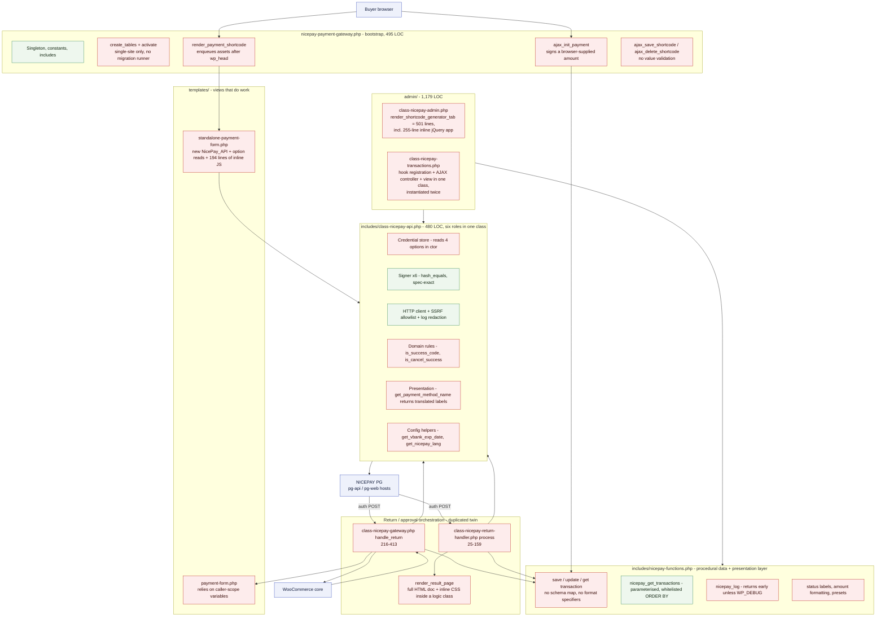

# Architecture & Code Quality

This document reviews the internal structure of the NicePay Payment Gateway plugin: how responsibilities are distributed across its ten production PHP files (3,863 LOC), how the data layer is shaped, how errors are handled and observed, and how much of the code can be extended or tested. It records **55 findings** for this dimension — 1 critical, 9 high, 31 medium, 14 low — drawn from a line-by-line read of every file plus targeted greps and diffs re-run during verification. The headline is a split verdict: the *protocol* layer of this plugin (signature construction and verification, SSRF policy, SQL parameterisation, output escaping, comparison discipline) is done to a standard well above the WordPress-plugin average, while the *orchestration* layer around it — the two return handlers, the transaction table, the settings plumbing and the shortcode generator — is procedural, duplicated, unhooked, untested and largely unobservable in production. Every serious defect in this report lives in the second layer, and almost all of them share one root cause: the two money-moving classes were written as copy-paste twins with no seam that would allow a fix to be written once, tested once, or logged once.

Findings are numbered `CODE-NN` in global severity order (critical first) and then presented grouped by theme. Verification notes are preserved verbatim where they change the reviewer's original reading, and the one finding that could not be confirmed against a live PG endpoint is flagged **needs confirmation**.

---

## What this codebase does well

Before the criticism, the parts that are genuinely good — several of them better than most commercial WordPress payment plugins:

- **Signature handling is the strongest part of the codebase.** All six signature operations (auth request/response, approval request/response, cancel request/response) are implemented exactly per spec §3, use `hash_equals()` for timing-safe comparison, and are locked down by a dedicated contract test ([tests/unit/NicePaySignatureIntegrationTest.php](../../tests/unit/NicePaySignatureIntegrationTest.php)) that asserts against the vendor's published worked examples rather than against the implementation's own output. That is the right way to test a protocol.
- **The comparison discipline is exemplary.** A sweep of every comparison in the plugin looking specifically for the `"0000" == 0` type-juggling class of bug found **not a single loose `==` or `!=` anywhere in the PHP code**. Every result-code check uses `===` or `in_array( $code, $codes, true )`. Many payment plugins fail exactly here; this one does not.
- **SSRF protection on the PG-supplied `NextAppURL`/`NetCancelURL` is present and correct.** `validate_nicepay_url()` requires https and checks the host against a static allowlist with strict `in_array` comparison, rather than the more common (and broken) `strpos( $url, 'nicepay.co.kr' ) !== false`. The spec explicitly warns that `NextAppURL` must not be hardcoded, and the code honours that while still constraining it.
- **Net cancel (망취소) is implemented at all** — many integrations skip it — and is correctly triggered from three of the failure branches in `request_approval()` (transport error, parse failure, signature mismatch). The gaps in CODE-15 are about the two branches that were missed, not about a missing capability.
- **Logging has a single entry point** (`nicepay_log()`), routes through the WooCommerce logger when available with a proper `source` context, and applies field redaction to PG responses before writing. The abstraction is right; only the `WP_DEBUG` gating and the redaction key list need work (CODE-05, CODE-23).
- **SQL is consistently parameterised.** `nicepay_get_transactions()` builds its WHERE clause from fixed strings with `%s` placeholders, whitelists ORDER BY against an explicit `$allowed_orderby` array, normalises the direction to ASC/DESC, casts LIMIT/OFFSET to int, and escapes LIKE input with `$wpdb->esc_like()`. The admin list issues exactly two queries regardless of row count — **there is no N+1 anywhere in the plugin**.
- **Output escaping is applied thoroughly and with the correct function for each context** (`esc_html`, `esc_attr`, `esc_url`, `esc_js`), including in the hand-written inline JavaScript. Both JS files build DOM text through `$('<span>').text( message ).html()` rather than concatenating raw strings into HTML, which is the safe pattern.
- **Byte-based truncation of `GoodsName`** via `mb_strcut( ..., 40, 'UTF-8' )` shows real attention to the spec: the limit is in bytes, not characters, and the code gets that right — including a comment explaining why. The problem (CODE-26) is that this care was not extended to the other size-limited fields.
- **The CI matrix is broad** (PHP 7.4 through 8.3), actions are pinned to commit SHAs rather than floating tags, and there is a separate lint job. Pinning by SHA is a supply-chain practice most projects of this size skip.
- **The documentation set is unusually thorough** for a plugin of this size — 2,598 lines across five documents, with accurate Mermaid class and flow diagrams, a correct signature-rules table, and a complete options and hooks inventory that matched the code everywhere it was cross-checked.

---

## 1. Current architecture

### 1.1 Component map

The plugin has no layering. Ten production files hold a mix of bootstrap, HTTP, domain rules, persistence, presentation and inline JavaScript, wired together by direct `new` calls and global function calls. Red nodes mark responsibilities that sit in the wrong component.



### 1.2 Responsibility violations, summarised

| # | Violation | Where | Finding |
|---|---|---|---|
| 1 | Approval orchestration exists twice, already diverged | gateway vs return-handler | CODE-13 |
| 2 | Price authority lives in the browser | `ajax_init_payment` | CODE-01 |
| 3 | One class is credential store + signer + HTTP client + domain rules + view helper | `NicePay_API` | CODE-30 |
| 4 | A logic class emits a full HTML document with its own CSS | `render_result_page` | CODE-31 |
| 5 | An admin render method contains a 255-line jQuery application | `render_shortcode_generator_tab` | CODE-19 |
| 6 | Views construct services and read options | `standalone-payment-form.php` | CODE-51 |
| 7 | Data layer has no schema knowledge and swallows failures | `nicepay-functions.php` | CODE-05, CODE-53 |
| 8 | No seam anywhere: zero `apply_filters` / `do_action` in the plugin | whole codebase | CODE-20 |

### 1.3 The two flows, side by side

| Concern | WooCommerce flow | Standalone shortcode flow |
|---|---|---|
| Amount source | `$order->get_total()` — server authoritative | `$_POST['amount']` — **browser authoritative** (CODE-01) |
| Inbound route | `woocommerce_api_nicepay_return` | rewrite `^nicepay-return/?$` — dies on plain permalinks (CODE-07) |
| Missing transaction | `wp_die()` (no net cancel, CODE-15) | proceeds and captures, records nothing (CODE-02) |
| Wrong-flow guard | `if ( ! $transaction \|\| ! $transaction->wc_order_id )` | **none** (CODE-41) |
| Unconfigured live mode | gateway hides itself | renders a broken form (CODE-09) |
| BANK result capture | present | **missing** (CODE-13) |
| Result presentation | WooCommerce thank-you page | hardcoded HTML in a PHP class (CODE-31) |
| Test coverage | excluded in `phpunit.xml` | excluded in `phpunit.xml` (CODE-32) |

---

## 2. Database schema review

Single table, created once at activation and never migrated (CODE-11). Twenty-seven columns; **sixteen are written and never read anywhere in the plugin** (CODE-23).

Source: [nicepay-payment-gateway.php:110-144](../../nicepay-payment-gateway.php#L110).

| Column | Current type | Read? | Issue | Recommended |
|---|---|:--:|---|---|
| `id` | `bigint(20) UNSIGNED AI` | yes | — | keep |
| `tid` | `varchar(50)` | yes | plain index only; PG TID is unique | `UNIQUE KEY uniq_tid (tid)` where non-empty |
| `order_id` | `varchar(100)` | **no** | always a duplicate of `moid`; carries a dead index | **drop column + `idx_order_id`** (CODE-42) |
| `wc_order_id` | `bigint(20) UNSIGNED NULL` | yes | fine | keep |
| `moid` | `varchar(64)` | yes | **no UNIQUE constraint**; generator has 9,000 values/second for `SP` | `UNIQUE KEY uniq_moid (moid)` (CODE-16) |
| `amount` | `decimal(12,2)` | yes | only 10 integer digits; spec allows `Amt(12)` | `decimal(14,2)` (CODE-24) |
| *(missing)* | — | — | **no currency stored**; format + cancel guess it | add `currency char(3) NOT NULL DEFAULT 'KRW'` (CODE-24) |
| `payment_method` | `varchar(20)` | yes | magic strings, no constant (CODE-28) | keep, back with `NicePay_Method` registry |
| `pay_method_name` | `varchar(50)` | yes | denormalised translated label frozen at write time | derive from `payment_method` at render |
| `status` | `varchar(20)` | yes | six magic values duplicated in two files; `refunded` vs `cancelled` semantics inconsistent | back with `NicePay_Status` constants (CODE-28) |
| `result_code` | `varchar(10)` | **no** | mixes PG codes (`3001`) with invented app codes (`SIG_FAIL`, `NET_ERROR`) | keep PG codes only; add `failure_source varchar(20)` (CODE-28) |
| `result_msg` | `text` | **no** | captured, never surfaced to the merchant | expose in a detail view (CODE-23) |
| `auth_token` | `varchar(50)` | **no** | a payment credential retained indefinitely with no post-approval use | null it on successful approval (CODE-23) |
| `buyer_name` | `varchar(100)` | yes | PII, no retention policy, not in GDPR exporters | add exporter/eraser + retention cron (CODE-23) |
| `buyer_email` | `varchar(100)` | **no** | PII stored and unreachable; not redacted in logs | same as above |
| `buyer_tel` | `varchar(30)` | **no** | PII stored and unreachable | same as above |
| `goods_name` | `varchar(100)` | **no** | 40-byte PG limit enforced upstream, 100 here | expose in detail view |
| `card_code` | `varchar(5)` | **no** | issuer code captured, never shown | expose in detail view |
| `card_name` | `varchar(50)` | **no** | — | expose in detail view |
| `card_no` | `varchar(30)` | **no** | masked PAN retained with no retention policy | expose + retention purge |
| `card_quota` | `varchar(5)` | **no** | instalment count invisible to merchant | expose in detail view |
| `bank_code` | `varchar(5)` | **no** | **never written at all in the standalone flow** (CODE-13) | write in both flows, expose |
| `bank_name` | `varchar(50)` | **no** | same divergence | same |
| `vbank_num` | `varchar(30)` | **no** | virtual-account number invisible in the admin | expose in detail view |
| `vbank_exp_date` | `varchar(20)` | **no** | computed in UTC, interpreted as KST (CODE-36); no expiry sweep (CODE-04) | generate in `Asia/Seoul`, add expiry cron |
| *(missing)* | — | — | no `OTID` / `RemainAmt` — 2nd+ partial cancels cannot comply with spec §9 | add `otid varchar(30)`, `remain_amt decimal(14,2)` (CODE-27) |
| `payment_data` | `longtext` | **no** | full approval JSON incl. buyer email/tel/masked PAN/AuthCode, unredacted, unqueryable | redact on write, expose pretty-printed, purge on retention |
| `created_at` | `datetime DEFAULT CURRENT_TIMESTAMP` | yes | **no index**, yet it is the default ORDER BY and a filter column; printed raw with no `wp_date()` | `KEY idx_status_created (status, created_at)` (CODE-42, CODE-36) |
| `updated_at` | `datetime ON UPDATE CURRENT_TIMESTAMP` | no | DB-server timezone, never surfaced | keep |

**Index summary.** Five secondary indexes are maintained on every write; one (`idx_order_id`) serves no query at all, and the two columns the admin list actually filters and sorts on (`created_at`, `payment_method`) are unindexed. Search uses four leading-wildcard `LIKE`s that no index can serve. See CODE-42.

**Structural gaps.** No `UNIQUE` on `moid` or `tid` means the storage layer cannot reject a duplicate or a replay (CODE-03, CODE-16). No flow discriminator column means neither handler can assert it owns a row (CODE-41). And because `dbDelta` is called with `CREATE TABLE IF NOT EXISTS`, **none of the above can currently be shipped to an installed site** — CODE-11 must land before any other schema change.

---

## 3. Findings

Severity legend: **`CRITICAL`** · **`HIGH`** · **`MEDIUM`** · **`LOW`**. Effort is the implementer's estimate carried from verification.

### 3.0 Index

| ID | Sev | Finding | Group |
|---|---|---|---|
| CODE-01 | CRITICAL | Standalone AJAX signs a browser-supplied amount | Structure |
| CODE-02 | HIGH | Approval proceeds when the transaction row is missing | Error handling |
| CODE-03 | HIGH | No idempotency guard on either return handler | Correctness |
| CODE-04 | HIGH | VBANK enabled by default with no deposit-notification endpoint | Correctness |
| CODE-05 | HIGH | DB write failures swallowed; production logging compiled out | Error handling |
| CODE-06 | HIGH | No HPOS declaration; legacy `post.php` order links | Configuration |
| CODE-07 | HIGH | Standalone return endpoint silently needs pretty permalinks | Configuration |
| CODE-08 | HIGH | Payment nonce baked into cacheable page HTML | Configuration |
| CODE-09 | HIGH | Live mode with empty credentials fails silently everywhere | Configuration |
| CODE-10 | HIGH | Multisite: table and rewrites created only for one site | Data layer |
| CODE-11 | MEDIUM | `dbDelta` + `IF NOT EXISTS` permanently disables migration | Data layer |
| CODE-12 | MEDIUM | Approval `Amt` zero-padding not normalised *(needs confirmation)* | Correctness |
| CODE-13 | MEDIUM | Return handlers copy-pasted and already diverged | Structure |
| CODE-14 | MEDIUM | Up to 60 s blocking HTTP on a page-render path | Performance |
| CODE-15 | MEDIUM | Two exit paths abandon an authorisation without net cancel | Error handling |
| CODE-16 | MEDIUM | Moid is timestamp + 4 digits with no UNIQUE constraint | Data layer |
| CODE-17 | MEDIUM | The `euc-kr` charset setting is a no-op | Configuration |
| CODE-18 | MEDIUM | WooCommerce failure notices vanish (cross-site session) | Error handling |
| CODE-19 | MEDIUM | `render_shortcode_generator_tab` is 501 lines with a 255-line JS app | Structure |
| CODE-20 | MEDIUM | Zero extension points: not one filter or action | Extensibility |
| CODE-21 | MEDIUM | Empty enabled-methods yields undefined index and empty `PayMethod` | Correctness |
| CODE-22 | MEDIUM | Option defaults diverge between seeding and every read site | Configuration |
| CODE-23 | MEDIUM | Sixteen write-only columns, including PII and the raw PG response | Data layer |
| CODE-24 | MEDIUM | No currency column: wrong display and wrong cancel amount | Data layer |
| CODE-25 | MEDIUM | Neither `Amt` nor `MID` reconciled against stored state | Correctness |
| CODE-26 | MEDIUM | Byte-length truncation applied to `GoodsName` only | Correctness |
| CODE-27 | MEDIUM | Cancel reuses the payment Moid, ignores `OTID`, no partial cancel | Correctness |
| CODE-28 | MEDIUM | Statuses, result codes and methods are magic strings | Structure |
| CODE-29 | MEDIUM | Payment-method registry duplicated four times | Extensibility |
| CODE-30 | MEDIUM | `NicePay_API` carries six responsibilities including presentation | Structure |
| CODE-31 | MEDIUM | Return handler renders a full HTML document with inline CSS | Structure |
| CODE-32 | MEDIUM | Both money-moving classes untestable; `phpunit.xml` formalises it | Structure |
| CODE-33 | MEDIUM | 194 lines of inline JS per shortcode instance | Structure |
| CODE-34 | MEDIUM | `nicepay_saved_shortcodes` autoloaded, uncapped, written on read | Performance |
| CODE-35 | MEDIUM | 72 translatable strings missing from every catalogue | Configuration |
| CODE-36 | MEDIUM | PG timestamps generated in UTC while NICEPAY operates in KST | Correctness |
| CODE-37 | MEDIUM | Saved shortcode config sanitised but never validated | Correctness |
| CODE-38 | MEDIUM | KRW truncated not rounded; dotted amounts silently corrupted | Correctness |
| CODE-39 | MEDIUM | Unauthenticated init endpoint inserts a row per call, unthrottled | Performance |
| CODE-40 | MEDIUM | `_nicepay_moid` overwritten on every receipt render | Correctness |
| CODE-41 | MEDIUM | Standalone handler will process a WooCommerce transaction | Correctness |
| CODE-42 | LOW | Index set does not match query patterns | Performance |
| CODE-43 | LOW | `json_decode` checked with a falsy test; HTTP status never read | Error handling |
| CODE-44 | LOW | Dead localised script payload with a wrong-action nonce | Dead code |
| CODE-45 | LOW | Build reproducibility: no lock file, undeclared extensions | Configuration |
| CODE-46 | LOW | No uninstall handler and no data-removal option | Data layer |
| CODE-47 | LOW | `NicePay_Transactions` instantiated twice; hooks from constructor | Structure |
| CODE-48 | LOW | Cancel nonce bound to row id while the operation targets a TID | Correctness |
| CODE-49 | LOW | `#2563eb` hardcoded across six files | Structure |
| CODE-50 | LOW | Shortcode string serialised by two divergent implementations | Structure |
| CODE-51 | LOW | Templates depend on caller-scope variables; assets enqueued late | Structure |
| CODE-52 | LOW | `manage_options` hardcoded at eight call sites | Extensibility |
| CODE-53 | LOW | `$wpdb->insert/update` without format specifiers or a schema map | Data layer |
| CODE-54 | LOW | Bare `$_SERVER` access and a stray `?><?php` pair | Correctness |
| CODE-55 | LOW | No stale-transaction cleanup; abandoned rows accumulate forever | Data layer |

---

### 3.1 Structure & responsibility boundaries

#### CODE-01 · **`CRITICAL`** · Standalone AJAX endpoint signs a browser-supplied amount — no server-side price authority

**Where** [nicepay-payment-gateway.php:313-359](../../nicepay-payment-gateway.php#L313), [templates/standalone-payment-form.php:305](../../templates/standalone-payment-form.php#L305) · **Effort** medium · **Verdict** CONFIRMED

**Problem.** `ajax_init_payment()` takes `$_POST['amount']` verbatim, validates only `(float) $amount > 0`, then calls `create_auth_sign_data( $edi_date, $amount )` and persists the same client value as the transaction `amount`. The saved shortcode config that holds the real price is never consulted — no `sc_id` is sent to the endpoint at all, and the shortcode-rendered `amount` in the XHR body is client-editable.

```php
// nicepay-payment-gateway.php:322-336
$amount     = isset( $_POST['amount'] ) ? sanitize_text_field( wp_unslash( $_POST['amount'] ) ) : '';
...
if ( empty( $amount ) || (float) $amount <= 0 ) {
    wp_send_json_error( array( 'message' => __( 'Invalid payment amount.', 'nicepay-payment-gateway' ) ) );
    return;
}

$api      = new NicePay_API();
$edi_date = $api->generate_edi_date();
$moid     = $api->generate_moid( 'SP' );
$sign_data = $api->create_auth_sign_data( $edi_date, $amount );
```

Grep confirms `sc_id` (or any config id) is never posted to `nicepay_init_payment`; the template sends only `action`, `nonce`, `amount`, `goods_name` and the `buyer_*` fields.

**Impact.** A buyer can obtain a valid merchant signature for **any** amount and complete a real payment for it. NICEPAY accepts it because `SignData = sha256(EdiDate + MID + Amt + MerchantKey)` is internally consistent; the auth-response signature check at return time uses the same manipulated `Amt` and passes; the transaction row records the manipulated amount, so the Transactions screen shows nothing anomalous. *Concrete scenario:* a shop sells a 50,000 KRW course via `[nicepay_payment id="product-purchase"]`. The buyer calls `admin-ajax.php` with `amount=100`, pastes the returned `edi_date`/`moid`/`sign_data` into the three hidden inputs, sets `Amt=100`, and completes a real 100 KRW payment.

Only the standalone shortcode flow is affected — the WooCommerce path derives `Amt` from `$order->get_total()` at [includes/class-nicepay-gateway.php:124](../../includes/class-nicepay-gateway.php#L124) and is not exploitable.

> **Verifier note.** The full chain was traced: init → sign → hidden `Amt` (template line 130) → `verify_auth_signature( $auth_token, $amt, $signature )` at [includes/class-nicepay-return-handler.php:70](../../includes/class-nicepay-return-handler.php#L70) → `request_approval` with `Amt => $amt`. Every step uses the client-chosen value; no server-side price exists anywhere in the standalone path.

**Recommendation.** Send the shortcode id instead of the amount and resolve the price server-side:

```php
// nicepay-payment-gateway.php :: ajax_init_payment()
$sc_id = isset( $_POST['sc_id'] ) ? sanitize_text_field( wp_unslash( $_POST['sc_id'] ) ) : '';
$cfg   = nicepay_get_saved_shortcode( $sc_id );
if ( ! $cfg ) {
    wp_send_json_error( array( 'message' => __( 'Unknown payment configuration.', 'nicepay-payment-gateway' ) ) );
    return;
}
$amount = nicepay_get_amount( $cfg['amount'], $cfg['currency'] );
```

For inline shortcodes without a saved id, sign an HMAC of the rendered amount into the page and verify it server-side. For genuinely open amounts (donations) make that an explicit `open_amount` flag on the saved config with server-enforced min/max, and record which mode was used on the row.

---

#### CODE-13 · **`MEDIUM`** · The two return handlers are copy-pasted and have already diverged — BANK details are dropped in the standalone flow

**Where** [includes/class-nicepay-gateway.php:216-413](../../includes/class-nicepay-gateway.php#L216) vs [includes/class-nicepay-return-handler.php:25-159](../../includes/class-nicepay-return-handler.php#L25) · **Effort** large · **Verdict** CONFIRMED

**Problem.** The diff was run directly. `diff <(sed -n '220,230p' includes/class-nicepay-gateway.php) <(sed -n '32,42p' includes/class-nicepay-return-handler.php)` exits 0 — eleven lines of `$_POST` collection are byte-identical. `diff <(sed -n '319,355p' …gateway) <(sed -n '112,140p' …handler)` reports only two comment differences plus one missing block: the standalone handler has no BANK capture. Auth-failure handling, signature verification, `$auth_data` assembly, the approval call, result extraction, CARD/VBANK capture and the success/failure dispatch are duplicated prose in both files.

```php
// Present only in includes/class-nicepay-gateway.php:343-347
// Bank info
if ( ! empty( $result['BankCode'] ) ) {
    $update_data['bank_code'] = $result['BankCode'];
    $update_data['bank_name'] = isset( $result['BankName'] ) ? $result['BankName'] : '';
}
```

**Impact.** The divergence is already live: a BANK (실시간 계좌이체) payment through a `[nicepay_payment]` shortcode leaves `bank_code`/`bank_name` empty. Every fix in this review that touches the return path — CODE-03 idempotency, CODE-25 reconciliation, CODE-12 `Amt` normalisation, CODE-15 net-cancel-on-abort, CODE-02 recovery insert — has to be written twice and will drift again. This is the largest single maintainability liability in the codebase.

> **Verifier note.** Diffs re-run and reproduced exactly. Downgraded high → medium: the BANK divergence has no user-visible consequence *today* because `bank_code`/`bank_name` are never read back anywhere (CODE-23), so the impact is maintainability plus latent data loss rather than a live defect.

**Recommendation.** Extract three collaborators and make both entry points thin adapters:

1. `NicePay_Auth_Response::from_post( array $post )` — value object owning the eleven-line sanitisation, with typed getters.
2. `NicePay_Payment_Processor::process( NicePay_Auth_Response $auth, ?object $transaction ): NicePay_Result` — owning the idempotency claim, signature verification, the approval call, the full `$update_data` assembly (CARD, BANK, VBANK) and the DB write.
3. `WC_Gateway_NicePay::handle_return()` maps the result onto order status and redirects; `NicePay_Return_Handler::process()` maps it onto a template.

Target both entry points under 40 lines. The processor then becomes unit-testable, which removes the reason for the `phpunit.xml` coverage exclusions (CODE-32).

---

#### CODE-19 · **`MEDIUM`** · `render_shortcode_generator_tab` is a 501-line method containing a 255-line inline jQuery application

**Where** [admin/class-nicepay-admin.php:431-931](../../admin/class-nicepay-admin.php#L431) (script block 675-929) · **Effort** large · **Verdict** CONFIRMED

**Problem.** One private method spans 501 of the class's 939 lines. It contains form markup (438-673), a complete jQuery app (675-929) with its own field registry, shortcode serializer, live-preview renderer, validator, colour-swatch logic and AJAX save routine, plus a PHP loop that echoes JavaScript string concatenations into the middle of that app, PHP-templated i18n literals scattered through it (740, 744, 788-789, 834, 837, 861, 889, 895), and a `wp_json_encode( $edit_data )` injection at 902.

```php
// admin/class-nicepay-admin.php:757-766
<?php
foreach ( NicePay_API::get_available_methods() as $code => $label ) {
    if ( ! in_array( $code, $enabled_methods, true ) ) {
        continue;
    }
    $icon_html  = preg_replace( '/\s+/', ' ', trim( nicepay_get_method_icon( $code ) ) );
    $icon_json  = wp_json_encode( $icon_html );
    $label_json = wp_json_encode( $label );
    echo "methodsHtml += '<div class=\"nicepay-sc-pv-method-option\">' + {$icon_json} + ' ' + {$label_json} + '</div>';\n";
}
```

**Impact.** The JS is unlinted, uncacheable (re-downloaded on every page load), untestable, and cannot participate in a dependency graph or be deferred. Any change means editing JavaScript embedded in PHP output where a stray quote produces a syntax error visible only in the browser console. The i18n literals inside it are a large share of the 72 strings missing from the catalogue (CODE-35).

**Recommendation.** Split into three files: (1) `admin/views/shortcode-generator.php` — pure markup, `include`d; (2) `assets/js/nicepay-shortcode-builder.js` — the whole jQuery app, enqueued only on this tab, with everything supplied through

```php
wp_localize_script( 'nicepay-sc-builder', 'nicepayBuilder', array(
    'i18n'         => array( /* … */ ),
    'methods'      => $methods_with_icons,
    'editData'     => $edit_data,
    'defaultColor' => NicePay_Defaults::BUTTON_COLOR,
    'redirectUrl'  => admin_url( 'admin.php?page=nicepay-settings&tab=shortcodes' ),
) );
```

and (3) a `NicePay_Shortcode_Repository` owning save/load/delete/serialize so the renderer holds no business logic. The PHP-emitting-JS loop disappears once `methods` arrives as localised data.

---

#### CODE-28 · **`MEDIUM`** · Statuses, result codes and pay methods are magic strings, with app pseudo-codes mixed into `result_code`

**Where** [includes/nicepay-functions.php:266-277](../../includes/nicepay-functions.php#L266), [includes/class-nicepay-api.php:399-421](../../includes/class-nicepay-api.php#L399), [admin/class-nicepay-transactions.php:47](../../admin/class-nicepay-transactions.php#L47) · **Effort** medium · **Verdict** CONFIRMED

**Problem.** There is no constant anywhere. The six status values appear as bare literals across five files, with the canonical list duplicated between `nicepay_get_status_label()` and the filter loop:

```php
// admin/class-nicepay-transactions.php:47
<?php foreach ( array( 'pending', 'paid', 'failed', 'cancelled', 'refunded', 'waiting' ) as $s ) : ?>
```

The auth-success code `'0000'` is written twice; the per-method success codes live in a private array literal inside `is_success_code()`; and `result_code` mixes PG codes with invented application codes:

```php
// includes/class-nicepay-return-handler.php:74-78
nicepay_update_transaction( $transaction->id, array(
    'status'      => 'failed',
    'result_code' => 'SIG_FAIL',
    'result_msg'  => 'Signature verification failed',
) );
```

**Impact.** Renaming or adding a status requires a grep across five files. The refunded/cancelled semantics are already inconsistent: `process_refund()` writes `'refunded'` for partial and `'cancelled'` for full ([class-nicepay-gateway.php:465](../../includes/class-nicepay-gateway.php#L465)), while the admin cancel always writes `'cancelled'` ([class-nicepay-transactions.php:219](../../admin/class-nicepay-transactions.php#L219)) — so a full WooCommerce refund and an admin cancel land on the same status by different reasoning, and no query can distinguish "the PG declined" from "our own code bailed out", which is exactly the distinction a merchant needs when diagnosing.

**Recommendation.**

```php
final class NicePay_Status {
    const PENDING = 'pending'; const PAID = 'paid'; const FAILED = 'failed';
    const CANCELLED = 'cancelled'; const REFUNDED = 'refunded'; const WAITING = 'waiting';
    public static function all(): array { /* … */ }
    public static function label( string $s ): string { /* … */ }
}
final class NicePay_Code {
    const AUTH_SUCCESS   = '0000';
    const CANCEL_SUCCESS = array( '2001', '2211' );
    const SUCCESS_BY_METHOD = array(
        'CARD' => '3001', 'BANK' => '4000', 'VBANK' => '4100',
        'CELLPHONE' => 'A000', 'SSG_BANK' => '0000', 'GIFT_CULT' => '0000',
    );
}
```

Have both `nicepay_get_status_label()` and the transactions filter read `NicePay_Status::all()`. Add a separate `failure_source varchar(20)` column (`pg` | `signature` | `network` | `internal`) instead of overloading `result_code`, and settle the refunded/cancelled semantics in one documented place.

---

#### CODE-30 · **`MEDIUM`** · `NicePay_API` carries six responsibilities including presentation, with arbitrary static/instance boundaries

**Where** [includes/class-nicepay-api.php:22-479](../../includes/class-nicepay-api.php#L22), [templates/standalone-payment-form.php:16](../../templates/standalone-payment-form.php#L16) · **Effort** large · **Verdict** CONFIRMED

**Problem.** One 480-line class is simultaneously a credential store (constructor reading four options), a clock/ID generator, a crypto module (six signature methods), an HTTP transport with SSRF policy and log redaction, a domain-rules engine (`is_success_code`, `is_cancel_success`), a config helper (`get_vbank_exp_date`, `get_nicepay_lang` — both read options), and a presentation layer:

```php
// includes/class-nicepay-api.php:434-436
public static function get_payment_method_name( $code ) {
    $methods = array(
        'CARD'      => __( 'Credit Card', 'nicepay-payment-gateway' ),
```

```php
// templates/standalone-payment-form.php:16 — a view constructing a service
$api = new NicePay_API();
```

Staticness is arbitrary: the pure `get_payment_method_name` / `get_available_methods` / `get_nicepay_lang` are static, while the equally pure `is_success_code` / `is_cancel_success` are instance methods that force option loading just to call them.

**Impact.** Nothing in this class can be exercised in isolation: verifying a signature requires the WordPress options table to be populated (every test's `setUp()` has to `update_option()` four times), and asking whether `3001` means success requires constructing an object that reads four options. Because the presentation helpers live here, the admin, both templates and the transactions screen all depend on the API class just to render a label — and each of the five `new NicePay_API()` sites re-reads the same four options.

> **Verifier note.** The five production construction sites are [class-nicepay-gateway.php:31](../../includes/class-nicepay-gateway.php#L31), [class-nicepay-return-handler.php:19](../../includes/class-nicepay-return-handler.php#L19), [class-nicepay-transactions.php:207](../../admin/class-nicepay-transactions.php#L207), [nicepay-payment-gateway.php:333](../../nicepay-payment-gateway.php#L333), [standalone-payment-form.php:16](../../templates/standalone-payment-form.php#L16).

**Recommendation.** Split along the seams that already exist: `NicePay_Credentials` (mid/key/mode/charset, constructed once and injected); `NicePay_Signer` (pure — takes mid + key in the constructor, no WordPress dependency, trivially unit-testable); `NicePay_Client` (HTTP, takes a Signer and Credentials); `NicePay_Method_Registry` (labels, icons, success codes, extras — see CODE-29). Move `get_payment_method_name()` next to `nicepay_get_status_label()` in `nicepay-functions.php`, make `is_success_code`/`is_cancel_success` static on the registry, and construct the client once and pass it in rather than newing it up in a template.

---

#### CODE-31 · **`MEDIUM`** · The return handler renders a complete HTML document, inline CSS included, from inside a logic class

**Where** [includes/class-nicepay-return-handler.php:164-268](../../includes/class-nicepay-return-handler.php#L164), [assets/css/nicepay.css:9](../../assets/css/nicepay.css#L9) · **Effort** medium · **Verdict** CONFIRMED

**Problem.** `render_result_page()` is 105 lines — 39% of the class — comprising `<!DOCTYPE html>`, a `<head>`, a 27-line inline `<style>` block that re-declares design tokens already defined in `assets/css/nicepay.css` (`#2563eb`, `#16a34a`, `#dc2626`, the same radii and shadows), inline SVG, and conditional presentation logic (`$is_vbank`, details vs deposit-info branch). The plugin has a `templates/` directory that this bypasses entirely.

```php
// includes/class-nicepay-return-handler.php:171-180 (abridged)
<!DOCTYPE html>
<html <?php language_attributes(); ?>>
<head>
    <meta charset="<?php bloginfo( 'charset' ); ?>">
...
    <style>
        * { box-sizing: border-box; }
        body { font-family: -apple-system, BlinkMacSystemFont, "Segoe UI", ... }
```

`--nicepay-primary: #2563eb` is defined at `assets/css/nicepay.css:9` and re-hardcoded at lines 192 and 197 of this file.

**Impact.** The customer-facing success page — arguably the most important screen in the product — is the one screen a theme cannot restyle, the merchant cannot rebrand, and no designer can find. It loads none of the site's fonts or CSS, so it looks like a different product from the rest of the checkout, and it cannot carry a logo, an order summary or a route back to the buyer's order. When a token changes in `nicepay.css`, the result page silently drifts.

**Recommendation.** Move the markup to `templates/payment-result.php` and load it through `nicepay_get_template( 'payment-result.php', array( 'success' => $success, 'message' => $message, 'data' => $data ) )` (see CODE-51), which checks `locate_template( 'nicepay/payment-result.php' )` first. Move the CSS into `assets/css/nicepay.css` under a `.nicepay-result` namespace so it shares the existing tokens, and add `do_action( 'nicepay_result_page_after_details', $data )`. Consider rendering it inside the theme so it inherits site branding.

---

#### CODE-32 · **`MEDIUM`** · The two money-moving classes are untestable by construction, and `phpunit.xml` formalises the gap

**Where** [phpunit.xml:19-24](../../phpunit.xml#L19), [includes/class-nicepay-return-handler.php:18-20](../../includes/class-nicepay-return-handler.php#L18), [composer.json:15-19](../../composer.json#L15) · **Effort** large · **Verdict** CONFIRMED

**Problem.**

```xml
<!-- phpunit.xml:19-24 -->
<exclude>
    <directory>vendor</directory>
    <directory>tests</directory>
    <file>includes/class-nicepay-gateway.php</file>
    <file>includes/class-nicepay-return-handler.php</file>
</exclude>
```

The exclusion is an admission that the approval orchestration has zero tests. The causes are structural: `NicePay_Return_Handler` constructs its dependency in the constructor (no injection), reads `$_POST`/`$_SERVER` directly, calls global functions that touch `global $wpdb`, echoes HTML, and is invoked by a caller that immediately `exit`s; the gateway extends a WooCommerce base class unavailable in the bootstrap and calls `wp_safe_redirect(); exit;` on every path.

```php
// includes/class-nicepay-return-handler.php:18-20
public function __construct() {
    $this->api = new NicePay_API();
}
```

`brain/monkey` and `mockery` sit in `require-dev` and are used by no test — `grep -rn -i 'monkey|Mockery' tests/` returns exactly one hit, a comment at [tests/bootstrap/wp-stubs.php:82](../../tests/bootstrap/wp-stubs.php#L82).

**Impact.** The suite verifies signature maths against the doc examples — genuinely good work — while every orchestration bug in this review (CODE-02, 03, 12, 15, 25) sits in the untested half. CI is green and will stay green through all of them.

**Recommendation.** Do the CODE-13 processor extraction first, then test it: `NicePay_Payment_Processor` takes an injected client and a repository interface, has no superglobal access (the auth data arrives as a value object built from an array), and returns a result object instead of echoing. `$processor->process( NicePay_Auth_Response::from_post( $fixture ), $fake_transaction )` is then a plain unit test. Use Brain\Monkey — already required and installed — to fake `wp_remote_post` per test, remove the coverage exclusions so the gap stays visible, and add fixtures for: duplicate POST, missing transaction, zero-padded `Amt`, PG timeout → net cancel, and each per-method success code.

---

#### CODE-33 · **`MEDIUM`** · 194 lines of JavaScript are inlined per shortcode instance, with a second divergent loading implementation

**Where** [templates/standalone-payment-form.php:174-367](../../templates/standalone-payment-form.php#L174), [assets/js/nicepay.js:32-70](../../assets/js/nicepay.js#L32), [templates/payment-form.php:49](../../templates/payment-form.php#L49) · **Effort** large · **Verdict** CONFIRMED

**Problem.** The standalone template emits 194 lines of `<script>` per rendered shortcode: a change-delegation handler, `nicepayStartStandalone()`, `showStandaloneError()`, modal open/close with an Escape-handler registry, and overrides of `window.nicepaySubmit` / `window.nicepayClose`. Two shortcodes on one page emit two copies declaring the same functions and re-declaring `var _nicepayModalEscHandlers = {}`, and both templates render `<form name="payForm">`, so `document.payForm` resolves to an HTMLCollection until it is reassigned at click time:

```js
// templates/standalone-payment-form.php:276
document.payForm = form;
```

Meanwhile the two loading implementations have already diverged:

```js
// templates/standalone-payment-form.php:258-260 — imperative, one button
var btn = form.querySelector('button');
btn.classList.add('is-loading');
btn.disabled = true;
```
```js
// assets/js/nicepay.js:44 — jQuery, every button on the page
$('.nicepay-pay-button').addClass('is-loading').prop('disabled', true);
```

**Impact.** None of this JavaScript is minified, cached, versioned, linted or testable, and page weight scales linearly with the number of payment buttons. The shared `document.payForm` global is a genuine multi-instance hazard and the duplicate declarations are benign only by luck of hoisting. Changing the loading behaviour requires editing two languages in two places, which is why they have already diverged.

**Recommendation.** Move the whole inline block into `assets/js/nicepay-standalone.js`, enqueued once, and drive per-instance configuration from `data-` attributes on the wrapper (`data-nicepay-form`, `data-sc-id`, `data-goods-name`) read at click time — no PHP-generated JS. Route i18n through the existing `wp_localize_script( 'nicepay-js', 'nicepayParams', … )` payload, which already exists and is mostly unused (CODE-44). Give each form a unique `name`, pass the form element directly to the PG bridge instead of the `document.payForm` global, and consolidate on a single `NicePayHandler.setLoading( formEl, bool )` used by both templates.

---

#### CODE-47 · **`LOW`** · `NicePay_Transactions` is instantiated twice and registers global hooks from its constructor

**Where** [admin/class-nicepay-transactions.php:12-14](../../admin/class-nicepay-transactions.php#L12), [admin/class-nicepay-transactions.php:240](../../admin/class-nicepay-transactions.php#L240), [admin/class-nicepay-admin.php:933-936](../../admin/class-nicepay-admin.php#L933) · **Effort** small · **Verdict** CONFIRMED

**Problem.**

```php
// admin/class-nicepay-transactions.php:12-14 and 240
public function __construct() {
    add_action( 'wp_ajax_nicepay_cancel_transaction', array( $this, 'ajax_cancel_transaction' ) );
}
...
new NicePay_Transactions();
```
```php
// admin/class-nicepay-admin.php:933-936
public function render_transactions_page() {
    $transactions_page = new NicePay_Transactions();
    $transactions_page->render();
}
```

The file-scope instance registers the AJAX action; the render path constructs a second instance that registers the same action again on a different object (WordPress keys array callbacks by object hash, so these are two distinct registrations). `admin/class-nicepay-admin.php` likewise ends with `new NicePay_Admin();`.

**Impact.** Harmless today only because the second instantiation happens during a page render, long after `wp_ajax_*` dispatch — during an actual AJAX request only the file-scope instance exists. If that ordering ever changes, `ajax_cancel_transaction` runs twice and issues two cancel requests to NICEPAY for one click. More immediately, the file-scope `new` makes both classes impossible to instantiate in a test, impossible to replace, and invisible in the dependency graph.

**Recommendation.** Remove both file-scope instantiations and construct explicitly from `NicePay_Payment_Gateway::includes()`. Split the controller from the view: `NicePay_Transactions_Controller` registers and handles `wp_ajax_nicepay_cancel_transaction`; `NicePay_Transactions_List_Table` (ideally extending `WP_List_Table`, which brings sorting, bulk actions, screen options and per-page preferences for free) does the rendering.

---

#### CODE-49 · **`LOW`** · The design token `#2563eb` is hardcoded across six files, and default strings are duplicated across four

**Where** [assets/css/nicepay.css:9](../../assets/css/nicepay.css#L9), [assets/css/nicepay-admin.css:163](../../assets/css/nicepay-admin.css#L163), [admin/class-nicepay-admin.php:377](../../admin/class-nicepay-admin.php#L377), [includes/class-nicepay-return-handler.php:192](../../includes/class-nicepay-return-handler.php#L192) · **Effort** small · **Verdict** CONFIRMED

**Problem.** `assets/css/nicepay.css:9` defines `--nicepay-primary: #2563eb` as a design token; the literal hex then appears at **13 further line locations across six files** — three times in the admin CSS that could use the token, twice in the return handler's inline CSS, and five times in admin PHP where it doubles as the default button colour used in equality comparisons:

```php
admin/class-nicepay-admin.php:377:  … $sc['button_color'] !== '#2563eb' …
admin/class-nicepay-admin.php:677:  var defaultColor = '#2563eb';
```

The same pattern applies to `'Pay Now'` (nicepay-payment-gateway.php:240, nicepay-functions.php:338, class-nicepay-admin.php:392 and 646) and `'nicepay-pay-button'` (four occurrences).

**Impact.** Rebranding requires finding thirteen hex literals across PHP, CSS and inline JS, and the two that participate in equality comparisons will silently stop suppressing the redundant `button_color` attribute if changed inconsistently.

**Recommendation.**

```php
final class NicePay_Defaults {
    const BUTTON_COLOR = '#2563eb';
    const BUTTON_TEXT  = 'Pay Now';
    const BUTTON_CLASS = 'nicepay-pay-button';
}
```

Reference the constants from the shortcode defaults, the preset builder, the AJAX save fallback, the card renderer and the generator's localised config. In CSS replace the three raw hexes in `nicepay-admin.css` with `var(--nicepay-primary)` — the token is in scope, since `nicepay-shared-css` is a declared dependency at [admin/class-nicepay-admin.php:60-65](../../admin/class-nicepay-admin.php#L60) — and move the result page's inline styles into the shared stylesheet.

---

#### CODE-50 · **`LOW`** · The shortcode string is serialised by two independent implementations that disagree

**Where** [admin/class-nicepay-admin.php:369-380](../../admin/class-nicepay-admin.php#L369) (PHP) vs [admin/class-nicepay-admin.php:697-730](../../admin/class-nicepay-admin.php#L697) (JavaScript) · **Effort** small · **Verdict** CONFIRMED

**Problem.** The Shortcodes tab builds the copyable shortcode in PHP; the Generator tab builds it again in JavaScript. They already differ — the PHP version emits `id`, `display_mode`, `amount`, `goods_name`, `pay_method`, `button_text`, `button_color`, `currency`, `language`; the JS version additionally emits `buyer_name`, `buyer_email`, `buyer_tel` and `button_class`.

```php
// PHP — no buyer fields, no button_class (lines 373-379, abridged)
if ( ! empty( $sc['amount'] ) )   $sc_parts[] = 'amount="'   . esc_attr( $sc['amount'] )   . '"';
...
if ( ! empty( $sc['currency'] ) ) $sc_parts[] = 'currency="' . esc_attr( $sc['currency'] ) . '"';
```
```js
// JS — includes them (lines 720-724)
if (buyerName)  parts.push('buyer_name="'  + buyerName  + '"');
if (buyerEmail) parts.push('buyer_email="' + buyerEmail + '"');
if (buyerTel)   parts.push('buyer_tel="'   + buyerTel   + '"');
if (buttonClass && buttonClass !== 'nicepay-pay-button') parts.push('button_class="' + buttonClass + '"');
```

**Impact.** The same saved configuration produces two different shortcode strings depending on which screen the merchant copies from. They mostly converge functionally because `id="…"` causes the saved config to be reloaded at render time — but a merchant who copies from the Shortcodes tab and then hand-edits out the `id` silently loses buyer prefill and the custom CSS class.

**Recommendation.** Make PHP the single serialiser: `function nicepay_build_shortcode( array $config ): string` in `nicepay-functions.php`, used directly by the Shortcodes tab and exposed to the Generator either by re-rendering server-side on save or via a lightweight AJAX endpoint returning the canonical string. If a live client-side preview must remain, generate the JS serialiser's attribute list from a PHP-localised array so the two cannot diverge on which attributes exist.

---

#### CODE-51 · **`LOW`** · Templates depend on caller-scope variables with no contract, and the shortcode enqueues assets after `wp_head`

**Where** [includes/class-nicepay-gateway.php:210](../../includes/class-nicepay-gateway.php#L210), [nicepay-payment-gateway.php:462-468](../../nicepay-payment-gateway.php#L462), [templates/standalone-payment-form.php:16-48](../../templates/standalone-payment-form.php#L16) · **Effort** medium · **Verdict** CONFIRMED

**Problem.** Both templates are pulled in with a bare `include NICEPAY_PLUGIN_DIR . 'templates/…'` and silently inherit whatever is in the calling scope. `payment-form.php` documents `@var WC_Order $order`, `@var array $form_data`, `@var array $enabled_methods` in a docblock, but nothing supplies or enforces them — they exist only because `generate_payment_form()` happens to have locals with those names. `standalone-payment-form.php` additionally does real work in the view: `new NicePay_API()`, option reads, amount normalisation and validity decisions. Separately:

```php
// nicepay-payment-gateway.php:462-468
private function is_payment_page() {
    global $post;
    if ( $post && has_shortcode( $post->post_content, 'nicepay_payment' ) ) {
        return true;
    }
    return false;
}
```

Because this only inspects the main post content, `render_payment_shortcode()` ends up calling `enqueue_payment_assets()` during `the_content` — after `wp_head` has run.

**Impact.** Renaming a local in `generate_payment_form()` silently blanks a form field with no error, and neither template can be reused, previewed or unit-tested. Late enqueuing means the stylesheet prints in the footer, producing a flash of unstyled payment form on any page where the shortcode is not in the main post content — widgets, reusable blocks, FSE templates, archive loops: precisely the pages a block-based site uses.

**Recommendation.**

```php
function nicepay_get_template( $name, array $args = array() ) {
    $path = locate_template( 'nicepay/' . $name ) ?: NICEPAY_PLUGIN_DIR . 'templates/' . $name;
    extract( $args, EXTR_SKIP );
    include $path;
}
```

Call it with an explicit argument array from both sites — this fixes the contract and adds theme overrides in one move. Move the API construction, option reads and amount normalisation out of `standalone-payment-form.php` into `render_payment_shortcode()`, passing a prepared view model. For the FOUC, register the styles unconditionally on `wp_enqueue_scripts` (registration is free) and call `wp_enqueue_style()` from the shortcode; broaden `is_payment_page()` to also check `has_block( 'core/shortcode' )`.

---

### 3.2 Data layer & schema

#### CODE-10 · **`HIGH`** · Multisite: the table and rewrite rules are created only for the activating site

**Where** [nicepay-payment-gateway.php:92-98](../../nicepay-payment-gateway.php#L92), [nicepay-payment-gateway.php:104-148](../../nicepay-payment-gateway.php#L104), [nicepay-payment-gateway.php:479-487](../../nicepay-payment-gateway.php#L479) · **Effort** small · **Verdict** CONFIRMED *(found during verification, missed by the original pass)*

**Problem.** `activate()` calls `create_tables()` (which uses `$wpdb->prefix`, i.e. the current site's prefix) and `flush_rewrite_rules()` with no multisite handling at all.

```php
// nicepay-payment-gateway.php:479-482
register_activation_hook( __FILE__, function () {
    $plugin = NicePay_Payment_Gateway::instance();
    $plugin->activate();
} );
```

The closure does not even accept the `$network_wide` parameter, and `grep -rni 'is_multisite|get_sites|switch_to_blog|network_wide|wp_initialize_site' --include='*.php' .` returns **no matches**. There is no runtime table-existence check anywhere.

**Impact.** On "Network Activate", only the site whose request performed the activation gets `wp_nicepay_transactions` and a flushed rewrite. Every other subsite has the plugin active with no table — every `nicepay_save_transaction()` fails, silently, per CODE-05; the WooCommerce receipt page fails the order and the shortcode returns "Payment initialization failed." — and no `/nicepay-return/` route. Sites created after activation are permanently in this state.

**Recommendation.**

```php
register_activation_hook( __FILE__, function ( $network_wide ) {
    $plugin = NicePay_Payment_Gateway::instance();
    if ( $network_wide && is_multisite() ) {
        foreach ( get_sites( array( 'fields' => 'ids', 'number' => 0 ) ) as $id ) {
            switch_to_blog( $id );
            $plugin->activate();
            restore_current_blog();
        }
        return;
    }
    $plugin->activate();
} );
add_action( 'wp_initialize_site', function ( $site ) { /* same per-site setup */ }, 20 );
```

Independently, add a lightweight per-site guard on `plugins_loaded` — `if ( get_option( 'nicepay_db_version' ) !== NICEPAY_VERSION ) { $this->create_tables(); $this->register_endpoints(); flush_rewrite_rules(); update_option( 'nicepay_db_version', NICEPAY_VERSION ); }` — which also fixes the never-runs-on-update problem in CODE-11.

---

#### CODE-11 · **`MEDIUM`** · `dbDelta` is called with `CREATE TABLE IF NOT EXISTS`, permanently disabling schema migration

**Where** [nicepay-payment-gateway.php:110](../../nicepay-payment-gateway.php#L110), [nicepay-payment-gateway.php:146-147](../../nicepay-payment-gateway.php#L146), [nicepay-payment-gateway.php:161](../../nicepay-payment-gateway.php#L161) · **Effort** small · **Verdict** CONFIRMED

**Problem.** `dbDelta()` identifies the target table with `preg_match( '|CREATE TABLE ([^ ]*)|', $qry, $matches )`. Given

```php
$sql = "CREATE TABLE IF NOT EXISTS {$table_name} (
```

the captured name is the literal `IF`, so dbDelta keys the query under `if`, never matches it against any row of `SHOW TABLES`, and therefore **never runs its column/index diff** — it simply executes the raw statement, which is a no-op after the first run because of `IF NOT EXISTS`. Compounding this: `activate()` is the only caller and WordPress does not fire `register_activation_hook` during a plugin *update*, and

```php
add_option( 'nicepay_db_version', NICEPAY_VERSION );   // line 161
```

can never update an existing value and is never read anywhere (grep: only line 161 and `docs/ARCHITECTURE.md:441`).

**Impact.** No column, index or type change can ever reach an installed site. Any future release needing a column (`currency` per CODE-24, `otid` per CODE-27, an idempotency key per CODE-03) will hard-fail on every existing install with an "Unknown column" error — invisible, because `nicepay_update_transaction()` swallows `$wpdb->update` failures and `nicepay_log()` is `WP_DEBUG`-gated (CODE-05).

> **Verifier note — one claim REFUTED.** The reviewer's secondary claim that `PRIMARY KEY (id)` needs two spaces is obsolete folklore: modern `wp-admin/includes/upgrade.php` classifies the field name `PRIMARY` as an index via its switch on `''|primary|index|fulltext|unique|key|spatial`, and its index regex accepts `\s+`. One space parses correctly. Downgraded critical → medium: there is **zero present-day impact**; the damage is entirely latent and lands on the first release that changes the schema — which is why every schema recommendation in §2 is blocked on this one.

**Recommendation.** (1) Drop `IF NOT EXISTS` — `dbDelta` is already idempotent. (2) Add a migration runner on `plugins_loaded` rather than relying on activation, changing `add_option` to `update_option`. (3) Combine with CODE-10 so the runner executes per site.

---

#### CODE-16 · **`MEDIUM`** · Moid is a timestamp plus a 4-digit random with no UNIQUE constraint anywhere

**Where** [includes/class-nicepay-api.php:66-68](../../includes/class-nicepay-api.php#L66), [nicepay-payment-gateway.php:139-143](../../nicepay-payment-gateway.php#L139), [includes/nicepay-functions.php:130-134](../../includes/nicepay-functions.php#L130) · **Effort** medium · **Verdict** CONFIRMED

**Problem.**

```php
// includes/class-nicepay-api.php:66-68
public function generate_moid( $prefix = 'WC' ) {
    return $prefix . '_' . date( 'YmdHis' ) . '_' . wp_rand( 1000, 9999 );
}
```

In the standalone flow the prefix is the constant `'SP'`, so within any given second there are only **9,000 distinct values**. The schema declares plain indexes, no UNIQUE:

```sql
KEY idx_tid (tid),
KEY idx_order_id (order_id),
KEY idx_wc_order_id (wc_order_id),
KEY idx_moid (moid),
KEY idx_status (status)
```

and `nicepay_get_transaction_by_moid()` uses `$wpdb->get_row()` with no `ORDER BY`, so it returns whichever duplicate the storage engine hands back first.

**Impact.** With ~20 standalone inits in the same second the birthday probability of a collision is around 2%; a busy campaign page will hit it. Two buyers then share a Moid and the return handler updates the wrong row — buyer A's payment marks buyer B's record paid, and the loser's real payment becomes one of the unrecorded captures of CODE-02. Because the database cannot reject the duplicate, nothing fails loudly.

> **Verifier note.** Scope correction: the WooCommerce path uses `generate_moid( 'WC' . $order->get_id() )` ([class-nicepay-gateway.php:123](../../includes/class-nicepay-gateway.php#L123)), so order ids keep those Moids distinct across orders — only the standalone `'SP'` prefix has the 9,000-value collision space. Downgraded high → medium accordingly.

**Recommendation.**

```php
return $prefix . '_' . gmdate( 'YmdHis' ) . '_' . strtoupper( bin2hex( random_bytes( 6 ) ) );
```

still far inside the 64-byte limit. Add `UNIQUE KEY uniq_moid (moid)` and let the insert fail loudly, retrying with a fresh Moid:

```php
for ( $i = 0; $i < 3; $i++ ) {
    $moid = $api->generate_moid( 'SP' );
    if ( $tx_id = nicepay_save_transaction( /* … */ ) ) { break; }
}
```

Both require CODE-11 first, since no schema change can currently reach an installed site.

---

#### CODE-23 · **`MEDIUM`** · Sixteen of the transaction columns are write-only, including PII and the raw PG response

**Where** [nicepay-payment-gateway.php:110-144](../../nicepay-payment-gateway.php#L110), [admin/class-nicepay-transactions.php:108-153](../../admin/class-nicepay-transactions.php#L108), [includes/class-nicepay-api.php:157-174](../../includes/class-nicepay-api.php#L157) · **Effort** medium · **Verdict** CONFIRMED

**Problem.** Every column was traced. Read and displayed: `id`, `tid`, `wc_order_id`, `moid`, `amount`, `payment_method`, `pay_method_name`, `status`, `buyer_name`, `created_at`. **Never read anywhere** (verified by grepping `->{column}` across all non-test PHP — sixteen columns, zero hits each): `order_id`, `result_code`, `result_msg`, `auth_token`, `buyer_email`, `buyer_tel`, `goods_name`, `card_code`, `card_name`, `card_no`, `card_quota`, `bank_code`, `bank_name`, `vbank_num`, `vbank_exp_date`, `payment_data`.

`payment_data longtext` stores the complete approval JSON — which per spec §7 carries `BuyerEmail`, `BuyerTel`, `BuyerName`, masked `CardNo`, `AuthCode` and `CartData` — unredacted and unqueryable. The log redaction list does not cover most of it:

```php
// includes/class-nicepay-api.php:162-165
$sensitive_keys = array(
    'AuthToken', 'SignData', 'Signature', 'MerchantKey',
    'CardNo', 'CardNumber', 'VbankNum',
);
```

There is no detail screen, no export, no retention policy, no deletion path, and no `wp_privacy_personal_data_exporters` / `_erasers` registration (grep: zero hits for `wp_privacy`).

**Impact.** Two problems in one. *Product:* the merchant cannot see the masked card number, the virtual-account number, the failure message or the auth code for any transaction — the data is captured and then unreachable, so every support question requires the NICEPAY console. *Compliance:* buyer emails, phone numbers, masked PANs and one-time auth tokens accumulate indefinitely in a table WordPress's GDPR tooling does not know about; Korea's PIPA imposes comparable obligations. `auth_token` in particular is a payment credential with no use after approval.

**Recommendation.** (1) Build a transaction detail view (`&tx=<id>` or a modal) rendering `result_code`/`result_msg`, card and bank details, and a pretty-printed `payment_data` — a one-day job that unlocks data already being stored. (2) Register `wp_privacy_personal_data_exporters` and `wp_privacy_personal_data_erasers` matched on `buyer_email`. (3) Add a retention setting plus a daily cron nulling `buyer_email`/`buyer_tel`/`card_no`/`payment_data` on rows older than N months while keeping `tid`/`amount`/`status` for accounting. (4) Clear `auth_token` as soon as approval succeeds. (5) Extend `redact_for_log()` to cover `BuyerEmail`, `BuyerTel`, `BuyerName` and `AuthCode`.

---

#### CODE-24 · **`MEDIUM`** · No currency column, so amounts are displayed and cancelled in the wrong currency

**Where** [nicepay-payment-gateway.php:110-144](../../nicepay-payment-gateway.php#L110), [includes/nicepay-functions.php:229-258](../../includes/nicepay-functions.php#L229), [admin/class-nicepay-transactions.php:133](../../admin/class-nicepay-transactions.php#L133) · **Effort** medium · **Verdict** CONFIRMED

**Problem.** `amount decimal(12,2)` is stored with no currency alongside it, yet currency is a per-shortcode attribute (KRW/USD selector at `class-nicepay-admin.php:494-497`), a per-order value in WooCommerce, and a global option.

```php
// admin/class-nicepay-transactions.php:133 — no currency passed
<td class="nicepay-amount"><?php echo esc_html( nicepay_format_amount( $item->amount ) ); ?></td>
```
```php
// admin/class-nicepay-transactions.php:198-205 — reconstructed, or given up on
$currency = '';
if ( $transaction->wc_order_id && function_exists( 'wc_get_order' ) ) {
    $wc_order = wc_get_order( $transaction->wc_order_id );
    if ( $wc_order ) {
        $currency = $wc_order->get_currency();
    }
}
$cancel_amount = nicepay_get_amount( $transaction->amount, $currency );
```

**Impact.** A USD standalone payment of 99.99 renders as "100 KRW" on a KRW-default site, and — worse — the cancel path computes `nicepay_get_amount( $transaction->amount, '' )`, which falls through to the global default, takes the KRW branch and truncates with `(int)`, sending `CancelAmt=99` for a 99.99 USD transaction. NICEPAY will reject that or, if it accepts it, book a partial cancel the merchant did not intend. Financial records that do not record their own currency cannot be audited.

**Spec.** §4: `Amt(12)`; `CurrencyCode(3: KRW default / USD)`.

**Recommendation.** Add `currency char(3) NOT NULL DEFAULT 'KRW'`, populate it at both insert sites ([nicepay-payment-gateway.php:338](../../nicepay-payment-gateway.php#L338), [class-nicepay-gateway.php:158](../../includes/class-nicepay-gateway.php#L158)), and pass it explicitly everywhere: `nicepay_format_amount( $item->amount, $item->currency )`, `nicepay_get_amount( $transaction->amount, $transaction->currency )`. Also widen `amount` — `decimal(12,2)` allows only ten integer digits while spec §4 permits a 12-digit `Amt`; use `decimal(14,2)`.

---

#### CODE-46 · **`LOW`** · No uninstall handler and no data-removal option

**Where** [nicepay-payment-gateway.php:100-102](../../nicepay-payment-gateway.php#L100), [nicepay-payment-gateway.php:484-487](../../nicepay-payment-gateway.php#L484) · **Effort** small · **Verdict** CONFIRMED

**Problem.**

```php
public function deactivate() {
    flush_rewrite_rules();
}
```

There is no `uninstall.php` in the repository (verified by directory listing) and no `register_uninstall_hook`. Deleting the plugin through the WordPress UI leaves `wp_nicepay_transactions`, twelve `nicepay_*` options (several autoloaded) and all `_nicepay_*` order meta permanently in the database.

**Impact.** Merchants who trial and remove the plugin retain an orphaned table containing buyer emails, phone numbers and masked card numbers indefinitely — a compliance liability they cannot discharge without SQL access. Preserving transaction history by default is a defensible choice; providing no path to removal is not.

**Recommendation.** Add `uninstall.php` guarded by `if ( ! defined( 'WP_UNINSTALL_PLUGIN' ) ) { exit; }` that reads a new `nicepay_delete_data_on_uninstall` option (default `no`) and, when enabled, drops the table, deletes every `nicepay_*` option and clears `_nicepay_*` order meta. Add the checkbox to the General tab with an explicit warning, and pair it with an "Export transactions to CSV" button so a merchant can take their data before deleting.

---

#### CODE-53 · **`LOW`** · `$wpdb->insert/update` are called without format specifiers and accept arbitrary column arrays

**Where** [includes/nicepay-functions.php:81](../../includes/nicepay-functions.php#L81), [includes/nicepay-functions.php:107](../../includes/nicepay-functions.php#L107) · **Effort** small · **Verdict** CONFIRMED

**Problem.**

```php
$result = $wpdb->insert( $table, $data );
...
$result = $wpdb->update( $table, $data, array( 'id' => $id ) );
```

Both omit the `$format` and `$where_format` arguments, so wpdb infers `%s` for every value — including `wc_order_id` (bigint) and `amount` (decimal) — and relies on MySQL coercion. More significantly, `nicepay_update_transaction()` accepts any array and passes it straight through, so a caller with a typo'd or unknown key produces a failed UPDATE which, per CODE-05, is never reported.

> **Verifier note.** wpdb does handle `'wc_order_id' => null` correctly (it emits a literal `NULL` rather than a quoted empty string), so the untyped formats cause no live bug today — the finding stands on the missing schema knowledge, not on coercion.

**Recommendation.** Give the data layer a schema map and validate against it:

```php
const COLUMNS = array( 'tid' => '%s', 'wc_order_id' => '%d', 'amount' => '%f', /* … */ );

$data    = array_intersect_key( $data, self::COLUMNS );
$formats = array_values( array_intersect_key( self::COLUMNS, $data ) );
$wpdb->insert( $table, $data, $formats );
```

Log (or throw in debug builds) when `$data` contained keys that were filtered out, so an unknown-column bug becomes loud at the moment it is introduced. Package the four transaction functions into a `NicePay_Transaction_Repository` so the schema map has an owner.

---

#### CODE-55 · **`LOW`** · No stale-transaction cleanup: abandoned pending rows accumulate forever

**Where** [nicepay-payment-gateway.php:338-352](../../nicepay-payment-gateway.php#L338), [includes/class-nicepay-gateway.php:158-168](../../includes/class-nicepay-gateway.php#L158) · **Effort** small · **Verdict** CONFIRMED

**Problem.** A transaction row is inserted every time a buyer clicks Pay (`ajax_init_payment`) or lands on the WooCommerce receipt page (`generate_payment_form`).

```php
// nicepay-payment-gateway.php:338-347 (abridged)
$tx_id = nicepay_save_transaction( array(
    'order_id'    => $moid,
    'moid'        => $moid,
    'amount'      => $amount,
    'status'      => 'pending',
```

Rows that never reach a return remain at `status = 'pending'` permanently. `grep -rn --include='*.php' -e 'wp_schedule_event' -e 'wp_next_scheduled' .` returns **no matches**: no cron sweep, no TTL, no dedupe.

**Impact.** The table grows with abandonment rate rather than revenue — a page with 70% abandonment accumulates roughly three junk rows per real payment. The Transactions screen's default view is dominated by rows that will never resolve, the "Total: N transactions" count is meaningless as a business metric, and (with no `created_at` index, CODE-42) list performance degrades against data nobody wants.

> **Verifier note.** The receipt-page insert is worse than first described: `receipt_page()` inserts on *every* render, so a single order reloaded five times leaves five pending rows (see CODE-40).

**Recommendation.**

```php
if ( ! wp_next_scheduled( 'nicepay_cleanup' ) ) {
    wp_schedule_event( time(), 'daily', 'nicepay_cleanup' );
}
// handler:
$wpdb->query( "DELETE FROM {$table}
               WHERE status = 'pending' AND tid = ''
                 AND created_at < DATE_SUB( NOW(), INTERVAL 7 DAY )" );
```

The `tid = ''` clause guarantees nothing that reached the PG is ever deleted. Make the window a setting, unschedule on deactivation, and in `ajax_init_payment` reuse a recent pending row for the same amount and buyer instead of inserting a new one.

---

### 3.3 Error handling & observability

#### CODE-02 · **`HIGH`** · Standalone return handler proceeds with approval when the transaction row is missing, recording nothing

**Where** [includes/class-nicepay-return-handler.php:51](../../includes/class-nicepay-return-handler.php#L51), [includes/class-nicepay-return-handler.php:97](../../includes/class-nicepay-return-handler.php#L97), [includes/class-nicepay-return-handler.php:142-158](../../includes/class-nicepay-return-handler.php#L142) · **Effort** small · **Verdict** CONFIRMED

**Problem.** `$transaction = nicepay_get_transaction_by_moid( $moid )` can return null. The approval HTTP call at line 97 is not guarded, but every subsequent DB write is wrapped in `if ( $transaction )`:

```php
// includes/class-nicepay-return-handler.php:142-149
if ( $this->api->is_success_code( $result_code, $result_method ) ) {
    $update_data['status'] = ( $result_method === 'VBANK' ) ? 'waiting' : 'paid';

    if ( $transaction ) {
        nicepay_update_transaction( $transaction->id, $update_data );
    }

    $this->render_result_page( true, $result_msg, $result );
```

When the lookup misses, the plugin still calls NICEPAY, still captures the payment, renders "Payment Successful", and writes nothing — no fallback insert, no error-level log (CODE-05), no admin signal.

**Impact.** A captured payment with zero merchant-side record: absent from the Transactions screen, uncancellable and unrefundable through the plugin, invisible for reconciliation. The customer sees success so they will not retry. The WooCommerce path is not affected — [class-nicepay-gateway.php:235-239](../../includes/class-nicepay-gateway.php#L235) `wp_die()`s when the transaction is missing (though without a net cancel — CODE-15).

> **Verifier note.** Downgraded critical → high: the original headline trigger is wrong — when `nicepay_save_transaction()` fails at [nicepay-payment-gateway.php:349](../../nicepay-payment-gateway.php#L349) the JSON response is `success:false`, the template's `xhr.onload` takes the error branch (line 287) and never calls `nicepayStart()`, so no PG round-trip occurs. Remaining real triggers are narrower: a Moid collision (CODE-16), a purged/archived row, or read-replica lag. Still a genuine unrecorded-capture path.

**Recommendation.** Before `$this->api->request_approval()`, if `$transaction` is null, insert a recovery row:

```php
$tx_id = nicepay_save_transaction( array(
    'moid' => $moid, 'order_id' => $moid, 'amount' => $amt,
    'status' => 'pending', 'result_msg' => 'recovered-at-return',
) );
```

If that insert also fails, do **not** call approval — call `$this->api->request_net_cancel( $auth_data )` and render the failure page, because an unrecordable capture is worse than a reversed authentication. Then the twelve `if ( $transaction )` guards can be dropped.

---

#### CODE-05 · **`HIGH`** · Every DB write failure is swallowed and production logging is compiled out

**Where** [includes/nicepay-functions.php:16-19](../../includes/nicepay-functions.php#L16), [includes/nicepay-functions.php:98-110](../../includes/nicepay-functions.php#L98), plus twelve call sites across the gateway, return handler and transactions screen · **Effort** small · **Verdict** CONFIRMED

**Problem.** Two compounding defects.

```php
// includes/nicepay-functions.php:107-109 — no error branch, no logging
$result = $wpdb->update( $table, $data, array( 'id' => $id ) );

return $result !== false;
```

No call site inspects the return (verified by grep), and unlike its sibling `nicepay_save_transaction()` — which does log `$wpdb->last_error` — this logs nothing on failure. And:

```php
// includes/nicepay-functions.php:16-19
function nicepay_log( $message, $data = null ) {
    if ( ! defined( 'WP_DEBUG' ) || ! WP_DEBUG ) {
        return;
    }
```

So on a normal production site there is **no record of an approval failure, a signature mismatch, a net-cancel, or a parse error** — the plugin's only logging entry point is inert exactly where it matters.

**Impact.** A payment can complete at the PG, the order can be marked paid, and the transaction row can silently stay `pending` or keep stale data, with nothing in any log to explain it. When a merchant reports "the payment went through but the plugin says pending" there is no diagnostic trail at all. This also makes every other finding in this report harder to detect in the field — CODE-08, CODE-10 and CODE-44 all fail invisibly because of it.

**Recommendation.**

```php
// nicepay_update_transaction()
if ( $result === false ) {
    nicepay_log_error( 'Failed to update transaction', array( 'id' => $id, 'error' => $wpdb->last_error ) );
    return false;
}
```

Check the return at the payment-critical sites ([class-nicepay-gateway.php:360](../../includes/class-nicepay-gateway.php#L360), [class-nicepay-return-handler.php:146](../../includes/class-nicepay-return-handler.php#L146)) — a failed write after a successful approval must be logged at error level and surfaced as a persistent admin notice. Split logging by level: keep verbose output behind `WP_DEBUG` but always emit errors via `wc_get_logger()->error( … )` (falling back to `error_log`), and add a `nicepay_debug_logging` checkbox on the General tab so a merchant can enable verbose logging without editing `wp-config.php`.

---

#### CODE-15 · **`MEDIUM`** · Authorisation abandoned without a net cancel in two exit paths, leaving dangling card holds

**Where** [includes/class-nicepay-api.php:182-189](../../includes/class-nicepay-api.php#L182), [includes/class-nicepay-gateway.php:234-246](../../includes/class-nicepay-gateway.php#L234) · **Effort** small · **Verdict** CONFIRMED

**Problem.** The spec requires a 망취소 whenever the merchant cannot complete an approval after a successful authentication. Two paths skip it:

```php
// includes/class-nicepay-api.php:186-189 — post-authentication, NetCancelURL available, not used
if ( ! $this->validate_nicepay_url( $next_app_url ) ) {
    nicepay_log( 'Approval URL validation failed', $next_app_url );
    return new WP_Error( 'nicepay_url_error', __( 'Invalid approval URL.', 'nicepay-payment-gateway' ) );
}
```
```php
// includes/class-nicepay-gateway.php:235-239 — wp_die() mid-checkout, NetCancelURL sitting unread in $_POST
$transaction = nicepay_get_transaction_by_moid( $moid );
if ( ! $transaction || ! $transaction->wc_order_id ) {
    nicepay_log( 'Return handler: Order not found for moid', $moid );
    wp_die( esc_html__( 'Order not found.', 'nicepay-payment-gateway' ), 'NicePay Error', array( 'response' => 404 ) );
```

Contrast lines 225-227, 238-240, 251-253 and 262-264 of the API class, which all *do* call `request_net_cancel()` — the machinery exists and is simply not wired into these two exits.

**Impact.** The customer's card carries an authorisation hold the merchant never reverses; it expires on the issuer's schedule. The customer sees a bare WordPress error screen mid-checkout and typically retries, producing a second hold. Path (1) becomes systemic if NICEPAY ever adds a host outside the hardcoded allowlist (`dc1-api`, `dc2-api`, `pg-api`, `pg-web`), at which point every payment would fail with a dangling hold.

**Spec.** §1 step 5 and §8: "On network/internal error → call NetCancelURL (망취소)."

**Recommendation.**

```php
if ( ! $this->validate_nicepay_url( $next_app_url ) ) {
    if ( ! empty( $auth_data['NetCancelURL'] ) ) {
        $this->request_net_cancel( $auth_data );
    }
    return new WP_Error( /* … */ );
}
```

In `handle_return()`, build the minimal `$auth_data` (`TxTid`, `AuthToken`, `Amt`, `NetCancelURL`) before either `wp_die()`, call `request_net_cancel()`, log the outcome, and render a customer-facing page with a route back to checkout instead of `wp_die()`.

---

#### CODE-18 · **`MEDIUM`** · The WooCommerce return relies on a session a cross-site POST cannot carry, so failure notices vanish

**Where** [includes/class-nicepay-gateway.php:265-271](../../includes/class-nicepay-gateway.php#L265), and the same pattern at 286-288, 314-316, 406-411 · **Effort** medium · **Verdict** CONFIRMED

**Problem.** NICEPAY posts the auth result to `/?wc-api=nicepay_return` as a top-level **cross-site** form navigation from `nicepay.co.kr`. Browsers apply `SameSite=Lax` by default and WooCommerce does not set its session cookie with `SameSite=None`, so `handle_return()` runs with no customer session. All four failure branches nevertheless do this:

```php
// includes/class-nicepay-gateway.php:265-271
wc_add_notice(
    __( 'Payment authentication failed. Please try again.', 'nicepay-payment-gateway' ) . ' (' . $auth_result_msg . ')',
    'error'
);

wp_safe_redirect( wc_get_checkout_url() );
exit;
```

Without a session cookie `WC_Session_Handler::has_session()` is false, so `save_data()` never persists the notice.

**Impact.** On every failure path the customer is bounced to a checkout page that shows **no error message** — so they have no idea what went wrong or how to retry. The success path survives only because `get_return_url( $order )` embeds the order key and works session-lessly. Browser cookie defaults are tightening, not loosening.

> **Verifier note.** The reviewer's additional claim of "an apparently empty cart" is **not** verified and has been removed — nothing in this flow empties the cart, and the redirect to checkout is a same-site GET that does carry the buyer's original cookie. Downgraded high → medium.

**Recommendation.** Stop carrying cross-site state in the session. Persist the failure on the order and read it back at the destination:

```php
$order->update_meta_data( '_nicepay_last_error', $result_msg );
$order->save();
wp_safe_redirect( $order->get_checkout_payment_url() . '&nicepay_error=1' );
```

That URL contains the order key and works without a session; render the stored message from `woocommerce_before_checkout_form`. Record in `docs/ARCHITECTURE.md` that the return endpoint must be session-independent.

---

#### CODE-43 · **`LOW`** · `json_decode` results are checked with a falsy test and the HTTP status code is never inspected

**Where** [includes/class-nicepay-api.php:232-243](../../includes/class-nicepay-api.php#L232), also 319-323 and 374-380 · **Effort** trivial · **Verdict** CONFIRMED

**Problem.**

```php
// includes/class-nicepay-api.php:232-241
$body = wp_remote_retrieve_body( $response );
$result = json_decode( $body, true );

if ( ! $result ) {
    nicepay_log( 'Approval response parse error' );

    if ( ! empty( $auth_data['NetCancelURL'] ) ) {
        $this->request_net_cancel( $auth_data );
    }
```

A valid JSON document decoding to `array()`, `0`, `false`, `''` or `null` is indistinguishable from a syntax error, and `json_last_error()` is never consulted. Separately, `wp_remote_retrieve_response_code()` is **never called anywhere in the plugin**, so a 502 HTML page from a proxy is handled identically to a malformed body, and the log line carries no context at all.

**Impact.** In `request_approval()` the false-parse-error branch fires `request_net_cancel()` and returns `WP_Error`, so a response the code merely failed to interpret reverses an authorised payment and reports it as failed. The spec also warns that new response fields may be added over time, which signals a format that will evolve — a bare truthiness check is the wrong shape for that.

> **Verifier note.** Downgraded medium → low: the falsy-check hazard is theoretical — NICEPAY returning a bare `{}`, `0` or `""` is not a documented or likely response. The genuinely useful part is the missing status-code check and the contextless log line.

**Recommendation.**

```php
$code   = wp_remote_retrieve_response_code( $response );
$result = json_decode( $body, true );
if ( 200 !== (int) $code || JSON_ERROR_NONE !== json_last_error() || ! is_array( $result ) ) {
    nicepay_log_error( 'Approval response unusable', array(
        'http' => $code, 'json_error' => json_last_error_msg(), 'body_len' => strlen( $body ),
    ) );
    // …
}
```

Apply the same to `request_net_cancel()` and `request_cancel()`.

---

### 3.4 Configuration, environment & build

#### CODE-06 · **`HIGH`** · No HPOS compatibility declaration, and the Transactions screen links orders with the legacy `post.php` URL

**Where** [nicepay-payment-gateway.php:1-16](../../nicepay-payment-gateway.php#L1), [admin/class-nicepay-transactions.php:125-131](../../admin/class-nicepay-transactions.php#L125) · **Effort** small · **Verdict** CONFIRMED

**Problem.** The header claims `WC tested up to: 9.0`, but `grep -rni 'FeaturesUtil|custom_order_tables|before_woocommerce_init|cart_checkout_blocks|blocks' --include='*.php' .` returns **zero hits**. High-Performance Order Storage has been the default for new WooCommerce installs since 8.2. Separately:

```php
// admin/class-nicepay-transactions.php:126
<a href="<?php echo esc_url( admin_url( 'post.php?post=' . $item->wc_order_id . '&action=edit' ) ); ?>">
```

— the pre-HPOS posts-table URL.

**Impact.** WooCommerce lists the plugin as incompatible in the HPOS settings screen and warns against / blocks enabling HPOS while it is active — a hard blocker for any modern store. On stores already running HPOS every "#123" link in the Transactions table lands on an invalid post ID. There is also no `AbstractPaymentMethodType` registration, so on the block-based checkout (the default for new stores) the gateway appears only via the legacy shim.

**Recommendation.**

```php
add_action( 'before_woocommerce_init', function () {
    if ( class_exists( \Automattic\WooCommerce\Utilities\FeaturesUtil::class ) ) {
        \Automattic\WooCommerce\Utilities\FeaturesUtil::declare_compatibility( 'custom_order_tables', NICEPAY_PLUGIN_FILE, true );
        \Automattic\WooCommerce\Utilities\FeaturesUtil::declare_compatibility( 'cart_checkout_blocks', NICEPAY_PLUGIN_FILE, true );
    }
} );
```

Replace the order link with `$o = wc_get_order( $item->wc_order_id ); $url = $o ? $o->get_edit_order_url() : '';`. Then add a Blocks payment-method registration. The order meta already uses the CRUD API (`update_meta_data` / `get_meta` / `save`), so the plugin **is in fact HPOS-safe** — it simply never declares it.

---

#### CODE-07 · **`HIGH`** · The standalone return endpoint silently requires pretty permalinks and a fresh rewrite flush

**Where** [nicepay-payment-gateway.php:202-212](../../nicepay-payment-gateway.php#L202), [nicepay-payment-gateway.php:92-98](../../nicepay-payment-gateway.php#L92), [templates/standalone-payment-form.php:136](../../templates/standalone-payment-form.php#L136) · **Effort** medium · **Verdict** CONFIRMED

**Problem.**

```php
// nicepay-payment-gateway.php:202-207
public function register_endpoints() {
    add_rewrite_rule(
        '^nicepay-return/?$',
        'index.php?nicepay_return=1',
        'top'
    );
```
```php
// templates/standalone-payment-form.php:136
<input type="hidden" name="ReturnURL" value="<?php echo esc_url( home_url( '/nicepay-return/' ) ); ?>">
```

On a site using plain permalinks (`permalink_structure` empty — the WordPress default until the admin changes it) rewrite rules are not applied and that URL resolves to a 404. Rules are flushed only inside `activate()`, so a file-copy deploy or an update that never fires the activation hook leaves the endpoint dead with no diagnostic anywhere.

**Impact.** The whole standalone flow breaks: the buyer completes card authentication, is POSTed to a 404 page, the approval is never requested, the authorisation hold is left dangling and no net cancel fires. Mobile buyers are affected first because the spec makes `ReturnURL` mandatory for them. Nothing in the admin surfaces the problem; the merchant learns about it from customers.

**Recommendation.** (1) Register a permalink-independent fallback: hook `admin_post_nopriv_nicepay_return` / `admin_post_nicepay_return` to the same handler and emit `admin_url( 'admin-post.php?action=nicepay_return' )` as both form action and `ReturnURL` whenever `! get_option( 'permalink_structure' )`. (2) Show an admin notice on the settings screen when `permalink_structure` is empty, plus a "Test return endpoint" button that issues a loopback POST and reports the status code. (3) Re-flush rewrite rules from a version-change migration runner (CODE-10, CODE-11), not only from `activate()`.

---

#### CODE-08 · **`HIGH`** · The payment nonce is baked into cacheable page HTML, so full-page caching breaks every standalone payment

**Where** [templates/standalone-payment-form.php:305](../../templates/standalone-payment-form.php#L305), [nicepay-payment-gateway.php:313-320](../../nicepay-payment-gateway.php#L313) · **Effort** medium · **Verdict** CONFIRMED

**Problem.**

```php
// templates/standalone-payment-form.php:305 (truncated)
xhr.send('action=nicepay_init_payment&nonce=<?php echo esc_js( wp_create_nonce( 'nicepay_init_payment' ) ); ?>&amount=<?php echo esc_js( $amount ); ?>&goods_name=' + ...
```
```php
// nicepay-payment-gateway.php:314-319
if ( ! wp_verify_nonce(
    isset( $_POST['nonce'] ) ? sanitize_text_field( wp_unslash( $_POST['nonce'] ) ) : '',
    'nicepay_init_payment'
) ) {
    wp_send_json_error( array( 'message' => __( 'Invalid request.', 'nicepay-payment-gateway' ) ) );
```

WordPress nonces are bound to the user (uid 0 for guests) and to a 12-hour tick, so they expire 12–24 hours after creation. Any full-page cache — Cloudflare APO, WP Rocket, LiteSpeed, host-level Varnish — serves the same HTML, and therefore the same frozen nonce, to every visitor for the cache lifetime.

**Impact.** Once the cached page outlives the nonce tick, **100% of Pay Now clicks** return `{"success":false,"data":{"message":"Invalid request."}}` and the buyer sees "Payment initialization failed." The failure is intermittent from the merchant's point of view (it works right after a purge), which makes it maximally hard to diagnose — and because `nicepay_log()` is `WP_DEBUG`-gated there is nothing in any log. The handler is registered for `wp_ajax_nopriv`, so guests are exactly the affected audience. *Scenario:* a merchant runs a donation page behind a page cache; it works when tested right after publishing, and two days later every donor gets "Payment initialization failed".

> **Verifier note.** Kept at high rather than critical because it requires a full-page cache whose TTL (or purge interval) exceeds 12 hours — common but not universal. Note the mitigation that does **not** exist: the plugin sends no cache-control headers on shortcode pages, so it does nothing to opt itself out.

**Recommendation.** Do not put a nonce in cacheable HTML for an anonymous initialisation endpoint. **Preferred:** drop the nonce from `ajax_init_payment` and instead make the endpoint safe by construction — resolve the amount server-side from `sc_id` (CODE-01) and add per-IP rate limiting (CODE-39). **Alternative:** fetch the nonce at click time from a small uncached endpoint before the init call, or detect the `Invalid request.` response client-side and retry once after re-fetching. If the nonce stays inline, document that pages containing `[nicepay_payment]` must be excluded from full-page caching and send `nocache_headers()` on those pages.

---

#### CODE-09 · **`HIGH`** · Live mode with empty credentials renders a broken standalone form and gives no warning anywhere

**Where** [includes/class-nicepay-api.php:22-33](../../includes/class-nicepay-api.php#L22), [includes/class-nicepay-gateway.php:76-86](../../includes/class-nicepay-gateway.php#L76), [templates/standalone-payment-form.php:131](../../templates/standalone-payment-form.php#L131), [admin/class-nicepay-admin.php:250-306](../../admin/class-nicepay-admin.php#L250) · **Effort** small · **Verdict** CONFIRMED

**Problem.** Switching Mode to `live` makes `NicePay_API` read credentials that default to empty strings and that nothing requires the merchant to fill:

```php
// includes/class-nicepay-api.php:29-32
} else {
    $this->mid          = get_option( 'nicepay_live_mid', '' );
    $this->merchant_key = get_option( 'nicepay_live_merchant_key', '' );
}
```

The WooCommerce gateway handles it correctly — `is_available()` at [class-nicepay-gateway.php:81](../../includes/class-nicepay-gateway.php#L81) returns false when either is missing, so the gateway silently disappears from checkout. The standalone shortcode path has **no equivalent check** between `new NicePay_API()` (line 16) and:

```php
// templates/standalone-payment-form.php:131 — no guard above it
<input type="hidden" name="MID" value="<?php echo esc_attr( $api->get_mid() ); ?>">
```

The API Credentials tab announces the current mode but never says whether the credentials for that mode are present.

**Impact.** A merchant flips to Live, publishes, and every payment button leads to a NICEPAY error screen while the settings page cheerfully reports "You are currently in Live mode." The WooCommerce gateway just vanishes from checkout with no explanation, which reads as an unrelated bug. This is the single most likely go-live failure in the product and it produces no diagnostic on any screen.

> **Verifier note.** UPGRADED medium → high: total failure of both payment paths triggered by an ordinary two-step misconfiguration (Mode lives on the General tab; Live MID on the API tab), with zero feedback on the very screen the merchant is looking at.

**Recommendation.** Add `NicePay_API::is_configured() { return $this->mid !== '' && $this->merchant_key !== ''; }` and use it in three places: (1) `standalone-payment-form.php` renders the existing `.nicepay-notice-error` block ("Payment is not configured yet.") instead of a broken form, with a link to the settings page for users who can `manage_options`; (2) `is_available()` calls it instead of duplicating the check; (3) an `admin_notices` callback warns site-wide when `nicepay_mode === 'live'` and either credential is empty. Mark the live fields `required` when Live is selected and add a "Test connection" button.

---

#### CODE-17 · **`MEDIUM`** · The `euc-kr` charset setting is a no-op — the request body is never transcoded

**Where** [includes/class-nicepay-api.php:213-219](../../includes/class-nicepay-api.php#L213), [admin/class-nicepay-admin.php:235-243](../../admin/class-nicepay-admin.php#L235), [templates/standalone-payment-form.php:19](../../templates/standalone-payment-form.php#L19) · **Effort** medium · **Verdict** CONFIRMED

**Problem.** The General tab offers a Charset selector with `utf-8` and `euc-kr`. The value is threaded into the `CharSet` parameter, the `Content-Type` header and the form's `accept-charset`, but the request body itself is always assembled from UTF-8 PHP strings and handed to `wp_remote_post()` unchanged:

```php
// includes/class-nicepay-api.php:213-219 — header set from $this->charset while $params stay UTF-8
$response = wp_remote_post( $next_app_url, array(
    'timeout'   => 30,
    'sslverify' => true,
    'headers'   => array(
        'Content-Type' => 'application/x-www-form-urlencoded; charset=' . $this->charset,
    ),
    'body'      => $params,
) );
```

`grep -rn 'iconv|mb_convert_encoding' --include='*.php' .` returns **nothing**.

**Impact.** Selecting EUC-KR — which the spec names as the default encoding for this flow — corrupts every non-ASCII field: Korean `GoodsName`, buyer names and cancel reasons arrive as mojibake. The byte-truncation helper (`mb_strcut( …, 40, 'UTF-8' )`) also measures against the wrong encoding. Because the option is silently ineffective, a merchant debugging garbled Korean has no way to reason about it.

> **Verifier note.** Downgraded high → medium: the shipped default is `utf-8` (set at `set_default_options` line 160, and every read defaults to `'utf-8'`), so the broken path is opt-in — a setting that silently does nothing, not a broken default.

**Spec.** §1 ("Accept-Charset EUC-KR", "encoding EUC-KR") and §4 `CharSet(10: utf-8 / euc-kr default)`.

**Recommendation.** Either implement it or remove it. To implement, convert immediately before dispatch and build the body yourself so WordPress does not re-encode:

```php
if ( $this->charset === 'euc-kr' ) {
    $params = array_map(
        static function ( $v ) { return is_string( $v ) ? mb_convert_encoding( $v, 'EUC-KR', 'UTF-8' ) : $v; },
        $params
    );
}
$body = http_build_query( $params, '', '&', PHP_QUERY_RFC1738 );
```

and switch the truncation helper to the same target encoding. To remove: delete the selector, hardcode `utf-8` (which the code already sends explicitly, satisfying spec §4), and say so in the docs.

---

#### CODE-22 · **`MEDIUM`** · Option defaults diverge between `set_default_options()` and every `get_option()` call site

**Where** [nicepay-payment-gateway.php:150-163](../../nicepay-payment-gateway.php#L150), [includes/class-nicepay-gateway.php:147](../../includes/class-nicepay-gateway.php#L147), [admin/class-nicepay-admin.php:309](../../admin/class-nicepay-admin.php#L309), [templates/standalone-payment-form.php:32](../../templates/standalone-payment-form.php#L32) · **Effort** medium · **Verdict** CONFIRMED

**Problem.** There is no settings accessor; every consumer calls `get_option()` with its own inline default and they disagree.

```php
// nicepay-payment-gateway.php:156 — seeded with four methods
add_option( 'nicepay_enabled_methods', array( 'CARD', 'BANK', 'VBANK', 'CELLPHONE' ) );
```

All four readers — `class-nicepay-gateway.php:147`, `class-nicepay-admin.php:309`, `class-nicepay-admin.php:432`, `standalone-payment-form.php:32` — use `get_option( 'nicepay_enabled_methods', array( 'CARD' ) )`. The General tab additionally reads `nicepay_mode`, `nicepay_language`, `nicepay_currency` and `nicepay_charset` with **no default at all** while every other reader supplies one.

**Impact.** If the option row is missing — activation skipped, a cleanup plugin deleted it, a multisite subsite never activated (CODE-10) — the plugin behaves as CARD-only in both payment forms while `set_default_options()` documents four methods, and the Payment Methods tab will silently persist that reduced set on the next save. Adding a new setting today means choosing a default in N+1 places and hoping they stay in sync.

> **Verifier note — one claim PARTIALLY REFUTED.** The reviewer's claim that the settings screen "misrepresents the effective configuration" for mode/language/currency/charset does not hold: when `get_option()` returns false, `selected()` marks nothing, and the browser renders the **first** `<option>` as selected — which in all four selects is exactly the seeded default (test / KO / KRW / utf-8). The display is accidentally correct. Downgraded high → medium.

**Recommendation.**

```php
final class NicePay_Settings {
    const DEFAULTS = array(
        'nicepay_mode'              => 'test',
        'nicepay_language'          => 'KO',
        'nicepay_currency'          => 'KRW',
        'nicepay_charset'           => 'utf-8',
        'nicepay_vbank_expiry_days' => 3,
        'nicepay_enabled_methods'   => array( 'CARD', 'BANK', 'VBANK', 'CELLPHONE' ),
    );
    public static function get( $key ) { return get_option( $key, self::DEFAULTS[ $key ] ?? false ); }
}
```

Have `set_default_options()` iterate `self::DEFAULTS` so seeding and reading cannot disagree, and replace every inline `get_option( 'nicepay_*', … )` with `NicePay_Settings::get()`.

---

#### CODE-35 · **`MEDIUM`** · Exactly 72 translatable strings exist in code but are absent from the `.pot` and all four catalogues

**Where** [languages/nicepay-payment-gateway.pot](../../languages/nicepay-payment-gateway.pot), concentrated in [admin/class-nicepay-admin.php:431-931](../../admin/class-nicepay-admin.php#L431), [.github/workflows/tests.yml](../../.github/workflows/tests.yml) · **Effort** medium · **Verdict** CONFIRMED

**Problem.** Extracting every unique literal passed to `__()`, `_e()`, `_x()`, `esc_html__()`, `esc_attr__()`, `esc_html_e()` and `esc_attr_e()` across the plugin yields **205 unique strings**; the `.pot` holds **157 msgids**; **72 strings exist in code and in no catalogue**. Spot-checks confirm zero matches in the `.pot` *and* `ko_KR.po` *and* `tr_TR.po` for "Button Color", "Create New", "Display Mode", "All Enabled", "Copy TID %s", "Shortcode Name" and "Live Preview". `.github/workflows/tests.yml` runs only phpunit and `php -l` — there is no `wp i18n make-pot` step, so nothing detects the drift.

Sample of the missing set: *All Enabled, Amount is required, Appearance, Button Color, Button Text, Buyer Information, CSS Class, Copy TID %s, Create New, Delete Shortcode, Display Mode, Donate, Donation, Generated Shortcode, Inline, Live Preview, Modal, Monthly Subscription, Payment Amount, Product Purchase, Quick Payment, Save Shortcode, Shortcode Generator, Shortcode Name, Shortcodes, Subscribe, Subscription, Update Shortcode, or create new.*

**Impact.** On a Korean or Turkish site — the plugin's primary and secondary markets — the entire Shortcode Generator UI, the four default preset names, the transaction copy/cancel affordances and several buyer-facing error messages render in English while the surrounding admin is localised. The plugin ships and advertises four locales, but its newest and most prominent feature is untranslated in all of them.

> **Verifier note.** The extraction and diff were re-run and reproduced the 72 figure exactly. One correction to the original numbers: the code contains 205 unique literals, not 218.

**Recommendation.** Regenerate (`wp i18n make-pot . languages/nicepay-payment-gateway.pot --domain=nicepay-payment-gateway`), `msgmerge` into the four `.po` files, translate the 72 new strings, rebuild the `.mo` files. Add a CI job that regenerates the `.pot` and fails when `git diff --exit-code languages/*.pot` is non-empty, so a PR adding an untranslated string cannot merge. Also add the missing translators comments at [admin/class-nicepay-transactions.php:116](../../admin/class-nicepay-transactions.php#L116) (`'Copy TID %s'`) and [:148](../../admin/class-nicepay-transactions.php#L148) (`'Cancel transaction %s'`).

---

#### CODE-45 · **`LOW`** · Build reproducibility gaps: `composer.lock` gitignored, undeclared extensions, version duplicated in three places

**Where** [.gitignore:24-25](../../.gitignore#L24), [composer.json:11-13](../../composer.json#L11), [nicepay-payment-gateway.php:6](../../nicepay-payment-gateway.php#L6), [tests/bootstrap/bootstrap.php:14](../../tests/bootstrap/bootstrap.php#L14) · **Effort** small · **Verdict** CONFIRMED

**Problem.** Four issues:

```gitignore
# Composer
composer.lock
```
```json
"require": {
    "php": ">=7.4"
},
```

(1) The lock file is never committed, so the CI cache key `hashFiles('**/composer.lock', '**/composer.json')` can only hash `composer.json` — every run resolves dev dependencies afresh. (2) `require` declares only PHP, while the code hard-depends on `mb_strcut` (ext-mbstring, three call sites), `hash()` (ext-hash) and `json_decode` (ext-json). (3) The version string `2.0.0` is written independently in the plugin header (line 6), the `NICEPAY_VERSION` constant (line 22) and `tests/bootstrap/bootstrap.php:14`, with nothing enforcing agreement. (4) The release workflow derives the version from the git tag and never checks it against the plugin header — and `git tag` returns **nothing**, so the pipeline has never actually run.

**Impact.** A green CI run is not evidence the committed code works, because the dependency set is unpinned. A host without mbstring gets a fatal `Call to undefined function mb_strcut()` at payment time rather than a clear activation-time failure. A release tagged `v2.1.0` would happily ship a ZIP whose header still says `2.0.0`, so WordPress would never offer the update.

> **Verifier note.** `.github/workflows/tests.yml` does install `extensions: mbstring, json, hash, curl` explicitly, so CI itself is not at risk from (2) — the undeclared requirements matter for host validation and for the missing runtime guard. Downgraded medium → low.

**Recommendation.** Remove `composer.lock` from `.gitignore` and commit it. Add `"ext-mbstring": "*", "ext-json": "*", "ext-hash": "*"` to `require`, plus a runtime guard in the bootstrap that shows an admin notice and refuses to register the gateway when `! function_exists( 'mb_strcut' )`. Make the plugin header the single version source (`get_file_data( __FILE__, array( 'Version' => 'Version' ) )`) or add a release step that fails when tag, header and constant disagree: `grep -q "Version: ${VERSION}" nicepay-payment-gateway.php || exit 1`. Add a phpcs job using WordPress-Extra — it would have caught the bare `date()` calls (CODE-36) and the missing translators comments automatically.

---

### 3.5 Correctness — payment flow, spec conformance & PHP

#### CODE-03 · **`HIGH`** · No idempotency guard on either return handler — a replayed POST downgrades a paid order to failed

**Where** [includes/class-nicepay-gateway.php:216-413](../../includes/class-nicepay-gateway.php#L216), [includes/class-nicepay-return-handler.php:25-159](../../includes/class-nicepay-return-handler.php#L25) · **Effort** small · **Verdict** CONFIRMED

**Problem.** Neither handler inspects `$transaction->status` before re-running the flow — grep for `->status` across `includes/` and the bootstrap returns **zero hits** (only `admin/class-nicepay-transactions.php:136,137,143` read it). `handle_return()` therefore reaches `request_approval()` at line 303 even when the row is already `paid`. NICEPAY rejects a second approval for a consumed `AuthToken`; because the failure response will not carry a valid `Signature`/`TID`, `request_approval()` returns `WP_Error` — after firing `request_net_cancel()` against an already-settled transaction — and `handle_return()` then executes:

```php
// includes/class-nicepay-gateway.php:396-404
// Payment failed
$update_data['status'] = 'failed';
nicepay_update_transaction( $transaction->id, $update_data );

$order->update_status( 'failed', sprintf(
    /* translators: %1$s: result code, %2$s: result message */
    __( 'NicePay payment failed. Code: %1$s, Message: %2$s', 'nicepay-payment-gateway' ),
```

**Impact.** A successfully paid WooCommerce order is downgraded to `failed`, stock is restored and fulfilment is cancelled while the customer keeps their charge; the transaction row is overwritten with a failure code. A stray net-cancel is also sent to the PG for a completed transaction. There is no `moid`/`tid` UNIQUE constraint (CODE-16), so nothing at the storage layer blocks double-processing either. *Scenario:* a mobile buyer pays by card, the order completes, then the browser re-sends the POST (back+confirm resubmission, a retried flaky POST, or a duplicated PG callback) — and the order the buyer just paid for is marked failed.

> **Verifier note.** Downgraded critical → high: reaching the replay requires a browser POST resubmission (Chrome/Safari show a confirmation dialog) or a duplicated PG callback, so it is not a guaranteed-on-every-payment failure. The consequence when it does happen is exactly as described.

**Recommendation.** Claim the row atomically at the top of both handlers, immediately after the lookup:

```php
$claimed = $wpdb->query( $wpdb->prepare(
    "UPDATE {$table} SET status = 'processing' WHERE id = %d AND status IN ('pending','processing')",
    $transaction->id
) );
if ( 1 !== $claimed ) {
    nicepay_log_error( 'Duplicate return POST ignored', $moid );
    wp_safe_redirect( $this->get_return_url( $order ) );   // or render_result_page( true, '' )
    exit;
}
```

---

#### CODE-04 · **`HIGH`** · VBANK is enabled by default but there is no deposit-notification endpoint — virtual-account orders never complete

**Where** [nicepay-payment-gateway.php:156](../../nicepay-payment-gateway.php#L156), [nicepay-payment-gateway.php:202-212](../../nicepay-payment-gateway.php#L202), [includes/class-nicepay-gateway.php:370-378](../../includes/class-nicepay-gateway.php#L370), [includes/class-nicepay-return-handler.php:143](../../includes/class-nicepay-return-handler.php#L143) · **Effort** large · **Verdict** CONFIRMED

**Problem.** The plugin registers exactly two inbound routes: the `^nicepay-return/?$` rewrite and `woocommerce_api_nicepay_return`. There is **no handler for NICEPAY's 입금통보 (deposit notification) callback** — the only signal that a virtual-account deposit arrived. Both handlers set the terminal state at approval time and nothing ever advances it:

```php
// includes/class-nicepay-gateway.php:370-378
if ( $result_method === 'VBANK' ) {
    // Virtual account - waiting for deposit
    $order->update_status( 'on-hold', sprintf(
        /* translators: %1$s: bank name, %2$s: account number, %3$s: expiry date */
        __( 'Awaiting virtual account deposit. Bank: %1$s, Account: %2$s, Expires: %3$s', 'nicepay-payment-gateway' ),
```

(and `$update_data['status'] = ( $result_method === 'VBANK' ) ? 'waiting' : 'paid'` in the standalone twin). There is also no expiry sweep for accounts that are never funded.

**Impact.** Every VBANK order is permanently stuck at `waiting`/`on-hold`; the merchant must reconcile every deposit by hand in the NICEPAY console and complete each WooCommerce order manually. VBANK is one of four methods seeded by `set_default_options()`, so this affects a headline feature out of the box — a payment method the plugin advertises and enables by default can never reach a completed state without manual work.

**Spec.** §2 — inbound deposit notification 입금통보 from `121.133.126.10`, `121.133.126.11`, `211.33.136.39`.

**Recommendation.** Add a dedicated notification endpoint (`woocommerce_api_nicepay_vbank` plus a rewrite for the standalone flow) that checks the source against the documented inbound IPs, matches on TID/Moid, verifies the signature, sets the row to `paid` and calls `$order->payment_complete( $tid )`. Add a daily WP-Cron sweep moving `waiting` rows past `vbank_exp_date` to a new `expired` status and cancelling the WooCommerce order. Document the callback URL on the settings screen so the merchant can paste it into the NICEPAY console.

---

#### CODE-12 · **`MEDIUM`** · Approval-response `Amt` is fed to signature verification without handling the documented zero-padding ambiguity — **needs confirmation**

**Where** [includes/class-nicepay-api.php:258-267](../../includes/class-nicepay-api.php#L258), [includes/class-nicepay-api.php:384-391](../../includes/class-nicepay-api.php#L384), [tests/unit/NicePaySignatureIntegrationTest.php:23](../../tests/unit/NicePaySignatureIntegrationTest.php#L23) · **Effort** small · **Verdict** PLAUSIBLE

**Problem.**

```php
// includes/class-nicepay-api.php:258-259
$amt = isset( $result['Amt'] ) ? $result['Amt'] : $auth_data['Amt'];
if ( ! $this->verify_approval_signature( $result['TID'], $amt, $result['Signature'] ) ) {
```

The response's `Amt` is taken verbatim with no normalisation and no fallback. The spec digest's worked example computes the approval-response `Signature` over the **unpadded** amount (`1004`) while §7 documents the response `Amt` field as **zero-padded** (`000000001004`), and explicitly flags this as a known integration trap. The test suite only exercises the unpadded form:

```php
// tests/unit/NicePaySignatureIntegrationTest.php:23
private string $amt         = '1004';
```

and grep confirms no test anywhere feeds `000000001004`.

**Impact.** *If* NICEPAY signs the unpadded value while returning a padded field, verification fails for every approval; the failure branch fires `request_net_cancel()` and returns `WP_Error`, so payments would be authorised then immediately reversed with the customer shown a generic "Signature verification failed." The same brittleness exists for `CancelAmt` at line 386.

> **Verifier note — needs confirmation.** The code and test observations are exact and were verified. The failure itself **cannot be confirmed without a live NICEPAY endpoint**, and the balance of evidence argues against the total-outage reading: the plugin is presented as working in test mode against MID `nicepay00m`, which it could not be if every approval failed verification. Downgraded high → medium and reframed as *missing defensive normalisation plus a test-coverage gap* rather than a predicted outage.

**Recommendation.** Make verification tolerant and observable:

```php
$candidates = array_unique( array_filter( array(
    $result['Amt'] ?? '',
    ltrim( (string) ( $result['Amt'] ?? '' ), '0' ),
    (string) $auth_data['Amt'],
) ) );
foreach ( $candidates as $candidate ) {
    if ( $this->verify_approval_signature( $result['TID'], $candidate, $result['Signature'] ) ) {
        nicepay_log( 'Approval signature matched Amt form', $candidate );
        $verified = true;
        break;
    }
}
```

Fail only when none matches. Add a regression test supplying `Amt = '000000001004'` with a signature computed over `'1004'` and asserting success. Apply the same treatment to `CancelAmt` in `request_cancel()`.

---

#### CODE-21 · **`MEDIUM`** · An empty enabled-methods option yields an undefined array key and an empty `PayMethod` in the standalone form

**Where** [templates/standalone-payment-form.php:32-39](../../templates/standalone-payment-form.php#L32), [admin/class-nicepay-admin.php:112-117](../../admin/class-nicepay-admin.php#L112) · **Effort** small · **Verdict** CONFIRMED

**Problem.**

```php
// templates/standalone-payment-form.php:32-39
$enabled_methods = get_option( 'nicepay_enabled_methods', array( 'CARD' ) );
$pay_method      = sanitize_text_field( $atts['pay_method'] );
if ( $pay_method && ! in_array( $pay_method, $enabled_methods, true ) ) {
    $pay_method = '';
}

$show_method_selector = empty( $pay_method ) && count( $enabled_methods ) > 1;
$default_method       = $pay_method ? $pay_method : $enabled_methods[0];
```

Index 0 is read with no guard. The option becomes `array()` whenever the merchant unchecks every method on the Payment Methods tab: `wp-admin/options.php` passes `null` for an absent POST key, and the registered sanitize callback (`return is_array( $value ) ? array_map( 'sanitize_text_field', $value ) : array();`) converts null to an empty array. The tab has no validation preventing this and shows no warning afterwards.

**Impact.** On PHP 8 the front end emits `Warning: Undefined array key 0`, `$default_method` is null, and the form is submitted to NICEPAY with `PayMethod=""`, which the PG rejects with an opaque error the buyer sees on NICEPAY's own error page.

> **Verifier note — PARTIALLY REFUTED.** The claim that the same expression is unsafe three times across both templates is wrong: in `templates/payment-form.php` the two `$enabled_methods[0]` uses (lines 36, 38) are inside `foreach ( $enabled_methods as $method )` and therefore unreachable when empty, and line 58 is guarded by `if ( ! empty( $enabled_methods ) )`. **Only the standalone template is affected.** Downgraded high → medium.

**Recommendation.** Guard at the source and use it at all four read sites:

```php
function nicepay_get_enabled_methods() {
    $m = get_option( 'nicepay_enabled_methods', array( 'CARD', 'BANK', 'VBANK', 'CELLPHONE' ) );
    $m = is_array( $m ) ? array_values( array_intersect( $m, array_keys( NicePay_API::get_available_methods() ) ) ) : array();
    return $m ? $m : array( 'CARD' );
}
```

Additionally, in the sanitize callback reject an empty selection and call `add_settings_error( 'nicepay_enabled_methods', 'empty', __( 'At least one payment method must be enabled.', … ) )`.

---

#### CODE-25 · **`MEDIUM`** · Neither the amount nor the MID from the return POST is reconciled against stored state

**Where** [includes/class-nicepay-gateway.php:292-301](../../includes/class-nicepay-gateway.php#L292), [includes/class-nicepay-return-handler.php:39-51](../../includes/class-nicepay-return-handler.php#L39) · **Effort** small · **Verdict** CONFIRMED

**Problem.** Both handlers pull `$amt` and `$mid` from `$_POST`, look the transaction up by `$moid`, and never compare either value with what was stored or with `$order->get_total()`.

```php
// includes/class-nicepay-gateway.php:292-301 — MID/Moid/PayMethod are assembled and never read by request_approval
$auth_data = array(
    'AuthToken'    => $auth_token,
    'TxTid'        => $tx_tid,
    'NextAppURL'   => $next_app_url,
    'NetCancelURL' => $net_cancel_url,
    'Amt'          => $amt,
    'MID'          => $mid,
    'Moid'         => $moid,
    'PayMethod'    => $pay_method,
);
```

`request_approval()` ([class-nicepay-api.php:193-205](../../includes/class-nicepay-api.php#L193)) reads only `TxTid`, `AuthToken`, `Amt` and the two URLs — it always uses `$this->mid` — so `MID`/`Moid`/`PayMethod` are dead there. `$req_reserved` at `class-nicepay-gateway.php:231` is assigned and never referenced again (grep: one hit in the whole repo).

**Impact.** Signature verification does cover MID and Amt, so this is defence in depth rather than an open hole — but it is the check that would catch a Moid collision (CODE-16), an operator switching MIDs mid-flight, configuration drift, or a mismatch introduced by the KRW `(int)` truncation (CODE-38). Today a WooCommerce order can be marked paid for an amount different from the order total and nothing notices.

> **Scope note.** Reconciling `$amt` against `$transaction->amount` would **not** close CODE-01, because the row stores the same manipulated value — it helps only the WooCommerce path, where the row is server-derived.

**Recommendation.**

```php
if ( $mid !== $this->api->get_mid() ) {
    nicepay_log_error( 'MID mismatch on return', array( 'got' => $mid, 'expected' => $this->api->get_mid() ) );
    // net cancel + abort
}
if ( (string) nicepay_get_amount( $transaction->amount, $currency ) !== (string) $amt ) {
    // log, net cancel, abort
}
```

Normalise both sides through `nicepay_get_amount()` so padding and float representation cannot cause a spurious mismatch. Delete `$req_reserved` or actually use it.

---

#### CODE-26 · **`MEDIUM`** · Byte-length truncation is applied to `GoodsName` only; every other size-limited field is unbounded

**Where** [includes/class-nicepay-gateway.php:143-144](../../includes/class-nicepay-gateway.php#L143), [includes/class-nicepay-gateway.php:187-189](../../includes/class-nicepay-gateway.php#L187), [assets/js/nicepay-admin.js:80](../../assets/js/nicepay-admin.js#L80) · **Effort** small · **Verdict** CONFIRMED

**Problem.**

```php
// includes/class-nicepay-gateway.php:143-144 — the one bounded field
// Truncate goods name to 40 bytes (NicePay limit is byte-based)
$goods_name = mb_strcut( $goods_name, 0, 40, 'UTF-8' );
```
```php
// includes/class-nicepay-gateway.php:187-189 — unbounded
'BuyerName'    => $order->get_billing_first_name() . ' ' . $order->get_billing_last_name(),
'BuyerTel'     => $order->get_billing_phone(),
'BuyerEmail'   => $order->get_billing_email(),
```
```js
// assets/js/nicepay-admin.js:80 — cancel reason, no maxlength
'<input type="text" id="nicepay-modal-input" placeholder="' + $('<span>').text(opts.inputPlaceholder).html() + '" autocomplete="off">' +
```

`mb_strcut` appears exactly three times in the plugin, all for `GoodsName`. `MallUserID` is the buyer's email address at both call sites (`class-nicepay-gateway.php:207` and the standalone form's JS) against a 20-byte limit.

**Impact.** NICEPAY rejects over-length parameters, so a buyer with a long email or a long name gets an opaque PG error instead of a payment window; because the limits are byte-based while the fields hold multibyte text, Korean names hit the 30-byte limit at ten characters. `MallUserID` at 20 bytes means GIFT_CULT (Culture Cash) will fail for almost every buyer — though that method is not enabled by default, so this sub-case only bites merchants who turn it on.

**Spec.** §4 (`GoodsName` 40, `BuyerName` 30, `BuyerTel` 20, `BuyerEmail` 60, `MallUserID` 20) and §9 (`CancelMsg` 100).

**Recommendation.** Centralise it:

```php
function nicepay_limit( $value, $bytes ) { return mb_strcut( (string) $value, 0, $bytes, 'UTF-8' ); }
```

plus a field→limit map matching spec §4/§9 (`GoodsName` 40, `BuyerName` 30, `BuyerTel` 20, `BuyerEmail` 60, `Moid` 64, `MallUserID` 20, `ReqReserved` 500, `CancelMsg` 100), applied in one place — a `sanitize_form_data( array $data )` method on `NicePay_API` that maps over outgoing parameters. Add `maxlength="100"` to the cancel-reason input. For `MallUserID` use a stable short identifier (WordPress user id, or a hash prefix), never an email.

---

#### CODE-27 · **`MEDIUM`** · Cancel reuses the original payment Moid, ignores `OTID`, and offers no partial cancel from the admin

**Where** [includes/class-nicepay-api.php:337-394](../../includes/class-nicepay-api.php#L337), [includes/class-nicepay-gateway.php:430-445](../../includes/class-nicepay-gateway.php#L430), [admin/class-nicepay-transactions.php:205-208](../../admin/class-nicepay-transactions.php#L205) · **Effort** medium · **Verdict** CONFIRMED

**Problem.** Spec §9 defines the cancel request's `Moid` as a merchant-issued **unique CANCEL order number** and states that second and subsequent partial cancels MUST carry the `OTID` returned by the previous cancel.

```php
// includes/class-nicepay-api.php:340-348
$params = array(
    'TID'                => $tid,
    'MID'                => $this->mid,
    'Moid'               => $moid,
    'CancelAmt'          => $cancel_amt,
    'CancelMsg'          => $cancel_msg,
    'PartialCancelCode'  => $partial ? '1' : '0',
    'EdiDate'            => $edi_date,
    'SignData'           => $this->create_cancel_sign_data( $cancel_amt, $edi_date ),
```
```php
// admin/class-nicepay-transactions.php:208 — $partial left at its false default, no amount field in the UI
$result = $api->request_cancel( $tid, $cancel_amount, $reason, $transaction->moid );
```

The code passes the original payment Moid straight through, never generates a cancel-specific Moid, and never reads or stores `OTID` or `RemainAmt` (grep: both appear nowhere in the codebase).

**Impact.** Repeated partial refunds through WooCommerce reuse the same Moid, violating the uniqueness contract, and the second partial refund is sent without the required `OTID` so it will fail. The Transactions screen can only ever issue a full cancel, so a merchant needing a partial refund on a standalone payment has no path inside the plugin. Ignoring `RemainAmt` means the plugin never knows how much is still refundable.

**Recommendation.** (1) Generate a distinct cancel Moid inside `request_cancel()`: `$cancel_moid = $this->generate_moid( 'CXL' );` and store it. (2) Add `otid varchar(30)` and `remain_amt` columns; persist `$result['OTID']` and `$result['RemainAmt']` after a successful cancel and pass `$extra_params['OTID']` on subsequent partial cancels. (3) Add an amount input to the admin cancel modal and derive `$partial = ( (float) $amount < (float) $transaction->amount )`. (4) Warn in the modal, when `ClickpayCl` is present in `payment_data`, that simple-pay services (NaverPay, KakaoPay, PAYCO, SSGPay, SKPay, ApplePay, TossPay) cannot be reverted after a partial cancel (spec §12.2).

---

#### CODE-36 · **`MEDIUM`** · PG timestamps are generated with `date()` under WordPress's UTC default while NICEPAY operates in KST

**Where** [includes/class-nicepay-api.php:59-61](../../includes/class-nicepay-api.php#L59), [includes/class-nicepay-api.php:426-429](../../includes/class-nicepay-api.php#L426), [admin/class-nicepay-transactions.php:141](../../admin/class-nicepay-transactions.php#L141) · **Effort** small · **Verdict** CONFIRMED

**Problem.** WordPress calls `date_default_timezone_set( 'UTC' )` during bootstrap, so all three `date()` calls in the plugin (grep confirms they are the only ones) produce UTC.

```php
public function generate_edi_date() {
    return date( 'YmdHis' );
}
...
$days = (int) get_option( 'nicepay_vbank_expiry_days', 3 );
return date( 'YmdHi', strtotime( '+' . $days . ' days' ) );
```
```php
// admin/class-nicepay-transactions.php:141 — raw, no wp_date()
<td><?php echo esc_html( $item->created_at ); ?></td>
```

NICEPAY interprets `VbankExpDate` as Korean local wall-clock time. Separately, `created_at`/`updated_at` default to MySQL `CURRENT_TIMESTAMP` (the database server's timezone, not necessarily the site's).

**Impact.** A merchant who configures "3 days" for virtual-account expiry gets an account that closes **9 hours earlier** than intended in Korean local terms, so a customer depositing on the final evening finds it already expired. In the admin every timestamp is displayed in an unlabelled, non-localised timezone matching neither the site setting nor the merchant's expectations, making reconciliation against the NICEPAY console error-prone.

> **Verifier note.** The `VbankExpDate` consequence is solid. The `EdiDate` consequence is hedged: the spec does not state that NICEPAY validates `EdiDate` freshness, and the signature binds both sides to the same value.

**Spec.** §4 `EdiDate(30, YYYYMMDDHHMISS)`; `VbankExpDate` (8 = `YYYYMMDD` or 12 = `YYYYMMDDHHMI`).

**Recommendation.**

```php
$kst = new DateTimeImmutable( 'now', new DateTimeZone( 'Asia/Seoul' ) );
return $kst->format( 'YmdHis' );                                  // EdiDate
return $kst->modify( '+' . $days . ' days' )->format( 'YmdHi' );  // VbankExpDate
```

This also satisfies WordPress coding standards, which forbid bare `date()`. For display, render with `wp_date( get_option( 'date_format' ) . ' ' . get_option( 'time_format' ), strtotime( $item->created_at . ' UTC' ) )` and label the column with the timezone.

---

#### CODE-37 · **`MEDIUM`** · Saved shortcode configuration is sanitised but never validated against its allowed values

**Where** [nicepay-payment-gateway.php:364-438](../../nicepay-payment-gateway.php#L364), [nicepay-payment-gateway.php:443-460](../../nicepay-payment-gateway.php#L443), [admin/class-nicepay-admin.php:369-397](../../admin/class-nicepay-admin.php#L369) · **Effort** small · **Verdict** CONFIRMED

**Problem.** `ajax_save_shortcode()` runs `sanitize_text_field()` over every field and stores whatever survives:

```php
// nicepay-payment-gateway.php:384-395 (abridged)
'display_mode' => isset( $_POST['display_mode'] ) ? sanitize_text_field( wp_unslash( $_POST['display_mode'] ) ) : 'inline',
'amount'       => isset( $_POST['amount'] ) ? sanitize_text_field( wp_unslash( $_POST['amount'] ) ) : '',
...
'currency'     => isset( $_POST['currency'] ) ? sanitize_text_field( wp_unslash( $_POST['currency'] ) ) : 'KRW',
```

Nothing checks that `display_mode` is `inline`/`modal`, `currency` is `KRW`/`USD`, `language` is `''`/`KO`/`EN`/`CN`, `pay_method` is a currently-enabled method code, or `amount` is numeric and positive. And the delete handler never checks whether the id existed:

```php
// nicepay-payment-gateway.php:454-456 — no existence check, unguarded $sc['id']
$shortcodes = array_values( array_filter( $shortcodes, function ( $sc ) use ( $id ) {
    return $sc['id'] !== $id;
} ) );
```

`render_shortcodes_tab()` similarly reads seven keys unguarded (lines 372-397).

**Impact.** A saved config with `currency="XYZ"` falls through `nicepay_format_amount()`'s KRW branch to the two-decimal branch and is sent to NICEPAY as an invalid `CurrencyCode`; `display_mode="popup"` renders inline while the card badge reads "popup"; `amount="abc"` produces a shortcode that fails only at render time. Deleting a non-existent id reports "Shortcode deleted." and refreshes to an unchanged list, which reads as a broken UI.

> **Verifier note.** The missing-key warnings realistically affect only hand-edited or future-migrated entries, since every write goes through `ajax_save_shortcode()` (which always sets the full key set) and updates use `array_merge( $sc, $entry )`. The **whitelist gaps are directly reachable today** — both through the AJAX endpoint and through shortcode attributes typed into a post.

**Recommendation.**

```php
$entry['display_mode'] = in_array( $mode, array( 'inline', 'modal' ), true ) ? $mode : 'inline';
$entry['currency']     = in_array( $cur,  array( 'KRW', 'USD' ), true )       ? $cur  : 'KRW';
$entry['language']     = in_array( $lang, array( '', 'KO', 'EN', 'CN' ), true ) ? $lang : '';
$entry['pay_method']   = in_array( $pm, nicepay_get_enabled_methods(), true ) ? $pm : '';
if ( ! is_numeric( $amount ) || (float) $amount <= 0 ) {
    wp_send_json_error( array( 'message' => __( 'Amount must be a positive number.', 'nicepay-payment-gateway' ) ) );
}
```

In `ajax_delete_shortcode()`, compare counts before and after and return an error when nothing was removed. Normalise every entry through `nicepay_normalise_shortcode( array $sc ): array` applied on read so a partial entry can never reach a template.

---

#### CODE-38 · **`MEDIUM`** · KRW amounts are truncated rather than rounded, and the shortcode amount normaliser silently corrupts dotted formats

**Where** [includes/nicepay-functions.php:248-258](../../includes/nicepay-functions.php#L248), [templates/standalone-payment-form.php:24-30](../../templates/standalone-payment-form.php#L24) · **Effort** small · **Verdict** CONFIRMED

**Problem.**

```php
// includes/nicepay-functions.php:253-255 — truncation toward zero, not rounding
if ( $currency === 'KRW' ) {
    return (string) (int) $amount;
}
```
```php
// templates/standalone-payment-form.php:24-25 — strips separators but keeps dots
$raw_amount = preg_replace( '/[^0-9.]/', '', sanitize_text_field( $atts['amount'] ) );
$amount     = nicepay_get_amount( $raw_amount, $currency );
```

A total arriving as `10000.99` from a tax or discount calculation is sent to NICEPAY as `10000`. A hand-written `amount="10.000"` (European formatting meaning ten thousand) survives normalisation as `10.000` and then `(int)` makes it **10**.

**Impact.** The order is marked paid for less than its total and, because no reconciliation check exists (CODE-25), nothing detects the shortfall. The dotted-amount case charges 10 instead of 10,000 with no warning anywhere in the admin — the merchant discovers it from the settlement report.

> **Verifier note.** There is a partial mitigation: template lines 27-30 reject a result that is empty or ≤ 0, so `amount="abc"` is caught. But `"10.000"` normalises to 10, which is > 0, so it passes the guard and is charged.

**Recommendation.**

```php
if ( $currency === 'KRW' ) {
    $rounded = (int) round( (float) $amount );
    if ( abs( (float) $amount - $rounded ) > 0.0001 ) {
        nicepay_log_error( 'KRW amount had a fractional part', $amount );
    }
    return (string) $rounded;
}
```

In the WooCommerce path compare the resulting string against `$order->get_total()` and refuse to build the form when they differ. In the shortcode normaliser, **reject rather than repair**: validate with `preg_match( '/^\d+(\.\d{1,2})?$/', $raw )` and render the existing "Invalid payment amount." notice on failure.

---

#### CODE-40 · **`MEDIUM`** · `_nicepay_moid` is overwritten on every receipt-page render, so refunds can carry a stale Moid

**Where** [includes/class-nicepay-gateway.php:107-116](../../includes/class-nicepay-gateway.php#L107), [includes/class-nicepay-gateway.php:152-155](../../includes/class-nicepay-gateway.php#L152), [includes/class-nicepay-gateway.php:425-445](../../includes/class-nicepay-gateway.php#L425) · **Effort** small · **Verdict** CONFIRMED *(found during verification)*

**Problem.** `receipt_page()` calls `generate_payment_form()` on every render, which generates a fresh Moid, overwrites the order meta, and inserts another `pending` transaction row:

```php
// includes/class-nicepay-gateway.php:152-155
// Store moid mapping to order
$order->update_meta_data( '_nicepay_moid', $moid );
$order->update_meta_data( '_nicepay_edi_date', $edi_date );
$order->save();
```
```php
// includes/class-nicepay-gateway.php:430 — refund reads whatever was written last
$moid = $order->get_meta( '_nicepay_moid' );
```

A buyer who reloads the receipt page, or returns to it after abandoning the PG window, therefore leaves the order pointing at the most recent Moid — which is not necessarily the Moid of the transaction that was actually approved.

**Impact.** A refund can be submitted with a Moid that belongs to an abandoned attempt rather than the settled one, which the PG may reject or mis-book. Every reload also leaves an orphan `pending` row (CODE-55) and rewrites `_nicepay_edi_date`, so the order's own record of its payment attempt is whichever attempt happened last, not the one that succeeded.

> **Verifier note.** The lookup in `handle_return()` uses the POSTed Moid rather than the meta, so the approval itself still resolves correctly — only the refund path and the order's own record are affected.

**Recommendation.** Write the approved Moid onto the order at the point of success, alongside the TID: in `handle_return()`'s success branch (around line 363) add `$order->update_meta_data( '_nicepay_moid', $moid );` so the meta always reflects the settled transaction. Better still, stop reusing the payment Moid for cancels entirely (CODE-27) and reuse an existing unconsumed `pending` row for the order instead of inserting a new one on every receipt render.

---

#### CODE-41 · **`MEDIUM`** · The standalone return handler will process a WooCommerce transaction without touching the order

**Where** [includes/class-nicepay-return-handler.php:51](../../includes/class-nicepay-return-handler.php#L51), [includes/class-nicepay-return-handler.php:117-158](../../includes/class-nicepay-return-handler.php#L117) · **Effort** trivial · **Verdict** CONFIRMED *(found during verification)*

**Problem.** `NicePay_Return_Handler::process()` looks the transaction up by Moid and never checks `wc_order_id` — the identifier does not appear anywhere in the file:

```php
// includes/class-nicepay-return-handler.php:50-51 — the only lookup
// Find existing transaction
$transaction = nicepay_get_transaction_by_moid( $moid );
```

The mirror-image guard **does** exist in the WooCommerce handler:

```php
// includes/class-nicepay-gateway.php:235
if ( ! $transaction || ! $transaction->wc_order_id ) {
```

**Impact.** If a POST carrying a WooCommerce Moid (prefix `WC{order_id}_`) arrives at `/nicepay-return/` — a mis-set `ReturnURL`, a copied form, a merchant experimenting, or a future refactor — the handler will request approval, mark the transaction row `paid`, and render its own standalone success page while the WooCommerce order stays `pending` forever, with no `payment_complete()`, no TID meta and no order note. That is the worst kind of reconciliation state, because both records exist and disagree.

> **Verifier note.** The trigger requires a POST reaching the wrong endpoint, so probability is low — but the guard is one line, the asymmetry with the WooCommerce handler is clearly unintentional, and the resulting state is unrecoverable without manual intervention.

**Recommendation.**

```php
if ( $transaction && $transaction->wc_order_id ) {
    nicepay_log_error( 'WooCommerce Moid posted to standalone endpoint', $moid );
    // net cancel + failure page, or delegate to the WooCommerce handler
    return;
}
```

Once the shared `NicePay_Payment_Processor` is extracted (CODE-13), make the flow (`wc` vs `standalone`) an explicit property of the transaction row so each adapter can assert it owns the record.

---

#### CODE-48 · **`LOW`** · The admin cancel nonce is bound to the row id while the operation targets a POST-supplied TID

**Where** [admin/class-nicepay-transactions.php:143-151](../../admin/class-nicepay-transactions.php#L143), [admin/class-nicepay-transactions.php:180-195](../../admin/class-nicepay-transactions.php#L180) · **Effort** trivial · **Verdict** CONFIRMED

**Problem.**

```php
// admin/class-nicepay-transactions.php:181-191 (abridged)
$id     = isset( $_POST['id'] )  ? (int) $_POST['id'] : 0;
$tid    = isset( $_POST['tid'] ) ? sanitize_text_field( wp_unslash( $_POST['tid'] ) ) : '';
...
if ( ! current_user_can( 'manage_options' ) || ! wp_verify_nonce( $nonce, 'nicepay_cancel_' . $id ) ) {
...
$transaction = nicepay_get_transaction_by_tid( $tid );
```

The nonce is created as `wp_create_nonce( 'nicepay_cancel_' . $item->id )` and verified against `$id`, but the cancellation is performed against a **different POST field**. The two values are never cross-checked. The handler also never verifies the transaction's current status before calling the PG, even though the UI applies exactly that rule when deciding whether to render the button (`in_array( $item->status, array( 'paid', 'waiting' ), true ) && $item->tid`).

**Impact.** Low, because `current_user_can( 'manage_options' )` gates the endpoint. But the design is wrong: the CSRF token authorises one record while the mutation targets another, which defeats the purpose of a per-record nonce, and an already-cancelled transaction can be re-submitted to NICEPAY.

**Recommendation.** Key everything off the row id: add a `nicepay_get_transaction_by_id( $id )` helper (which does not yet exist), take the TID from the row rather than from POST, and drop `tid` from the request entirely. Add the server-side state guard the markup already implies:

```php
if ( ! in_array( $transaction->status, array( 'paid', 'waiting' ), true ) ) {
    wp_send_json_error( array( 'message' => __( 'Only paid or pending-deposit transactions can be cancelled.', 'nicepay-payment-gateway' ) ) );
}
```

---

#### CODE-54 · **`LOW`** · Bare `$_SERVER['REQUEST_METHOD']` access and a stray PHP close/open pair in the settings renderer

**Where** [includes/class-nicepay-return-handler.php:26](../../includes/class-nicepay-return-handler.php#L26), [admin/class-nicepay-admin.php:129-132](../../admin/class-nicepay-admin.php#L129) · **Effort** trivial · **Verdict** CONFIRMED

**Problem.**

```php
// includes/class-nicepay-return-handler.php:26 — no isset
if ( $_SERVER['REQUEST_METHOD'] !== 'POST' ) {
```
```php
// admin/class-nicepay-admin.php:129-132 — closes and immediately reopens PHP
$active_tab = isset( $_GET['tab'] ) ? sanitize_text_field( wp_unslash( $_GET['tab'] ) ) : 'general';
?>
<?php $mode = get_option( 'nicepay_mode', 'test' ); ?>
<div class="wrap nicepay-admin">
```

**Impact.** Minor individually: log noise in CLI/WP-CLI contexts, and one confusing snippet that emits a stray newline before `<div class="wrap">`. Worth fixing because they erode confidence when a reviewer or contributor reads the file.

> **Verifier note — one item dropped as REFUTED.** The original finding also claimed `count( $enabled_methods )` at `templates/payment-form.php:31` would `TypeError` on PHP 8. The only caller passes `get_option( 'nicepay_enabled_methods', array( 'CARD' ) )` whose registered sanitize callback guarantees an array, so a non-array value cannot arrive through any supported path. The verifier also independently re-ran the loose-comparison sweep and confirms the negative result: **zero** loose `==`/`!=` comparisons in plugin code (the single grep hit is the base64 `==` padding inside `NICEPAY_TEST_MERCHANT_KEY`).

**Recommendation.**

```php
$method = isset( $_SERVER['REQUEST_METHOD'] )
    ? strtoupper( sanitize_text_field( wp_unslash( $_SERVER['REQUEST_METHOD'] ) ) )
    : '';
if ( 'POST' !== $method ) { /* … */ }
```

Delete the stray `?><?php` pair and hoist `$mode` above the opening `?>`.

---

### 3.6 Performance & resource use

#### CODE-14 · **`MEDIUM`** · Up to 60 s of blocking HTTP on a page-render path, with a connect timeout six times the spec limit

**Where** [includes/class-nicepay-api.php:213-220](../../includes/class-nicepay-api.php#L213), also 305-312 and 360-367; [includes/class-nicepay-return-handler.php:97](../../includes/class-nicepay-return-handler.php#L97), [admin/class-nicepay-transactions.php:208](../../admin/class-nicepay-transactions.php#L208) · **Effort** small · **Verdict** CONFIRMED

**Problem.**

```php
// includes/class-nicepay-api.php:213-220
$response = wp_remote_post( $next_app_url, array(
    'timeout'   => 30,
    'sslverify' => true,
    'headers'   => array(
        'Content-Type' => 'application/x-www-form-urlencoded; charset=' . $this->charset,
    ),
    'body'      => $params,
) );
```

All three `wp_remote_post()` calls pass `'timeout' => 30`. WordPress's cURL transport applies the single `timeout` argument to **both** `CURLOPT_CONNECTTIMEOUT` and `CURLOPT_TIMEOUT`, so the connect timeout is 30 s where the spec mandates 5 s. `request_approval()` runs on `template_redirect` (standalone) and `parse_request` / `woocommerce_api_*` (WooCommerce) — ordinary front-end renders — and on failure chains `request_net_cancel()`, another 30 s call, for a **60 s worst case in one PHP request**. There is no `ignore_user_abort()`, no `set_time_limit()` bump and no retry policy. `ajax_cancel_transaction` makes the same 30 s synchronous call inside admin-ajax.

**Impact.** With the common `max_execution_time` of 30–60 s, a slow NICEPAY response can get the PHP worker killed **after the approval has been sent but before the DB write** — producing exactly the charged-but-unrecorded state of CODE-02. Meanwhile the customer stares at a blank tab for up to a minute, and one hung admin cancel occupies a worker.

**Spec.** §2: "Timeouts: Connection 5 sec, Receive (Read) 30 sec."

**Recommendation.** Set the connect timeout independently of the read timeout with a scoped filter around each call:

```php
$fn = static function ( $h ) { curl_setopt( $h, CURLOPT_CONNECTTIMEOUT, 5 ); };
add_action( 'http_api_curl', $fn, 10, 1 );
$response = wp_remote_post( $next_app_url, array( 'timeout' => 30, /* … */ ) );
remove_action( 'http_api_curl', $fn, 10 );
```

Wrap the approval sequence in `ignore_user_abort( true ); @set_time_limit( 120 );` so an aborted client cannot orphan a charge, add `'redirection' => 0` and an explicit `'user-agent'`, and write an `approval_sent` marker on the row before dispatch so a killed worker leaves a recoverable trace.

---

#### CODE-34 · **`MEDIUM`** · `nicepay_saved_shortcodes` is autoloaded, uncapped, written during a read, and freezes preset labels in the activation locale

**Where** [includes/nicepay-functions.php:428-435](../../includes/nicepay-functions.php#L428), [nicepay-payment-gateway.php:162](../../nicepay-payment-gateway.php#L162), [nicepay-payment-gateway.php:432](../../nicepay-payment-gateway.php#L432) · **Effort** medium · **Verdict** CONFIRMED

**Problem.** Four issues in one option.

```php
// includes/nicepay-functions.php:428-435 — a write inside a read
function nicepay_get_all_shortcodes() {
    $shortcodes = get_option( 'nicepay_saved_shortcodes', null );
    if ( $shortcodes === null ) {
        $shortcodes = nicepay_get_default_presets();
        update_option( 'nicepay_saved_shortcodes', $shortcodes );
    }
    return $shortcodes;
}
```
```php
// nicepay-payment-gateway.php:162 — no autoload argument
add_option( 'nicepay_saved_shortcodes', nicepay_get_default_presets() );
```

(1) `add_option()` at line 162 and `update_option()` at 432/458 pass no autoload argument, so the option is loaded on every request, front end and back. (2) `ajax_save_shortcode()` appends with no cap — each entry is ~15 keys. (3) A front-end GET on a site where activation never ran issues a database write. (4) The presets are built by `nicepay_get_default_presets()` with `__()` evaluated at activation time, so the four labels are frozen in whatever locale the activating admin had and never re-translate.

**Impact.** WordPress 6.6 added large-autoloaded-option warnings for precisely this pattern; a shortcode-heavy site pays deserialisation cost on every request including AJAX and REST. The write-on-read makes page caching and read-replica setups unsafe. And a Korean merchant who activates under an English admin session gets four presets permanently named "Quick Payment", "Donation", "Product Purchase", "Subscription" with no way to retranslate them.

> **Verifier note — precision correction.** On WordPress 6.6+ `add_option` without an explicit autoload uses the `auto` value, which still autoloads unless the payload exceeds the size threshold — the practical effect is as described, but the mechanism is not literally "defaults to yes". The activation-locale freeze is real: `activate()` runs during an admin request after `plugins_loaded`, so the textdomain is loaded in the activating admin's locale.

**Recommendation.** (1) `add_option( 'nicepay_saved_shortcodes', $presets, '', 'no' )` and `update_option( …, false )`. (2) Cap the count (e.g. 200) in `ajax_save_shortcode()` with a clear error. (3) Remove the seeding write from the read path — seed only in the activation/migration runner and have `nicepay_get_all_shortcodes()` return `nicepay_get_default_presets()` without persisting when the option is absent. (4) Store preset labels as translation keys (`'name_key' => 'preset_quick_payment'`) and translate at render time. Longer term a custom post type would give these autoload behaviour, revisions, capabilities and search for free.

---

#### CODE-39 · **`MEDIUM`** · Unauthenticated `wp_ajax_nopriv` init endpoint inserts an unbounded row per call with no throttle

**Where** [nicepay-payment-gateway.php:81-82](../../nicepay-payment-gateway.php#L81), [nicepay-payment-gateway.php:313-359](../../nicepay-payment-gateway.php#L313) · **Effort** small · **Verdict** CONFIRMED *(found during verification)*

**Problem.**

```php
// nicepay-payment-gateway.php:81-82
add_action( 'wp_ajax_nicepay_init_payment', array( $this, 'ajax_init_payment' ) );
add_action( 'wp_ajax_nopriv_nicepay_init_payment', array( $this, 'ajax_init_payment' ) );
```

Every accepted call inserts a transactions row (lines 338-347) before any PG interaction occurs. The only gate is a nonce that any visitor can harvest from a public page — and which, per CODE-08, is identical for every visitor of a cached page. There is no per-IP rate limit, no per-session cap, no dedupe against a recent identical pending row, and no cleanup cron (grep for `wp_schedule_event`/`wp_next_scheduled` returns nothing).

**Impact.** An unauthenticated visitor can drive unbounded INSERTs into `wp_nicepay_transactions` — an easy database-growth and write-amplification vector on shared hosting, made worse because the table has five secondary indexes maintained on every write and no `created_at` index to make cleanup cheap (CODE-42). Even without abuse, ordinary repeated Pay Now clicks multiply pending rows one-for-one.

**Recommendation.**

```php
$k = 'nicepay_init_' . md5( $ip );
$n = (int) get_transient( $k );
if ( $n > 10 ) {
    wp_send_json_error( array( 'message' => __( 'Too many attempts. Please wait a moment.', 'nicepay-payment-gateway' ) ) );
}
set_transient( $k, $n + 1, MINUTE_IN_SECONDS );
```

Reuse an existing `pending` row for the same amount and buyer within the last few minutes instead of inserting a new one. Pair with the daily cleanup cron of CODE-55.

---

#### CODE-42 · **`LOW`** · Index set does not match query patterns: a dead index on `order_id`, no index on `created_at`

**Where** [nicepay-payment-gateway.php:139-143](../../nicepay-payment-gateway.php#L139), [includes/nicepay-functions.php:142-220](../../includes/nicepay-functions.php#L142) · **Effort** small · **Verdict** CONFIRMED

**Problem.**

```sql
KEY idx_tid (tid),
KEY idx_order_id (order_id),
KEY idx_wc_order_id (wc_order_id),
KEY idx_moid (moid),
KEY idx_status (status)
```
```php
// includes/nicepay-functions.php:210
$sql = "SELECT * FROM {$table} WHERE {$where_clause} ORDER BY {$orderby} {$order} LIMIT %d OFFSET %d";
```

`idx_order_id` indexes a column no query ever filters on — `order_id` is written (always as a duplicate of `moid`) and never read back. Meanwhile the admin list's default ordering is `ORDER BY created_at DESC` with optional `created_at` range filters and a `payment_method` equality filter, and **neither column is indexed**. Search uses four leading-wildcard `LIKE`s that no index can serve.

**Impact.** Every Transactions page load performs a full scan plus a filesort over the whole table, as does the COUNT query — cost grows with history while five indexes are maintained on every write. The `order_id` column and its index are pure overhead.

> **Verifier note.** Downgraded medium → low: the observation is exact but the cost only materialises on stores with substantial transaction history, and the admin list is not a hot path.

**Recommendation.** Drop the `order_id` column and `idx_order_id`. Add `KEY idx_created_at (created_at)` and replace `idx_status` with the composite `KEY idx_status_created (status, created_at)` so the default filtered listing is index-ordered. For search, either restrict to prefix matching (`$like = $wpdb->esc_like( $search ) . '%'`, which `idx_tid`/`idx_moid` can serve) or add a FULLTEXT index on `(buyer_name, goods_name)`. All of this depends on CODE-11 landing first.

---

### 3.7 Extensibility & integration surface

#### CODE-20 · **`MEDIUM`** · Zero extension points: not one `apply_filters` or `do_action` in the plugin

**Where** whole codebase; template loading at [includes/class-nicepay-gateway.php:210](../../includes/class-nicepay-gateway.php#L210) and [nicepay-payment-gateway.php:262](../../nicepay-payment-gateway.php#L262) · **Effort** medium · **Verdict** CONFIRMED

**Problem.** `grep -rn --include='*.php' -e 'apply_filters' -e 'do_action' .` returns **zero matches**, including in tests. Templates are pulled in with bare includes with no `locate_template()` lookup, the customer-facing result page is hardcoded HTML inside `NicePay_Return_Handler` (CODE-31), and `'manage_options'` is a literal at eight call sites (CODE-52).

```php
// includes/class-nicepay-gateway.php:210
include NICEPAY_PLUGIN_DIR . 'templates/payment-form.php';
```

**Impact.** Nothing about the plugin can be customised without forking it. A merchant cannot add `SelectQuota` for card instalments, adjust the goods-name composition, pass `ReqReserved`, hook a CRM on successful payment, restyle the result page, or let a shop manager see the Transactions screen. For a payment gateway — where every merchant has integration requirements — every customisation request becomes a code change in this repository.

**Recommendation.** Add a deliberate, documented surface of roughly a dozen hooks:

```php
apply_filters( 'nicepay_auth_form_data', $form_data, $order );          // before the form include
apply_filters( 'nicepay_approval_params', $params, $auth_data );        // in request_approval()
apply_filters( 'nicepay_goods_name', $goods_name, $order );
apply_filters( 'nicepay_enabled_methods', $methods, $context );
apply_filters( 'nicepay_admin_capability', 'manage_options', $context );
do_action( 'nicepay_payment_completed', $transaction_id, $result, $order );
do_action( 'nicepay_payment_failed', $transaction_id, $result, $order );
```

Add `nicepay_get_template( $name, array $args )` (CODE-51) that checks `locate_template( 'nicepay/' . $name )` first so themes can override `payment-form.php`, `standalone-payment-form.php` and a new `payment-result.php`. Document them in `docs/DEVELOPER-GUIDE.md`.

---

#### CODE-29 · **`MEDIUM`** · The payment-method registry is duplicated four times and adding a method touches six files

**Where** [includes/class-nicepay-api.php:399-414](../../includes/class-nicepay-api.php#L399), [includes/class-nicepay-api.php:434-459](../../includes/class-nicepay-api.php#L434), [includes/nicepay-icons.php:20-66](../../includes/nicepay-icons.php#L20), [includes/class-nicepay-gateway.php:196-208](../../includes/class-nicepay-gateway.php#L196), [templates/standalone-payment-form.php:144-154](../../templates/standalone-payment-form.php#L144) · **Effort** medium · **Verdict** CONFIRMED

**Problem.** `get_payment_method_name()` (434-445) and `get_available_methods()` (450-459) contain the **same six-entry code→translated-label array, written out twice eleven lines apart**:

```php
// lines 435-441 and again at 451-457
$methods = array(
    'CARD'      => __( 'Credit Card', 'nicepay-payment-gateway' ),
    'BANK'      => __( 'Bank Transfer', 'nicepay-payment-gateway' ),
    'VBANK'     => __( 'Virtual Account', 'nicepay-payment-gateway' ),
...
return array(
    'CARD'      => __( 'Credit Card', 'nicepay-payment-gateway' ),
    'BANK'      => __( 'Bank Transfer', 'nicepay-payment-gateway' ),
```

A third array in `is_success_code()` (400-407) maps the same six codes to success codes. Icons are a fourth map in a different file. Method-specific request parameters (`VbankExpDate`, `GoodsCl`, `MallUserID`) are hardcoded twice — once in `class-nicepay-gateway.php:196-208` and again, near-identically (same three `in_array( …, $enabled_methods, true )` blocks in the same order), in `templates/standalone-payment-form.php:144-154`.

**Impact.** Adding SSG_BANK support properly today means editing three arrays in one class, one array in another file, two copies of the extras logic, the activation default and the translation catalogue — with nothing failing loudly if one is missed. The two label arrays can silently diverge, so a method could appear in the settings checkboxes under one name and in the Transactions table under another.

**Recommendation.**

```php
final class NicePay_Method {
    public static function all(): array {
        return array(
            'CARD'  => array(
                'label' => __( 'Credit Card', 'nicepay-payment-gateway' ),
                'success_code' => '3001', 'icon' => 'card',
                'extra_params' => static function ( $ctx ) { return array(); },
            ),
            'VBANK' => array(
                'label' => __( 'Virtual Account', 'nicepay-payment-gateway' ),
                'success_code' => '4100', 'icon' => 'vbank',
                'extra_params' => static function ( $ctx ) { return array( 'VbankExpDate' => $ctx->vbank_exp_date() ); },
            ),
            // …
        );
    }
}
```

Then `get_payment_method_name()`, `get_available_methods()`, `is_success_code()`, `nicepay_get_method_icon()` and both extras blocks derive from it, and adding a method becomes one array entry plus a `.po` string.

---

#### CODE-52 · **`LOW`** · Admin capability is hardcoded at eight call sites instead of being filterable

**Where** [admin/class-nicepay-admin.php:22](../../admin/class-nicepay-admin.php#L22), [:33](../../admin/class-nicepay-admin.php#L33), [:42](../../admin/class-nicepay-admin.php#L42), [:125](../../admin/class-nicepay-admin.php#L125), [admin/class-nicepay-transactions.php:17](../../admin/class-nicepay-transactions.php#L17), [:186](../../admin/class-nicepay-transactions.php#L186), [nicepay-payment-gateway.php:365](../../nicepay-payment-gateway.php#L365), [:444](../../nicepay-payment-gateway.php#L444) · **Effort** trivial · **Verdict** CONFIRMED

**Problem.** `'manage_options'` appears as a bare literal at **eight** call sites across three files — the menu capability, both submenu capabilities, the settings render guard, the transactions render guard, and the AJAX authorisation checks for shortcode save, shortcode delete and transaction cancel.

**Impact.** Only a full administrator can view transactions or cancel a payment. On a real store the person handling refunds is a shop manager, not an administrator — so either they are given administrator rights (a security downgrade the plugin forces) or they cannot do their job. There is no way to grant partial access and no way for a role or membership plugin to integrate.

**Recommendation.**

```php
function nicepay_admin_capability( $context = 'manage' ) {
    return apply_filters( 'nicepay_admin_capability', 'manage_options', $context );
}
```

Pass a context string (`'settings'`, `'transactions'`, `'cancel'`, `'shortcodes'`) so an integrator can grant read-only transaction access without granting cancel rights. Consider defaulting the transactions screen to `manage_woocommerce` when WooCommerce is active, which shop managers already have.

---

### 3.8 Dead code & cruft

#### CODE-44 · **`LOW`** · Dead configuration in the localised script payload, including a nonce created with the wrong action string

**Where** [nicepay-payment-gateway.php:297-306](../../nicepay-payment-gateway.php#L297), [nicepay-payment-gateway.php:313-320](../../nicepay-payment-gateway.php#L313), [assets/js/nicepay.js:37](../../assets/js/nicepay.js#L37) · **Effort** trivial · **Verdict** CONFIRMED

**Problem.** `wp_localize_script( 'nicepay-js', 'nicepayParams', … )` exports `ajaxUrl`, `returnUrl`, `nonce` and `i18n.processing`. `assets/js/nicepay.js` reads only `i18n.selectMethod` (line 37) and `i18n.error` (lines 54, 61); nothing anywhere reads `ajaxUrl`, `returnUrl`, `nonce` or `i18n.processing`. Worse, the two halves of the nonce disagree:

```php
// nicepay-payment-gateway.php:300 — created for 'nicepay_payment'
'nonce'      => wp_create_nonce( 'nicepay_payment' ),
```
```php
// nicepay-payment-gateway.php:314-317 — verified against 'nicepay_init_payment'
if ( ! wp_verify_nonce(
    isset( $_POST['nonce'] ) ? sanitize_text_field( wp_unslash( $_POST['nonce'] ) ) : '',
    'nicepay_init_payment'
) ) {
```

**Impact.** A future developer wiring the standalone init through `nicepayParams.nonce` — the obvious move when extracting the inline JS (CODE-33) — gets a silent, permanent "Invalid request." with nothing in any log to explain it, because `nicepay_log()` is `WP_DEBUG`-gated. This is a booby trap, not merely dead weight, and it also misleads anyone reading the bootstrap into believing the front end has an AJAX path it does not have.

**Recommendation.** Fix the action string to `'nicepay_init_payment'` so the two halves agree, define it once as a class constant referenced by both the create and verify sites, and either delete `returnUrl` and `i18n.processing` or start using them. When the inline template JS is extracted into `nicepay-standalone.js`, make this payload the single source of truth for `ajaxUrl`, the nonce and the i18n strings.

---

#### Dead artifacts collected from other findings

| Artifact | Where | Status | Covered by |
|---|---|---|---|
| `order_id` column + `idx_order_id` | schema | always a duplicate of `moid`; never read | CODE-42 |
| `$req_reserved` | class-nicepay-gateway.php:231 | assigned once, never referenced (one hit in the repo) | CODE-25 |
| `$auth_data['MID'] / ['Moid'] / ['PayMethod']` | class-nicepay-gateway.php:292-301 | assembled, never read by `request_approval()` | CODE-25 |
| `nicepay_db_version` option | nicepay-payment-gateway.php:161 | written once with `add_option`, never read | CODE-11 |
| `nicepayParams.ajaxUrl / returnUrl / nonce / i18n.processing` | bootstrap:297-306 | never read by any JS | CODE-44 |
| `brain/monkey`, `mockery` | composer.json require-dev | installed, used by no test | CODE-32 |
| 16 write-only table columns | schema | written on every payment, read by nothing | CODE-23 |
| Charset selector (`euc-kr` option) | General tab | threaded through headers, never applied to the body | CODE-17 |

---

## 4. Refuted or corrected during verification

Recorded so the reader can trust the rest. These were claimed in the first pass and did **not** survive:

| Claim | Outcome |
|---|---|
| `PRIMARY KEY (id)` with one space breaks `dbDelta` | **Refuted.** `upgrade.php` classifies `PRIMARY` as an index and its regex accepts `\s+`. Obsolete folklore. |
| `count( $enabled_methods )` at `templates/payment-form.php:31` TypeErrors on PHP 8 | **Refuted.** The registered sanitize callback guarantees an array; no supported path delivers a non-array. |
| The settings selects misrepresent the effective configuration when the option row is missing | **Partially refuted.** `selected()` marks nothing, so the browser renders the first `<option>` — which is the seeded default in all four cases. Display is accidentally correct. |
| `$enabled_methods[0]` is unguarded in three places across both templates | **Partially refuted.** Only `standalone-payment-form.php:39` is reachable when empty; the `payment-form.php` uses are inside a `foreach` or behind an `empty()` guard. |
| WooCommerce return failure leaves "an apparently empty cart" | **Not verified, removed.** Nothing in the flow empties the cart, and the redirect is a same-site GET carrying the buyer's own cookie. |
| Missing transaction row is triggered by a failed insert at init | **Corrected.** A failed insert returns `success:false` and the browser never starts the PG round-trip. Real triggers are narrower (CODE-02). |
| 218 unique translatable strings in code | **Corrected to 205.** The missing count of 72 is exact. |
| `manage_options` hardcoded at five sites | **Corrected to eight.** |
| Moid collisions affect both flows | **Corrected.** The WooCommerce prefix embeds the order id; only the standalone `SP` prefix collides. |

---

## 5. Proposed target structure

### 5.1 Target layout

```
nicepay-payment-gateway.php          bootstrap only: constants, autoload, container wiring, hooks
includes/
  class-nicepay-settings.php         NicePay_Settings — one DEFAULTS map, one accessor        [CODE-22]
  class-nicepay-credentials.php      mid / key / mode / charset, constructed once             [CODE-30]
  class-nicepay-signer.php           pure crypto, zero WordPress dependency                   [CODE-30]
  class-nicepay-client.php           HTTP + SSRF policy + redaction + timeouts                [CODE-14]
  class-nicepay-method-registry.php  labels, icons, success codes, per-method extras          [CODE-29]
  class-nicepay-status.php           status + result-code constants                           [CODE-28]
  class-nicepay-auth-response.php    value object built from $_POST                           [CODE-13]
  class-nicepay-payment-processor.php  THE single approval orchestration                      [CODE-13]
  class-nicepay-transaction-repo.php  schema map, typed writes, loud failures                 [CODE-05,53]
  class-nicepay-shortcode-repo.php   save / load / delete / serialize                         [CODE-19,50]
  class-nicepay-migrator.php         version-keyed, per-site, runs on plugins_loaded          [CODE-10,11]
  nicepay-template.php               nicepay_get_template() with locate_template override     [CODE-51]
  nicepay-hooks.php                  the documented filter/action surface                     [CODE-20]
gateway/
  class-wc-gateway-nicepay.php       thin WooCommerce adapter, < 200 lines
  class-nicepay-blocks-support.php   AbstractPaymentMethodType registration                   [CODE-06]
  class-nicepay-vbank-listener.php   입금통보 deposit-notification endpoint                    [CODE-04]
public/
  class-nicepay-return-controller.php  thin standalone adapter, < 60 lines
admin/
  class-nicepay-admin.php            menu + settings registration only
  views/…                            markup, no logic                                         [CODE-19]
  class-nicepay-transactions-controller.php / -list-table.php                                 [CODE-47]
templates/
  payment-form.php  standalone-payment-form.php  payment-result.php   (all overridable)       [CODE-31]
assets/js/
  nicepay.js  nicepay-standalone.js  nicepay-shortcode-builder.js     (no inline JS anywhere)  [CODE-19,33]
uninstall.php                                                                                 [CODE-46]
```

### 5.2 Refactor steps, in dependency order

Each step is independently shippable and leaves the plugin working.

| # | Step | Unblocks / fixes | Effort |
|---|---|---|---|
| 1 | **Make failures visible.** Split `nicepay_log()` into debug/error levels, always emit errors; check and log every `nicepay_update_transaction()` return; add the debug-logging setting. | CODE-05 — prerequisite for observing every later step | S |
| 2 | **Close the money hole.** Send `sc_id`, resolve the amount server-side, add the `open_amount` flag. | CODE-01 | M |
| 3 | **Make the schema migratable.** Drop `IF NOT EXISTS`, add `NicePay_Migrator` on `plugins_loaded`, make it multisite- and new-site-aware. | CODE-10, CODE-11 — prerequisite for every schema change | S |
| 4 | **Ship the schema changes** the migrator now enables: `UNIQUE uniq_moid`, wider Moid generator, `currency`, `otid`, `remain_amt`, `failure_source`, `idx_status_created`, drop `order_id`/`idx_order_id`. | CODE-16, 24, 27, 28, 42 | M |
| 5 | **Extract the processor.** `NicePay_Auth_Response` + `NicePay_Payment_Processor`; both handlers become adapters. Fold in the atomic status claim, the recovery insert, the wrong-flow guard, MID/amount reconciliation, `Amt` normalisation and net-cancel-on-abort **once**. | CODE-02, 03, 12, 13, 15, 25, 41 | L |
| 6 | **Cover it with tests.** Remove the `phpunit.xml` exclusions, use the already-installed Brain\Monkey to fake `wp_remote_post`, add the five fixtures listed in CODE-32. | CODE-32 | M |
| 7 | **Split `NicePay_API`.** Credentials / Signer / Client / Method registry; move presentation helpers to `nicepay-functions.php`; fix the connect timeout and add `ignore_user_abort`. | CODE-14, 29, 30 | L |
| 8 | **Introduce configuration discipline.** `NicePay_Settings` with one DEFAULTS map; `is_configured()` guards on both paths plus the admin notice; validate saved shortcode configs against whitelists. | CODE-09, 21, 22, 37 | M |
| 9 | **Fix the environment assumptions.** HPOS + Blocks declarations, `get_edit_order_url()`, `admin-post.php` return fallback + permalink notice, cache-safe nonce handling, KST timestamps. | CODE-06, 07, 08, 36 | M |
| 10 | **Complete VBANK.** Deposit-notification endpoint with IP allowlist and signature check, expiry sweep cron, callback URL surfaced in the admin. | CODE-04 | L |
| 11 | **Un-inline the front end.** `nicepay-standalone.js` + `nicepay-shortcode-builder.js`, `nicepay_get_template()` with theme overrides, `templates/payment-result.php`, `NicePay_Defaults` constants, single PHP shortcode serialiser. | CODE-19, 31, 33, 49, 50, 51 | L |
| 12 | **Open the plugin up.** The documented hook surface, `nicepay_admin_capability()`, `NicePay_Method` registry-driven extension. | CODE-20, 29, 52 | M |
| 13 | **Close the lifecycle.** Cleanup + retention crons, `uninstall.php` with the opt-in data-removal setting, GDPR exporter/eraser, transaction detail view, `auth_token` clearing, extended log redaction. | CODE-23, 39, 46, 55 | M |
| 14 | **Harden the build.** Commit `composer.lock`, declare the extensions plus a runtime `mb_strcut` guard, single version source with a release-time check, `wp i18n make-pot` CI gate, phpcs (WordPress-Extra). | CODE-35, 45 | S |

Steps 1–5 are the ones that change the risk profile; everything after that raises the product from "works" to the first-class experience the owner is aiming for.
