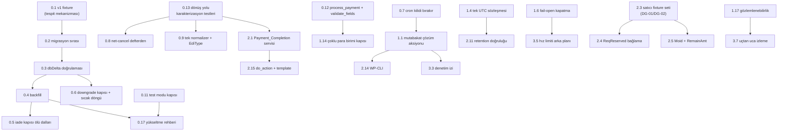

# 17 — Remediation Aksiyon Planı

> **Girdi.** 14 boyut raporu (`01`–`14`, 296 doğrulanmış bulgu), `15-cross-cutting.md` (8 kök neden
> kümesi, 6 bileşik risk zinciri, 8 sistemik boşluk) ve `16-coverage-gaps.md` (13 GAP bulgusu).
> **Kapsam.** PR #3 (`main` ← `development`), NICEPAY PG-Web v3 · WooCommerce · KRW.
> **Söz.** 5 kritik ve 39 yüksek bulgunun **tamamı** aşağıdaki dört aşamadan birine atanmıştır;
> hiçbiri boşta değildir. Atama tablosu için bkz. [§ Kapsama denetimi](#kapsama-denetimi).
> **Satır referansları** bu dokümanın yazıldığı andaki `development` HEAD ile doğrulanmıştır.

---

## Prensipler

Bu plan, 296 bulgunun her birine ayrı bir yama yazmaz. `15-cross-cutting.md` 118 bulgunun sekiz
kök nedene indiğini gösterdi; plan **kök nedeni** hedefler ve semptomları onun altında kapatır.
Aşağıdaki beş kural, her aksiyonun kabul ölçütüdür.

### P1 — Kök nedeni düzelt, semptomu değil

Bir aksiyon en az bir RC kümesini veya CR zincirini kapatmalıdır. Örnek: `MONEY-001`, `MONEY-018`,
`DATA-002` ve `DATA-020` dört ayrı bulgu olarak raporlandı; dördü de **tek bir eksik backfill
migrasyonunun** yüzleridir. Plan dört yama değil, bir migrasyon + bir fixture yazar.

Bu kuralın negatif hâli de bağlayıcıdır: **`gateway.php:704`'teki `flow === ''` toleransını
"düzeltmek" bir çözüm değildir** — o tolerans ölüdür çünkü `nicepay_get_transaction_by_tid()`
(`includes/nicepay-functions.php:450`) sorguya `AND flow = 'woocommerce'` sabitliyor. Semptomu
yamamak, kök nedeni gizler.

### P2 — Her düzeltme kendi testiyle gelir; test önce yazılır

Bir aksiyon, **düzeltmeden önce kırmızıya düşen** bir test olmadan kapatılamaz. Bu, mevcut test
paketinin en büyük zaafına doğrudan bir yanıttır: `TEST-003`/`TEST-004`, güvenlik iddialarının
`addslashes` tabanlı sahte `$wpdb->prepare()`'lere ve dosya metni `grep`'ine dayandığını gösterdi.
Bu plan kapsamında yazılan hiçbir test şu üç kalıbı kullanamaz:

| Yasak kalıp | Neden | Yerine |
|---|---|---|
| `file_get_contents()` + `assertStringContainsString()` | Yorum satırı da geçer; ölü kod da geçer | Fonksiyonu gerçekten çağır |
| Sahte `prepare()` içinde `addslashes` | Gerçek WordPress escaping'i ölçmüyor | Entegrasyon testinde gerçek `$wpdb` |
| Beklenen değeri üretim fonksiyonuyla üretmek | Tautoloji | Literal golden değer (imza testlerindeki gibi) |

**Ters yönde bir tuzak var ve önceden temizlenmelidir:** `tests/unit/NicePayRateLimitTest.php:48-54`
hız limitinin fail-open davranışını *beklenen davranış* olarak çiviliyor (`GAP-006`). `SEC-016`
düzeltildiğinde bu test kırılacak ve düzeltme bir regresyon gibi görünecek. Aksiyon 1.6 bu testi
düzeltmenin **parçası** olarak yeniden yazar.

### P3 — Migrasyon geri alınabilir; geri alınamaz olan açıkça onaylatılır

Bugün `NicePay_Installer` yalnızca ileri gider ve `scrub_legacy_sensitive_data()`
(`includes/class-nicepay-installer.php:262-300`) `payment_data` denetim yükünü **dbDelta'dan önce**,
geri alınamaz biçimde NULL'lar. Bu plan kapsamındaki her migrasyon üç şartı sağlar:

1. **Sıra:** yapı değişiklikleri (ALTER/dbDelta) → doğrulama → veri dönüşümü. Yıkıcı adım asla
   doğrulanmamış bir şemanın önünde olamaz.
2. **Kapı:** daha yeni bir şema sürümü tespit edilirse `version_compare` ile fail-closed dur
   (`GAP-004`); düz dize eşitsizliği (`installer.php:40`, `:120`, `:128`) yeterli değildir.
3. **Onay:** geri alınamaz veri silme (`payment_data` temizliği) varsayılan olarak **çalışmaz**;
   satıcı yönetici ekranından açıkça onaylar veya bir WP-CLI komutuyla tetikler.

### P4 — Fail-closed varsayılanlar korunur ve genişletilir

PR'ın en güçlü tarafı fail-closed disiplinidir: bilinmeyen ResultCode'da red
(`class-nicepay-api.php:650-652`), doğrulanamayan ters çevirmede `needs_reconciliation`, taze
kurulumda gateway `enabled = 'no'`. Bu plan **hiçbir aksiyonda bu davranışı gevşetmez.**

Buna karşılık `RC-6`'nın tespit ettiği fail-**open** kapılar kapatılır. Ayrım nettir:

- *Fail-closed:* ön koşul doğrulanamıyorsa **reddet** → korunur, genişletilir.
- *Fail-open:* ön koşul **yoksa geç** → kaldırılır (`function_exists('is_ssl')` kalıbı,
  `nicepay_check_public_rate_limit()`'in geçersiz IP dalı, `is_available()`'da mod kapısının
  hiç olmaması).

Yeni bir kapı eklendiğinde varsayılan **daima** en kısıtlayıcı olandır; gevşetme yalnızca açıkça
dokümante edilmiş bir filtre üzerinden yapılır (ör. `nicepay_allow_test_mode_checkout`).

### P5 — Ölü yüzey yasak

Yazılıp hiç okunmayan sütun, atanıp hiç kullanılmayan değişken, erişilemez kod dalı ve
karşılanmayan durum üretilmez. `RC-5` bunun bedelini gösterdi: `config_fingerprint` üç yerde
yazılıp sıfır yerde okunuyor ve okuyucuya var olmayan bir bütünlük kontrolü vaat ediyor. Bir
özellik ya tamamlanır ya geri alınır; "sonra bitiririz" hâlinde şemaya girmez.

### P6 — Sıralama kuralı

Aksiyonlar **bağımlılık** sırasındadır, şiddet sırasında değil. Şema/migrasyon/mimari önce gelir;
ona bağlı olan davranış, UI ve doküman düzeltmeleri sonra. Bir aksiyonun "Bağımlılık" işareti
varsa, önce o aksiyon tamamlanmadan başlanamaz — çünkü aksi hâlde düzeltme yanlış temelin üstüne
kurulur ve ikinci kez yapılması gerekir.

**Efor ölçeği:** `S` ≤ 0,5 gün · `M` 1–3 gün · `L` > 3 gün (test yazımı dâhil).

---

## Aşama 0 — Sevkiyat Öncesi Zorunlu

**Kapı:** Bu aşamanın 18 aksiyonu tamamlanmadan 2.0.0 **hiçbir kanala** (WordPress.org, GitHub
Releases, doğrudan müşteri kurulumu) sevk edilemez. Gerekçe: her biri ya para kaybı/çift tahsilat
üretir, ya mağazayı çıkışsız bırakır, ya hukuki risk taşır, ya da yayın hattını fiilen çalışmaz
kılar.

**Zincir odağı:** `CR-1` (yükseltme → sessiz indeks kaybı → çift onay + iade yolu aynı anda ölür),
`CR-2` (test modu → bedava ürün), `CR-3` (süreç ölümü → çıkışsız kilitlenme), `CR-4` (kesirli KRW),
`CR-5` (net-cancel oracle).

| # | Aksiyon | Kapatılan bulgular | Dosyalar | Efor | Doğrulama | Risk |
|---|---|---|---|---|---|---|
| **0.1** | **Gerçek v1 tablo fixture'ı ekle.** `run-schema-migration.sh` içine v1 şemasını birebir kuran bir `CREATE TABLE` bloğu yaz: `tid varchar(50) NOT NULL DEFAULT ''`, `flow`/`mid`/`mode`/`captured_amount`/`remaining_amount` sütunları **yok**, `payment_data` dolu, en az 3 ödenmiş + 2 `tid=''` satır. Ardından `maybe_install()` çalıştır ve iade akışını uçtan uca koştur. **Bu aksiyon 0.2–0.5'in tespit mekanizmasıdır; onlardan önce yeşile alınmaz, kırmızıya alınır.** | DATA-015, DATA-037, TEST-013 (kısmi), SG-5 | `tests/integration/run-schema-migration.sh`, `tests/integration/schema-migration.php` | M | Yeni test **düzeltmeden önce kırmızı** olmalı: `uniq_tid` yok + iade `nicepay_refund_amount_error` veriyor. CI'da `database-integration` job'ı bu fixture'ı koşar. | Düşük. Yalnızca test altyapısı; üretim kodu değişmiyor. Tersine, tüm Aşama 0'ın güvenlik ağı. |
| **0.2** | **Migrasyon sırasını düzelt.** (a) `tid` sütununu NULL'lamadan **önce** açık `ALTER TABLE {$table} MODIFY tid varchar(50) NULL` çalıştır (dbDelta nullability değiştirmez). (b) `scrub_legacy_sensitive_data()` çağrısını dbDelta + doğrulama **sonrasına** taşı. (c) `payment_data` NULL'lama sorgusunu varsayılan yoldan çıkar; ayrı, onay gerektiren bir adıma al (P3). | **DATA-001 (critical)**, **MONEY-015 (critical)**, DATA-003, DATA-028, CR-1 | `includes/class-nicepay-installer.php:262-300` (`scrub_legacy_sensitive_data`), `:138-200` (`maybe_install`) | M | 0.1'in fixture'ı yeşile döner: `SHOW INDEX` üç UNIQUE indeksi de gösterir; `SELECT COUNT(*) FROM ... WHERE tid = ''` sıfır; `payment_data` **korunmuş**. | **Orta.** MySQL'in `NOT NULL` sütuna NULL yazma davranışı WP'nin strict-mode kaldırmasına bağlı (güven: orta). Bu yüzden 0.1 gerçek MariaDB'de koşmalı; unit test yeterli değil. |
| **0.3** | **dbDelta sonrası şema doğrulaması.** `maybe_install()` içine dbDelta'dan sonra açık bir kontrol ekle: `SHOW INDEX FROM {$table}` ile `uniq_moid`, `uniq_tid`, `uniq_active_attempt`, `idx_source_ref` varlığını ve `SHOW COLUMNS` ile beklenen sütun kümesini kanıtla. Eksik varsa `WP_Error` dön ve **sürüm option'ını ilerletme**. | **DATA-018 (critical)**, DATA-019 (etki daralması), CR-1 | `includes/class-nicepay-installer.php:185-200` | S | 0.1 fixture'ının bir varyantı: indeksi bilerek engelle (çift `tid=''` bırak), `maybe_install()` `WP_Error` dönmeli ve `get_option( VERSION_OPTION )` **değişmemeli**. | Düşük. Fail-closed yönde; en kötü ihtimalle bugün sessizce geçen bozuk bir yükseltme artık görünür şekilde durur — istenen davranış. |
| **0.4** | **Backfill migrasyonu yaz.** Eski satırlar için türet: `flow = 'woocommerce'` (`wc_order_id > 0` olanlar), `currency = 'KRW'`, `mid`/`mode` aktif yapılandırmadan, `captured_amount = amount` (yalnızca `status = 'paid'` satırlarda), `remaining_amount = amount - refunded_amount`. Batch'li (`LIMIT`) ve idempotent yaz. | **DATA-002**, **DATA-020**, **MONEY-001**, **MONEY-018**, CR-1 | `includes/class-nicepay-installer.php` (yeni `backfill_legacy_rows()`), `includes/class-nicepay-transaction-schema.php` | M | 0.1 fixture'ındaki ödenmiş satırlar için `process_refund()` uçtan uca **başarılı** olmalı — bugün `Transaction ID not found.` veriyor. | Orta. `mid`/`mode` türetimi varsayımsal (eski satır hangi MID ile alındı?). Fail-closed çözüm: türetilemiyorsa sütunu boş bırak ve iade kapısında **açık** bir hata kodu ver (`nicepay_refund_legacy_context_missing`), jenerik para birimi hatası değil. |
| **0.5** | **İade kapısındaki iki ölü dalı gerçek kontrole çevir.** (a) `nicepay_get_transaction_by_tid()`'deki `AND flow = 'woocommerce'` sabitini kaldır ve `flow IN ('', 'woocommerce')` yap — böylece `gateway.php:704`'teki tolerans **gerçekten** çalışır. (b) `! empty( $transaction->captured_amount )` yerine `nicepay_normalize_ledger_amount()` sonucunu kontrol et; `'0.00'` PHP'de truthy olduğu için mevcut fallback ölü. | **MONEY-002**, MONEY-014, MONEY-026, X-6 | `includes/nicepay-functions.php:445-458`, `includes/class-nicepay-gateway.php:700-706`, `:723-726` | S | Unit: `captured_amount = '0.00'` olan bir satırda fallback'in `amount`'a düştüğünü doğrula. Entegrasyon: 0.1 fixture'ında `flow = ''` satırı için iade çalışsın. **Bağımlılık: 0.4.** | Düşük. Ancak 0.4 olmadan tek başına uygulanırsa yanlış güvence verir (satır bulunur ama tutar hâlâ boştur) — bu yüzden sırası bağlayıcıdır. |
| **0.6** | **Geri alma kapısı + bloke migrasyonun sıcak döngüsünü kes.** (a) `maybe_install()`'un başına `version_compare( $current, $target, '>' )` kapısı ekle; daha yeni şema tespit edilirse `nicepay_schema_downgrade_blocked` dön. (b) Migrasyon bloke olduğunda sonucu kısa TTL'li bir transient'e yaz; her istekte iki tam tablo taraması tekrarlanmasın. (c) dbDelta çevresine `add_option` tabanlı TTL kilidi koy (retention'daki desen). | **DATA-022**, GAP-004 (kod yarısı), DATA-004, ARCH-008 (kısmi) | `includes/class-nicepay-installer.php:40`, `:120-138`, `:185-200`; `nicepay-payment-gateway.php:202-213` | S | Unit: daha yeni sürüm option'ı yazılıp `maybe_install()` çağrıldığında `WP_Error` dönmeli. Entegrasyon: bloke durumda ikinci istekte `SHOW TABLES` sorgu sayısı 0 olmalı (sorgu sayacı ile). | Düşük. Transient önbelleği yanlış boyutlanırsa gerçek bir düzeltmenin görünmesi gecikir → TTL ≤ 60 sn ve admin tarafında her zaman bypass. |
| **0.7** | **Cron kurtarması kilidi bıraksın.** Stale-approving `UPDATE`'ine `active_attempt_key = NULL` ve `auth_token = ''` ekle. Bugün satır `needs_reconciliation` olarak işaretleniyor ama kilit kalıyor; sonuç, sipariş **ödenemez + iade edilemez + silinemez**. | **MONEY-003**, **MONEY-016**, **DATA-021**, CR-3 | `includes/nicepay-functions.php:970-978` | S | Entegrasyon: `approving` + 31 dk eski `approval_started_at` satırı kur, cron'u çalıştır, sonra **aynı sipariş için yeni bir deneme INSERT'inin başarılı olduğunu** doğrula (bugün duplicate key ile düşüyor). | Düşük. Kilit bırakmak yeni bir onay denemesine izin verir; ancak satır `needs_reconciliation` olduğu için iade kapısı hâlâ kapalı — para güvenliği korunuyor. |
| **0.8** | **Net-cancel'ı defterden kur, POST'tan değil.** `nicepay_abort_authenticated_payment()`'ın kullandığı `TID`/`AuthToken`/`Amt`/`NetCancelURL` alanları, saldırganın POST ettiği gövdeden değil **iddia edilmiş (claimed) defter satırından** okunsun; `NetCancelURL` allowlist'e ek olarak satırın `mid`/`moid`'iyle eşleşen bir istek üretsin. Ayrıca `handle_return`'ün ilk dalında (`gateway.php:426-433`) **başarılı ama yerel doğrulamada reddedilen** auth için de ters çevirme + defter kaydı yap. | **SEC-011 (critical)**, **SEC-012** (istismar edilebilir yarısı), MONEY-019, MONEY-025, CR-5 | `includes/nicepay-functions.php:236-271`, `includes/class-nicepay-api.php:471-547`, `includes/class-nicepay-gateway.php:426-433` | M | Unit: POST'ta başka bir işleme ait `TxTid` gönderildiğinde net-cancel'ın **hiç çağrılmadığını** doğrula. Unit: `validate_auth_return` `WP_Error` döndüğünde net-cancel'ın çağrıldığını ve satırın `needs_reconciliation` yazıldığını doğrula. **Bağımlılık: 0.13.** | Orta. Yerel doğrulamada reddedilen auth için ters çevirme eklemek, daha önce hiç yapılmayan bir dış çağrı ekliyor; imza doğrulanmış bir bağlam olmadan çağrı yapılmadığından fail-closed korunur. |
| **0.9** | **Tek yanıt normalizeri + `EdiType=JSON`.** (a) `validate_auth_return`'deki `nicepay_normalize_amount( $payload['Amt'] )` çağrısını `nicepay_normalize_response_amount()` ile değiştir — approval yolu (aynı dosyada 65 satır sonra) sıfır-dolgulu `Amt`'yi zaten kabul ediyor. (b) Onay ve iptal isteklerine açıkça `EdiType=JSON` ekle. | **PROTO-002**, PROTO-003, MONEY-006, MONEY-022, DOC-018, RC-3 | `includes/class-nicepay-inbound-validator.php:98`, `includes/class-nicepay-api.php:299` ve istek kurucuları | S | Unit: `'000000050000'` payload'lı auth-return'ün **kabul** edildiğini ve `'50000'` ile aynı sonucu ürettiğini doğrula. Unit: giden istek gövdesinde `EdiType=JSON` alanının bulunduğunu assert et. | Düşük. Güvenlik gevşemesi **yok**: imza ham byte üzerinden doğrulanıyor, normalizer yalnızca binding karşılaştırması için kanonikleştiriyor ve ikisi de kanonik pozitif tamsayı döndürüyor. |
| **0.10** | **KRW ondalıksızlığını WooCommerce sınırında zorla.** `is_available()`'a mağaza ondalık ayarı kontrolü ekle (`wc_get_price_decimals() !== 0` → gateway görünmesin) **veya** `woocommerce_currencies`/fiyat filtreleriyle KRW için ondalığı 0'a sabitle; hazırlık paneline açık bir uyarı satırı koy. Ayrıca iade tavanını tek kaynaktan (`captured_amount`) türet ve üç farklı reddi üç ayrı hata koduna ayır. | **MONEY-005**, **MONEY-017**, MONEY-014, MONEY-026, CR-4 | `includes/class-nicepay-gateway.php:76-102`, `:723-760`; `includes/nicepay-functions.php:1490-1521`; `admin/class-nicepay-admin.php:425-463` | M | Unit: `40000.50` toplamlı sipariş için `process_payment()`'ın **sipariş oluşturmadan** açık bir hata ile reddettiğini doğrula. Unit: iki adet `20000.25` kısmi iadenin ikincisinin bugün kalıcı olarak reddedildiğini kanıtlayan test **önce kırmızı** yazılmalı. | Orta. Ondalık ayarını zorlamak, mağazanın diğer ödeme yöntemlerini etkileyebilir; bu yüzden tercih edilen çözüm **gateway'i gizlemek + net uyarı**, mağaza ayarını sessizce değiştirmek değil. |
| **0.11** | **Test modu kapısı + görünür test bandı.** (a) `is_available()`'a mod kapısı ekle: `'test' === $this->api->get_mode()` ise varsayılan **false**; yalnızca `apply_filters( 'nicepay_allow_test_mode_checkout', false )` açıkça `true` dönerse görünsün. (b) `.nicepay-notice` taban sınıfına arka plan/çerçeve/renk ver ve `.nicepay-notice-warning` varyantını test bandına uygula. | **SEC-013**, SEC-001, UX-002, CR-2 | `includes/class-nicepay-gateway.php:76-102`, `assets/css/nicepay.css:469+`, `templates/payment-form.php:18` | S | Unit: test modunda `is_available()` **false**; filtre `true` döndüğünde **true**. CSS: 1.11'de eklenecek CI kapısının ilk vakası — `.nicepay-notice` için `background` bildiriminin varlığını assert et. | **Orta-yüksek ürün riski.** Bu, test modunda kalmış mağazalarda checkout'tan NicePay'i kaldırır — kasıtlı ve doğru davranış, ama CHANGELOG'da ve `Upgrade Notice`'ta **kırıcı değişiklik** olarak duyurulmalı (0.17). |
| **0.12** | **`process_payment()` sessiz başarısızlığını ve geç doğrulamayı kaldır.** (a) İki bildirimsiz `failure` dalına (`:111-113`, `:123-125`) `wc_add_notice()` ekle ve nedeni logla. (b) `validate_fields()` uygula: alıcı ad/e-posta/telefon doğrulaması sipariş oluşmadan **önce** çalışsın. (c) Receipt sayfasındaki üç çıkışsız hata dalına (`:216-219`, `:242-245`, `:264-266`) `Return to Checkout` bağlantısını ekle — desen `:296-302`'de zaten var. | **PLAT-001**, **PLAT-002**, MONEY-010, GAP-005 (UX yarısı) | `includes/class-nicepay-gateway.php:108-125`, `:213-266`, yeni `validate_fields()` | S | Entegrasyon (`woocommerce-smoke.php`): geçersiz alıcı e-postasıyla checkout denendiğinde **sipariş oluşmadığını** ve bir notice basıldığını doğrula. | Düşük. `validate_fields()` yalnızca klasik checkout'ta çalışır; Blocks tarafı 2.7'de ele alınır — bu asimetri dokümante edilmeli. |
| **0.13** | **Dönüş yolu için karakterizasyon testleri yaz.** `handle_return()` (`gateway.php:376+`, 313 satır) ve `NicePay_Return_Handler::process()` (`return-handler.php:25+`) için mevcut davranışı **olduğu gibi** çiviliyen testler: başarılı akış, imza reddi, replay, claim başarısızlığı, approval `WP_Error`, binding uyuşmazlığı. Bunlar 0.8/0.9/0.5'in kırdığı yeri gösterecek ağdır ve Aşama 2'deki birleştirme refactor'ünün ön koşuludur. | **TEST-001 (critical)**, TEST-006 (kısmi) | `tests/unit/` (yeni `NicePayReturnFlowTest.php`), `tests/bootstrap/wp-stubs.php` | L | Yeni test dosyası en az 12 vaka; `wp_remote_post` `WP_Error` dalı dâhil. Kabul: `handle_return()` satır kapsamı ölçülebilir ve raporlanır (eşik 1.3'te bağlanır). | Orta. Karakterizasyon testleri yanlış davranışı da çivileyebilir; bu yüzden her vakanın başına *"bu davranış doğru mu, yoksa yalnızca mevcut mu?"* notu düşülmeli ve 0.8/0.9 sonrası gözden geçirilmeli. |
| **0.14** | **Lisansı GPL-uyumlu hâle getir.** Dört beyanı birden `GPLv2 or later`'a çevir (`plugin header`, `readme.txt`, `composer.json`, `LICENSE` tam metin) ve `check-version.js`'e GPL-uyumlu allowlist kapısı ekle. Gerekçe: `WC_Gateway_NicePay extends WC_Payment_Gateway` ve `NicePay_Blocks_Integration extends AbstractPaymentMethodType` — her ikisi de GPLv3 kod; `LICENSE:8` sahip olunmayan bir `sublicense/sell` hakkı devrediyor. | **GAP-001** | `nicepay-payment-gateway.php:15`, `readme.txt:7-8`, `composer.json:5`, `LICENSE`, `.github/scripts/check-version.js` | S | `check-version.js` GPL dışı bir lisans dizesinde **fail** etmeli (negatif test). `deploy-wordpress-org.yml:106-127`'deki mevcut eşitlik kapısı korunur. | Düşük teknik, **yüksek hukuki değer**. WordPress.org sonucu `medium confidence` (MIT zaten uyumlu listede) ama türev-eser çelişkisi kesin. |
| **0.15** | **Yayın hattının üç kırığını kapat.** (a) `readme.txt`'e `Contributors:` başlığı ekle — bugün yok ve `deploy-wordpress-org.yml:262-265` publish'i tam SVN yazımından önce durdurur. (b) Entegrasyon script'lerindeki sabit `2.0.0`'ı plugin header'ından oku. (c) `check-version.js` kapsamına `readme.txt` `Stable tag` ve `package.json` `version` alanlarını al. (d) `Update URI` kapısını `NICEPAY_DISTRIBUTION_CHANNEL` kaçışıyla `composer quality`, `tests.yml` package ve `release.yml` yollarına da tanıt. | **DOC-001**, **CI-001**, **CI-002** (daraltılmış kapsam), CI-004, SG-8 | `readme.txt:1-8`, `tests/integration/run-schema-migration.sh:80`, `run-woocommerce-smoke.sh:84`, `.github/scripts/check-version.js:66-85`, `.github/scripts/build-release.sh:23` | S | Sürümü yerelde `2.0.1`'e çıkar ve **tüm** CI job'larının yeşil kaldığını doğrula — bugün `database-integration` ve `woocommerce-integration` deterministik olarak kırmızıya döner. | Düşük. Tamamen CI yüzeyi; üretim kodu değişmiyor. |
| **0.16** | **`docs/analysis` (00–12) yayın kararını uygula.** İki seçenekten birini seç ve tamamen uygula: **(a) çıkar** — dizini repodan kaldır, iç referansı olan dokümanları güncelle; **(b) banla** — her dosyanın başına tarih + taban commit (`5855db1`) + "bu doküman düzeltilmiş koddan öncedir, satır referansları geçersizdir" bandı koy ve `04-security.md`'deki çalışır `curl` sömürü komutunu kaldır. Her iki durumda da 2.0.0 sürüm numarasının **yeniden kullanılmadığından** emin ol (yayımlanmış savunmasız 2.0.0 ile aynı numara). | **META-001**, **META-002**, **META-004**, **META-006**, META-003, META-009 | `docs/analysis/00-*.md` … `12-*.md`, `docs/CONFIGURATION.md:71`, `CHANGELOG.md` | M | `grep -rn "curl .*nicepay_return" docs/` sıfır eşleşme. `grep -L "GEÇERSİZ\|SUPERSEDED" docs/analysis/0*.md` boş (b seçilirse). `CONFIGURATION.md`'deki CSV yedek adımına 10.000 satır sınırı uyarısı eklenmiş olmalı (META-006). | Düşük teknik, **yüksek itibar riski**. (a) daha düşük toplam maliyetlidir; (b) seçilirse META-009'un sahiplik/kadans sorusu Aşama 3'te çözülmelidir. |
| **0.17** | **Yükseltme rehberi + kırıcı değişiklik duyurusu.** `docs/USER-GUIDE.md`'e "Upgrading from 1.x" bölümü: **zorunlu** veritabanı yedeği, `nicepay_schema_duplicate_moid`/`_tid` için SQL kurtarma reçetesi, "sürüm geri alma desteklenmiyor" açık beyanı. `CHANGELOG.md`'e `### Breaking` bölümü. `readme.txt`'in `== Upgrade Notice ==` metnini kırıcı değişiklikleri **adıyla** sayacak şekilde yeniden yaz (0.11'in test modu kapısı dâhil). | **DOC-002**, GAP-004 (doküman yarısı), DOC-019 | `docs/USER-GUIDE.md`, `CHANGELOG.md`, `readme.txt:99-103` | S | İnsan incelemesi + `check-version.js`'in CHANGELOG sürüm kapısı. Kabul ölçütü: rehber, 0.2–0.4'te uygulanan **gerçek** migrasyon davranışını anlatmalı (spekülatif değil). **Bağımlılık: 0.2, 0.4, 0.11.** | Düşük. Tek risk, koddan önce yazılıp sonra ayrışması — bu yüzden bağımlılık sırası bağlayıcıdır. |
| **0.18** | **Shortcode `buyer_*` çelişkisini karara bağla.** Üç doküman (`README.md:106` vd.) bu parametrelerin ön-doldurma yaptığını söylüyor; kod kayıtlı yapılandırma değerleriyle koşulsuz eziyor. Ya kodu dokümana uydur (attribute > preset önceliği), ya dokümanı koda uydur ve parametreleri kaldır. Ayrıca `id` olmadan çalışan 1.x shortcode'larının artık hata bastığını kırıcı değişiklik olarak duyur. | **DOC-003**, SEC-005 (kapsam daralması) | `README.md`, `docs/USER-GUIDE.md`, `docs/CONFIGURATION.md`, `nicepay-payment-gateway.php:743+`, `templates/standalone-payment-form.php` | S | Unit: seçilen davranışı çiviliyen bir test (`buyer_name` attribute'u ya etkili ya da attribute listesinde yok). | Düşük. **Gizlilik notu:** ön-doldurma korunursa `SEC-005` (alıcı PII'sinin herkese açık HTML'de gizli input olarak yayımlanması) yeniden değerlendirilmeli; kaldırma seçeneği hem dokümanı hem SEC-005'i kapatır. |

**Aşama 0 çıkış kapısı.** (1) `database-integration` job'ı v1 fixture'ıyla yeşil. (2) Sürümü
`2.0.1`'e çıkarma denemesi tüm CI'da yeşil. (3) `grep -rn "curl" docs/analysis/04-security.md`
sömürü komutu içermiyor. (4) Test modunda `is_available()` false. (5) `LICENSE` GPLv2-or-later.
(6) Aşama 0'da eklenen her test, düzeltmeden önceki commit'te kırmızı olduğu gösterilerek kaydedildi.

---

## Aşama 1 — İlk Yama (2.0.1)

**Kapı:** Aşama 0 sevk edildikten sonraki ilk yama. Odak: operatörün elini çözmek (çıkışsız
durumlar için gerçek araçlar), test kapsamının en tehlikeli boşluklarını kapatmak ve
kullanıcıya görünen kırıklıkları gidermek.

**Zincir odağı:** `RC-2` (kilit/kurtarma), `RC-6` (fail-open), `RC-7` (zaman dilimi), `RC-8`
(karşılanmayan durumlar), `CR-6` (multisite).

| # | Aksiyon | Kapatılan bulgular | Dosyalar | Efor | Doğrulama | Risk |
|---|---|---|---|---|---|---|
| **1.1** | **Mutabakat çözüm aksiyonu.** `wp_ajax_nicepay_resolve_reconciliation` ekle: yetenek + işlem-özel nonce + **zorunlu serbest metin gerekçe** + append-only denetim satırı (aktör, zaman, gerekçe). İki sonuç sunsun: *"ters çevirmeyi NICEPAY konsolunda doğruladım"* → `failed`; *"yakalama gerçekleşti"* → `paid` + `captured_amount`. Ayrıca `net_cancel_status`/`net_cancel_result_code`/`reconciliation_note` alanlarını hem `get_safe_detail_fields()` allowlist'ine hem CSV sütunlarına ekle. | **ADMIN-002**, MONEY-009, MONEY-021, DATA-031, PROTO-005, SG-2, SG-4, RC-2, CR-3 | `admin/class-nicepay-transactions.php:360-402`, `:566`, `:634-645`, `:969-1027`; `includes/nicepay-functions.php` | L | Unit: yetkisiz kullanıcı ve yanlış nonce ile çağrının **reddedildiğini**, gerekçesiz çağrının reddedildiğini, denetim satırının yazıldığını doğrula. Entegrasyon: çözülen satırın retention predicate'ine artık uygun hâle geldiğini doğrula. **Bağımlılık: 0.7.** | **Yüksek.** Bu aksiyon operatöre defter durumunu elle değiştirme yetkisi verir — yani gerçek para durumunu yanlış işaretleyebilir. Bu yüzden: geri alınamaz olmayan (yalnızca ileri) geçişler, zorunlu gerekçe, append-only denetim ve `edit_shop_orders` seviyesinde yetenek (bkz. SEC-003). |
| **1.2** | **İade akışının transport sonrası dallarını test et.** `process_refund()`'ın yedi kapanış dalı: `WP_Error`, binding uyuşmazlığı, PG reddi, defter yazamama, tam iade, kısmi iade, iade kilidinin serbest bırakılması. | **TEST-002**, TEST-016, MONEY-021 | `tests/unit/NicePayRefundTest.php`, `includes/class-nicepay-gateway.php:807+` | M | Yedi dalın her biri için ayrı vaka; her biri düzeltme öncesi **kapsanmamış** olduğu kanıtlanarak eklenir. | Düşük. Yalnızca test; ancak dalların bazıları bugün yanlış davranıyor olabilir — bulunan her sapma ayrı bir bulgu olarak kaydedilmeli, sessizce çivilenmemeli. |
| **1.3** | **Kapsam kapılarını gerçekleştir.** (a) `phpunit.xml` coverage kapsamına `admin/`, kök eklenti dosyası ve `templates/` ekle. (b) Bir eşik bağla (başlangıç: mevcut ölçülen değer, regresyon yasak). (c) Beş nonce/capability kapısının dördü için test yaz (`nicepay_init_payment`, `nicepay_refresh_nonce`, `nicepay_save_shortcode`, `nicepay_delete_shortcode`, `nicepay_cancel_transaction`) ve `wp_verify_nonce` stub'ı ekle. (d) `phpunit.xml`'e deprecation/çıktı/global-state sıkılığı ekle. | **TEST-005**, **TEST-007**, CI-016, TEST-010, TEST-011 | `phpunit.xml:8-24`, `tests/bootstrap/wp-stubs.php`, `tests/unit/` (yeni CSRF testleri) | M | Bir nonce kontrolünü kaldırma denemesi CI'da **fail** etmeli (mutasyon kontrolü). Coverage eşiği düşürüldüğünde CI kırılmalı. | Düşük. Eşik çok yüksek başlatılırsa geliştirmeyi bloke eder → başlangıç değeri ölçülen değere sabitlenir, kademeli yükseltilir. |
| **1.4** | **Tek UTC zaman dilimi sözleşmesi.** `created_at`/`updated_at`'i DB varsayılanından (`CURRENT_TIMESTAMP`) al ve `prepare_write()` içinde PHP `gmdate()` ile yaz; okuma tarafında `get_date_from_gmt()` + `date_i18n()` kullan. Mevcut satırlar için tek seferlik ofset düzeltmesi **yapma** (tespit edilemez); bunun yerine migrasyon notunda belirt. | **ADMIN-001**, DATA-006, DATA-023, UX-027, I18N-011, RC-7 | `includes/class-nicepay-transaction-schema.php:112-113`, `:257-295`; `admin/class-nicepay-transactions.php:793` | M | Entegrasyon: DB oturum TZ'si `Asia/Seoul` iken yazılan satırın `created_at` değerinin UTC olduğunu ve admin filtresiyle ekrandaki tarihin **aynı günü** gösterdiğini doğrula. | Orta. Yükseltme sırasında eski (yerel TZ'de yazılmış) satırlar ile yeni (UTC) satırlar aynı tabloda karışık kalır; retention penceresi bu satırlar için ofset kadar kayar. Bu bilinen ve **dokümante edilecek** bir sınırlamadır. |
| **1.5** | **Expiry cron'unu batch'le ve indeksle.** İki sınırsız `UPDATE`'i retention desenine çevir: `LIMIT` + döngü + `add_option` TTL kilidi + işlenen satır sayısını `info` seviyesinde logla. Şemaya `KEY idx_status_offer_expiry (status, offer_expires_at)` ve `KEY idx_status_approval_started (status, approval_started_at)` ekle. | **GAP-003**, SG-7, DATA-009 (kısmi) | `includes/nicepay-functions.php:955-985`, `includes/class-nicepay-transaction-schema.php:122-136` | M | Entegrasyon: 50.000 satırlık sentetik defterde cron'un tek seferde kaç satır işlediğini ve `EXPLAIN`'in yeni indeksi seçtiğini doğrula. | Orta. Yeni indeksler yazma amplifikasyonu ekler; ölçülmeli. Ayrıca 0.3'ün indeks doğrulaması bu iki yeni indeksi de kapsamalıdır. |
| **1.6** | **Fail-open kapıları kapat.** (a) `function_exists('is_ssl')` / `wp_next_scheduled` korumalarını sert gereksinime çevir (eklenti zaten WP 5.8+ istiyor). (b) `nicepay_check_public_rate_limit()`'in geçersiz `REMOTE_ADDR` dalını **reddet** varsayılanına çevir; gevşetme `nicepay_rate_limit_unknown_ip_policy` filtresiyle olsun. (c) `tests/unit/NicePayRateLimitTest.php:48-54`'ü yeni davranışa göre yeniden yaz. (d) Ters proxy için güvenilir başlık desteği ekle (allowlist'li). | **ARCH-011**, SEC-016, GAP-006, PLAT-010, RC-6 | `includes/class-nicepay-gateway.php:98`, `admin/class-nicepay-admin.php:430-431`, `includes/nicepay-functions.php:286-330`, `tests/unit/NicePayRateLimitTest.php` | M | Unit: geçersiz IP'de `false` dönmeli (bugün `true`). Unit: filtre ile fail-open'a dönülebildiğini doğrula. Hazırlık paneli `DISABLE_WP_CRON` durumunda "Ready" **dememeli**. | **Orta-yüksek.** Fail-closed'a geçiş, `REMOTE_ADDR`'ı doğru iletmeyen barındırmalarda tüm standalone ödemeleri bloke edebilir. Bu yüzden: filtre + hazırlık panelinde açık teşhis satırı + `Upgrade Notice`'ta uyarı zorunlu. |
| **1.7** | **Net-cancel'a yeniden deneme.** Tek denemeyi, kısa üstel geri çekilmeli (ör. 0 sn / 2 sn / 5 sn) üç denemeye çıkar; her denemenin sonucunu deftere yaz. Toplam bütçe, NICEPAY'in 망취소 penceresi teyit edilene kadar (DG-01) muhafazakâr tutulsun. | **PROTO-004**, PROTO-005 (görünürlük yarısı) | `includes/class-nicepay-api.php:435-547`, `includes/nicepay-functions.php:236-271` | M | Unit: ilk iki denemede `WP_Error`, üçüncüde başarı senaryosunda satırın `failed` (not `needs_reconciliation`) yazıldığını doğrula. Unit: üç deneme de başarısızsa `needs_reconciliation` + üç denemenin de loglandığını doğrula. **Bağımlılık: 0.8.** | Orta. Ek denemeler PHP istek süresini uzatır; approval timeout'u (30 sn) + üç net-cancel denemesi toplam bütçeyi aşabilir → toplam süre üst sınırı konmalı ve aşıldığında fail-closed `needs_reconciliation` yazılmalı. |
| **1.8** | **PG penceresi için watchdog + XHR timeout.** (a) `XMLHttpRequest`'e timeout ver ve `ontimeout`/`onerror` dallarını doldur. (b) PG hiç geri çağırmazsa (N sn) butonları serbest bırakan ve kullanıcıya "ödeme penceresi yanıt vermedi, tekrar deneyin" diyen bir watchdog ekle. (c) HTTP 403'ü körü körüne "eski nonce" saymayı bırak; hız limiti yanıtını ayırt et. (d) WooCommerce akışında PG penceresi kapandığında `/checkout/`'a zorla atmak yerine receipt sayfasında kal. | **JS-002**, JS-003, JS-010, JS-012 | `assets/js/nicepay.js:145-190`, `:306-328`, `:393-441`, `:486` | M | jsdom testi: XHR hiç yanıt vermediğinde N sn sonra butonların `disabled === false` olduğunu doğrula. jsdom: 429 yanıtında "oturum süresi doldu" **değil** hız limiti mesajının gösterildiğini doğrula. | Orta. Watchdog süresi çok kısa olursa yavaş bağlantılarda meşru akış kesilir → süre `nicepayParams` üzerinden yapılandırılabilir ve varsayılan cömert (≥ 90 sn) olmalı. |
| **1.9** | **Standalone formu tek bir `<form>` içine al.** Görünür alıcı alanları (`templates/standalone-payment-form.php:123-150`) bugün `<form>` elemanının **dışında**; bu yüzden Enter ile gönderim ve native `required` doğrulaması hiç çalışmıyor. Alanları form içine taşı veya `form="<form_id>"` niteliği ver. Ayrıca `aria-live` bölge ile erişilebilir yükleniyor bildirimi ekle ve `wp_rand()` tabanlı `$form_id`'yi çakışmasız bir sayaçla değiştir. | **UX-004**, UX-005, UX-024 (kısmi), JS-014, PLAT-018 | `templates/standalone-payment-form.php:62`, `:123-190`, `assets/js/nicepay.js:145-160` | M | jsdom: e-posta alanında Enter'ın gönderimi tetiklediğini; boş zorunlu alanla native doğrulamanın devreye girdiğini doğrula. Aynı sayfada iki shortcode'da `id` çakışmasının imkânsız olduğunu doğrula. | Orta. Alanları form içine taşımak, PG'ye giden hidden alan setine yanlışlıkla görünür alanları eklememelidir — gönderim öncesi `disabled`/`name` yönetimi testle çivilenmeli. |
| **1.10** | **İade onay diyaloğunu düzelt.** (a) Diyalogda **iade edilecek tutarı** ve para birimini göster. (b) Terminolojiyi tek kavrama sabitle (buton, `aria-label` ve başlık bugün "Refund"/"Cancel transaction"/"Cancel Transaction" olmak üzere üç farklı şey diyor). (c) Başarılı iade sonrası satırın bakiye sütununu ve sayfa üstü finansal toplamları güncelle. (d) Kısmi iade sunulmuyorsa diyalogda operatörü WooCommerce sipariş ekranına açıkça yönlendir. | **UX-007**, ADMIN-005, ADMIN-012, UX-008, I18N-005 | `admin/class-nicepay-transactions.php:924-930`, `assets/js/nicepay-admin.js:274-310` | S | jsdom: diyalog metninin tutarı içerdiğini; başarılı yanıt sonrası `Remaining` hücresinin güncellendiğini doğrula. | Düşük. Tek dikkat: tutar istemciden gelmemeli — sunucu yanıtındaki `remaining_amount` kullanılmalı (mevcut AJAX zaten tutarı istemciden almıyor, bu korunmalı). |
| **1.11** | **Durum/stil kapsamını tamamla ve CI kapısı koy.** (a) Eksik beş durum rozeti (`approving`, `partially_refunded`, `needs_reconciliation`, `abandoned`, `expired`) için CSS yaz; `needs_reconciliation` görsel olarak **en belirgin** olsun. (b) `.nicepay-error` sınıfına stil ver ve yönetici teşhis mesajlarını ziyaretçiden gizle. (c) `check-css.js`'e kapı ekle: kod tarafından üretilen her durum için bir kural, kullanılan her `.nicepay-*` sınıfı için en az bir tanım. | **UX-001**, UX-002 (0.11'in tamamlayıcısı), UX-003, UX-026, RC-8 | `assets/css/nicepay.css:520-546`, `assets/css/nicepay-admin.css`, `.github/scripts/check-css.js:34`, `nicepay-payment-gateway.php:396-432` | M | Yeni bir durum eklenip CSS yazılmadığında CI **fail** etmeli (negatif test). Ziyaretçiye "credentials are not configured" mesajının gösterilmediğini doğrulayan unit test. | Düşük. Kapı çok katı yazılırsa (ör. tüm `.nicepay-*` sınıfları) yanlış pozitif üretir → allowlist'li ve açık hata mesajlı yazılmalı. |
| **1.12** | **Çeviri hattını gerçek kapılara bağla.** (a) Müşterinin gördüğü standalone form string'lerini (18'den 10'u hiçbir dilde çevrilmemiş) ko_KR/zh_CN/tr_TR'de tamamla. (b) CI'a POT↔PO msgid bütünlük kapısı ekle (`msgcmp`); bir msgid'i tüm kataloglardan silmek bugün tüm kontrollerden geçiyor. (c) `nicepay-admin.js`'teki sabit İngilizce metinleri i18n anahtarlarına bağla. (d) `__('REFUNDED')` ile kanonik `Refunded` çakışmasını çöz. | **I18N-002**, **I18N-004**, I18N-005, I18N-006, JS-006, UX-017 | `languages/*.po`, `.github/scripts/check-translations.sh:51-79`, `assets/js/nicepay-admin.js:305`, `admin/class-nicepay-admin.php:90` | M | Bir msgid'i katalogdan silme denemesi CI'da **fail** etmeli. Standalone formun ko_KR altında tüm etiketlerinin çevrildiğini doğrulayan bir kontrol. | Düşük. Çeviri kalitesi ayrı bir konudur (I18N-003'teki ters anlamlı fuzzy kayıtlar) — o Aşama 2'de. |
| **1.13** | **Multisite yollarını düzelt.** (a) `flush_rewrite_rules()`'ü `switch_to_blog()` bloklarının **iki** konumundan da çıkar (aktivasyon `:170`, deaktivasyon `:191-195`); yerine `delete_option( 'rewrite_rules' )`. (b) `get_sites()` döngüsünü sayfalı yap ve döngü ortasındaki `wp_die()`'ı kaldırıp hata biriktirip sonunda raporla. (c) `wpmu_drop_tables` filtresine kaydol. | **PLAT-005**, **PLAT-006**, GAP-012, DATA-016, DATA-034, CR-6, SG-6 | `nicepay-payment-gateway.php:132-146`, `:158-172`, `:178-195`, `:97` | M | Multisite entegrasyon testi ekle (CI'da yeni eksen): iki alt site, farklı permalink yapıları; ağ etkinleştirmesi sonrası her iki sitenin `rewrite_rules` option'ının kendi yapısına uygun olduğunu doğrula. Alt site silindiğinde tabloların düştüğünü doğrula. | Orta. Multisite ekseni CI'da bugün hiç yok; test altyapısı kurulumu aksiyonun eforunun yarısıdır. Test olmadan düzeltme kabul edilmez (P2). |
| **1.14** | **Çoklu para birimi kapısı.** `is_available()` ve `process_payment()` **siparişin kendi** para birimini kontrol etsin (bugün uygunluk mağaza para birimine, form siparişin para birimine bakıyor). Uyuşmazlıkta sipariş **oluşmadan** başarısız ol ve "para birimi desteklenmiyor" mesajını "kimlik bilgileri yapılandırılmamış" mesajından ayır. | **GAP-005**, MONEY-010 (kısmi) | `includes/class-nicepay-gateway.php:93-96`, `:108-125`, `:213-219` | S | Unit: sipariş para birimi `USD` iken `process_payment()`'ın `failure` + açık notice döndüğünü ve siparişin `pending` bırakılmadığını doğrula. **Bağımlılık: 0.12.** | Düşük. WPML WCML/Aelia gibi eklentilerle gerçek doğrulama yapılamadı; kapı fail-closed olduğu için en kötü ihtimalle meşru bir akış engellenir ve mesajdan teşhis edilebilir. |
| **1.15** | **Kimlik bilgisi reçetesi ile kodu uzlaştır.** `sanitize_merchant_key()` boş girdide `get_option()` **filtrelenmiş** değerini döndürüp Settings API üzerinden DB'ye kalıcılaştırıyor; yani `docs/CONFIGURATION.md:160-180`'in "anahtarı wp-config'de tut" reçetesi canlı anahtarı veritabanına yazdırıyor. Sabit tanımlıysa alanı salt-okunur göster ve **hiç** kaydetme. | **SEC-014** | `admin/class-nicepay-admin.php:184-196`, `:658-691`, `docs/CONFIGURATION.md:160-180` | S | Unit: `option_nicepay_merchant_key` filtresi aktifken form kaydedildiğinde `update_option`'ın **çağrılmadığını** doğrula. | Düşük. Mevcut anahtarları DB'den temizlemek bu aksiyonun kapsamında değil; `uninstall.php` (1.16) ve dokümantasyon bunu ele alır. |
| **1.16** | **`uninstall.php` ekle.** Varsayılan: **hiçbir şey silme**, ama açık bir "verileri de sil" ayarı sunulsun ve seçiliyse iki tabloyu + 14 option'ı + transient'leri temizlesin. Davranışı `readme.txt` ve `USER-GUIDE`'da açıkla. | SEC-021, DATA-011, PLAT-016 | yeni `uninstall.php`, `admin/class-nicepay-admin.php`, `readme.txt` | S | Unit/entegrasyon: ayar kapalıyken tabloların **kaldığını**, açıkken silindiğini doğrula. | Orta. Finansal defterin silinmesi geri alınamaz → varsayılan kapalı + zorunlu onay kutusu + retention ekranındakiyle aynı uyarı dili. |
| **1.17** | **Gözlemlenebilirlik: reddin gerçek nedenini logla.** `NicePay_Inbound_Validator` (bugün 0 log çağrısı) ve `NicePay_Offer_Resolver` (0) reddi verirken elinde tuttuğu bağlamı (`Moid`, `mid`, beklenen/gelen tutar — imza/token **asla**) `WP_Error` verisine koysun; çağıranlar bunu loglasın. Installer'ın bloke dalına `error` seviyesinde log ekle. Kimliksiz uç noktada ise istemciye tek jenerik mesaj dön, gerçek kodu sunucuda logla. | **GAP-010**, GAP-009, SG-1, DOC-008 (kod yarısı) | `includes/class-nicepay-inbound-validator.php:297`, `includes/class-nicepay-offer-resolver.php`, `includes/class-nicepay-gateway.php:428`, `includes/class-nicepay-return-handler.php:79`, `nicepay-payment-gateway.php:567-571` | M | Unit: reddedilen bir auth-return'ün log satırında `Moid` bulunduğunu ve `SignData`/`AuthToken` **bulunmadığını** doğrula (redaksiyon testi). | Orta. Log'a bağlam eklemek sızıntı riski taşır → `nicepay_redact_log_data()`'nın bu yeni alanları kapsadığı testle kanıtlanmalı. |
| **1.18** | **Paketleme yüzeyini sıkılaştır.** `build-release.sh`'ın blanket `cp -R` dizin kopyasını allowlist'e çevir (`git archive` + mevcut `.gitattributes export-ignore` ya da uzantı bazlı `rsync`). `smoke-check-artifact.sh` denylist'ini genişlet: `.env*`, `*.map`, `*.bak`, `*.orig`, `*.swp`, `.DS_Store`, `*.zip`. `node --check`'i paketteki **tüm** `.js` dosyalarına uygula. | **GAP-007**, CI-009 (kısmi) | `.github/scripts/build-release.sh:41-64`, `.github/scripts/smoke-check-artifact.sh:48-57`, `:83-85` | S | `includes/.env.local` ve `assets/js/x.js.map` içeren bir çalışma alanında paket üretimi **fail** etmeli (negatif test). | Düşük. Allowlist'e geçiş meşru bir dosyayı düşürebilir → mevcut 26 zorunlu yol kontrolü bunu yakalar. |
| **1.19** | **ARCHITECTURE.md'yi ve genişletme yüzeyini belgele.** Yeni sınıfları (offer resolver, inbound validator, retention, privacy, installer, schema, blocks), 70 sütunlu şemayı, `nicepay_refund_attempts` tablosunu, 7 public filtreyi ve tam durum taksonomisini (`abandoned`, `expired`, `cancelled`, `waiting` dâhil) yaz. Yetki modelindeki çelişkiyi çöz. | **DOC-004**, DOC-005, DOC-007, SEC-020 | `docs/ARCHITECTURE.md`, `docs/DEVELOPER-GUIDE.md` | M | İnsan incelemesi + basit bir kapı: şemadaki her sütunun dokümanda geçtiğini doğrulayan bir script (P5'in dokümantasyon yüzü). | Düşük. Tek risk bayatlama → kapı script'i bunu önler. |

---

## Aşama 2 — Sonraki Minor (2.1)

**Kapı:** Yapısal borç. Bu aşamanın aksiyonları davranış değiştirmekten çok **aynı davranışı tek
kaynaktan** üretmeyi hedefler; bu yüzden hepsi Aşama 0/1'de yazılan testlere yaslanır.

**Zincir odağı:** `RC-3` (yanıt sözleşmesi), `RC-4` (tek doğru kaynak), `RC-5` (ölü niyet).

| # | Aksiyon | Kapatılan bulgular | Dosyalar | Efor | Doğrulama | Risk |
|---|---|---|---|---|---|---|
| **2.1** | **`NicePay_Payment_Completion` servisi.** İki dönüş işleyicisindeki ~300 satırlık neredeyse birebir kopyayı tek bir `complete( $transaction, $approval_result, $flow )` çağrısına indir; akışa özgü olan **yalnızca** yönlendirme ve bildirim kalsın. | **ARCH-002**, TEST-001 (kalıcı kapanış), ARCH-010, RC-4 | yeni `includes/class-nicepay-payment-completion.php`, `includes/class-nicepay-gateway.php:376+`, `includes/class-nicepay-return-handler.php:25+` | L | 0.13'ün karakterizasyon testleri **hiç değişmeden** yeşil kalmalı — bu, refactor'ün davranışı korumasının tek kanıtıdır. **Bağımlılık: 0.13.** | **Yüksek.** Para akışının en kritik kısmında büyük bir refactor. Ön koşul mutlaktır: 0.13 tamamlanmadan başlanamaz. Ayrıca iki akış arasında bugün var olan **kasıtlı** farklar (ör. standalone'da `active_attempt_key` kullanılmaması) refactor öncesi karara bağlanmalı. |
| **2.2** | **`nicepay-functions.php`'yi katmanlara böl.** 1.956 satır / 59 global fonksiyon → `repository`, `money`, `protocol`, `labels`. Geriye dönük uyum için eski isimler ince sarmalayıcı olarak kalsın. Tablo adının 26 elle kurulumunu tek kaynağa (`NicePay_Installer::table_name()`) indir. | **ARCH-001**, DATA-017, RC-4 | `includes/nicepay-functions.php`, yeni `includes/` sınıfları | L | Mevcut tüm unit testler değişmeden yeşil; `grep -c "^function nicepay_"` belirgin şekilde düşmeli. | Orta. Sarmalayıcı katmanı korunduğu sürece dış API kırılmaz; sarmalayıcılar unutulursa tema/eklenti entegrasyonları kırılır. |
| **2.3** | **Sanitize edilmiş satıcı fixture seti + yanıt sözleşme testleri.** Gerçek bir auth-return POST'u, bir approval yanıtı, bir iptal yanıtı. Bugün imza **bileşim sırası** gerçek digest'lerle pinlenmiş ama yanıtın **şekli** (dolgulu mu, JSON mu KV mi, hangi alanlar) hiçbir fixture'la sabitlenmemiş. DG-01/DG-02 satıcı teyitleri bu aksiyonun girdisidir. | **PROTO-013**, PROTO-002 (kesin kapanış), PROTO-003, TEST-006, RC-3 | `tests/fixtures/` (yeni), `tests/unit/NicePayTransportTest.php` | M | Fixture'lar gerçek yanıt şeklini yansıtmalı (4 anahtarlık iskelet değil). Auth-return'ün dolgulu `Amt` ile geldiği doğrulanırsa 0.9 kesinleşir; gelmiyorsa değişiklik yine güvenlidir. | **Dış bağımlı.** Satıcı fixture'ı olmadan tamamlanamaz; DG-01 teyidi gelene kadar 0.9'un savunmacı çözümü yürürlükte kalır. |
| **2.4** | **`ReqReserved` bağlama kanalını uygula.** `binding_token_hash` sütunu şemada var ama **hiç yazılmıyor**; `$req_reserved` `gateway.php:406`'da atanıp atılıyor. Ya bağlamayı uygula (istekte `ReqReserved` gönder, dönüşte `hash_equals` ile doğrula) ya sütunu ve değişkeni düşür (P5). | **SEC-012** (kalan yarısı), PROTO-007, ARCH-007 | `includes/class-nicepay-gateway.php:406`, `includes/class-nicepay-inbound-validator.php`, `includes/class-nicepay-transaction-schema.php` | M | Unit: `ReqReserved` eşleşmeyen bir auth-return'ün reddedildiğini doğrula. **Bağımlılık: 2.3** (NICEPAY'in `ReqReserved`'ı dönüşte echo edip etmediği teyidi). | Orta. Echo edilmiyorsa uygulanamaz ve sütun düşürülmelidir — karar 2.3'ün çıktısına bağlıdır. |
| **2.5** | **İptal yanıtındaki `Moid` ve `RemainAmt`'i kullan.** `Moid`'i bağla (imza yalnızca TID+MID+CancelAmt kapsıyor; aynı tutarlı farklı bir iptalin yanıtı ayırt edilemiyor) ve `RemainAmt`'i yerel defterle çapraz kontrol et; sapma varsa `needs_reconciliation`. | **PROTO-012**, MONEY-028, RC-3 | `includes/class-nicepay-api.php:615-632`, `includes/class-nicepay-gateway.php:852+` | M | Unit: `RemainAmt` yerel bakiyeden farklı geldiğinde satırın `needs_reconciliation` yazıldığını doğrula. **Bağımlılık: 2.3.** | Orta. `Moid` her zaman dönmüyorsa bağlama zorunlu değil opsiyonel olmalı → 2.3'ün fixture'ı bunu belirler. |
| **2.6** | **Ölü yüzeyi kaldır (P5).** `config_fingerprint` (3 yazma / 0 okuma, üstelik iki farklı formül), `binding_token_hash` (2.4'ün kararına göre), VBANK katmanı (5 sütun + `idx_vbank_expires_at` + `4100` dalı + ayar + UI), `wp_set_script_translations()` (işlevsiz), `request_cancel()`'ın nötrleştirilmiş `$extra_params`'ı, `nicepayParams.returnUrl`/`i18n.processing`. CI'a küçük bir kapı: şemadaki her sütunun en az bir okuma noktası olmalı. | **ARCH-003**, ARCH-007, MONEY-012, MONEY-024, MONEY-027, PROTO-009, PROTO-015, DATA-010, DATA-032, PLAT-014, I18N-014, JS-017, RC-5 | `includes/class-nicepay-transaction-schema.php`, `includes/class-nicepay-gateway.php`, `includes/class-nicepay-api.php:644`, `includes/class-nicepay-blocks-integration.php:47` | M | Yeni CI kapısı: okunmayan bir sütun eklendiğinde **fail**. VBANK için: `4100` dalının kaldırıldığını veya `paid` yerine `waiting` yazdığını doğrulayan test. | **Orta-yüksek ürün riski.** VBANK'ın kaldırılması bir ürün kararıdır (Aşama 3'te tamamlanma seçeneği var). Karar verilene kadar **asgari** güvenlik düzeltmesi zorunludur: `4100` kodu `paid` + `captured_amount` yazmamalı — sertifikasyon kapısı kaldırıldığı an parasız sipariş onaylanır (MONEY-027). |
| **2.7** | **Checkout Blocks kararını uygula.** Bugün sevk edilen, iki tutarlı seçenekten **hiçbiri**: ödeme yöntemi koşulsuz kaydediliyor ama `cart_checkout_blocks` uyumluluğu beyan edilmiyor. Ya (a) beyan et + Blocks smoke testi ekle, ya (b) kaydı kapıla. Ayrıca `supports` listesini gateway'den türet (`refunds` bugün Blocks'a yanlış bildiriliyor) ve başlık/açıklamayı `get_title()`/`get_description()` üzerinden oku. | **PLAT-003 / META-007** (ürün kararı), ARCH-018, PLAT-004, JS-009 | `nicepay-payment-gateway.php:41-50`, `:317-318`, `includes/class-nicepay-blocks-integration.php:47-69`, `assets/js/nicepay-blocks.js` | M | Seçilen davranışı çiviliyen test + Blocks JS için ilk jsdom testi (bugün sıfır). | Orta. (a) seçilirse WC sürüm matrisi genişler (2.12); (b) seçilirse Blocks checkout kullanan mağazalarda yöntem kaybolur → `Upgrade Notice`'ta duyurulmalı. |
| **2.8** | **ko_KR/zh_CN kataloglarını tamamla ve fuzzy'yi yasakla.** Bugün 417 kaydın yalnızca ~116'sı çalışma zamanında çevrili (%72 İngilizce) ve 83 fuzzy kaydın bir kısmı anlamı **tersine** çeviriyor (`Copy failed` → `취소에 실패했습니다.`). tr_TR'deki fuzzy yasağını ko/zh'ye de uygula; hedef pazar dili için tamamlanma eşiği koy. `_x()` bağlamı ekle. | **I18N-001**, I18N-003, I18N-015, I18N-016 | `languages/*.po`, `.github/scripts/check-translations.sh:53-70` | L | CI: ko_KR'de fuzzy kayıt varsa **fail**; çeviri oranı eşiğin altındaysa **fail**. | Orta. Gerçek çeviri emeği gerektirir; eşik önce düşük başlatılıp kademeli yükseltilmeli, aksi hâlde CI kalıcı kırmızı kalır. |
| **2.9** | **PHP statik analizi kur.** WPCS + `phpcs.xml.dist` + PHPStan (seviye kademeli) + WordPress.org Plugin Check'i CI'a bağla; `.codacy.yml`'deki PHPCS devre dışı bırakmasını kaldır. Bugün ~7.000 satırlık para kodu için tek otomatik kontrol `php -l`. | **CI-005**, ARCH-006, ARCH-005, I18N-009, SEC-006 | `.codacy.yml:9`, yeni `phpcs.xml.dist`, `.github/workflows/tests.yml`, `composer.json` | L | Yeni bir escaping ihlali veya `__( $variable )` çağrısı CI'da **fail** etmeli. | Orta. İlk çalıştırma büyük olasılıkla yüzlerce ihlal üretir → baseline dosyasıyla başlanıp yeni kod için sıfır tolerans uygulanmalı. |
| **2.10** | **Yönetici defter ekranını `WP_List_Table`'a taşı ve indeksle.** Sıralanabilir sütunlar, per-page, `column-primary`/`data-colname` (782px altında tablo bugün kullanılamıyor), istenen tutarın gösterimi. Sorgu tarafında: indekssiz `COUNT(*)`, 4 yollu `OR` taramaları ve sayfa başına 20× `wc_get_order()` çağrısını gider. | **ADMIN-011**, UX-006, UX-027, ADMIN-008, DATA-009, DATA-030 | `admin/class-nicepay-transactions.php:534-800`, `includes/nicepay-functions.php:1036-1235`, `includes/class-nicepay-transaction-schema.php` | L | Entegrasyon: 200.000 satırlık defterde liste sayfası sorgu sayısı ve `EXPLAIN` çıktısı assert edilsin. 360px genişlikte tablonun okunabilir olduğunu doğrulayan kontrol. | Orta. `WP_List_Table` geçişi mevcut filtre/CSV yollarını etkiler; her ikisinin de aynı satır kümesini döndürdüğünü doğrulayan bir test (ARCH-014) bu aksiyonun parçası olmalı. |
| **2.11** | **Retention'ı gerçekçi ve doğru kıl.** (a) Günlük 500 satır tavanını yapılandırılabilir yap ve birikimin kapanamadığı durumda **uyar** (bugün sessizce ihlal ediliyor). (b) Saklama saatini `updated_at` yerine `created_at`'e ve tek UTC sözleşmesine bağla. (c) `purge_batch()`'te DB hatasını "0 kayıt" olarak raporlamayı bırak. (d) InnoDB varsayımını açıkça doğrula (`ROLLBACK` MyISAM'de sessizce hiçbir şey yapmaz). (e) İade edilebilir bakiyesi olan `paid` satırlar için ek koruma veya açık uyarı. | DATA-007, DATA-008, DATA-014, DATA-023, DATA-025, DATA-026, DATA-024, MONEY-008 | `includes/class-nicepay-retention.php:22`, `:145`, `:205-249`, `:279-316` | M | Entegrasyon: DB hatası enjekte edildiğinde işin **hata** raporladığını doğrula. Birikim kapanamadığında admin uyarısının basıldığını doğrula. **Bağımlılık: 1.4.** | Orta. Retention geri alınamaz silme yapar; her değişiklik `NicePayRetentionTest`'in mevcut rollback/eligible-count guard'larıyla birlikte doğrulanmalı. |
| **2.12** | **CI sürüm matrisini gerçekleştir.** Beyan edilen minimumlar (WP 5.8 / WC 5.0) bugün hiç test edilmiyor; entegrasyon tek bir WC 11.0.1 ve adı belirsiz bir WP digest'inde koşuyor. Ya matrisi genişlet ya minimumları gerçeğe çek (HPOS beyanı zaten WC 7.1+ gerektiriyor). `Tested up to: 7.0` iddiasını kanıta bağla. Job'lara `timeout-minutes` ekle. | **CI-007**, PLAT-012, TEST-013, DOC-011, CI-006 | `.github/workflows/tests.yml`, `tests/integration/run-woocommerce-smoke.sh:14`, `readme.txt:3-4`, `nicepay-payment-gateway.php` header | M | Beyan edilen minimum WC sürümünde smoke testi yeşil olmalı; değilse beyan düşürülür. | Düşük. Matris maliyeti artar → minimumları yükseltmek (WC 7.1+) hem maliyeti düşürür hem gerçeği yansıtır. |
| **2.13** | **Tekrarlanabilir (reproducible) build.** Aynı commit'ten iki build bugün farklı SHA-256 üretiyor, ama `README.md:39-41` kullanıcıya checksum doğrulatıyor. `SOURCE_DATE_EPOCH`, sabit `zip` sırası ve sabit dosya izinleri ile bit-bazında tekrarlanabilirlik sağla. | **CI-003**, META-015 | `.github/scripts/build-release.sh:69`, `.github/workflows/release.yml` | M | Aynı commit'ten iki ardışık build'in SHA-256'sının **eşit** olduğunu doğrulayan CI adımı. | Düşük. Başarılamıyorsa alternatif: README'deki checksum vaadini "bütünlük" olarak netleştir, "tekrar üretilebilirlik" iddiasını kaldır. |
| **2.14** | **WP-CLI komut seti.** Kod tabanında bugün **hiç** WP-CLI komutu yok; her sıkışmış durumun çaresi ham SQL. Asgari set: `wp nicepay reconcile <id>`, `wp nicepay release-lock <id>`, `wp nicepay backfill`, `wp nicepay retention run`, `wp nicepay doctor` (hazırlık + saat kayması + indeks kontrolü). | **SG-4**, ADMIN-002 (CLI yüzü), DATA-001 (kurtarma reçetesi) | yeni `includes/class-nicepay-cli.php` | M | Her komut için bir entegrasyon testi; `doctor` bozuk şemada **fail** dönmeli. **Bağımlılık: 1.1** (aynı denetim izini paylaşmalı). | Orta. CLI para durumunu değiştirir → 1.1'deki zorunlu gerekçe ve append-only denetim aynen uygulanmalı. |
| **2.15** | **Genişletme yüzeyi aç.** Kod tabanında **hiç** `do_action()` yok. Yaşam döngüsü olayları ekle (`nicepay_payment_completed`, `nicepay_payment_failed`, `nicepay_refund_completed`, `nicepay_reconciliation_resolved`) ve standalone sonuç sayfası için tema template override'ı sun (bugün tam HTML dokümanı sınıf içine gömülü). | **ARCH-012**, PLAT-011, ARCH-019 | `includes/class-nicepay-payment-completion.php` (2.1), `includes/class-nicepay-return-handler.php:251-374`, yeni `templates/` | M | Her hook için bir test; template override'ın tema dizininden yüklendiğini doğrula. **Bağımlılık: 2.1.** | Düşük. Hook imzaları yayımlandıktan sonra sözleşmedir → ilk sürümde asgari ve dokümante tutulmalı. |

---

## Aşama 3 — Yol Haritası

**Kapı:** Ürün kararı gerektiren, dış bağımlılığı olan veya "birinci sınıf" hedefine ait olan
işler. Tarih değil, **ön koşul** ile sıralanmıştır.

| # | Aksiyon | Kapatılan bulgular | Dosyalar | Efor | Doğrulama | Risk |
|---|---|---|---|---|---|---|
| **3.1** | **VBANK kararı ve tamamlanması.** 2.6'da asgari güvenlik düzeltmesi yapıldı; burada ürün kararı verilir: kaldır, ya da tamamla — sanal hesap bilgisini göster, `4100`'ü `waiting` yaz, yatırma bildirimi için sunucudan sunucuya webhook yaz, son ödeme tarihini yerelleştirilmiş göster. | MONEY-012, MONEY-027, PROTO-009, DATA-032, UX-010, DOC-012 | `includes/class-nicepay-api.php:644`, `includes/nicepay-functions.php:1359`, şema, UI | L | Tamamlanırsa: yatırma webhook'u için uçtan uca entegrasyon testi. Kaldırılırsa: 2.6'nın CI kapısı kalıntı bırakmadığını doğrular. | Yüksek. Yeni bir para giriş yolu; sertifikasyon ve satıcı teyidi gerektirir. |
| **3.2** | **PCI DSS kapsamı ve ödeme sayfası bütünlüğü.** `docs/` içinde bugün tek bir `PCI`/`SAQ` dizesi yok. (a) Kapsam bölümü yaz: eklentinin PAN/CVV toplamadığı (doğrulanmış gerçek), ödeme sayfasının satıcı kontrolünde olduğu, 6.4.3/11.6.1'in satıcıya düştüğü. (b) `nicepay_payment_page_csp` filtresi ekle. (c) Üçüncü parti betik için bütünlük/izleme seçeneği sun. | **GAP-002**, SEC-023 | `docs/CONFIGURATION.md`, `nicepay-payment-gateway.php:489`, `templates/payment-form.php` | M | CSP başlığının ödeme sayfalarında basıldığını ve NICEPAY betiğini bloke **etmediğini** doğrulayan test. | Orta. Yanlış CSP ödeme penceresini kırar → varsayılan kapalı, opt-in. SAQ sınıfı sorusu bir QSA görüşü gerektirir (dış bağımlı). |
| **3.3** | **Denetim izi: aktör, zaman, gerekçe.** `nicepay_refund_attempts` bugün tutarı ve gerekçeyi tutuyor ama **aktörü tutmuyor**; CSV indirme ve reddedilen yetkisiz denemeler hiç kaydedilmiyor. Tüm yönetici para ve veri işlemleri için birleşik bir denetim tablosu/görünümü. | **SG-2**, ADMIN-006 | şema, `admin/class-nicepay-transactions.php`, `includes/nicepay-functions.php` | M | "Bu iadeyi kim yaptı?" sorusunun arayüzden cevaplanabildiğini doğrulayan entegrasyon testi. **Bağımlılık: 1.1, 2.14.** | Düşük. Aktör kaydı PII içerir → retention ve privacy exporter/eraser kapsamına alınmalı. |
| **3.4** | **Yetkilendirme modelini netleştir.** Gerçek para iadesi bugün `edit_shop_orders` yerine filtrelenebilir `manage_woocommerce`'a bağlı ve filtrenin alt sınırı yok. Okuma ile para hareketi yeteneklerini ayır; filtreye alt sınır koy; dokümanla uzlaştır. | SEC-003, SEC-020 | `admin/class-nicepay-transactions.php:974`, `includes/nicepay-functions.php:539`, `docs/DEVELOPER-GUIDE.md` | S | Unit: `manage_woocommerce` olup `edit_shop_orders` olmayan bir rolün iade tetikleyemediğini doğrula. | Düşük. Mevcut kurulumlarda yetki daralması → kırıcı değişiklik olarak duyurulmalı. |
| **3.5** | **Hız limiti arka planını değiştir.** Sayaçlar bugün `wp_options`'a yazıyor (nesne önbelleği yoksa kalıcı büyüme); proxy arkasında tek küresel kova. Nesne önbelleği varsa onu kullan, yoksa kendi sınırlı tablon veya saatlik temizlik. | SEC-016 (kalan yarısı), GAP-006, SEC-002, SEC-017 | `includes/nicepay-functions.php:286-330`, `docs/CONFIGURATION.md` | M | Nesne önbelleği olmayan ortamda 1.000 istekten sonra `wp_options` satır sayısının artmadığını doğrula. **Bağımlılık: 1.6.** | Orta. Kendi tablosu yeni bir şema sürümü gerektirir. |
| **3.6** | **Erişilebilirlik ve tema uyumu.** RTL, `prefers-color-scheme`, `forced-colors` (bugün üçü de tamamen yok), `prefers-reduced-motion` kapsamının tamamlanması, odak halkalarının `outline: none` + düşük alfa gölgeden kurtarılması, WP yönetici renk şemalarına saygı, dokunma hedefleri. | UX-020, UX-014, UX-015, UX-012, UX-024, UX-018, UX-019 | `assets/css/nicepay.css`, `assets/css/nicepay-admin.css`, `assets/js/nicepay.js:408`, `assets/js/nicepay-admin.js` | L | Kontrast oranlarını ölçen bir CI kontrolü (1.11'in kapısının genişletilmesi); `forced-colors` altında odak göstergesinin var olduğunu doğrulayan görsel kontrol. | Düşük. Kademeli uygulanabilir. |
| **3.7** | **Uçtan uca gözlemlenebilirlik.** Her ödeme denemesi için korelasyon kimliği (Moid) tüm log satırlarında; WooCommerce yoksa `debug`/`info` seviyelerinin tamamen düşürülmesi sorununu çöz (bugün standalone kurulumda teşhis imkânsız, üstelik `DEVELOPER-GUIDE.md:416` tersini vaat ediyor); WooCommerce Status Report ve Site Health entegrasyonu. | **SG-1**, DOC-008, ADMIN-010, ADMIN-009 | `includes/nicepay-functions.php:36-45`, `admin/class-nicepay-admin.php:280`, yeni Site Health kancaları | M | Standalone (WooCommerce'siz) kurulumda `debug` log satırının üretildiğini doğrulayan test. **Bağımlılık: 1.17.** | Düşük. |
| **3.8** | **Yönetişim ve güvenlik süreci.** İkinci CODEOWNER + `main` üzerinde zorunlu inceleme, **veya** tek bakımcılığın `SECURITY.md`/`CONTRIBUTING.md`'de açık beyanı. `SECURITY.md`'ye SLA, desteklenen sürüm tablosu ve açıklama takvimi ekle. Dal modeli çelişkisini (CONTRIBUTING `main` der, deploy workflow tag'in `development` içinde olmasını şart koşar) çöz. | GAP-013, DOC-016, CI-010, META-011 | `.github/CODEOWNERS`, `SECURITY.md`, `CONTRIBUTING.md`, `.github/workflows/deploy-wordpress-org.yml:85` | S | Tag'lenmiş bir release'in publish job'ının soyağacı kapısından geçtiğini doğrula. | Düşük teknik; **ürün sahibi kararı** gerektirir. |
| **3.9** | **`docs/analysis` yaşam döngüsü.** 0.16'da (b) seçildiyse: sahip, gözden geçirme kadansı ve bayatlama uyarısı ata; her bulguya `FIXED`/`OPEN` durumu ver (13-remediation-action-plan.md'nin kendi zorunlu kıldığı closure ledger bugün hiç üretilmemiş). Renk kodu tutarsızlığını (🔴 iki farklı anlamda) düzelt. Dil karışıklığını gider. | META-003, META-008, META-009, META-010, META-012, META-014, UX-022, DOC-013 | `docs/analysis/**` | M | Bir CI kontrolü: her analiz dosyasının başında geçerlilik tarihi ve durum bandı olmalı. | Düşük. 0.16'da (a) seçildiyse bu aksiyon büyük ölçüde düşer. |
| **3.10** | **Sunucu saat kayması tespiti.** Her imza `EdiDate`'e bağlıyken kayma için hiçbir tespit/tolerans/teşhis yok; konteyner ortamlarında yaygın ve sessiz bir arıza. Hazırlık paneline bir kontrol ve reddedilen imzalarda özel bir teşhis mesajı ekle. | PROTO-011 | `includes/class-nicepay-api.php:74-77`, `admin/class-nicepay-admin.php:425-463` | S | Saat 10 dk ileri alınmış bir ortamda hazırlık panelinin uyardığını doğrula. | Düşük. |

---

## Bağımlılık sırası ve sahiplik

### Bağımlılık grafiği

Yalnızca **sert** bağımlılıklar gösterilmiştir: ok yönünde önce gelen tamamlanmadan sonraki
başlatılamaz.

### Kritik yol

En uzun sert zincir Aşama 0'ın içindedir ve tüm sevkiyatı kapılar:

**0.1 → 0.2 → 0.3 → 0.4 → 0.5 → 0.17**

İkinci kritik zincir para akışının doğruluğunu kapılar:

**0.13 → 0.8 / 0.9 → (2.1)**

Bu iki zincir paralel yürütülebilir; kalan Aşama 0 aksiyonları (0.6, 0.7, 0.10–0.12, 0.14–0.16,
0.18) bağımsızdır ve herhangi bir sırada alınabilir.

### Paralelleştirme

| Şerit | Aksiyonlar | Neden bağımsız |
|---|---|---|
| **Şerit A — Veri katmanı** | 0.1 → 0.2 → 0.3 → 0.4 → 0.5, 0.6 | Yalnızca `installer`/`schema`/`repository` dosyalarına dokunur |
| **Şerit B — Protokol & para** | 0.13 → 0.8, 0.9, 0.7, 0.10 | Yalnızca `api`/`validator`/`gateway` dönüş yoluna dokunur |
| **Şerit C — Ürün yüzeyi** | 0.11, 0.12, 0.18 | UI/CSS/şablon; Şerit A ve B ile çakışmaz |
| **Şerit D — Yayın & doküman** | 0.14, 0.15, 0.16, 0.17 | Kod dışı; 0.17 yalnızca A ve C'nin sonucunu bekler |

Şerit A ve B **aynı dosyada buluşmaz**; tek kesişim `nicepay-functions.php`'dir (0.5 repository
sorgusu / 0.7 cron SQL'i) ve iki farklı fonksiyondadır.

### Sahiplik

Depoda tek CODEOWNER var (`* @cemililik`, bkz. GAP-013), dolayısıyla aşağıdaki roller kişi değil
**şapka** olarak okunmalıdır; tek bakımcılı bir projede aynı kişi hepsini taşır ama her aksiyon
kabul edilirken hangi şapkanın sorumluluğunda olduğu kayda geçmelidir.

| Şapka | Sorumluluk alanı | Aşama 0'daki aksiyonları | Kabul yetkisi |
|---|---|---|---|
| **Veri/Migrasyon** | Şema, installer, retention, backfill, geri alma | 0.1–0.6 | Gerçek MariaDB'de v1 fixture'ının yeşil olması |
| **Ödeme protokolü** | NICEPAY sözleşmesi, imza, net-cancel, normalizasyon | 0.7–0.9, 0.13 | Karakterizasyon testlerinin refactor sonrası değişmemesi |
| **Para doğruluğu** | KRW, iade tavanı, defter tutarlılığı | 0.5, 0.10 | Kesirli toplam senaryosunun testte kapanması |
| **Ürün/UX** | Checkout görünürlüğü, hata yolları, durum tasarımı | 0.11, 0.12, 0.18 | Test modunda gateway'in görünmediğinin kanıtlanması |
| **Yayın/Uyumluluk** | Lisans, CI kapıları, sürüm tutarlılığı, dokümantasyon | 0.14–0.17 | Sürümü artırma denemesinin tüm CI'da yeşil kalması |

**Dış bağımlı kalemler** (hiçbir şapka tek başına kapatamaz):

| Kalem | Kim gerekli | Bloke ettiği aksiyonlar |
|---|---|---|
| DG-01 — `EdiType` varsayılanı, `ReqReserved` echo'su, callback ad sabitliği | NICEPAY satıcı teyidi | 2.3, 2.4 |
| DG-02 — auth-return `Amt` formatı, cancel `Moid`/`RemainAmt` davranışı, 망취소 penceresi | NICEPAY sandbox yakalaması | 2.3, 2.5, 1.7'nin bütçesi |
| DG-03 — finansal saklama süresi kararı | Ürün sahibi + hukuk | 2.11, `CONFIGURATION.md` prosedürü |
| PCI kapsam görüşü (SAQ A vs A-EP) | QSA | 3.2 |
| VBANK sertifikasyonu | NICEPAY | 3.1 |
| Blocks uyumluluk kararı | Ürün sahibi | 2.7 |

---

## Kapsama denetimi

**5 kritik bulgunun tamamı Aşama 0'dadır.**

| Bulgu | Aksiyon |
|---|---|
| MONEY-015 | 0.2 |
| DATA-001 | 0.2 |
| DATA-018 | 0.3 |
| SEC-011 | 0.8 |
| TEST-001 | 0.13 (kalıcı kapanış 2.1) |

**39 yüksek bulgunun tamamı bir aşamaya atanmıştır.**

| Aşama | Yüksek bulgular | Sayı |
|---|---|---|
| **Aşama 0** | MONEY-001, MONEY-003, MONEY-005, MONEY-016, MONEY-017, MONEY-018 (6) · SEC-012, SEC-013 (2) · DATA-002, DATA-020, DATA-021, DATA-022 (4) · PLAT-001, PLAT-002 (2) · CI-001, CI-002 (2) · DOC-001, DOC-002, DOC-003 (3) · META-001, META-002, META-004, META-006 (4) · GAP-001 (1) | **24** |
| **Aşama 1** | PROTO-004 · ARCH-011 · JS-002 · UX-004, UX-007 · ADMIN-001, ADMIN-002 · TEST-002, TEST-005, TEST-007 · I18N-002, I18N-004 · DOC-004 | **13** |
| **Aşama 2** | ARCH-002 · I18N-001 | **2** |
| **Aşama 3** | — (atanmamış yüksek bulgu kalmadı) | **0** |
| | **Toplam** | **39** |

> `PLAT-005`/`PLAT-006` `05` boyutunda `medium` raporlanmıştır ama `CR-6` zincirinin (ağ genelinde
> 404) parçası oldukları için Aşama 1'e (1.13) alınmışlardır; yukarıdaki yüksek sayımına dâhil
> değildirler. Aynı şekilde Aşama 2 ve 3'ün aksiyonları çok sayıda `medium`/`low` bulgu kapatır;
> tablo yalnızca **yüksek** şiddet için kapsama denetimi yapar.

**Mükerrer kayıtlar tek aksiyonda birleştirilmiştir** (`15-cross-cutting.md` §4 hükmü uyarınca):
MONEY-001/MONEY-018 → 0.4 · MONEY-003/MONEY-016/DATA-021 → 0.7 · DATA-002/DATA-020 → 0.4 ·
MONEY-005/MONEY-017 → 0.10 · SEC-001/SEC-013 → 0.11 · ADMIN-002/DATA-031/MONEY-009 → 1.1 ·
TEST-005/CI-016 → 1.3.

**Kısmen çürütülen bulgular** kapsam daraltılarak alınmıştır: `ADMIN-004` (sınır arayüzde zaten
bildiriliyor; kalan iş yalnızca dosya içi kesilme işareti — 2.10'un parçası), `CI-002` (WP.org iş
akışı kendi içinde tutarlı; kalan iş yalnızca diğer üç boru hattı — 0.15).
